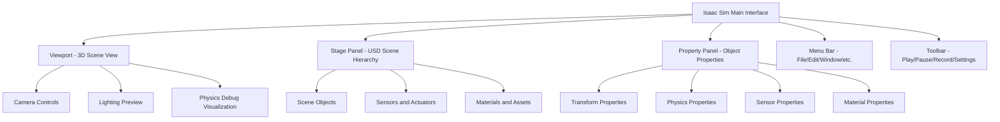

# Chapter 1: Introduction to NVIDIA Isaac Sim

## Overview

Welcome to Chapter 1 of Module 3: The AI-Robot Brain. This chapter introduces you to NVIDIA Isaac Sim, a powerful photorealistic simulation environment that enables robotics development through synthetic data generation.

Isaac Sim is built on NVIDIA's Omniverse platform and provides:
- **Photorealistic rendering** using PhysX physics and RTX ray tracing
- **Realistic sensor simulation** including cameras, LiDAR, IMU, and GPS
- **Domain randomization** capabilities for sim-to-real transfer
- **ROS 2 integration** for seamless robotics workflows
- **USD (Universal Scene Description)** scene format for asset sharing

## Learning Objectives

By the end of this chapter, you will be able to:
- Launch and navigate Isaac Sim interface
- Create and configure simulation environments
- Set up virtual sensors for data collection
- Generate synthetic datasets with ground truth annotations
- Apply domain randomization techniques
- Understand sim-to-real transfer principles

## Prerequisites

Before starting this chapter, ensure you have:
- [x] Completed Module 1 (ROS 2 Fundamentals)
- [x] Completed Module 2 (Digital Twin Engineering)
- [x] Installed NVIDIA Isaac Sim 2023.1.1+ (via Omniverse Launcher)
- [x] NVIDIA GPU with CUDA 11.8+ support (RTX 2060 or higher recommended)
- [x] Python 3.10+ with ROS 2 Humble/Jazzy installed

## Chapter Structure

This chapter is organized into 6 sections:

1. **Environment Creation** - Building photorealistic simulation scenes
2. **Sensor Configuration** - Setting up virtual cameras and sensors
3. **Data Generation** - Creating synthetic datasets with annotations
4. **Domain Randomization** - Applying Tier 1/2/3 randomization strategies
5. **Sim-to-Real Transfer** - Understanding and mitigating reality gaps
6. **Chapter Validation** - Testing your implementation against success criteria

## Isaac Sim Interface Overview

When you launch Isaac Sim, you'll encounter several key components:



### Key Controls

- **Camera Navigation**: Right-click + drag to orbit, middle-click + drag to pan, scroll to zoom
- **Object Selection**: Left-click to select objects in viewport or stage panel
- **Transform Tools**: W (Move), E (Rotate), R (Scale) keys
- **Play/Pause**: Spacebar or toolbar buttons to start/stop simulation

## Hardware Tier Detection

Module 3 automatically detects your hardware capabilities:

```bash
# Check your current tier
python3 shared/utils/tier_detection.py

# Expected output:
# Detected Tier: A (simulation) - Simulation Only
# GPU: NVIDIA GeForce RTX 3060 (12GB VRAM)
# CUDA: 11.8
# Status: Ready
```

Based on your tier, the exercises will adapt:
- **Tier A (Simulation)**: All exercises run in Isaac Sim
- **Tier B (Jetson)**: Exercises focus on deployment concepts
- **Tier C (Hardware)**: Exercises include physical robot integration

## Getting Started

1. **Launch Isaac Sim**:
   ```bash
   # From Omniverse Launcher
   # Or directly if installed:
   ~/.local/share/ov/pkg/isaac_sim-2023.1.1/isaac-sim.sh
   ```

2. **Verify Installation**:
   - Open Isaac Sim
   - Load a sample scene: `File > Open > Isaac/Samples/Simple_Room.usd`
   - Check that you can move the camera and see the scene

3. **Set ROS 2 Environment** (if using ROS 2 integration):
   ```bash
   export ROS_DISTRO=humble
   source /opt/ros/humble/setup.bash
   ```

## Success Criteria for Chapter 1

This chapter addresses the following Module 3 success criteria:

- **SC-001**: Generate 1000+ labeled images within 1 hour
- **SC-007**: Achieve >85% perception accuracy with generated datasets

You'll validate these criteria in the final section of this chapter.

## Next Steps

Continue to Section 2: [Environment Creation](./02-environment-creation.mdx) to begin building your first simulation scene.

## Resources

- [NVIDIA Isaac Sim Documentation](https://docs.omniverse.nvidia.com/isaacsim/)
- [USD Format Reference](https://graphics.pixar.com/usd/release/docs/index.html)
- [Omniverse Asset Library](https://docs.omniverse.nvidia.com/asset-library/latest/index.html)

## Troubleshooting

**Isaac Sim won't launch**:
- Check NVIDIA GPU drivers: `nvidia-smi`
- Verify Vulkan support: `vulkaninfo`
- Review logs: `~/.nvidia-omniverse/logs/`

**Performance issues**:
- Reduce viewport quality in Settings
- Close other GPU-intensive applications
- Check available VRAM: `nvidia-smi`

## Safety Considerations

This chapter focuses on simulation, so there are no physical safety concerns. However, we emphasize safety-first principles that will apply to later hardware chapters:

:::danger Physical AI Safety
Always maintain emergency stop procedures and dead man switches when working with physical robots. Simulation-first testing is crucial before hardware deployment.
:::

---

*Continue to [Section 2: Environment Creation](./02-environment-creation.mdx) to start building your first simulation scene.*