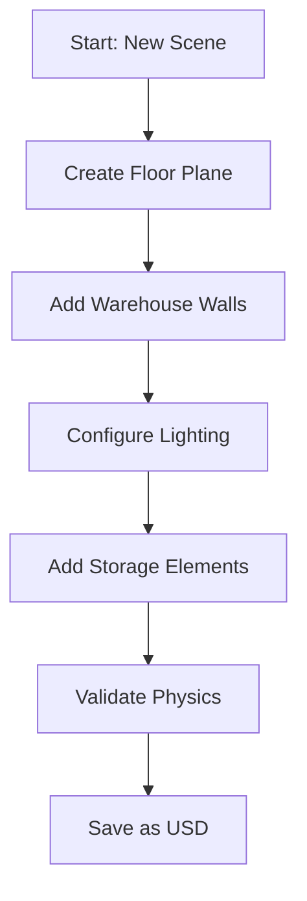

# Chapter 1: Environment Creation

## Overview

In this section, you'll learn how to create photorealistic simulation environments using NVIDIA Isaac Sim. You'll understand the USD (Universal Scene Description) format, utilize Omniverse assets, and build structured environments for robotics applications.

## Learning Objectives

By the end of this section, you will be able to:
- Navigate the USD scene structure in Isaac Sim
- Import and configure Omniverse assets
- Create structured warehouse environments
- Apply realistic materials and lighting
- Validate environment for simulation use

## USD Scene Structure

USD (Universal Scene Description) is Pixar's scene description format that enables scalable, layered 3D scenes. In Isaac Sim, USD files define:

- **Scene Hierarchy**: Object parent-child relationships
- **Transforms**: Position, rotation, scale of objects
- **Materials**: Surface properties and appearances
- **Physics**: Collision shapes and dynamic properties
- **Sensors**: Virtual sensor configurations

### Basic USD Structure

```usd
# Example USD structure
def Xform "World"
{
    def Xform "Environment"
    {
        def Scope "Lights"
        {
            def DistantLight "KeyLight"
            {
                float intensity = 1000
                float angle = 0.5
            }
        }

        def Scope "StaticObjects"
        {
            def Mesh "Floor"
            {
                # Floor mesh properties
            }

            def Mesh "Walls"
            {
                # Wall mesh properties
            }
        }
    }

    def Xform "Robot"
    {
        # Robot model and sensors
    }
}
```

## Creating Your First Environment

### Step 1: Launch Isaac Sim with a Base Scene

1. Open Isaac Sim
2. Create a new scene: `File > New`
3. Or load a template: `File > Open > Isaac/Samples/Simple_Room.usd`

### Step 2: Understanding the Scene Hierarchy

In the **Stage Panel**, you'll see the USD hierarchy:

```
World
├── DefaultPrim
│   ├── Xform "Environment"
│   │   ├── Scope "Lights"
│   │   ├── Scope "StaticObjects"
│   │   └── Scope "DynamicObjects"
│   ├── Xform "Robot"
│   └── Scope "Sensors"
```

### Step 3: Building a Warehouse Environment

Let's create a simple warehouse scene:

1. **Create the floor**:
   - Right-click in Stage Panel → `Create > Mesh > Plane`
   - Name it "WarehouseFloor"
   - In Property Panel, set dimensions to 50x30 meters
   - Apply a concrete material

2. **Add walls**:
   - Create 4 rectangular prisms for walls
   - Position them to form a 50x30m rectangle
   - Set height to 8 meters
   - Apply warehouse wall materials

3. **Add basic lighting**:
   - Create a `DistantLight` for key lighting
   - Add `DomeLight` for ambient lighting
   - Adjust intensities for realistic warehouse illumination

## Using Omniverse Assets

NVIDIA provides extensive asset libraries for robotics simulation:

### Accessing Asset Library

1. In Isaac Sim, open the **Content Browser** (Window > Content Browser)
2. Navigate to **Isaac > Assets > Environments**
3. Browse available warehouse assets

### Importing Warehouse Assets

```python
# Example Python API usage (for automation)
import omni
from omni.isaac.core import World
from omni.isaac.core.utils.stage import add_reference_to_stage

# Add warehouse asset to current stage
add_reference_to_stage(
    usd_path="omniverse://localhost/NVIDIA/Assets/Isaac/Environments/Warehouse/warehouse.usd",
    prim_path="/World/Warehouse"
)
```

### Custom Asset Creation

For this chapter, we'll create a simple warehouse using basic shapes:



## Practical Exercise: Create a Simple Warehouse

Let's build a basic warehouse environment step by step:

### Exercise 1: Basic Structure

1. **Create the floor**:
   - Right-click in Stage Panel → `Create > Mesh > Plane`
   - Name: `WarehouseFloor`
   - In Property Panel:
     - `xformOp:translate`: (0, 0, 0)
     - `size`: 50.0 (meters)
     - `width`: 50.0
     - `length`: 30.0

2. **Create walls**:
   - Create 4 `Cube` meshes for walls
   - Wall dimensions: 0.2m thick, 8m high
   - Positions:
     - North wall: (0, 15, 4) - 50m long
     - South wall: (0, -15, 4) - 50m long
     - East wall: (25, 0, 4) - 30m long
     - West wall: (-25, 0, 4) - 30m long

3. **Add basic lighting**:
   - Create `DistantLight`: `/World/Lights/KeyLight`
   - Set `intensity`: 1000
   - Set `color`: (0.9, 0.9, 0.9) for white light
   - Adjust rotation for realistic angle

### Exercise 2: Add Warehouse Elements

1. **Create a loading dock**:
   - Add a rectangular area with different flooring material
   - Position: (20, -10, 0) with size 10x10m

2. **Add basic shelving**:
   - Create cube primitives for simple shelves
   - Position in organized rows
   - Use different materials for variety

3. **Configure physics**:
   - Select all static objects (floor, walls, shelves)
   - Add `Physics Collider` components
   - Set `Collision Group` to "Static"

## Materials and Textures

Realistic materials are crucial for synthetic data quality:

### Applying Materials

1. In the **Material Browser** (Window > Material Browser)
2. Select a material: `Isaac > Materials > Concrete`
3. Drag and drop onto your floor object
4. Adjust material properties:
   - `roughness`: 0.8 for realistic concrete
   - `metallic`: 0.0 for non-metallic surface
   - `normal`: Add subtle bump for texture

### Custom Material Creation

For advanced users, create custom materials:

```python
# Python API example for material creation
from omni.isaac.core.utils.materials import create_diffuse_material

# Create a custom warehouse floor material
create_diffuse_material(
    prim_path="/World/Materials/WarehouseFloorMat",
    color=(0.6, 0.6, 0.6),
    roughness=0.8
)
```

## Environment Validation

Before proceeding, validate your environment:

### Physics Validation

1. **Play the simulation** (spacebar)
2. Ensure static objects don't move
3. Check that gravity works correctly
4. Verify no unexpected collisions or physics errors

### Visual Validation

1. **Check lighting** - Ensure no overexposed or dark areas
2. **Verify materials** - Check realistic appearance
3. **Validate scale** - Confirm objects are appropriately sized
4. **Test camera views** - Ensure good visibility throughout

### Performance Validation

1. **Monitor FPS** in Isaac Sim status bar
2. Ensure >30 FPS for smooth interaction
3. Check VRAM usage: `nvidia-smi`

## USD File Management

### Saving Your Scene

1. `File > Save As`
2. Choose location: `chapter-1-isaac-sim/assets/`
3. Name: `my_warehouse_scene.usd`
4. Verify the file saves successfully

### Scene Organization Best Practices

```
assets/
├── warehouse-scenes/
│   ├── basic-warehouse.usd
│   ├── complex-warehouse.usd
│   └── warehouse-template.usd
├── materials/
│   ├── warehouse-floors/
│   └── warehouse-walls/
└── sensor-configs/
    ├── stereo-camera.usd
    └── lidar-unit.usd
```

## Advanced Environment Features

### Dynamic Objects

Add objects that can be moved or manipulated:

1. Create a `Cube` for a cardboard box
2. Add `RigidBody` component in Property Panel
3. Set `mass` and `collision` properties
4. Verify it falls and collides with floor when simulation runs

### Procedural Environment Generation

For larger environments, consider procedural generation:

```python
# Example: Create multiple storage units
import numpy as np

def create_storage_row(start_pos, num_units, spacing=2.0):
    for i in range(num_units):
        x = start_pos[0] + i * spacing
        y = start_pos[1]
        z = start_pos[2]

        # Create storage unit
        # Add to stage at (x, y, z)
        pass
```

## Troubleshooting Common Issues

### Environment Not Loading

- **Check file paths**: Ensure USD files are in correct location
- **Validate USD syntax**: Use `usdview` to check file integrity
- **Check permissions**: Ensure Isaac Sim can read the file

### Physics Issues

- **Objects falling through floor**: Check collision shapes and materials
- **Unexpected movements**: Verify static objects don't have rigid body components
- **Performance problems**: Reduce polygon count or simplify materials

### Visual Issues

- **Dark scenes**: Check lighting setup and exposure settings
- **Material problems**: Verify material assignments and properties
- **Texture stretching**: Check UV mapping and texture resolution

## Performance Optimization

### For Synthetic Data Generation

1. **Reduce viewport complexity** during data collection
2. **Use lower resolution** for initial testing
3. **Optimize lighting** to reduce rendering overhead
4. **Batch operations** for multiple similar objects

### GPU Memory Management

- Monitor VRAM usage: `nvidia-smi`
- Keep environment size reasonable for your GPU
- Use texture streaming for large environments
- Consider Level of Detail (LOD) for distant objects

## Success Criteria Validation

This section addresses **FR-001**: Learners MUST be able to create photorealistic 3D environments using simulation tools for robotics scenarios.

### Validation Checklist

- [ ] Environment has realistic scale (50x30m warehouse)
- [ ] Proper lighting setup (key + ambient)
- [ ] Physics validation passed (static objects stay static)
- [ ] Materials applied realistically
- [ ] Scene saves successfully as USD file
- [ ] Environment suitable for sensor simulation

## Next Steps

Continue to Section 3: [Sensor Configuration](./03-sensor-configuration.mdx) to learn how to set up virtual sensors for data collection.

## Resources

- [USD Documentation](https://graphics.pixar.com/usd/release/docs/index.html)
- [Isaac Sim Scene Creation Guide](https://docs.omniverse.nvidia.com/isaacsim/latest/tutorial_basic_scene_creation.html)
- [Omniverse Asset Library](https://docs.omniverse.nvidia.com/asset-library/latest/index.html)

---

*Continue to [Section 3: Sensor Configuration](./03-sensor-configuration.mdx) to learn how to set up virtual sensors for data collection.*