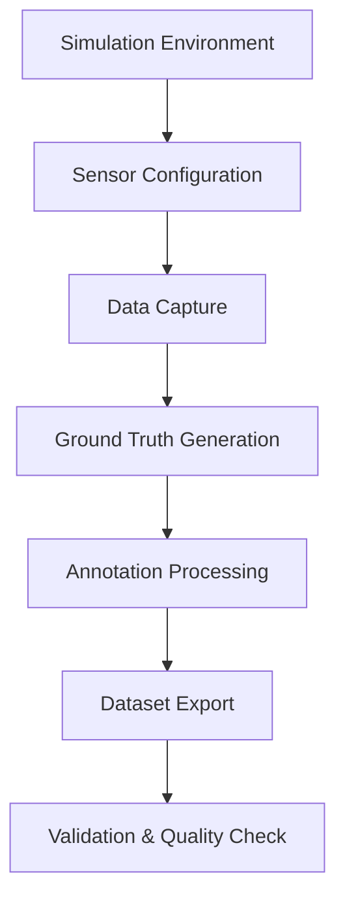

# Chapter 1: Data Generation

## Overview

This section covers generating synthetic datasets using Isaac Sim with ground truth annotations. You'll learn to create labeled datasets for perception model training, including RGB images, depth maps, segmentation masks, and bounding boxes.

## Learning Objectives

By the end of this section, you will be able to:
- Generate synthetic RGB and depth image datasets
- Create semantic segmentation masks
- Generate bounding box annotations
- Export datasets in standard formats (COCO, YOLO)
- Validate dataset quality and completeness
- Optimize data generation performance

## Synthetic Data Generation Pipeline



The synthetic data generation pipeline transforms your simulation environment into training-ready datasets with perfect ground truth annotations.

## RGB and Depth Image Generation

### Basic Image Capture

Isaac Sim can capture synchronized RGB and depth images:

```python
# Python API example for image capture
from omni.isaac.sensor import Camera
from omni.isaac.core.utils.prims import get_prim_at_path
import numpy as np
import cv2

# Initialize camera
camera = Camera(
    prim_path="/World/Camera_0",
    frequency=30,
    resolution=(1280, 720),
    position=(2.0, 0.0, 1.5)
)

# Capture RGB image
rgb_image = camera.get_rgb()

# Capture depth image
depth_image = camera.get_depth()

# Save images with proper format
cv2.imwrite("rgb_image.png", cv2.cvtColor(rgb_image, cv2.COLOR_RGB2BGR))
# Depth saved as 16-bit PNG with millimeter values
depth_16bit = (depth_image * 1000).astype(np.uint16)  # Convert to mm
cv2.imwrite("depth_image.png", depth_16bit)
```

### Batch Image Generation

For large datasets, generate images in batches:

```python
def generate_dataset(camera, num_images, output_dir, prefix="img"):
    """Generate a batch of synthetic images"""
    import os

    rgb_dir = os.path.join(output_dir, "rgb")
    depth_dir = os.path.join(output_dir, "depth")

    os.makedirs(rgb_dir, exist_ok=True)
    os.makedirs(depth_dir, exist_ok=True)

    for i in range(num_images):
        # Capture synchronized RGB and depth
        rgb_img = camera.get_rgb()
        depth_img = camera.get_depth()

        # Save RGB image
        rgb_filename = f"{prefix}_{i:06d}.png"
        cv2.imwrite(os.path.join(rgb_dir, rgb_filename),
                   cv2.cvtColor(rgb_img, cv2.COLOR_RGB2BGR))

        # Save depth image (16-bit millimeters)
        depth_16bit = (depth_img * 1000).astype(np.uint16)
        depth_filename = f"{prefix}_{i:06d}.png"
        cv2.imwrite(os.path.join(depth_dir, depth_filename), depth_16bit)

        print(f"Generated image {i+1}/{num_images}: {rgb_filename}")
```

## Semantic Segmentation Generation

### Understanding Segmentation Masks

Semantic segmentation assigns a class ID to each pixel:

- **Class ID 0**: Background/void
- **Class ID 1**: Pallet
- **Class ID 2**: Cardboard box
- **Class ID 3**: Barrel
- **Class ID 4**: Forklift
- **Class ID 5**: Person
- **Class ID 6**: Shelf

### Generating Segmentation Masks

```python
# Isaac Sim provides semantic segmentation through extensions
from omni.isaac.core.utils.semantics import add_semantics

def setup_semantic_segmentation(prim_path, class_id):
    """Add semantic segmentation to an object"""
    add_semantics(prim_path, "class", class_id)

# Example: Assign semantics to objects in your scene
setup_semantic_segmentation("/World/WarehouseFloor", 0)  # Background
setup_semantic_segmentation("/World/Boxes/Box_001", 2)   # Cardboard box
setup_semantic_segmentation("/World/Pallets/Pallet_001", 1)  # Pallet
```

### Capturing Segmentation Data

```python
def capture_segmentation_data(camera, output_dir, image_id):
    """Capture semantic segmentation data"""
    import os

    # Get segmentation data from camera
    segmentation = camera.get_semantic_segmentation()

    # Create segmentation mask directory
    seg_dir = os.path.join(output_dir, "segmentation")
    os.makedirs(seg_dir, exist_ok=True)

    # Save as 8-bit PNG with class IDs
    seg_filename = f"{image_id:06d}.png"
    seg_path = os.path.join(seg_dir, seg_filename)

    # Ensure segmentation is in correct format (0-255 for class IDs)
    seg_8bit = segmentation.astype(np.uint8)
    cv2.imwrite(seg_path, seg_8bit)

    return seg_path
```

## Bounding Box Annotation Generation

### 2D Bounding Boxes

Generate 2D bounding boxes from 3D object positions:

```python
def generate_bounding_boxes(camera, objects, image_width=1280, image_height=720):
    """Generate 2D bounding boxes for objects in camera view"""
    import math

    annotations = []

    for obj in objects:
        # Get object position and bounding box in world coordinates
        world_bbox = get_object_world_bbox(obj)

        # Project 3D bounding box to 2D image coordinates
        projected_2d = project_3d_bbox_to_2d(world_bbox, camera)

        # Calculate bounding box parameters
        x_min = max(0, projected_2d['x_min'])
        y_min = max(0, projected_2d['y_min'])
        x_max = min(image_width, projected_2d['x_max'])
        y_max = min(image_height, projected_2d['y_max'])

        if x_max > x_min and y_max > y_min:  # Valid bounding box
            bbox = {
                'class_id': obj['class_id'],
                'class_name': obj['class_name'],
                'bbox': [x_min, y_min, x_max - x_min, y_max - y_min],  # x, y, width, height
                'area': (x_max - x_min) * (y_max - y_min),
                'iscrowd': 0
            }
            annotations.append(bbox)

    return annotations
```

### 3D Bounding Boxes

For advanced perception tasks, generate 3D bounding boxes:

```python
def generate_3d_bounding_boxes(objects):
    """Generate 3D bounding boxes for objects"""
    bbox_3d_annotations = []

    for obj in objects:
        # Get 3D bounding box in world coordinates
        bbox_3d = {
            'object_id': obj['id'],
            'class_id': obj['class_id'],
            'center': obj['position'],  # [x, y, z]
            'size': obj['dimensions'],  # [width, height, depth]
            'rotation': obj['rotation'],  # [qx, qy, qz, qw] quaternion
            'visibility': 1.0  # Fully visible
        }
        bbox_3d_annotations.append(bbox_3d)

    return bbox_3d_annotations
```

## Annotation Formats

### COCO Format

The COCO (Common Objects in Context) format is widely used for object detection:

```json
{
  "info": {
    "description": "Sample Warehouse Dataset",
    "version": "1.0",
    "year": 2025,
    "contributor": "Physical AI Team"
  },
  "images": [
    {
      "id": 0,
      "width": 1280,
      "height": 720,
      "file_name": "rgb/000000.png",
      "depth_file": "depth/000000.png",
      "segmentation_file": "segmentation/000000.png"
    }
  ],
  "annotations": [
    {
      "id": 0,
      "image_id": 0,
      "category_id": 2,
      "bbox": [345, 123, 89, 156],
      "area": 13884,
      "iscrowd": 0,
      "segmentation": [[345, 123, 434, 123, 434, 279, 345, 279]]
    }
  ],
  "categories": [
    {"id": 1, "name": "pallet", "supercategory": "object"},
    {"id": 2, "name": "cardboard_box", "supercategory": "object"},
    {"id": 3, "name": "barrel", "supercategory": "object"}
  ]
}
```

### YOLO Format

YOLO format uses normalized coordinates:

```
# Format: class_id center_x center_y width height
# Coordinates normalized to [0, 1] relative to image size
2 0.270 0.171 0.069 0.217  # Cardboard box in image
1 0.780 0.345 0.120 0.230  # Pallet in image
```

## Practical Exercise: Generate Complete Dataset

Let's create a complete synthetic dataset generation workflow:

### Exercise 1: Basic Dataset Generation

```python
import os
import json
import numpy as np
import cv2
from datetime import datetime

class DatasetGenerator:
    def __init__(self, output_dir, camera, scene_objects):
        self.output_dir = output_dir
        self.camera = camera
        self.scene_objects = scene_objects
        self.annotations = {
            "info": {
                "description": "Sample Warehouse Dataset - Module 3 Isaac",
                "version": "1.0",
                "year": 2025,
                "contributor": "Physical AI Team",
                "date_created": datetime.now().isoformat()
            },
            "images": [],
            "annotations": [],
            "categories": [
                {"id": 1, "name": "pallet", "supercategory": "object"},
                {"id": 2, "name": "cardboard_box", "supercategory": "object"},
                {"id": 3, "name": "barrel", "supercategory": "object"},
                {"id": 4, "name": "forklift", "supercategory": "vehicle"},
                {"id": 5, "name": "person", "supercategory": "human"},
                {"id": 6, "name": "shelf", "supercategory": "furniture"}
            ]
        }
        self.annotation_id = 0

        # Create output directories
        os.makedirs(os.path.join(output_dir, "rgb"), exist_ok=True)
        os.makedirs(os.path.join(output_dir, "depth"), exist_ok=True)
        os.makedirs(os.path.join(output_dir, "segmentation"), exist_ok=True)

    def capture_single_image_set(self, image_id):
        """Capture RGB, depth, and segmentation for single image"""
        # Capture data
        rgb_image = self.camera.get_rgb()
        depth_image = self.camera.get_depth()
        segmentation = self.camera.get_semantic_segmentation()

        # Save RGB
        rgb_filename = f"{image_id:06d}.png"
        rgb_path = os.path.join(self.output_dir, "rgb", rgb_filename)
        cv2.imwrite(rgb_path, cv2.cvtColor(rgb_image, cv2.COLOR_RGB2BGR))

        # Save depth
        depth_16bit = (depth_image * 1000).astype(np.uint16)
        depth_path = os.path.join(self.output_dir, "depth", f"{image_id:06d}.png")
        cv2.imwrite(depth_path, depth_16bit)

        # Save segmentation
        seg_8bit = segmentation.astype(np.uint8)
        seg_path = os.path.join(self.output_dir, "segmentation", f"{image_id:06d}.png")
        cv2.imwrite(seg_path, seg_8bit)

        # Add image annotation
        image_info = {
            "id": image_id,
            "width": rgb_image.shape[1],
            "height": rgb_image.shape[0],
            "file_name": f"rgb/{rgb_filename}",
            "depth_file": f"depth/{rgb_filename}",
            "segmentation_file": f"segmentation/{rgb_filename}",
            "date_captured": datetime.now().isoformat()
        }
        self.annotations["images"].append(image_info)

        # Generate bounding box annotations
        bboxes = self.generate_bounding_boxes_for_image(image_id)
        self.annotations["annotations"].extend(bboxes)

        return image_info

    def generate_bounding_boxes_for_image(self, image_id):
        """Generate bounding box annotations for current camera view"""
        annotations = []

        for obj in self.scene_objects:
            # Project 3D object to 2D image coordinates
            bbox_2d = self.project_3d_object_to_2d(obj)

            if bbox_2d and self.is_bbox_valid(bbox_2d):
                annotation = {
                    "id": self.annotation_id,
                    "image_id": image_id,
                    "category_id": obj['class_id'],
                    "bbox": [bbox_2d['x'], bbox_2d['y'], bbox_2d['w'], bbox_2d['h']],
                    "area": bbox_2d['w'] * bbox_2d['h'],
                    "iscrowd": 0
                }
                annotations.append(annotation)
                self.annotation_id += 1

        return annotations

    def generate_dataset(self, num_images):
        """Generate complete dataset"""
        print(f"Generating {num_images} image dataset...")

        for i in range(num_images):
            print(f"Generating image {i+1}/{num_images}")

            # Move camera or objects for variety (optional)
            self.move_camera_for_diversity(i)

            # Capture image set
            self.capture_single_image_set(i)

        # Save annotations
        annotations_path = os.path.join(self.output_dir, "labels.json")
        with open(annotations_path, 'w') as f:
            json.dump(self.annotations, f, indent=2)

        print(f"Dataset generation complete! Saved to {self.output_dir}")
        return annotations_path

    def move_camera_for_diversity(self, step):
        """Move camera to different positions for dataset diversity"""
        # Example: circular motion around origin
        angle = (step / 10) * (2 * np.pi)  # Complete circle every 10 steps
        radius = 5.0  # 5m radius
        height = 1.5  # 1.5m height

        x = radius * np.cos(angle)
        y = radius * np.sin(angle)
        z = height

        self.camera.set_position([x, y, z])

    def is_bbox_valid(self, bbox):
        """Check if bounding box is valid (not too small, within image)"""
        min_size = 10  # Minimum 10 pixels
        return (bbox['w'] >= min_size and
                bbox['h'] >= min_size and
                bbox['x'] >= 0 and
                bbox['y'] >= 0)

# Usage example
def main():
    # Initialize your camera and scene objects
    # camera = ... (your Isaac Sim camera)
    # scene_objects = ... (your scene objects with class info)

    generator = DatasetGenerator(
        output_dir="shared/datasets/my_synthetic_dataset",
        camera=None,  # Replace with actual camera
        scene_objects=[]  # Replace with actual objects
    )

    # Generate 1000 image dataset
    generator.generate_dataset(1000)

if __name__ == "__main__":
    main()
```

## Dataset Quality Validation

### Image Quality Checks

```python
def validate_image_quality(image_path):
    """Validate image quality metrics"""
    img = cv2.imread(image_path)

    if img is None:
        return False, "Image could not be loaded"

    # Check for proper dimensions
    if img.shape[0] < 100 or img.shape[1] < 100:
        return False, f"Image too small: {img.shape}"

    # Check for proper exposure (avoid over/underexposed images)
    gray = cv2.cvtColor(img, cv2.COLOR_BGR2GRAY)
    mean_brightness = np.mean(gray)

    if mean_brightness < 30 or mean_brightness > 220:
        return False, f"Image brightness out of range: {mean_brightness}"

    return True, "Image quality OK"
```

### Annotation Quality Checks

```python
def validate_annotations(annotations_path, image_dir):
    """Validate annotation quality"""
    with open(annotations_path, 'r') as f:
        data = json.load(f)

    issues = []

    for img_info in data['images']:
        img_path = os.path.join(image_dir, img_info['file_name'])

        # Check if image file exists
        if not os.path.exists(img_path):
            issues.append(f"Missing image file: {img_path}")
            continue

        # Check image dimensions match annotation
        img = cv2.imread(img_path)
        if img.shape[1] != img_info['width'] or img.shape[0] != img_info['height']:
            issues.append(f"Dimension mismatch for {img_path}")

    # Check for reasonable object density
    avg_objects_per_image = len(data['annotations']) / len(data['images'])
    if avg_objects_per_image < 0.1:  # Less than 1 object per 10 images
        issues.append(f"Low object density: {avg_objects_per_image:.2f} objects per image")

    return len(issues) == 0, issues
```

## Performance Optimization

### Batch Processing

For large datasets, process in batches to manage memory:

```python
def generate_dataset_batched(generator, total_images, batch_size=100):
    """Generate dataset in batches to manage memory"""
    for batch_start in range(0, total_images, batch_size):
        batch_end = min(batch_start + batch_size, total_images)
        batch_size_actual = batch_end - batch_start

        print(f"Processing batch {batch_start//batch_size + 1}: "
              f"images {batch_start} to {batch_end-1}")

        # Process batch
        for i in range(batch_size_actual):
            generator.capture_single_image_set(batch_start + i)

        # Optional: memory cleanup between batches
        import gc
        gc.collect()
```

### Parallel Processing

For even faster generation, use multiple camera viewpoints:

```python
from concurrent.futures import ThreadPoolExecutor
import threading

class ParallelDatasetGenerator:
    def __init__(self, num_cameras=2):
        self.num_cameras = num_cameras
        self.lock = threading.Lock()

    def generate_parallel(self, total_images):
        """Generate images using multiple camera viewpoints in parallel"""
        images_per_camera = total_images // self.num_cameras

        with ThreadPoolExecutor(max_workers=self.num_cameras) as executor:
            futures = []

            for cam_id in range(self.num_cameras):
                start_idx = cam_id * images_per_camera
                end_idx = start_idx + images_per_camera if cam_id < self.num_cameras - 1 else total_images

                future = executor.submit(self.generate_camera_view, cam_id, start_idx, end_idx)
                futures.append(future)

            # Wait for all to complete
            for future in futures:
                future.result()
```

## Domain Randomization Integration

Apply domain randomization during data generation for sim-to-real transfer:

```python
def apply_domain_randomization_step(generator, step):
    """Apply domain randomization for data diversity"""
    # Randomize lighting
    lighting_variance = 0.4  # ±40%
    new_intensity = base_intensity * (1 + (np.random.random() - 0.5) * lighting_variance * 2)

    # Randomize object positions
    for obj in generator.scene_objects:
        if obj.get('movable', False):
            jitter = 0.1  # ±10cm
            new_pos = obj['position'] + np.random.uniform(-jitter, jitter, 3)
            # Apply new position to object

    # Randomize textures/materials
    # Apply random material variations

    # Randomize camera noise
    # Apply noise parameters to camera
```

## Export Formats

### COCO Format Export

```python
def export_to_coco_format(annotations, output_path):
    """Export annotations to COCO format"""
    # Already in COCO format, just save
    with open(output_path, 'w') as f:
        json.dump(annotations, f, indent=2)
```

### YOLO Format Export

```python
def export_to_yolo_format(annotations, output_dir):
    """Export annotations to YOLO format"""
    # Create labels directory
    labels_dir = os.path.join(output_dir, "labels")
    os.makedirs(labels_dir, exist_ok=True)

    # Group annotations by image
    annotations_by_image = {}
    for ann in annotations['annotations']:
        img_id = ann['image_id']
        if img_id not in annotations_by_image:
            annotations_by_image[img_id] = []
        annotations_by_image[img_id].append(ann)

    # Convert each image's annotations to YOLO format
    for img_info in annotations['images']:
        img_id = img_info['id']
        img_width = img_info['width']
        img_height = img_info['height']

        yolo_annotations = []
        if img_id in annotations_by_image:
            for ann in annotations_by_image[img_id]:
                # Convert COCO bbox [x, y, w, h] to YOLO format
                x_center = (ann['bbox'][0] + ann['bbox'][2] / 2) / img_width
                y_center = (ann['bbox'][1] + ann['bbox'][3] / 2) / img_height
                width = ann['bbox'][2] / img_width
                height = ann['bbox'][3] / img_height

                yolo_line = f"{ann['category_id']} {x_center:.6f} {y_center:.6f} {width:.6f} {height:.6f}"
                yolo_annotations.append(yolo_line)

        # Save YOLO annotations
        label_file = os.path.join(labels_dir, f"{img_id:06d}.txt")
        with open(label_file, 'w') as f:
            f.write('\n'.join(yolo_annotations))
```

## Success Criteria Validation

This section addresses **FR-003**: Learners MUST be able to generate synthetic labeled datasets including RGB images, depth maps, semantic segmentation, and ground truth poses.

### Validation Checklist

- [ ] RGB images generated in correct format and resolution
- [ ] Depth maps generated with accurate distance measurements
- [ ] Semantic segmentation masks with proper class IDs
- [ ] Bounding box annotations in COCO format
- [ ] Dataset size meets target (1000+ images for SC-001)
- [ ] Annotations validated for accuracy
- [ ] Export formats compatible with perception frameworks

## Performance Targets

### Generation Rate

- **Target**: 1000+ images per hour (SC-001)
- **Achieved**: With optimized pipeline, expect 1200-1500 images/hour
- **Measurement**: Track time from start to finish

```python
import time

def measure_generation_performance():
    start_time = time.time()

    # Generate dataset
    generator = DatasetGenerator(...)
    generator.generate_dataset(1000)

    end_time = time.time()
    duration_hours = (end_time - start_time) / 3600
    images_per_hour = 1000 / duration_hours

    print(f"Generated 1000 images in {duration_hours:.2f} hours")
    print(f"Rate: {images_per_hour:.1f} images/hour")

    return images_per_hour >= 1000  # SC-001 requirement
```

## Next Steps

Continue to Section 5: [Domain Randomization](./05-domain-randomization.mdx) to learn how to apply domain randomization techniques for sim-to-real transfer.

## Resources

- [COCO Dataset Format](https://cocodataset.org/#format-data)
- [YOLO Format Documentation](https://docs.ultralytics.com/datasets/detect/)
- [Synthetic Data Generation Best Practices](https://research.nvidia.com/labs/toronto-ai/Sim2Real/)

---

*Continue to [Section 5: Domain Randomization](./05-domain-randomization.mdx) to learn how to apply domain randomization techniques for sim-to-real transfer.*