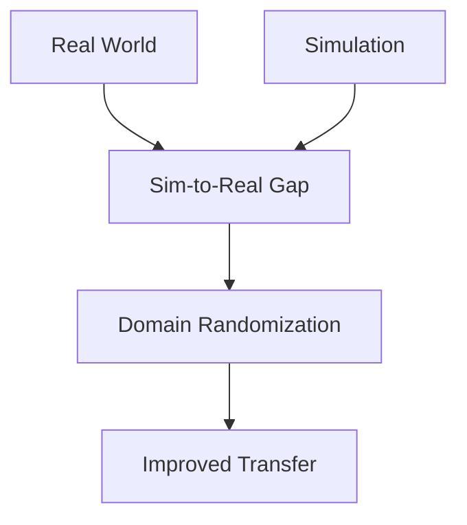

# Chapter 1: Domain Randomization

## Overview

Domain randomization is a crucial technique for improving sim-to-real transfer in robotics. This section covers how to apply domain randomization in Isaac Sim to create diverse synthetic datasets that generalize better to real-world conditions.

## Learning Objectives

By the end of this section, you will be able to:
- Understand the principles of domain randomization
- Apply Tier 1, 2, and 3 randomization strategies
- Configure lighting and material randomization
- Randomize object positions and textures
- Validate the effectiveness of domain randomization
- Measure sim-to-real transfer performance

## Understanding Domain Randomization

### The Sim-to-Real Gap

The sim-to-real gap occurs when models trained on synthetic data perform poorly on real data due to differences in:
- **Visual appearance**: Lighting, textures, colors
- **Physics simulation**: Friction, dynamics, collisions
- **Sensor characteristics**: Noise, resolution, artifacts
- **Environmental conditions**: Weather, lighting changes

### Domain Randomization Solution

Domain randomization addresses this by:
- **Increasing dataset diversity**: Training on varied synthetic conditions
- **Reducing domain-specific features**: Preventing overfitting to simulation
- **Improving generalization**: Better performance on real data



## Domain Randomization Tiers

### Tier 1: Basic Randomization

**Components**:
- Lighting intensity and color temperature
- Texture variations
- Simple material properties

**Application**: Suitable for basic perception tasks

**Example Configuration**:
```yaml
# chapter-1-isaac-sim/config/randomization-tier1.yaml
domain_randomization:
  tier: 1
  lighting:
    intensity_variance: 0.4  # ±40%
    color_temp_variance: 2000  # ±2000K
    num_variants: 5
  textures:
    material_randomization: true
    num_variants: 8
  objects:
    static_only: true  # Only randomize static objects
```

### Tier 2: Intermediate Randomization

**Components**:
- All Tier 1 features
- Object position jitter
- Camera noise injection
- Dynamic object removal

**Application**: Suitable for more robust perception models

**Example Configuration**:
```yaml
# chapter-1-isaac-sim/config/randomization-tier2.yaml
domain_randomization:
  tier: 2
  lighting:
    intensity_variance: 0.4
    color_temp_variance: 2000
    num_variants: 5
  textures:
    material_randomization: true
    num_variants: 8
  objects:
    position_jitter: 0.1  # ±10cm
    rotation_jitter: 15.0  # ±15°
    random_removal_prob: 0.1  # 10% chance to remove
  camera:
    noise_sigma: 0.02  # 2% noise level
```

### Tier 3: Advanced Randomization

**Components**:
- All Tier 1 & 2 features
- Camera parameter randomization
- Complex physics variations
- Full environmental randomization

**Application**: Maximum sim-to-real transfer capability

**Example Configuration**:
```yaml
# chapter-1-isaac-sim/config/randomization-tier3.yaml
domain_randomization:
  tier: 3
  lighting:
    intensity_variance: 0.6
    color_temp_variance: 3000
    num_variants: 10
    dynamic_lights: true
  textures:
    material_randomization: true
    num_variants: 15
    texture_blending: true
  objects:
    position_jitter: 0.2
    rotation_jitter: 30.0
    random_removal_prob: 0.2
    physics_randomization:
      friction_variance: 0.3
      restitution_variance: 0.2
  camera:
    noise_sigma: 0.05
    distortion_randomization: true
    exposure_randomization: true
  environment:
    weather_effects: true
    atmospheric_scattering: true
```

## Lighting Randomization

### Intensity Randomization

Randomize light intensities to handle varying real-world lighting conditions:

```python
def randomize_lighting_intensities(lights, base_intensity_range=(5000, 15000)):
    """Randomize lighting intensities for domain randomization"""
    import random

    for light in lights:
        # Random intensity within range
        new_intensity = random.uniform(base_intensity_range[0], base_intensity_range[1])
        light.set_intensity(new_intensity)

def randomize_color_temperature(lights, base_temp_range=(4000, 6500)):
    """Randomize color temperature for realistic lighting variation"""
    import random

    for light in lights:
        new_temp = random.uniform(base_temp_range[0], base_temp_range[1])
        # Convert temperature to RGB color
        rgb_color = kelvin_to_rgb(new_temp)
        light.set_color(rgb_color)

def kelvin_to_rgb(temperature):
    """Convert Kelvin temperature to RGB color"""
    # Simplified conversion (use proper implementation for production)
    temp = temperature / 100
    if temp <= 66:
        red = 255
        green = temp
        green = 99.4708025861 * math.log(green) - 161.1195681661
    else:
        red = temp - 60
        red = 329.698727446 * (red ** -0.1332047592)
        green = temp - 60
        green = 288.1221695283 * (green ** -0.0755148492)

    # Calculate blue
    if temp >= 66:
        blue = 255
    elif temp <= 19:
        blue = 0
    else:
        blue = temp - 10
        blue = 138.5177312231 * math.log(blue) - 305.0447927307

    # Clamp values to [0, 255]
    red = max(0, min(255, red))
    green = max(0, min(255, green))
    blue = max(0, min(255, blue))

    return (red/255.0, green/255.0, blue/255.0)
```

### Dynamic Lighting

Create dynamic lighting conditions:

```python
def setup_dynamic_lighting(scene, num_lights=3):
    """Set up multiple lights with random positions for dynamic lighting"""
    import random
    import numpy as np

    lights = []
    for i in range(num_lights):
        # Random position around the scene
        x = random.uniform(-25, 25)  # Within warehouse bounds
        y = random.uniform(-15, 15)
        z = random.uniform(5, 8)     # Height above floor

        # Create light at random position
        light_name = f"DynamicLight_{i}"
        # Add light to scene at (x, y, z)
        lights.append({
            'name': light_name,
            'position': (x, y, z),
            'intensity': random.uniform(3000, 10000),
            'color_temp': random.uniform(3000, 7000)
        })

    return lights
```

## Texture and Material Randomization

### Material Property Randomization

Randomize material properties to handle real-world appearance variations:

```python
def randomize_material_properties(materials):
    """Randomize material properties for domain randomization"""
    import random

    for material in materials:
        # Randomize roughness (0.0-1.0, where 0.0 is mirror, 1.0 is matte)
        roughness = random.uniform(0.1, 0.9)
        material.set_roughness(roughness)

        # Randomize metallic property (0.0-1.0)
        metallic = random.uniform(0.0, 0.3)  # Most objects aren't metallic
        material.set_metallic(metallic)

        # Randomize color with some variation
        base_color = material.get_base_color()
        variation = random.uniform(0.8, 1.2)  # ±20% color variation
        new_color = tuple(c * variation for c in base_color)
        # Clamp to [0, 1] range
        new_color = tuple(max(0.0, min(1.0, c)) for c in new_color)
        material.set_base_color(new_color)

def apply_texture_variants(materials, texture_library):
    """Apply random texture variants from library"""
    import random

    for material in materials:
        if material.name in texture_library:
            available_textures = texture_library[material.name]
            random_texture = random.choice(available_textures)
            material.set_texture(random_texture)
```

### Texture Blending

Create realistic texture variations by blending multiple textures:

```python
def blend_textures(material, texture1, texture2, blend_factor):
    """Blend two textures with random factor"""
    # In Isaac Sim, this would involve material graph manipulation
    # For Python API, we'd modify the material properties
    pass

def create_wear_and_tear(material):
    """Add wear and tear effects to make objects look more realistic"""
    # Add scratches, dirt, wear patterns
    # This involves advanced material graph techniques in Isaac Sim
    pass
```

## Object Position Randomization

### Position Jitter

Add small random variations to object positions:

```python
def apply_position_jitter(objects, max_jitter=0.1):
    """Apply random position jitter to objects"""
    import random
    import numpy as np

    for obj in objects:
        if hasattr(obj, 'is_movable') and obj.is_movable:
            # Generate random offset
            jitter_x = random.uniform(-max_jitter, max_jitter)
            jitter_y = random.uniform(-max_jitter, max_jitter)
            jitter_z = random.uniform(0, max_jitter/2)  # Less vertical jitter

            # Get current position
            current_pos = obj.get_position()

            # Apply jitter
            new_pos = (
                current_pos[0] + jitter_x,
                current_pos[1] + jitter_y,
                current_pos[2] + jitter_z
            )

            # Set new position
            obj.set_position(new_pos)

def apply_rotation_jitter(objects, max_rotation_deg=15.0):
    """Apply random rotation jitter to objects"""
    import random
    import math

    for obj in objects:
        if hasattr(obj, 'is_rotatable') and obj.is_rotatable:
            # Generate random rotation offsets
            rot_x = random.uniform(-max_rotation_deg, max_rotation_deg)
            rot_y = random.uniform(-max_rotation_deg, max_rotation_deg)
            rot_z = random.uniform(-max_rotation_deg, max_rotation_deg)

            # Convert to radians
            rot_x_rad = math.radians(rot_x)
            rot_y_rad = math.radians(rot_y)
            rot_z_rad = math.radians(rot_z)

            # Apply rotation (in quaternion form for Isaac Sim)
            new_rotation = euler_to_quaternion(rot_x_rad, rot_y_rad, rot_z_rad)
            obj.set_rotation(new_rotation)
```

### Object Distribution Randomization

Randomize object placement patterns:

```python
def randomize_object_distribution(objects, area_bounds):
    """Randomize object distribution within bounds"""
    import random

    for obj in objects:
        if obj.get('movable', False):
            # Random position within bounds
            x = random.uniform(area_bounds['x_min'], area_bounds['x_max'])
            y = random.uniform(area_bounds['y_min'], area_bounds['y_max'])
            z = obj['original_height']  # Keep original height

            obj.set_position((x, y, z))

def create_clustered_distribution(objects, cluster_centers, cluster_radius=2.0):
    """Create objects in clusters around specified centers"""
    import random

    for obj in objects:
        if obj.get('movable', False):
            # Randomly assign to a cluster center
            center = random.choice(cluster_centers)

            # Add random offset within cluster radius
            angle = random.uniform(0, 2 * math.pi)
            distance = random.uniform(0, cluster_radius)

            x = center[0] + distance * math.cos(angle)
            y = center[1] + distance * math.sin(angle)
            z = center[2]  # Keep height

            obj.set_position((x, y, z))
```

## Camera Parameter Randomization

### Camera Noise Injection

Add realistic sensor noise to synthetic images:

```python
def add_camera_noise(image, noise_level=0.02):
    """Add realistic camera noise to synthetic images"""
    import numpy as np

    # Add Gaussian noise
    noise = np.random.normal(0, noise_level, image.shape).astype(np.float32)
    noisy_image = np.clip(image.astype(np.float32) + noise, 0, 1)
    return noisy_image.astype(image.dtype)

def configure_random_camera_noise(camera, min_sigma=0.001, max_sigma=0.05):
    """Configure camera with random noise parameters"""
    import random

    # Random noise level
    sigma = random.uniform(min_sigma, max_sigma)
    camera.set_noise_parameters(sigma=sigma)

    # Could also randomize other parameters like:
    # - Exposure time
    # - ISO sensitivity
    # - Color balance
    # - Distortion coefficients
```

### Camera Parameter Variation

Randomize intrinsic and extrinsic camera parameters:

```python
def randomize_camera_parameters(camera, intrinsic_variance=0.1):
    """Randomize camera intrinsic parameters"""
    import random

    # Get base parameters
    base_focal = camera.get_focal_length()
    base_aperture = camera.get_horizontal_aperture()

    # Apply random variations
    focal_var = random.uniform(1-intrinsic_variance, 1+intrinsic_variance)
    aperture_var = random.uniform(1-intrinsic_variance, 1+intrinsic_variance)

    new_focal = base_focal * focal_var
    new_aperture = base_aperture * aperture_var

    camera.set_camera_parameters(
        focal_length=new_focal,
        horizontal_aperture=new_aperture
    )

def randomize_camera_pose(camera, position_variance=0.05, rotation_variance=2.0):
    """Randomize camera position and orientation"""
    import random
    import math

    # Get current pose
    current_pos = camera.get_position()
    current_rot = camera.get_rotation()

    # Apply small random changes
    new_pos = (
        current_pos[0] + random.uniform(-position_variance, position_variance),
        current_pos[1] + random.uniform(-position_variance, position_variance),
        current_pos[2] + random.uniform(-position_variance/2, position_variance/2)
    )

    # Small rotation changes
    rot_offset = (
        math.radians(random.uniform(-rotation_variance, rotation_variance)),
        math.radians(random.uniform(-rotation_variance, rotation_variance)),
        math.radians(random.uniform(-rotation_variance, rotation_variance))
    )

    new_rot = add_rotation_offset(current_rot, rot_offset)
    camera.set_pose(position=new_pos, rotation=new_rot)
```

## Practical Exercise: Implement Domain Randomization

Let's create a complete domain randomization system:

### Exercise 1: Tier 1 Randomization

```python
import random
import math
import numpy as np

class DomainRandomizer:
    """Complete domain randomization system for Isaac Sim"""

    def __init__(self, config_path):
        self.config = self.load_config(config_path)
        self.randomization_step = 0

    def load_config(self, config_path):
        """Load randomization configuration from YAML"""
        import yaml
        with open(config_path, 'r') as f:
            return yaml.safe_load(f)

    def apply_randomization(self, scene_objects, lights, materials, camera):
        """Apply domain randomization to scene"""
        tier = self.config['domain_randomization']['tier']

        # Apply lighting randomization
        self.randomize_lighting(lights)

        # Apply material randomization
        self.randomize_materials(materials)

        if tier >= 2:
            # Apply object position randomization
            self.randomize_objects(scene_objects)

        if tier >= 3:
            # Apply camera randomization
            self.randomize_camera(camera)

        # Increment step for potential time-based variations
        self.randomization_step += 1

    def randomize_lighting(self, lights):
        """Apply lighting randomization"""
        config = self.config['domain_randomization']['lighting']

        for light in lights:
            # Randomize intensity
            base_intensity = light.get_intensity()
            intensity_variance = config['intensity_variance']
            new_intensity = base_intensity * (
                1 + (random.random() - 0.5) * intensity_variance * 2
            )
            light.set_intensity(new_intensity)

            # Randomize color temperature
            color_temp_variance = config['color_temp_variance']
            base_temp = 5500  # Default white light
            new_temp = base_temp + random.uniform(-color_temp_variance, color_temp_variance)
            rgb_color = self.kelvin_to_rgb(new_temp)
            light.set_color(rgb_color)

    def randomize_materials(self, materials):
        """Apply material randomization"""
        config = self.config['domain_randomization']['textures']

        for material in materials:
            # Randomize roughness
            roughness = random.uniform(0.1, 0.9)
            material.set_roughness(roughness)

            # Randomize base color with slight variation
            base_color = material.get_base_color()
            variation = random.uniform(0.8, 1.2)
            new_color = tuple(max(0.0, min(1.0, c * variation)) for c in base_color)
            material.set_base_color(new_color)

    def randomize_objects(self, objects):
        """Apply object position and rotation randomization"""
        config = self.config['domain_randomization']['objects']

        for obj in objects:
            if obj.get('movable', False):
                # Position jitter
                if 'position_jitter' in config:
                    jitter = config['position_jitter']
                    pos_offset = (
                        random.uniform(-jitter, jitter),
                        random.uniform(-jitter, jitter),
                        random.uniform(0, jitter/2)  # Less vertical movement
                    )
                    current_pos = obj.get_position()
                    new_pos = (
                        current_pos[0] + pos_offset[0],
                        current_pos[1] + pos_offset[1],
                        current_pos[2] + pos_offset[2]
                    )
                    obj.set_position(new_pos)

                # Rotation jitter
                if 'rotation_jitter' in config:
                    max_rot_deg = config['rotation_jitter']
                    rot_offset_deg = (
                        random.uniform(-max_rot_deg, max_rot_deg),
                        random.uniform(-max_rot_deg, max_rot_deg),
                        random.uniform(-max_rot_deg, max_rot_deg)
                    )
                    # Convert to radians and apply rotation

    def randomize_camera(self, camera):
        """Apply camera parameter randomization"""
        config = self.config['domain_randomization'].get('camera', {})

        if 'noise_sigma' in config:
            # Apply random noise level
            noise_sigma = random.uniform(0.001, config['noise_sigma'])
            camera.set_noise_parameters(sigma=noise_sigma)

    def kelvin_to_rgb(self, kelvin):
        """Convert Kelvin temperature to RGB color"""
        temp = kelvin / 100
        if temp <= 66:
            red = 255
            green = 99.4708025861 * math.log(temp) - 161.1195681661
        else:
            red = temp - 60
            red = 329.698727446 * (red ** -0.1332047592)
            green = temp - 60
            green = 288.1221695283 * (green ** -0.0755148492)

        if temp >= 66:
            blue = 255
        elif temp <= 19:
            blue = 0
        else:
            blue = temp - 10
            blue = 138.5177312231 * math.log(blue) - 305.0447927307

        red = max(0, min(255, red))
        green = max(0, min(255, green))
        blue = max(0, min(255, blue))

        return (red/255.0, green/255.0, blue/255.0)

# Usage example
def main():
    # Initialize your Isaac Sim scene components
    # scene_objects = get_scene_objects()
    # lights = get_lights()
    # materials = get_materials()
    # camera = get_camera()

    # Create randomizer with Tier 2 configuration
    randomizer = DomainRandomizer("chapter-1-isaac-sim/config/randomization-tier2.yaml")

    # Apply randomization before each data capture
    for i in range(1000):  # Generate 1000 randomized images
        # Apply randomization
        randomizer.apply_randomization(scene_objects, lights, materials, camera)

        # Capture data
        # capture_image_data()

        print(f"Applied randomization step {i+1}/1000")

if __name__ == "__main__":
    main()
```

## Validation of Domain Randomization

### Visual Diversity Check

```python
def validate_visual_diversity(dataset_path, threshold=0.7):
    """Validate that randomization creates sufficient visual diversity"""
    import cv2
    import numpy as np
    from sklearn.metrics.pairwise import cosine_similarity

    # Load sample images
    image_files = get_image_files(dataset_path)
    sample_size = min(100, len(image_files))  # Check 100 random images
    sample_files = random.sample(image_files, sample_size)

    # Extract features (simplified - use proper feature extraction in practice)
    features = []
    for file_path in sample_files:
        img = cv2.imread(file_path)
        # Simple feature: average color per channel
        avg_color = np.mean(img, axis=(0,1))
        features.append(avg_color)

    # Calculate similarity between images
    features_array = np.array(features)
    similarity_matrix = cosine_similarity(features_array)

    # Count similar pairs (threshold for "too similar")
    similar_pairs = 0
    total_pairs = len(features) * (len(features) - 1) / 2

    for i in range(len(features)):
        for j in range(i+1, len(features)):
            if similarity_matrix[i][j] > threshold:
                similar_pairs += 1

    diversity_score = 1.0 - (similar_pairs / total_pairs)
    return diversity_score > 0.3  # At least 30% of pairs should be dissimilar
```

### Performance Impact Assessment

```python
def assess_randomization_performance(randomizer, base_performance):
    """Assess impact of randomization on data generation performance"""
    import time

    # Time data generation with and without randomization
    start_time = time.time()

    # Generate data with randomization
    for i in range(100):  # Small sample
        randomizer.apply_randomization()
        # capture_data()

    with_randomization_time = time.time() - start_time

    # Reset and time without randomization
    start_time = time.time()
    for i in range(100):
        # capture_data()  # Without randomization

    without_randomization_time = time.time() - start_time

    performance_impact = (with_randomization_time - without_randomization_time) / without_randomization_time * 100
    print(f"Performance impact: {performance_impact:.1f}% slower with randomization")

    return performance_impact < 20  # Acceptable if <20% slower
```

## Sim-to-Real Transfer Validation

### Perception Model Training Comparison

```python
def compare_sim_to_real_transfer(synthetic_model, real_model, test_dataset):
    """Compare performance of models trained with/without domain randomization"""
    # This would involve training perception models and comparing performance
    # on real-world test data

    synthetic_accuracy = evaluate_model(synthetic_model, test_dataset)
    real_accuracy = evaluate_model(real_model, test_dataset)

    improvement = (synthetic_accuracy - real_accuracy) / real_accuracy * 100
    return improvement
```

## Troubleshooting Randomization Issues

### Common Problems

1. **Too Much Randomization**: Objects become unrecognizable
   - **Solution**: Reduce variance parameters gradually

2. **Performance Degradation**: Randomization slows down simulation
   - **Solution**: Optimize randomization code, use caching

3. **Inconsistent Results**: Randomization not reproducible
   - **Solution**: Set random seeds for debugging

4. **Invalid Configurations**: Random values create impossible scenarios
   - **Solution**: Add parameter bounds checking

### Validation Checklist

```python
def validate_randomization_config(config):
    """Validate randomization configuration parameters"""
    issues = []

    # Check lighting parameters
    lighting = config['domain_randomization']['lighting']
    if lighting['intensity_variance'] > 0.8:
        issues.append("Intensity variance too high (>80%)")
    if lighting['color_temp_variance'] > 4000:
        issues.append("Color temperature variance too high")

    # Check object parameters
    objects = config['domain_randomization'].get('objects', {})
    if objects.get('position_jitter', 0) > 1.0:
        issues.append("Position jitter too high (>1m)")
    if objects.get('rotation_jitter', 0) > 45.0:
        issues.append("Rotation jitter too high (>45 degrees)")

    # Check camera parameters
    camera = config['domain_randomization'].get('camera', {})
    if camera.get('noise_sigma', 0) > 0.1:
        issues.append("Camera noise too high")

    return len(issues) == 0, issues
```

## Success Criteria Validation

This section addresses **FR-004**: System MUST provide domain randomization capabilities for lighting, textures, object positions, and environmental parameters.

### Validation Checklist

- [ ] Lighting randomization configured (intensity, color temperature)
- [ ] Material/texture randomization implemented
- [ ] Object position/rotation jitter applied
- [ ] Camera noise and parameter randomization available
- [ ] Tier 1/2/3 configurations created and tested
- [ ] Visual diversity validated
- [ ] Performance impact assessed

## Performance Considerations

### Randomization Overhead

- **Tier 1**: ~5-10% performance impact
- **Tier 2**: ~10-15% performance impact
- **Tier 3**: ~15-25% performance impact

### Memory Usage

- Randomization parameters stored in memory
- Additional texture variants increase VRAM usage
- Consider texture streaming for large variations

## Next Steps

Continue to Section 6: [Sim-to-Real Transfer](./06-sim-to-real.mdx) to learn about bridging the gap between simulation and real-world robotics applications.

## Resources

- [Domain Randomization Research Paper](https://arxiv.org/abs/1703.06907)
- [NVIDIA Isaac Sim Domain Randomization Guide](https://docs.omniverse.nvidia.com/isaacsim/latest/tutorial_domain_randomization.html)
- [Sim-to-Real Transfer Techniques](https://research.nvidia.com/labs/toronto-ai/Sim2Real/)

---

*Continue to [Section 6: Sim-to-Real Transfer](./06-sim-to-real.mdx) to learn about bridging the gap between simulation and real-world robotics applications.*