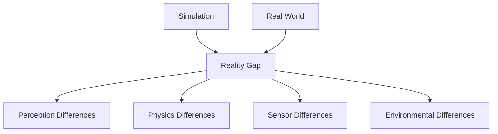

# Chapter 1: Sim-to-Real Transfer

## Overview

Sim-to-real transfer is the process of taking models and algorithms developed in simulation and successfully deploying them on real robots. This section covers the challenges, techniques, and best practices for achieving effective sim-to-real transfer in robotics applications.

## Learning Objectives

By the end of this section, you will be able to:
- Identify the main challenges in sim-to-real transfer
- Apply techniques to minimize the sim-to-real gap
- Evaluate sim-to-real transfer effectiveness
- Understand domain adaptation methods
- Implement validation strategies for real-world deployment

## The Sim-to-Real Transfer Challenge

### Understanding the Reality Gap

The sim-to-real gap encompasses all differences between simulation and reality:



### Key Components of the Reality Gap

1. **Visual Differences**:
   - Lighting conditions (shadows, reflections, glare)
   - Texture and material appearance
   - Color representation and calibration
   - Dynamic lighting changes

2. **Physics Differences**:
   - Friction models and coefficients
   - Collision detection and response
   - Dynamics and inertial properties
   - Actuator behavior and limitations

3. **Sensor Differences**:
   - Noise characteristics and patterns
   - Resolution and accuracy limitations
   - Temporal synchronization
   - Calibration parameters

4. **Environmental Differences**:
   - Unmodeled objects and dynamics
   - Weather and atmospheric conditions
   - Human presence and activities
   - Wear and aging of equipment

## Techniques for Reducing the Reality Gap

### 1. Domain Randomization

Domain randomization was covered in the previous section and is one of the most effective techniques:

- **Visual domain randomization**: Randomize lighting, textures, colors
- **Physical domain randomization**: Randomize physics parameters
- **Sensor domain randomization**: Add realistic noise models

### 2. Domain Adaptation

Domain adaptation techniques help models adapt from simulation to reality:

#### Unsupervised Domain Adaptation

```python
def unsupervised_domain_adaptation(sim_model, real_data):
    """Adapt simulation-trained model to real data without labels"""
    import torch
    import torch.nn as nn

    # Extract features from both domains
    sim_features = sim_model.extract_features(sim_data)
    real_features = sim_model.extract_features(real_data)

    # Align feature distributions using adversarial training
    discriminator = nn.Sequential(
        nn.Linear(feature_dim, 256),
        nn.ReLU(),
        nn.Linear(256, 128),
        nn.ReLU(),
        nn.Linear(128, 1),
        nn.Sigmoid()
    )

    # Train discriminator to distinguish domains
    # Train feature extractor to fool discriminator
    # This aligns sim and real feature distributions
    pass
```

#### Self-Supervised Learning

Use unlabeled real data to adapt the model:

```python
def self_supervised_adaptation(model, unlabeled_real_data):
    """Use unlabeled real data for adaptation"""
    # Apply data augmentations to create pseudo-labels
    augmented_data = apply_augmentations(unlabeled_real_data)

    # Train on augmented pairs with consistency loss
    for batch in augmented_data:
        pred1 = model(batch['view1'])
        pred2 = model(batch['view2'])

        # Consistency loss: predictions should be similar
        loss = consistency_loss(pred1, pred2)
        loss.backward()
```

### 3. System Identification

Identify and model the differences between simulation and reality:

```python
def system_identification(robot_sim, robot_real):
    """Identify system parameters that differ between sim and real"""
    # Collect input-output data from both systems
    sim_data = collect_io_data(robot_sim)
    real_data = collect_io_data(robot_real)

    # Identify parameters that minimize sim-real differences
    parameters = optimize_parameters(sim_data, real_data)
    return parameters
```

## Perception-Specific Techniques

### Camera Calibration

Ensure accurate camera models in simulation:

```python
def validate_camera_calibration(sim_camera, real_camera):
    """Validate that simulation camera matches real camera"""
    # Compare intrinsic parameters
    sim_K = sim_camera.get_intrinsic_matrix()
    real_K = real_camera.get_intrinsic_matrix()

    # Compare distortion coefficients
    sim_D = sim_camera.get_distortion_coefficients()
    real_D = real_camera.get_distortion_coefficients()

    # Validate within acceptable tolerance
    k_diff = np.linalg.norm(sim_K - real_K)
    d_diff = np.linalg.norm(sim_D - real_D)

    return k_diff < 0.1 and d_diff < 0.05  # Tolerance values
```

### Sensor Fusion

Combine multiple sensor modalities to improve robustness:

```python
def sensor_fusion_localization(cam_pose, lidar_pose, imu_data, weights):
    """Fuse multiple sensor estimates for robust localization"""
    # Weighted combination of sensor estimates
    fused_pose = (
        weights['camera'] * cam_pose +
        weights['lidar'] * lidar_pose +
        weights['imu'] * integrate_imu(imu_data)
    ) / sum(weights.values())

    # Include uncertainty estimates
    fused_uncertainty = combine_uncertainties(
        cam_uncertainty, lidar_uncertainty, imu_uncertainty, weights
    )

    return fused_pose, fused_uncertainty
```

## Physics Model Calibration

### Friction and Contact Models

Calibrate physics parameters to match real-world behavior:

```python
def calibrate_friction_coefficients():
    """Calibrate friction coefficients using real-world data"""
    import numpy as np
    from scipy.optimize import minimize

    def objective(params):
        # Simulate with given parameters
        sim_result = simulate_with_params(params)

        # Compare with real-world measurements
        real_result = get_real_world_data()

        # Return error between sim and real
        error = np.mean((sim_result - real_result) ** 2)
        return error

    # Optimize parameters
    initial_params = [0.5, 0.1]  # Initial friction, restitution
    result = minimize(objective, initial_params, method='BFGS')

    return result.x  # Optimized parameters
```

### Dynamics Modeling

Improve dynamic simulation accuracy:

```python
def enhanced_dynamics_model(robot, control_input):
    """Enhanced dynamics model with real-world corrections"""
    # Base physics simulation
    base_accel = simulate_physics(robot, control_input)

    # Apply learned corrections
    correction = learned_dynamics_correction(robot.state, control_input)

    # Add realistic noise and delays
    noise = realistic_sensor_noise(robot.sensors)
    delay = actuator_delay(control_input)

    final_accel = base_accel + correction + noise
    return integrate_acceleration(final_accel, delay)
```

## Validation Strategies

### Progressive Validation

Validate at increasing levels of reality:

#### 1. Simulation Validation
- Validate in the same simulation environment used for training
- Check basic functionality and performance

#### 2. Domain Shift Validation
- Test on simulation with different randomization settings
- Validate robustness to domain variations

#### 3. Partial Reality Validation
- Use hardware-in-the-loop (HIL) testing
- Combine real sensors with simulated environment or vice versa

#### 4. Full Reality Validation
- Test on actual hardware in real environment
- Validate complete system performance

### Performance Metrics

#### Perception Metrics

```python
def evaluate_perception_transfer(gt_annotations, sim_predictions, real_predictions):
    """Evaluate perception performance transfer"""
    # Calculate mAP for both domains
    sim_map = calculate_map(gt_annotations, sim_predictions)
    real_map = calculate_map(gt_annotations, real_predictions)

    # Calculate sim-to-real gap
    gap = (sim_map - real_map) / sim_map * 100

    return {
        'sim_mAP': sim_map,
        'real_mAP': real_map,
        'transfer_gap': gap,
        'success': gap < 15.0  # Acceptable gap < 15%
    }
```

#### Navigation Metrics

```python
def evaluate_navigation_transfer():
    """Evaluate navigation performance transfer"""
    metrics = {
        'success_rate': 0.0,
        'path_efficiency': 0.0,  # Actual path length / optimal length
        'collision_rate': 0.0,
        'computation_time': 0.0,
        'localization_accuracy': 0.0
    }

    # Run extensive tests in both domains
    # Compare performance metrics
    return metrics
```

## Practical Exercise: Implement Transfer Validation

### Exercise 1: Perception Model Evaluation

Let's implement a complete evaluation pipeline:

```python
import numpy as np
import cv2
import json
from sklearn.metrics import average_precision_score
import matplotlib.pyplot as plt

class SimToRealEvaluator:
    """Complete evaluation framework for sim-to-real transfer"""

    def __init__(self, sim_model_path, real_model_path=None):
        self.sim_model = self.load_model(sim_model_path)
        self.real_model = self.load_model(real_model_path) if real_model_path else None

    def load_model(self, model_path):
        """Load trained model"""
        # Implementation depends on your ML framework
        # This is a placeholder
        pass

    def evaluate_perception(self, sim_dataset, real_dataset):
        """Evaluate perception performance in both domains"""
        results = {}

        # Evaluate on simulation data
        sim_predictions = self.run_inference(self.sim_model, sim_dataset['images'])
        sim_metrics = self.calculate_detection_metrics(
            sim_dataset['annotations'], sim_predictions
        )
        results['simulation'] = sim_metrics

        # Evaluate on real data (if available)
        if self.real_model and real_dataset:
            real_predictions = self.run_inference(self.real_model, real_dataset['images'])
            real_metrics = self.calculate_detection_metrics(
                real_dataset['annotations'], real_predictions
            )
            results['real'] = real_metrics

            # Calculate transfer metrics
            results['transfer_metrics'] = self.calculate_transfer_metrics(
                sim_metrics, real_metrics
            )

        return results

    def run_inference(self, model, images):
        """Run model inference on images"""
        predictions = []
        for img in images:
            pred = model.predict(img)
            predictions.append(pred)
        return predictions

    def calculate_detection_metrics(self, ground_truth, predictions):
        """Calculate object detection metrics"""
        # Calculate mAP, precision, recall, etc.
        metrics = {}

        # For each class, calculate average precision
        classes = set()
        for gt in ground_truth:
            for obj in gt.get('objects', []):
                classes.add(obj['class_id'])

        ap_scores = []
        for class_id in classes:
            # Get all ground truth and predictions for this class
            gt_for_class = self.filter_by_class(ground_truth, class_id)
            pred_for_class = self.filter_by_class(predictions, class_id)

            # Calculate AP for this class
            ap = self.calculate_average_precision(gt_for_class, pred_for_class)
            ap_scores.append(ap)

        metrics['mAP'] = np.mean(ap_scores) if ap_scores else 0.0
        return metrics

    def calculate_transfer_metrics(self, sim_metrics, real_metrics):
        """Calculate sim-to-real transfer metrics"""
        transfer_metrics = {}

        # Calculate performance gap
        if 'mAP' in sim_metrics and 'mAP' in real_metrics:
            sim_map = sim_metrics['mAP']
            real_map = real_metrics['mAP']
            gap = (sim_map - real_map) / sim_map * 100 if sim_map > 0 else 0

            transfer_metrics['map_gap_percent'] = gap
            transfer_metrics['transfer_success'] = gap < 20.0  # Good transfer if <20% gap

        return transfer_metrics

    def visualize_transfer_analysis(self, results):
        """Create visualizations for transfer analysis"""
        fig, axes = plt.subplots(1, 2, figsize=(12, 5))

        # Plot 1: Performance comparison
        if 'simulation' in results and 'real' in results:
            sim_map = results['simulation'].get('mAP', 0)
            real_map = results['real'].get('mAP', 0)

            axes[0].bar(['Simulation', 'Real'], [sim_map, real_map])
            axes[0].set_ylabel('mAP')
            axes[0].set_title('Perception Performance: Sim vs Real')

        # Plot 2: Transfer gap over time (if multiple evaluations)
        if 'transfer_metrics' in results:
            gap = results['transfer_metrics'].get('map_gap_percent', 0)
            axes[1].bar(['Transfer Gap'], [gap])
            axes[1].set_ylabel('Gap (%)')
            axes[1].set_title(f'Transfer Gap: {gap:.1f}%')

        plt.tight_layout()
        plt.savefig('transfer_analysis.png')
        plt.show()

# Usage example
def main():
    evaluator = SimToRealEvaluator(
        sim_model_path="models/sim_object_detector.pt",
        real_model_path="models/real_object_detector.pt"
    )

    # Load datasets
    # sim_dataset = load_dataset("shared/datasets/synthetic_warehouse/")
    # real_dataset = load_dataset("real_warehouse_data/")

    # Evaluate transfer
    results = evaluator.evaluate_perception(sim_dataset, real_dataset)

    # Print results
    print("Sim-to-Real Transfer Evaluation Results:")
    print(f"Simulation mAP: {results['simulation']['mAP']:.3f}")
    print(f"Real mAP: {results['real']['mAP']:.3f}")
    print(f"Transfer Gap: {results['transfer_metrics']['map_gap_percent']:.1f}%")
    print(f"Transfer Success: {results['transfer_metrics']['transfer_success']}")

if __name__ == "__main__":
    main()
```

## Real-World Deployment Considerations

### Safety First Approach

```python
def safe_real_world_deployment(model, safety_threshold=0.7):
    """Deploy model safely in real world with fallbacks"""

    def safe_predict(image):
        # Get prediction with confidence
        prediction = model.predict_with_confidence(image)

        # Check if confidence is above threshold
        if prediction['confidence'] > safety_threshold:
            return prediction
        else:
            # Fallback to conservative behavior
            return self.fallback_action(prediction)

    return safe_predict
```

### Gradual Deployment Strategy

1. **Supervised Operation**: Human supervisor present
2. **Assisted Operation**: Human ready to intervene
3. **Autonomous Operation**: Full autonomy with monitoring

## Transfer Learning Techniques

### Fine-tuning on Real Data

```python
def fine_tune_on_real_data(sim_model, real_data, epochs=10):
    """Fine-tune simulation-trained model on limited real data"""
    import torch
    import torch.nn as nn
    import torch.optim as optim

    # Use lower learning rate to preserve sim knowledge
    optimizer = optim.Adam(sim_model.parameters(), lr=1e-5)
    criterion = nn.CrossEntropyLoss()

    for epoch in range(epochs):
        for batch in real_data:
            optimizer.zero_grad()

            # Forward pass
            outputs = sim_model(batch['images'])
            loss = criterion(outputs, batch['labels'])

            # Backward pass
            loss.backward()
            optimizer.step()

    return sim_model
```

### Few-Shot Adaptation

```python
def few_shot_adaptation(model, few_real_examples, num_updates=100):
    """Adapt model with very limited real data"""
    # Meta-learning approach or gradient-based adaptation
    # Adapt quickly with minimal real examples
    pass
```

## Validation Checklist

### Pre-Deployment Validation

- [ ] Model performance validated in simulation
- [ ] Domain randomization applied during training
- [ ] Real-world data collected for validation
- [ ] Safety mechanisms implemented
- [ ] Fallback behaviors defined
- [ ] Performance metrics established

### Post-Deployment Monitoring

- [ ] Real-time performance monitoring
- [ ] Drift detection in model inputs
- [ ] Continuous learning capabilities
- [ ] Safety violation logging
- [ ] Performance degradation alerts

## Troubleshooting Transfer Issues

### Common Problems

1. **Large Performance Drop**: Model performs well in sim but poorly in real
   - **Solution**: Increase domain randomization, collect more real data

2. **Overfitting to Simulation**: Model doesn't generalize to real variations
   - **Solution**: Add more diverse simulation conditions

3. **Sensor Calibration Issues**: Mismatch between sim and real sensors
   - **Solution**: Recalibrate sensors, validate intrinsic/extrinsic parameters

4. **Physics Model Inaccuracies**: Real robot behaves differently than sim
   - **Solution**: Calibrate physics parameters, add system identification

### Debugging Strategies

```python
def debug_transfer_issues(sim_output, real_output):
    """Debug sim-to-real transfer issues"""
    issues = []

    # Compare input distributions
    if not distributions_match(sim_output['inputs'], real_output['inputs']):
        issues.append("Input distributions don't match")

    # Compare processing times
    if processing_time_mismatch(sim_output, real_output):
        issues.append("Processing time mismatch")

    # Compare output patterns
    if output_pattern_mismatch(sim_output, real_output):
        issues.append("Output pattern mismatch")

    return issues
```

## Success Criteria Validation

This section addresses **FR-006**: System MUST demonstrate sim-to-real transfer principles and techniques to minimize reality gap.

### Validation Checklist

- [ ] Domain randomization techniques applied (Tier 1/2/3)
- [ ] Sim-to-real gap quantified and measured
- [ ] Transfer validation methodology implemented
- [ ] Performance metrics established for both domains
- [ ] Safety considerations addressed
- [ ] Gradual deployment strategy defined

## Advanced Topics

### Neural Rendering

Use neural networks to make simulation more realistic:

```python
def neural_rendering_correction(rendered_image, real_reference):
    """Use neural network to make rendered images more realistic"""
    # Train neural network to transform synthetic to realistic appearance
    # This bridges visual domain gap
    pass
```

### System-Level Adaptation

Adapt entire system rather than individual components:

```python
def system_level_adaptation(robot_system, real_performance):
    """Adapt entire robot system based on real performance"""
    # Adjust planning, control, perception parameters jointly
    # Based on observed real-world performance
    pass
```

## Future Directions

### Emerging Techniques

1. **Neural Radiance Fields (NeRF)**: For more realistic scene rendering
2. **Differentiable Simulation**: End-to-end optimization through simulation
3. **Foundation Models**: Pre-trained models for better transfer
4. **Embodied AI**: Learning from physical interaction

## Next Steps

This concludes Chapter 1 on Isaac Sim. You've learned to:
- Create photorealistic simulation environments
- Configure virtual sensors for data generation
- Generate synthetic datasets with ground truth
- Apply domain randomization techniques
- Understand sim-to-real transfer principles

Continue to Chapter 2: [Isaac ROS - Hardware-Accelerated VSLAM](../chapter-2-isaac-ros/01-intro.mdx) to learn about Visual SLAM.

## Resources

- [Sim-to-Real Transfer Survey](https://arxiv.org/abs/2006.12416)
- [Domain Randomization Best Practices](https://openreview.net/forum?id=H1q9HsAcFQ)
- [NVIDIA Isaac ROS Sim-to-Real Guide](https://nvidia-isaac-ros.github.io/concepts/sim2real/index.html)

---

*Continue to [Chapter 2: Isaac ROS - Hardware-Accelerated VSLAM](../chapter-2-isaac-ros/01-intro.mdx) to learn about Visual SLAM.*