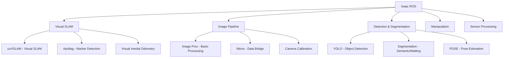

# Chapter 2: Introduction to Isaac ROS VSLAM

## Overview

Welcome to Chapter 2 of Module 3: The AI-Robot Brain. This chapter introduces you to NVIDIA Isaac ROS packages for hardware-accelerated Visual SLAM (Simultaneous Localization and Mapping). You'll learn to build 3D maps while tracking robot pose in real-time using GPU acceleration.

Isaac ROS provides production-ready, hardware-accelerated perception packages built on top of ROS 2. For VSLAM specifically, Isaac ROS offers:
- **cuVSLAM**: CUDA-accelerated Visual SLAM algorithm
- **Real-time performance**: >30 Hz frame rate on supported GPUs
- **Robust tracking**: Visual odometry with loop closure detection
- **ROS 2 integration**: Standard interfaces compatible with Nav2
- **GPU acceleration**: Leverages NVIDIA GPU compute capabilities

## Learning Objectives

By the end of this chapter, you will be able to:
- Install and configure Isaac ROS VSLAM packages
- Set up visual odometry pipelines for real-time pose estimation
- Configure stereo and mono camera inputs for VSLAM processing
- Build 3D maps with loop closure detection and pose graph optimization
- Save, load, and relocalize within previously mapped environments
- Tune VSLAM parameters for optimal performance
- Demonstrate GPU acceleration benefits over CPU-only implementations
- Debug common VSLAM failures (tracking loss, mapping errors, relocalization issues)

## Prerequisites

Before starting this chapter, ensure you have:

**Completed Previous Modules:**
- [x] Module 1: ROS 2 Fundamentals
- [x] Module 2: Digital Twin Engineering
- [x] Chapter 1: Isaac Sim (for synthetic data and simulation experience)

**Hardware Requirements:**
- [x] NVIDIA GPU with CUDA 11.8+ support (RTX 2060 or higher recommended)
- [x] 8GB+ VRAM minimum, 12GB+ recommended for optimal performance
- [x] Compute Capability 7.5+ (Turing architecture or newer)

**Software Requirements:**
- [x] ROS 2 Humble (primary) or Jazzy (with compatibility notes)
- [x] Isaac ROS Visual SLAM packages installed
- [x] Isaac Sim (for simulation testing)
- [x] Python 3.10+

**Knowledge Prerequisites:**
- Understanding of ROS 2 concepts (topics, services, actions, tf)
- Basic computer vision concepts (camera models, feature detection)
- Familiarity with 3D transformations and coordinate systems

## Chapter Structure

This chapter is organized into 7 sections:

1. **Introduction to Isaac ROS VSLAM** - Overview and setup
2. **Visual Odometry** - Setting up camera streams and pose estimation
3. **Stereo VSLAM** - Stereo camera configuration and 3D reconstruction
4. **Loop Closure Detection** - Pose graph optimization and drift correction
5. **Map Management** - Saving, loading, and relocalization workflows
6. **Performance Tuning** - GPU acceleration optimization and parameter tuning
7. **VSLAM Debugging** - Failure diagnosis and recovery strategies

## Isaac ROS Ecosystem

Isaac ROS is NVIDIA's collection of hardware-accelerated perception packages:



### cuVSLAM Architecture

The cuVSLAM package provides GPU-accelerated Visual SLAM:

```
Camera Input → Feature Extraction → Tracking → Mapping → Loop Closure → Pose Output
     ↓              ↓                ↓         ↓           ↓              ↓
   Stereo/     CUDA Features    GPU KLT    Bundle     GPU ICP      TF Transforms
   Mono        (ORB/SURF)      Tracking   Adjustment   Matching      (map→odom)
```

## Hardware Tier Detection

Module 3 automatically detects your hardware capabilities:

```bash
# Check your current tier
python3 shared/utils/tier_detection.py

# Expected output for VSLAM:
# Detected Tier: A (simulation) - Simulation Only
# GPU: NVIDIA GeForce RTX 3060 (12GB VRAM)
# CUDA: 11.8
# Compute Capability: 8.6
# Status: Ready for VSLAM (30+ Hz expected)
```

Based on your tier, the exercises will adapt:
- **Tier A (Simulation)**: Use recorded ROS bags from Chapter 1 datasets
- **Tier B (Jetson)**: Deploy on Jetson Orin with power management
- **Tier C (Hardware)**: Connect to real stereo camera on humanoid robot

## Performance Targets

Isaac ROS cuVSLAM delivers significant performance improvements:

| GPU | Frame Rate | VSLAM Type | VRAM Usage |
|-----|------------|------------|------------|
| RTX 3060 (12GB) | 35-60 Hz | Stereo VSLAM | 4-6 GB |
| RTX 4070 (12GB) | 50-80 Hz | Stereo VSLAM | 5-7 GB |
| Jetson Orin NX | 25-35 Hz | Stereo VSLAM | 6-8 GB |
| RTX 2060 (6GB) | 15-25 Hz | Stereo VSLAM | 3-4 GB |

**Target Performance (SC-002)**: >30 Hz real-time operation for autonomous navigation.

## Getting Started

### Installation

Isaac ROS packages are typically installed via apt:

```bash
# Install Isaac ROS Visual SLAM
sudo apt update
sudo apt install ros-humble-isaac-ros-visual-slam

# Verify installation
ros2 pkg list | grep isaac_ros_visual_slam
```

### Basic Launch

Test the installation with a simple launch:

```bash
# Terminal 1: Launch Isaac Sim with stereo camera (from Chapter 1)
# (Make sure Chapter 1 scene with stereo camera is running)

# Terminal 2: Launch cuVSLAM
ros2 launch isaac_ros_visual_slam isaac_ros_visual_slam.launch.py

# Terminal 3: Visualize in RViz
ros2 run rviz2 rviz2
# Add displays for: TF, Pose, PointCloud2, Image
```

## Success Criteria for Chapter 2

This chapter addresses the following Module 3 success criteria:

- **SC-002**: VSLAM implementation achieves >30 Hz real-time performance
- **SC-003**: VSLAM trajectory accuracy maintains <2% drift over 100-meter paths
- **FR-007 to FR-013**: All VSLAM functional requirements

You'll validate these criteria through exercises and performance measurements.

## Troubleshooting Common Issues

**CUDA Runtime Error**:
- Verify NVIDIA drivers: `nvidia-smi`
- Check CUDA installation: `nvcc --version`
- Ensure Isaac ROS was built with correct CUDA version

**Low Frame Rate**:
- Check GPU utilization: `nvidia-smi`
- Verify camera resolution (reduce if needed)
- Check for competing GPU processes

**Tracking Loss**:
- Ensure adequate lighting conditions
- Verify camera calibration
- Check for sufficient visual features in environment

## Safety Considerations

:::danger Physical AI Safety
When deploying VSLAM on physical robots, always maintain emergency stop procedures. While VSLAM provides localization, it may fail in featureless environments or under poor lighting conditions.
:::

## Next Steps

Continue to Section 2: [Visual Odometry](./02-visual-odometry.mdx) to begin setting up camera streams and pose estimation.

## Resources

- [Isaac ROS Documentation](https://nvidia-isaac-ros.github.io/)
- [cuVSLAM Package Guide](https://nvidia-isaac-ros.github.io/repositories_and_packages/isaac_ros_visual_slam/index.html)
- [ROS 2 Camera Calibration](https://docs.ros.org/en/humble/Tutorials/Calibrating-A-Camera.html)

---

*Continue to [Section 2: Visual Odometry](./02-visual-odometry.mdx) to begin setting up camera streams and pose estimation.*