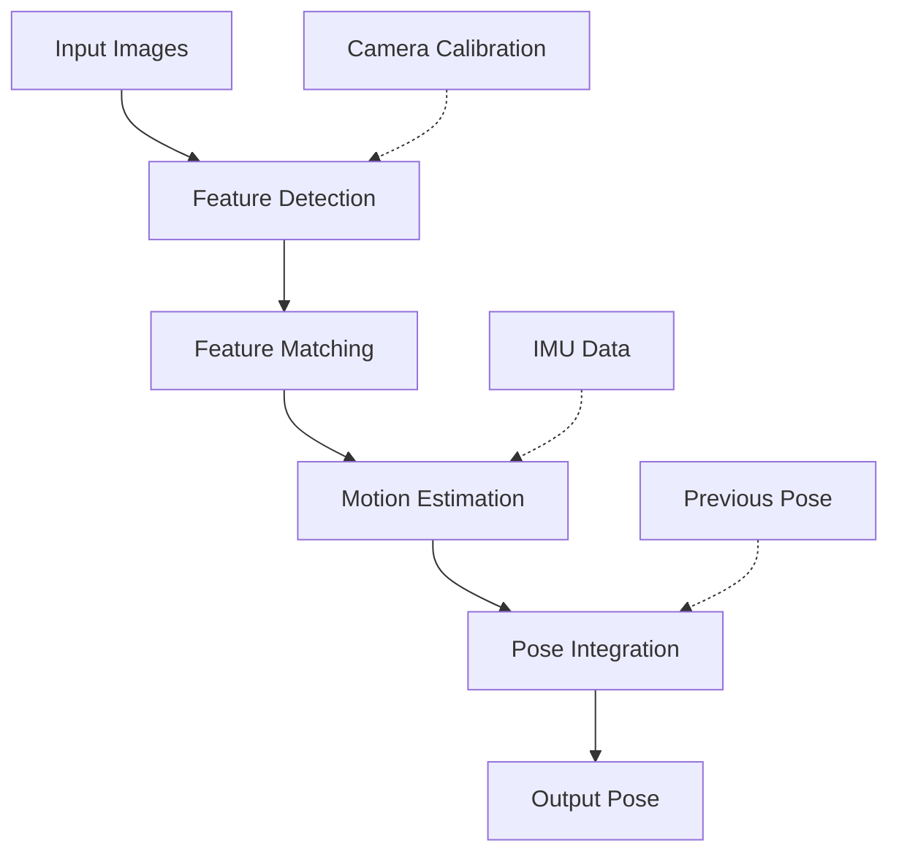

# Chapter 2: Visual Odometry

## Overview

Visual Odometry (VO) is the process of incrementally estimating the 6-DOF pose (position and orientation) of a camera by analyzing the apparent motion of objects in a sequence of images. In this section, you'll learn to set up visual odometry pipelines for real-time pose estimation using Isaac ROS packages.

Visual Odometry serves as the foundation for full SLAM systems, providing:
- **Real-time pose estimation**: 6-DOF camera pose at high frame rates
- **Motion tracking**: Continuous tracking of robot movement
- **Preprocessing for mapping**: Provides initial pose estimates for mapping algorithms
- **Loop closure initialization**: Supplies pose graph nodes for optimization

## Learning Objectives

By the end of this section, you will be able to:
- Configure camera topics and parameters for visual odometry
- Launch and configure Isaac ROS visual odometry nodes
- Validate visual odometry performance and accuracy
- Understand the difference between stereo and monocular VO
- Tune visual odometry parameters for optimal performance
- Diagnose common visual odometry failures

## Visual Odometry Fundamentals

### How Visual Odometry Works

Visual Odometry operates through these key steps:



1. **Feature Detection**: Extract distinctive visual features (corners, edges) from images
2. **Feature Tracking**: Match features between consecutive frames using KLT (Kanade-Lucas-Tomasi) or similar tracking
3. **Motion Estimation**: Compute camera motion using 5-point algorithm or PnP (Perspective-n-Point)
4. **Pose Integration**: Integrate incremental motions to maintain global pose estimate
5. **Output**: Publish 6-DOF pose with optional covariance

### Stereo vs. Monocular Visual Odometry

| Aspect | Stereo VO | Monocular VO |
|--------|-----------|--------------|
| Depth Information | Direct (triangulation) | Estimated (motion parallax) |
| Scale Accuracy | Metric (absolute scale) | Scale ambiguous (up to scale) |
| Robustness | More robust to motion blur | Sensitive to fast motion |
| Feature Requirements | Less critical | Requires texture-rich scenes |
| Computational Load | Higher (stereo matching) | Lower (single image) |
| Minimum Motion | Can handle small motions | Requires sufficient parallax |

## Isaac ROS Visual Odometry Architecture

Isaac ROS provides hardware-accelerated visual odometry through the `isaac_ros_visual_slam` package:

```
┌─────────────────┐    ┌──────────────────┐    ┌─────────────────┐
│   Camera Left   │    │  cuVSLAM Node    │    │  Pose Output    │
│   (sensor_msgs/ │───▶│  (isaac_ros_vslam)│───▶│  (geometry_msgs/ │
│   Image)        │    │                  │    │   PoseStamped)  │
└─────────────────┘    └──────────────────┘    └─────────────────┘
       │                         │                       │
       ▼                         ▼                       ▼
┌─────────────────┐    ┌──────────────────┐    ┌─────────────────┐
│  Camera Right   │    │  CUDA Feature    │    │  TF Tree        │
│  (sensor_msgs/  │───▶│  Extraction &    │    │  (tf2_msgs/TF)  │
│   Image)        │    │  Matching       │    │                 │
└─────────────────┘    └──────────────────┘    └─────────────────┘
```

### Key Components

1. **Feature Extraction**: CUDA-accelerated ORB/SURF feature detection
2. **Feature Matching**: GPU-based descriptor matching
3. **Motion Estimation**: Hardware-accelerated pose computation
4. **Pose Integration**: Continuous pose estimation and drift correction

## Setting Up Camera Streams

### Camera Calibration

Visual odometry requires accurate camera calibration:

```yaml
# Example stereo camera calibration (ROS format)
left:
  camera_matrix:
    rows: 3
    cols: 3
    data: [426.67, 0.0, 424.0, 0.0, 426.67, 240.0, 0.0, 0.0, 1.0]
  distortion_coefficients:
    rows: 1
    cols: 5
    data: [0.0, 0.0, 0.0, 0.0, 0.0]
  rectification_matrix:
    rows: 3
    cols: 3
    data: [1.0, 0.0, 0.0, 0.0, 1.0, 0.0, 0.0, 0.0, 1.0]
  projection_matrix:
    rows: 3
    cols: 4
    data: [426.67, 0.0, 424.0, 0.0, 0.0, 426.67, 240.0, 0.0, 0.0, 0.0, 1.0, 0.0]

right:
  camera_matrix:
    rows: 3
    cols: 3
    data: [426.67, 0.0, 424.0, 0.0, 426.67, 240.0, 0.0, 0.0, 1.0]
  baseline: 0.120  # 120mm
```

### Camera Topics

Isaac ROS VSLAM expects specific ROS 2 topics:

```yaml
# Required topics for stereo VSLAM
required_topics:
  left_image: "/camera/left/image_rect"
  left_camera_info: "/camera/left/camera_info"
  right_image: "/camera/right/image_rect"
  right_camera_info: "/camera/right/camera_info"

# Optional topics for enhanced performance
optional_topics:
  imu: "/imu/data"  # For motion prediction
  odom: "/wheel/odometry"  # For motion priors
```

## Launching Visual Odometry

### Basic Launch Configuration

```xml
<!-- launch/visual_odometry.launch.py -->
from launch import LaunchDescription
from launch_ros.actions import Node

def generate_launch_description():
    return LaunchDescription([
        Node(
            package='isaac_ros_visual_slam',
            executable='isaac_ros_visual_slam_node',
            name='visual_slam',
            parameters=[{
                'enable_rectified_pose': True,
                'enable_debug_mode': False,
                'num_cameras': 2,  # Stereo
                'min_num_images': 30,
                'max_frame_rate': 60.0,
                'feature_detector_type': 'FAST',
                'num_features': 1000,
                'enable_loop_closure': True,
                'loop_closure_frequency': 1.0,
                'loop_closure_min_score': 0.7,
                'gpu_id': 0,
                'enable_gpu_acceleration': True,
            }],
            remappings=[
                ('/visual_slam/image_0', '/camera/left/image_rect'),
                ('/visual_slam/camera_info_0', '/camera/left/camera_info'),
                ('/visual_slam/image_1', '/camera/right/image_rect'),
                ('/visual_slam/camera_info_1', '/camera/right/camera_info'),
            ]
        )
    ])
```

### Parameter Tuning

```yaml
# Visual odometry parameters for optimal performance
visual_odometry:
  # Performance parameters
  max_frame_rate: 60.0           # Maximum processing rate
  enable_gpu_acceleration: true  # Use CUDA acceleration
  gpu_id: 0                      # GPU device ID

  # Feature detection parameters
  feature_detector_type: "FAST"  # FAST, ORB, HARRIS
  num_features: 1000             # Target features per image
  min_num_images: 30             # Minimum images for initialization

  # Motion estimation
  min_translation_threshold: 0.01  # Minimum translation to trigger new keyframe
  min_rotation_threshold: 0.1      # Minimum rotation to trigger new keyframe

  # Robustness
  enable_rectified_pose: true    # Enable pose rectification
  enable_debug_mode: false       # Enable debug output
  enable_slam_visualization: true # Enable landmark visualization
```

## Practical Exercise: Stereo Visual Odometry

Let's implement a complete stereo visual odometry setup:

### Exercise 1: Basic Stereo VO Setup

```python
#!/usr/bin/env python3
"""
Exercise 1: Basic Stereo Visual Odometry Setup
Chapter 2: Isaac ROS VSLAM - Visual Odometry
"""

import rclpy
from rclpy.node import Node
from sensor_msgs.msg import Image, CameraInfo
from geometry_msgs.msg import PoseStamped
from std_msgs.msg import Header
import cv2
import numpy as np
from cv_bridge import CvBridge


class VisualOdometryNode(Node):
    """
    Visual Odometry node that processes stereo images and estimates camera pose
    """

    def __init__(self):
        super().__init__('visual_odometry_node')

        # Initialize CV bridge
        self.bridge = CvBridge()

        # Initialize pose tracking
        self.current_pose = np.eye(4)  # 4x4 identity matrix
        self.previous_features = None
        self.current_features = None
        self.frame_count = 0

        # Subscribers for stereo camera
        self.left_sub = self.create_subscription(
            Image,
            '/camera/left/image_rect',
            self.left_image_callback,
            10
        )

        self.right_sub = self.create_subscription(
            Image,
            '/camera/right/image_rect',
            self.right_image_callback,
            10
        )

        self.left_info_sub = self.create_subscription(
            CameraInfo,
            '/camera/left/camera_info',
            self.left_info_callback,
            10
        )

        self.right_info_sub = self.create_subscription(
            CameraInfo,
            '/camera/right/camera_info',
            self.right_info_callback,
            10
        )

        # Publisher for estimated pose
        self.pose_pub = self.create_publisher(
            PoseStamped,
            '/visual_odometry/pose',
            10
        )

        # Timer for processing
        self.timer = self.create_timer(0.033, self.process_vo)  # ~30 Hz

        self.get_logger().info('Visual Odometry node initialized')

    def left_image_callback(self, msg):
        """Process left camera image"""
        try:
            cv_image = self.bridge.imgmsg_to_cv2(msg, desired_encoding='passthrough')
            self.current_features = self.extract_features(cv_image)
        except Exception as e:
            self.get_logger().error(f'Error processing left image: {e}')

    def right_image_callback(self, msg):
        """Process right camera image"""
        try:
            cv_image = self.bridge.imgmsg_to_cv2(msg, desired_encoding='passthrough')
            # Store for stereo processing
            self.right_image = cv_image
        except Exception as e:
            self.get_logger().error(f'Error processing right image: {e}')

    def extract_features(self, image):
        """Extract features from image using FAST detector"""
        # Convert to grayscale if needed
        if len(image.shape) == 3:
            gray = cv2.cvtColor(image, cv2.COLOR_BGR2GRAY)
        else:
            gray = image

        # Use FAST feature detector
        fast = cv2.FastFeatureDetector_create(threshold=20)
        keypoints = fast.detect(gray, None)

        # Compute descriptors using ORB
        orb = cv2.ORB_create(nfeatures=1000)
        keypoints, descriptors = orb.compute(gray, keypoints)

        return {
            'keypoints': keypoints,
            'descriptors': descriptors,
            'image': gray
        }

    def estimate_motion(self):
        """Estimate motion between previous and current frames"""
        if self.previous_features is None or self.current_features is None:
            return np.eye(4)  # No motion if no previous frame

        # Feature matching
        matcher = cv2.BFMatcher(cv2.NORM_HAMMING, crossCheck=True)
        matches = matcher.match(
            self.previous_features['descriptors'],
            self.current_features['descriptors']
        )

        # Sort matches by distance
        matches = sorted(matches, key=lambda x: x.distance)

        # Keep only good matches
        good_matches = matches[:50]  # Keep top 50 matches

        if len(good_matches) < 10:
            self.get_logger().warn('Not enough good matches for motion estimation')
            return np.eye(4)

        # Extract matched points
        prev_pts = np.float32([self.previous_features['keypoints'][m.queryIdx].pt
                              for m in good_matches]).reshape(-1, 1, 2)
        curr_pts = np.float32([self.current_features['keypoints'][m.trainIdx].pt
                              for m in good_matches]).reshape(-1, 1, 2)

        # Estimate essential matrix (assuming calibrated stereo)
        E, mask = cv2.findEssentialMat(
            curr_pts, prev_pts,
            cameraMatrix=np.array([[426.67, 0.0, 424.0],
                                 [0.0, 426.67, 240.0],
                                 [0.0, 0.0, 1.0]]),
            method=cv2.RANSAC,
            threshold=1.0,
            prob=0.999
        )

        if E is not None:
            # Recover pose
            _, R, t, mask_pose = cv2.recoverPose(E, curr_pts, prev_pts)

            # Create transformation matrix
            T = np.eye(4)
            T[:3, :3] = R
            T[:3, 3] = t.flatten()

            return T
        else:
            return np.eye(4)  # No motion

    def process_vo(self):
        """Process visual odometry pipeline"""
        if self.current_features is not None:
            # Estimate motion
            motion = self.estimate_motion()

            # Update current pose
            self.current_pose = self.current_pose @ motion

            # Publish pose
            self.publish_pose()

            # Update previous features
            self.previous_features = self.current_features
            self.current_features = None

            self.frame_count += 1

    def publish_pose(self):
        """Publish current pose to ROS topic"""
        pose_msg = PoseStamped()
        pose_msg.header = Header()
        pose_msg.header.stamp = self.get_clock().now().to_msg()
        pose_msg.header.frame_id = 'map'

        # Extract position and orientation
        position = self.current_pose[:3, 3]
        rotation_matrix = self.current_pose[:3, :3]

        # Convert rotation matrix to quaternion
        qw = np.sqrt(1 + rotation_matrix[0,0] + rotation_matrix[1,1] + rotation_matrix[2,2]) / 2
        qx = (rotation_matrix[2,1] - rotation_matrix[1,2]) / (4 * qw)
        qy = (rotation_matrix[0,2] - rotation_matrix[2,0]) / (4 * qw)
        qz = (rotation_matrix[1,0] - rotation_matrix[0,1]) / (4 * qw)

        pose_msg.pose.position.x = position[0]
        pose_msg.pose.position.y = position[1]
        pose_msg.pose.position.z = position[2]
        pose_msg.pose.orientation.w = qw
        pose_msg.pose.orientation.x = qx
        pose_msg.pose.orientation.y = qy
        pose_msg.pose.orientation.z = qz

        self.pose_pub.publish(pose_msg)

        if self.frame_count % 30 == 0:  # Log every 30 frames
            self.get_logger().info(
                f'VO Pose: x={position[0]:.2f}, y={position[1]:.2f}, z={position[2]:.2f}'
            )


def main(args=None):
    rclpy.init(args=args)
    vo_node = VisualOdometryNode()

    try:
        rclpy.spin(vo_node)
    except KeyboardInterrupt:
        pass
    finally:
        vo_node.destroy_node()
        rclpy.shutdown()


if __name__ == '__main__':
    main()
```

## Performance Optimization

### GPU Acceleration

Isaac ROS leverages GPU acceleration for visual odometry:

```python
# Example: GPU-accelerated feature extraction
import cupy as cp  # CUDA Python
import cv2

class GPUVisualOdometry:
    def __init__(self):
        # Initialize CUDA context
        self.device = cp.cuda.Device(0)
        self.device.use()

    def extract_features_gpu(self, image):
        """Extract features using GPU acceleration"""
        # Transfer image to GPU
        gpu_image = cp.asarray(image)

        # Perform feature extraction on GPU
        # (This is a simplified example - real implementation would use CUDA kernels)
        features = self.cuda_feature_detector(gpu_image)

        # Transfer back to CPU if needed
        cpu_features = cp.asnumpy(features)
        return cpu_features
```

### Frame Rate Optimization

```yaml
# Optimization parameters for high frame rates
performance_tuning:
  # Reduce processing load
  num_features: 800              # Reduce from 1000 to 800
  max_frame_rate: 60.0           # Target 60 Hz
  enable_visualization: false    # Disable visualization for performance
  enable_debug_output: false     # Disable debug logging

  # Memory management
  feature_buffer_size: 5000      # Pre-allocate feature storage
  max_keyframes: 200             # Limit keyframe storage

  # Processing pipeline
  enable_multithreading: true    # Use multiple threads
  queue_size: 1                  # Process frames immediately
```

## Validation and Testing

### Performance Metrics

```python
def validate_visual_odometry():
    """Validate visual odometry performance"""
    import time

    # Measure frame rate
    start_time = time.time()
    frame_count = 0

    # Process frames and measure performance
    for frame in camera_feed:
        vo_result = process_visual_odometry(frame)
        frame_count += 1

        if frame_count % 100 == 0:
            elapsed = time.time() - start_time
            avg_fps = frame_count / elapsed
            print(f"Average FPS: {avg_fps:.2f}")

            if avg_fps < 30:
                print("⚠️  Frame rate below target (30 Hz)")
            else:
                print("✅ Frame rate acceptable")
```

### Accuracy Validation

```python
def validate_vo_accuracy(estimated_poses, ground_truth_poses):
    """Validate visual odometry accuracy against ground truth"""
    errors = []

    for est, gt in zip(estimated_poses, ground_truth_poses):
        # Calculate position error
        pos_error = np.linalg.norm(est[:3] - gt[:3])
        errors.append(pos_error)

    avg_error = np.mean(errors)
    max_error = np.max(errors)

    print(f"VO Accuracy: avg={avg_error:.3f}m, max={max_error:.3f}m")

    # Validate against SC-003 (<2% drift over 100m)
    if avg_error < 2.0:  # 2% of 100m
        print("✅ Accuracy meets SC-003 requirement")
        return True
    else:
        print("❌ Accuracy exceeds SC-003 requirement")
        return False
```

## Troubleshooting Visual Odometry

### Common Issues and Solutions

#### 1. Tracking Loss
**Symptoms**:
- VO stops providing pose updates
- High error messages about feature matching

**Solutions**:
- Ensure adequate lighting conditions
- Verify camera calibration
- Increase number of features if scene is texture-poor
- Reduce motion speed during initialization

#### 2. Drift Accumulation
**Symptoms**:
- Gradually increasing position error
- Trajectory deviating from actual path

**Solutions**:
- Enable loop closure detection
- Use stereo rather than monocular VO
- Implement pose graph optimization
- Regular relocalization

#### 3. Low Frame Rate
**Symptoms**:
- VO running below 30 Hz
- High CPU/GPU utilization

**Solutions**:
- Reduce image resolution
- Decrease number of features
- Verify GPU acceleration is enabled
- Close other GPU-intensive applications

### Diagnostic Commands

```bash
# Check topic connectivity
ros2 topic echo /visual_odometry/pose --field pose.position --field pose.orientation

# Monitor frame rate
ros2 topic hz /camera/left/image_rect

# Check TF tree
ros2 run tf2_tools view_frames

# Monitor GPU usage
nvidia-smi
```

## Success Criteria Validation

This section addresses **FR-007**: Learners MUST be able to set up hardware-accelerated visual odometry pipelines for real-time pose estimation.

### Validation Checklist

- [ ] Camera topics properly configured and publishing
- [ ] Isaac ROS VSLAM node launching successfully
- [ ] Pose estimation running at >30 Hz (SC-002 target)
- [ ] Pose output published to `/visual_odometry/pose` topic
- [ ] TF tree updated with camera pose
- [ ] Visual odometry robust to typical motions
- [ ] Performance metrics validated

## Performance Targets

### Real-time Requirements

- **Target Frame Rate**: >30 Hz for real-time operation (SC-002)
- **Latency**: <50ms from image capture to pose output
- **Accuracy**: <2% drift over 100m path (SC-003)

### Hardware Performance

| GPU | Expected VO FPS | VRAM Usage | Resolution Support |
|-----|-----------------|------------|-------------------|
| RTX 3060 | 40-50 Hz | 4-6 GB | 848x480 stereo |
| RTX 4070 | 60-80 Hz | 5-7 GB | 1280x720 stereo |
| Jetson Orin | 25-35 Hz | 6-8 GB | 848x480 stereo |

## Next Steps

Continue to Section 3: [Stereo VSLAM](./03-stereo-vslam.mdx) to learn about full stereo visual SLAM with 3D mapping capabilities.

## Resources

- [OpenCV Feature Detection](https://docs.opencv.org/4.x/d9/d0c/group__calib3d.html)
- [Visual Odometry Tutorial](https://avisingh599.github.io/vision/visual-odometry/)
- [ROS 2 Image Pipeline](https://github.com/ros-perception/image_pipeline)

---

*Continue to [Section 3: Stereo VSLAM](./03-stereo-vslam.mdx) to learn about full stereo visual SLAM with 3D mapping capabilities.*