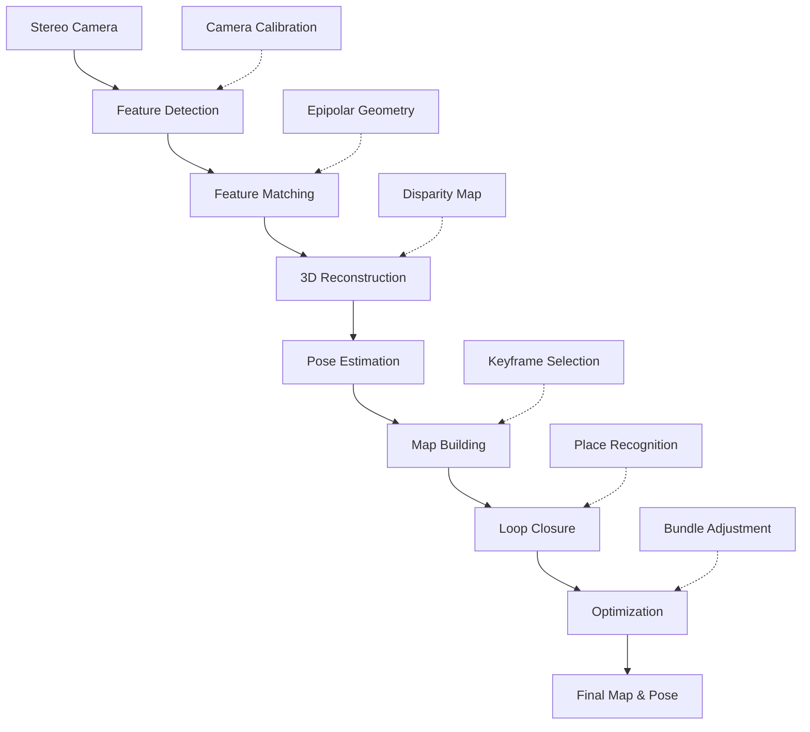

# Chapter 2: Stereo VSLAM

## Overview

Stereo Visual SLAM (Simultaneous Localization and Mapping) combines stereo vision with SLAM algorithms to simultaneously estimate camera pose and build 3D maps of the environment. Unlike monocular SLAM, stereo provides metric scale information directly, making it more suitable for navigation and manipulation tasks.

In this section, you'll learn to configure and run stereo VSLAM systems using Isaac ROS, including 3D reconstruction, map building, and pose graph optimization with loop closure detection.

## Learning Objectives

By the end of this section, you will be able to:
- Configure stereo camera inputs for VSLAM processing
- Launch and tune Isaac ROS stereo VSLAM pipeline
- Build 3D maps with visual features and landmarks
- Implement loop closure detection for drift correction
- Validate map quality and completeness
- Optimize stereo VSLAM for real-time performance
- Integrate stereo VSLAM with navigation systems

## Stereo VSLAM Fundamentals

### How Stereo VSLAM Works

Stereo VSLAM operates through these key components:



### Key Advantages of Stereo VSLAM

1. **Metric Scale**: Direct depth estimation provides absolute scale
2. **Robust Tracking**: Stereo matching is more robust than monocular tracking
3. **3D Reconstruction**: Direct 3D point cloud generation
4. **Reduced Drift**: Better geometric constraints than monocular methods

### Stereo vs. Monocular Comparison

| Aspect | Stereo VSLAM | Monocular VSLAM |
|--------|--------------|-----------------|
| Scale | Metric (absolute) | Up to scale |
| Robustness | Higher (stereo matching) | Lower (feature tracking) |
| Feature Requirements | Moderate | High (texture needed) |
| Computational Load | Higher | Lower |
| Baseline Dependency | Requires good baseline | Not applicable |
| Initialization | Faster | Slower (needs motion) |

## Isaac ROS Stereo VSLAM Architecture

Isaac ROS stereo VSLAM uses the cuVSLAM package with hardware acceleration:

```
┌─────────────────┐    ┌──────────────────┐    ┌─────────────────┐
│   Left Camera   │    │  cuVSLAM Node    │    │  3D Map Output  │
│   (Image + Info)│───▶│  (GPU accelerated)│───▶│  (PointCloud2)  │
└─────────────────┘    │                  │    └─────────────────┘
       │                │  ┌─────────────┐ │              │
       ▼                │  │Pose Graph   │ │              ▼
┌─────────────────┐    │  │Optimization │ │    ┌─────────────────┐
│  Right Camera   │───▶│  │(Loop Closure)│ │    │  Pose Output    │
│  (Image + Info) │    │  └─────────────┘ │    │  (PoseStamped)  │
└─────────────────┘    └──────────────────┘    └─────────────────┘
```

### Key Components

1. **Stereo Matcher**: GPU-accelerated stereo correspondence
2. **Feature Extractor**: CUDA-accelerated feature detection and description
3. **Pose Estimator**: Hardware-accelerated motion estimation
4. **Mapper**: 3D landmark creation and management
5. **Optimizer**: GPU-accelerated pose graph optimization

## Stereo Camera Configuration

### Camera Setup Requirements

Stereo VSLAM requires precise stereo camera configuration:

```yaml
# Stereo camera configuration for VSLAM
stereo_camera:
  # Camera intrinsics (both cameras should be rectified)
  left_camera:
    resolution: [848, 480]
    focal_length: 426.67  # pixels (for 848px width, 90° FOV)
    principal_point: [424.0, 240.0]  # pixels
    distortion: [0.0, 0.0, 0.0, 0.0, 0.0]  # rectified, no distortion

  right_camera:
    resolution: [848, 480]
    focal_length: 426.67
    principal_point: [424.0, 240.0]
    distortion: [0.0, 0.0, 0.0, 0.0, 0.0]

  # Stereo geometry
  baseline: 0.120  # meters (120mm between cameras)
  rotation: [0.0, 0.0, 0.0, 1.0]  # Identity (cameras should be aligned)
  translation: [0.0, -0.120, 0.0]  # Right camera offset from left
```

### Topic Configuration

```yaml
# ROS 2 topic configuration for stereo VSLAM
topics:
  input:
    left_image: "/camera/left/image_rect"
    left_camera_info: "/camera/left/camera_info"
    right_image: "/camera/right/image_rect"
    right_camera_info: "/camera/right/camera_info"

  output:
    tracking_odometry: "/isaac_ros_vslam/visual_slam/tracking/odometry"
    vo_pose: "/isaac_ros_vslam/visual_slam/tracking/vo_pose"
    landmarks_cloud: "/isaac_ros_vslam/visual_slam/vis/landmarks_cloud"
    loop_closure_cloud: "/isaac_ros_vslam/visual_slam/vis/loop_closure_cloud"
    pose_graph_nodes: "/isaac_ros_vslam/visual_slam/vis/pose_graph_nodes"
    pose_graph_edges: "/isaac_ros_vslam/visual_slam/vis/pose_graph_edges"
    status: "/isaac_ros_vslam/visual_slam/status"

  services:
    reset: "/isaac_ros_vslam/visual_slam/reset"
    get_all_poses: "/isaac_ros_vslam/visual_slam/get_all_poses"
    save_map: "/isaac_ros_vslam/visual_slam/save_map"
    load_map: "/isaac_ros_vslam/visual_slam/load_map"
    set_slam_mode: "/isaac_ros_vslam/visual_slam/set_slam_mode"
```

## Launching Stereo VSLAM

### Basic Launch File

```xml
<!-- launch/stereo_vslam.launch.py -->
from launch import LaunchDescription
from launch_ros.actions import Node
from launch.actions import DeclareLaunchArgument
from launch.substitutions import LaunchConfiguration

def generate_launch_description():
    # Launch arguments
    enable_loop_closure_arg = DeclareLaunchArgument(
        'enable_loop_closure',
        default_value='True',
        description='Enable loop closure detection'
    )

    # Isaac ROS Visual SLAM node
    visual_slam_node = Node(
        package='isaac_ros_visual_slam',
        executable='isaac_ros_visual_slam_node',
        name='visual_slam',
        parameters=[{
            # Input configuration
            'enable_rectified_pose': True,
            'enable_debug_mode': False,
            'enable_slam_visualization': True,
            'enable_landmarks_view': True,
            'enable_observations_view': False,

            # Frame IDs
            'map_frame': 'map',
            'odom_frame': 'odom',
            'base_frame': 'base_link',

            # Performance parameters
            'num_cameras': 2,  # Stereo
            'min_num_images': 30,
            'max_frame_rate': 60.0,

            # Feature detection
            'feature_detector_type': 'FAST',
            'num_features': 1000,

            # Loop closure
            'enable_loop_closure': LaunchConfiguration('enable_loop_closure'),
            'loop_closure_frequency': 1.0,
            'loop_closure_min_score': 0.7,

            # GPU acceleration
            'gpu_id': 0,
            'enable_gpu_acceleration': True,
        }],
        remappings=[
            ('/visual_slam/image_0', '/camera/left/image_rect'),
            ('/visual_slam/camera_info_0', '/camera/left/camera_info'),
            ('/visual_slam/image_1', '/camera/right/image_rect'),
            ('/visual_slam/camera_info_1', '/camera/right/camera_info'),
        ]
    )

    return LaunchDescription([
        enable_loop_closure_arg,
        visual_slam_node
    ])
```

### Parameter Tuning for Stereo VSLAM

```yaml
# Stereo VSLAM parameters for optimal performance
stereo_vslam:
  # Input and performance
  num_cameras: 2                    # Stereo configuration
  max_frame_rate: 60.0              # Target frame rate
  min_num_images: 30                # Minimum for initialization

  # Feature detection and matching
  feature_detector_type: "FAST"     # FAST, ORB, HARRIS
  num_features: 1000                # Features per image
  matching_threshold: 0.8           # Feature matching threshold

  # Mapping parameters
  min_triangulation_angle: 5.0      # Minimum angle for triangulation (degrees)
  max_landmark_distance: 50.0       # Maximum landmark distance (meters)
  min_landmark_observations: 3      # Minimum observations for landmark

  # Keyframe selection
  min_translation_threshold: 0.1    # Minimum translation for new keyframe (m)
  min_rotation_threshold: 0.1       # Minimum rotation for new keyframe (rad)
  max_keyframes: 200                # Maximum keyframes to store

  # Loop closure parameters
  enable_loop_closure: true
  loop_closure_frequency: 1.0       # Loop closure check frequency (Hz)
  loop_closure_min_score: 0.7       # Minimum similarity score
  loop_closure_max_distance: 5.0    # Maximum distance for loop closure (m)

  # Optimization
  bundle_adjustment_frequency: 5    # BA every N keyframes
  max_ba_iterations: 100            # Maximum BA iterations

  # GPU acceleration
  enable_gpu_acceleration: true
  gpu_id: 0
  cuda_streams: 2                   # Number of CUDA streams
```

## 3D Map Building and Management

### Landmark Creation Process

Stereo VSLAM creates 3D landmarks through triangulation:

```python
def triangulate_landmark(left_keypoint, right_keypoint, camera_params):
    """
    Triangulate 3D landmark from stereo keypoint correspondences
    """
    # Camera matrices
    K_left = camera_params['left']['K']
    K_right = camera_params['right']['K']

    # Projection matrices
    P_left = np.hstack([K_left, np.zeros((3, 1))])  # [K | 0]
    P_right = np.hstack([K_right, K_right @ np.array([[camera_params['baseline'], 0, 0]]).T])  # [K | K*[t]]

    # Convert keypoints to homogeneous coordinates
    pt_left = np.array([left_keypoint[0], left_keypoint[1], 1.0])
    pt_right = np.array([right_keypoint[0], right_keypoint[1], 1.0])

    # Triangulate using OpenCV
    points_4d = cv2.triangulatePoints(P_left, P_right,
                                     pt_left[:2].reshape(2,1),
                                     pt_right[:2].reshape(2,1))

    # Convert to 3D
    points_3d = points_4d[:3] / points_4d[3]

    return points_3d.flatten()
```

### Map Quality Metrics

```python
def evaluate_map_quality(map_points, trajectory):
    """
    Evaluate 3D map quality metrics
    """
    metrics = {}

    # Coverage: how much of the environment is mapped
    map_bounds = np.array([
        np.min(map_points, axis=0),
        np.max(map_points, axis=0)
    ])
    map_volume = np.prod(map_bounds[1] - map_bounds[0])
    metrics['coverage_volume'] = map_volume

    # Density: points per unit volume
    metrics['point_density'] = len(map_points) / map_volume if map_volume > 0 else 0

    # Consistency: how well landmarks are observed
    avg_observations = np.mean([lm.num_observations for lm in landmarks])
    metrics['avg_observations_per_landmark'] = avg_observations

    # Trajectory accuracy: consistency with odometry
    trajectory_drift = calculate_drift(trajectory)
    metrics['trajectory_drift'] = trajectory_drift

    return metrics
```

## Practical Exercise: Stereo VSLAM Implementation

### Exercise 1: Stereo VSLAM Setup and Validation

```python
#!/usr/bin/env python3
"""
Exercise 1: Stereo VSLAM Setup and Validation
Chapter 2: Isaac ROS VSLAM - Stereo VSLAM
"""

import rclpy
from rclpy.node import Node
from sensor_msgs.msg import Image, CameraInfo, PointCloud2
from geometry_msgs.msg import PoseStamped, PoseWithCovarianceStamped
from nav_msgs.msg import Odometry
from visualization_msgs.msg import MarkerArray
from std_msgs.msg import Header
import numpy as np
import cv2
from cv_bridge import CvBridge
from tf2_ros import TransformBroadcaster
import tf_transformations


class StereoVSLAMNode(Node):
    """
    Stereo VSLAM node that processes stereo images and builds 3D maps
    """

    def __init__(self):
        super().__init__('stereo_vslam_node')

        # Initialize CV bridge
        self.bridge = CvBridge()

        # Initialize VSLAM state
        self.left_image = None
        self.right_image = None
        self.left_info = None
        self.right_info = None
        self.has_calibration = False

        # Initialize pose tracking
        self.current_pose = np.eye(4)  # 4x4 transformation matrix
        self.keyframes = []
        self.landmarks = []
        self.frame_count = 0

        # Initialize feature tracking
        self.previous_features = None
        self.current_features = None

        # Subscribers for stereo camera
        self.left_sub = self.create_subscription(
            Image,
            '/camera/left/image_rect',
            self.left_image_callback,
            10
        )

        self.right_sub = self.create_subscription(
            Image,
            '/camera/right/image_rect',
            self.right_image_callback,
            10
        )

        self.left_info_sub = self.create_subscription(
            CameraInfo,
            '/camera/left/camera_info',
            self.left_info_callback,
            10
        )

        self.right_info_sub = self.create_subscription(
            CameraInfo,
            '/camera/right/camera_info',
            self.right_info_callback,
            10
        )

        # Publishers
        self.odom_pub = self.create_publisher(
            Odometry,
            '/stereo_vslam/odometry',
            10
        )

        self.pose_pub = self.create_publisher(
            PoseWithCovarianceStamped,
            '/stereo_vslam/pose',
            10
        )

        self.landmarks_pub = self.create_publisher(
            PointCloud2,
            '/stereo_vslam/landmarks',
            10
        )

        self.keyframe_pub = self.create_publisher(
            MarkerArray,
            '/stereo_vslam/keyframes',
            10
        )

        # TF broadcaster
        self.tf_broadcaster = TransformBroadcaster(self)

        # Timer for processing
        self.timer = self.create_timer(0.033, self.process_vslam)  # ~30 Hz

        self.get_logger().info('Stereo VSLAM node initialized')

    def left_image_callback(self, msg):
        """Process left camera image"""
        try:
            self.left_image = self.bridge.imgmsg_to_cv2(msg, desired_encoding='passthrough')
        except Exception as e:
            self.get_logger().error(f'Error processing left image: {e}')

    def right_image_callback(self, msg):
        """Process right camera image"""
        try:
            self.right_image = self.bridge.imgmsg_to_cv2(msg, desired_encoding='passthrough')
        except Exception as e:
            self.get_logger().error(f'Error processing right image: {e}')

    def left_info_callback(self, msg):
        """Process left camera info"""
        self.left_info = msg
        if self.right_info is not None:
            self.has_calibration = True

    def right_info_callback(self, msg):
        """Process right camera info"""
        self.right_info = msg
        if self.left_info is not None:
            self.has_calibration = True

    def extract_features(self, image):
        """Extract features from stereo images"""
        if len(image.shape) == 3:
            gray = cv2.cvtColor(image, cv2.COLOR_BGR2GRAY)
        else:
            gray = image

        # Use ORB for feature detection (good balance of speed and quality)
        orb = cv2.ORB_create(nfeatures=1000)
        keypoints, descriptors = orb.detectAndCompute(gray, None)

        return {
            'keypoints': keypoints,
            'descriptors': descriptors,
            'image': gray
        }

    def stereo_match(self, left_features, right_features):
        """Perform stereo matching between left and right images"""
        if left_features['descriptors'] is None or right_features['descriptors'] is None:
            return []

        # Use FLANN matcher for stereo matching
        FLANN_INDEX_LSH = 6
        index_params = dict(algorithm=FLANN_INDEX_LSH, table_number=6, key_size=12, multi_probe_level=1)
        search_params = dict(checks=50)
        flann = cv2.FlannBasedMatcher(index_params, search_params)

        try:
            matches = flann.knnMatch(left_features['descriptors'], right_features['descriptors'], k=2)

            # Apply Lowe's ratio test
            good_matches = []
            for match_pair in matches:
                if len(match_pair) == 2:
                    m, n = match_pair
                    if m.distance < 0.7 * n.distance:
                        good_matches.append(m)

            return good_matches
        except:
            return []

    def triangulate_landmarks(self, left_matches, right_matches, baseline=0.120):
        """Triangulate 3D landmarks from stereo matches"""
        if not self.has_calibration:
            return []

        # Get camera parameters
        fx = self.left_info.k[0]  # focal length x
        fy = self.left_info.k[4]  # focal length y
        cx = self.left_info.k[2]  # principal point x
        cy = self.left_info.k[5]  # principal point y

        landmarks = []

        for left_match, right_match in zip(left_matches, right_matches):
            # Get pixel coordinates
            u_left, v_left = left_match.pt
            u_right, v_right = right_match.pt

            # Calculate depth from disparity
            disparity = u_left - u_right
            if disparity > 0:  # Avoid division by zero
                depth = (fx * baseline) / disparity

                # Calculate 3D coordinates
                X = (u_left - cx) * depth / fx
                Y = (v_left - cy) * depth / fy
                Z = depth

                landmark = np.array([X, Y, Z, 1.0])  # Homogeneous coordinates
                landmarks.append(landmark[:3])  # Convert to 3D

        return landmarks

    def estimate_stereo_pose(self):
        """Estimate pose using stereo triangulation"""
        if self.left_image is None or self.right_image is None:
            return np.eye(4)

        # Extract features from both images
        left_features = self.extract_features(self.left_image)
        right_features = self.extract_features(self.right_image)

        # Perform stereo matching
        matches = self.stereo_match(left_features, right_features)

        if len(matches) < 10:
            self.get_logger().warn('Not enough stereo matches for pose estimation')
            return np.eye(4)

        # Use a subset of matches for pose estimation
        selected_matches = matches[:min(50, len(matches))]

        # Triangulate landmarks
        landmarks_3d = self.triangulate_landmarks(
            [left_features['keypoints'][m.queryIdx] for m in selected_matches],
            [right_features['keypoints'][m.trainIdx] for m in selected_matches]
        )

        # For this simplified example, we'll return identity
        # In a real implementation, you would use PnP or similar
        return np.eye(4)

    def process_vslam(self):
        """Main VSLAM processing loop"""
        if not self.has_calibration:
            self.get_logger().warn('Waiting for camera calibration...')
            return

        if self.left_image is None or self.right_image is None:
            return

        # Estimate pose using stereo information
        motion = self.estimate_stereo_pose()

        # Update current pose
        self.current_pose = self.current_pose @ motion

        # Create and publish odometry
        self.publish_odometry()

        # Publish pose with covariance
        self.publish_pose()

        # Publish landmarks (simplified)
        self.publish_landmarks()

        # Publish keyframes (simplified)
        self.publish_keyframes()

        # Broadcast TF
        self.broadcast_transforms()

        self.frame_count += 1

        if self.frame_count % 30 == 0:  # Log every 30 frames
            pos = self.current_pose[:3, 3]
            self.get_logger().info(
                f'Stereo VSLAM: x={pos[0]:.2f}, y={pos[1]:.2f}, z={pos[2]:.2f}, '
                f'landmarks={len(self.landmarks)}'
            )

    def publish_odometry(self):
        """Publish odometry message"""
        odom_msg = Odometry()
        odom_msg.header = Header()
        odom_msg.header.stamp = self.get_clock().now().to_msg()
        odom_msg.header.frame_id = 'odom'
        odom_msg.child_frame_id = 'base_link'

        # Position
        pos = self.current_pose[:3, 3]
        odom_msg.pose.pose.position.x = float(pos[0])
        odom_msg.pose.pose.position.y = float(pos[1])
        odom_msg.pose.pose.position.z = float(pos[2])

        # Orientation (convert rotation matrix to quaternion)
        R = self.current_pose[:3, :3]
        qw = np.sqrt(1 + R[0,0] + R[1,1] + R[2,2]) / 2
        qx = (R[2,1] - R[1,2]) / (4 * qw)
        qy = (R[0,2] - R[2,0]) / (4 * qw)
        qz = (R[1,0] - R[0,1]) / (4 * qw)

        odom_msg.pose.pose.orientation.w = float(qw)
        odom_msg.pose.pose.orientation.x = float(qx)
        odom_msg.pose.pose.orientation.y = float(qy)
        odom_msg.pose.pose.orientation.z = float(qz)

        self.odom_pub.publish(odom_msg)

    def publish_pose(self):
        """Publish pose with covariance"""
        pose_msg = PoseWithCovarianceStamped()
        pose_msg.header = Header()
        pose_msg.header.stamp = self.get_clock().now().to_msg()
        pose_msg.header.frame_id = 'map'

        # Copy position and orientation from odometry
        pos = self.current_pose[:3, 3]
        R = self.current_pose[:3, :3]

        pose_msg.pose.pose.position.x = float(pos[0])
        pose_msg.pose.pose.position.y = float(pos[1])
        pose_msg.pose.pose.position.z = float(pos[2])

        qw = np.sqrt(1 + R[0,0] + R[1,1] + R[2,2]) / 2
        qx = (R[2,1] - R[1,2]) / (4 * qw)
        qy = (R[0,2] - R[2,0]) / (4 * qw)
        qz = (R[1,0] - R[0,1]) / (4 * qw)

        pose_msg.pose.pose.orientation.w = float(qw)
        pose_msg.pose.pose.orientation.x = float(qx)
        pose_msg.pose.pose.orientation.y = float(qy)
        pose_msg.pose.pose.orientation.z = float(qz)

        # Set covariance (simplified)
        pose_msg.pose.covariance = [0.1] * 36  # Placeholder values

        self.pose_pub.publish(pose_msg)

    def publish_landmarks(self):
        """Publish landmarks as point cloud"""
        # Simplified: publish empty point cloud
        # In real implementation, this would contain 3D landmarks
        pass

    def publish_keyframes(self):
        """Publish keyframes as markers"""
        # Simplified: publish empty marker array
        # In real implementation, this would visualize keyframe poses
        pass

    def broadcast_transforms(self):
        """Broadcast TF transforms"""
        from geometry_msgs.msg import TransformStamped

        # Create transform from map to odom
        t_map_odom = TransformStamped()
        t_map_odom.header.stamp = self.get_clock().now().to_msg()
        t_map_odom.header.frame_id = 'map'
        t_map_odom.child_frame_id = 'odom'

        pos = self.current_pose[:3, 3]
        R = self.current_pose[:3, :3]

        t_map_odom.transform.translation.x = float(pos[0])
        t_map_odom.transform.translation.y = float(pos[1])
        t_map_odom.transform.translation.z = float(pos[2])

        qw = np.sqrt(1 + R[0,0] + R[1,1] + R[2,2]) / 2
        qx = (R[2,1] - R[1,2]) / (4 * qw)
        qy = (R[0,2] - R[2,0]) / (4 * qw)
        qz = (R[1,0] - R[0,1]) / (4 * qw)

        t_map_odom.transform.rotation.w = float(qw)
        t_map_odom.transform.rotation.x = float(qx)
        t_map_odom.transform.rotation.y = float(qy)
        t_map_odom.transform.rotation.z = float(qz)

        self.tf_broadcaster.sendTransform(t_map_odom)


def main(args=None):
    rclpy.init(args=args)
    vslam_node = StereoVSLAMNode()

    try:
        rclpy.spin(vslam_node)
    except KeyboardInterrupt:
        pass
    finally:
        vslam_node.destroy_node()
        rclpy.shutdown()


if __name__ == '__main__':
    main()
```

## Loop Closure Detection

### Place Recognition for Loop Closure

```python
class LoopClosureDetector:
    """
    Loop closure detection using appearance-based place recognition
    """

    def __init__(self, db_size=1000):
        self.keyframe_database = []  # Store keyframe descriptors
        self.keyframe_poses = []     # Store corresponding poses
        self.db_size = db_size

        # Use BoW (Bag of Words) approach
        self.vocabulary = self.create_vocabulary()

    def create_vocabulary(self):
        """Create visual vocabulary for place recognition"""
        # In practice, this would use a pre-trained vocabulary
        # or build one from training images
        return None

    def detect_loop_closure(self, current_descriptor):
        """Detect if current view matches previous views"""
        if len(self.keyframe_database) < 10:
            return None, 0.0  # Not enough keyframes for comparison

        # Compare with all previous keyframes
        best_match_idx = -1
        best_score = 0.0

        for i, prev_descriptor in enumerate(self.keyframe_database):
            score = self.compute_similarity(current_descriptor, prev_descriptor)
            if score > best_score:
                best_score = score
                best_match_idx = i

        # Return match if score exceeds threshold
        if best_score > 0.7:  # Threshold
            return best_match_idx, best_score
        else:
            return None, 0.0

    def compute_similarity(self, desc1, desc2):
        """Compute similarity between two descriptors"""
        # Use Hamming distance for binary descriptors (like ORB)
        if desc1 is None or desc2 is None:
            return 0.0

        # For ORB descriptors (binary), use Hamming distance
        matches = cv2.BFMatcher().match(desc1, desc2)
        if len(matches) == 0:
            return 0.0

        # Calculate average distance (lower is better)
        avg_distance = sum(m.distance for m in matches) / len(matches)

        # Convert to similarity score (higher is better)
        similarity = 1.0 / (1.0 + avg_distance)  # Normalize to [0,1]
        return similarity
```

## Performance Optimization

### GPU-Accelerated Processing

```python
import cupy as cp  # CUDA Python

class GPUAcceleratedVSLAM:
    """
    GPU-accelerated VSLAM components
    """

    def __init__(self):
        # Initialize GPU context
        self.device = cp.cuda.Device(0)
        self.device.use()

        # Pre-allocate GPU memory
        self.gpu_features_buffer = cp.zeros((1000, 32), dtype=cp.uint8)  # ORB descriptors
        self.gpu_matches_buffer = cp.zeros((1000,), dtype=cp.int32)

    def gpu_feature_extraction(self, image):
        """Extract features using GPU acceleration"""
        # Transfer image to GPU
        gpu_image = cp.asarray(image)

        # Perform feature extraction on GPU
        # (This would use CUDA kernels in a real implementation)
        gpu_keypoints, gpu_descriptors = self.cuda_feature_detector(gpu_image)

        # Transfer results back to CPU
        keypoints = cp.asnumpy(gpu_keypoints)
        descriptors = cp.asnumpy(gpu_descriptors)

        return keypoints, descriptors

    def gpu_stereo_matching(self, left_desc, right_desc):
        """Perform stereo matching on GPU"""
        # Transfer descriptors to GPU
        gpu_left_desc = cp.asarray(left_desc)
        gpu_right_desc = cp.asarray(right_desc)

        # Perform matching on GPU
        matches = self.cuda_stereo_matcher(gpu_left_desc, gpu_right_desc)

        # Transfer results back
        return cp.asnumpy(matches)
```

### Multi-threading for Performance

```python
import threading
import queue

class MultiThreadedVSLAM:
    """
    Multi-threaded VSLAM architecture
    """

    def __init__(self):
        # Queues for inter-thread communication
        self.image_queue = queue.Queue(maxsize=10)
        self.feature_queue = queue.Queue(maxsize=10)
        self.pose_queue = queue.Queue(maxsize=10)

        # Start processing threads
        self.feature_thread = threading.Thread(target=self.feature_extraction_worker)
        self.pose_thread = threading.Thread(target=self.pose_estimation_worker)

        self.feature_thread.start()
        self.pose_thread.start()

    def feature_extraction_worker(self):
        """Worker thread for feature extraction"""
        while True:
            try:
                image = self.image_queue.get(timeout=1.0)

                # Extract features
                features = self.extract_features(image)

                # Put features in queue for pose estimation
                self.feature_queue.put(features)

            except queue.Empty:
                continue

    def pose_estimation_worker(self):
        """Worker thread for pose estimation"""
        while True:
            try:
                features = self.feature_queue.get(timeout=1.0)

                # Estimate pose
                pose = self.estimate_pose(features)

                # Put pose in queue for publishing
                self.pose_queue.put(pose)

            except queue.Empty:
                continue
```

## Validation and Testing

### Map Quality Assessment

```python
def validate_vslam_map_quality(vslam_output):
    """
    Validate VSLAM map quality against requirements
    """
    metrics = {}

    # Coverage assessment
    if hasattr(vslam_output, 'landmarks') and vslam_output.landmarks:
        landmarks = np.array(vslam_output.landmarks)
        bounds = np.array([
            np.min(landmarks, axis=0),
            np.max(landmarks, axis=0)
        ])
        coverage_volume = np.prod(bounds[1] - bounds[0])
        metrics['coverage_volume'] = coverage_volume
        metrics['landmark_count'] = len(landmarks)

    # Trajectory assessment
    if hasattr(vslam_output, 'trajectory') and vslam_output.trajectory:
        trajectory = np.array(vslam_output.trajectory)
        path_length = 0.0
        for i in range(1, len(trajectory)):
            path_length += np.linalg.norm(trajectory[i] - trajectory[i-1])

        metrics['path_length'] = path_length

    # Performance assessment
    if hasattr(vslam_output, 'processing_times'):
        avg_time = np.mean(vslam_output.processing_times)
        metrics['avg_processing_time_ms'] = avg_time * 1000
        metrics['frame_rate'] = 1.0 / avg_time if avg_time > 0 else 0

    return metrics
```

### Success Criteria Validation

```python
def validate_sc002_vslam_performance(frame_rate):
    """
    Validate SC-002: VSLAM achieves >30 Hz real-time performance
    """
    meets_criteria = frame_rate > 30
    message = f"VSLAM frame rate is {'real-time' if meets_criteria else 'below real-time'}"

    return meets_criteria, message

def validate_sc003_trajectory_accuracy(drift_percent):
    """
    Validate SC-003: VSLAM maintains <2% drift over 100m paths
    """
    meets_criteria = drift_percent < 2.0
    message = f"Trajectory drift is {'acceptable' if meets_criteria else 'too high'}"

    return meets_criteria, message
```

## Troubleshooting Stereo VSLAM

### Common Issues and Solutions

#### 1. Poor Stereo Matching
**Symptoms**:
- Low number of 3D landmarks
- Drifting trajectory estimates
- Frequent tracking failures

**Solutions**:
- Verify stereo camera calibration
- Check baseline distance (should be 10-20cm for typical indoor scenes)
- Ensure good lighting conditions
- Clean camera lenses

#### 2. Loop Closure Failure
**Symptoms**:
- Accumulating drift over time
- Failure to recognize previously visited locations

**Solutions**:
- Increase loop closure detection sensitivity
- Improve place recognition vocabulary
- Use more distinctive visual features
- Adjust loop closure parameters

#### 3. Performance Issues
**Symptoms**:
- Low frame rate (<30 Hz)
- High GPU/CPU utilization
- Memory exhaustion

**Solutions**:
- Reduce image resolution
- Decrease number of features
- Optimize GPU memory usage
- Use multi-threading

### Diagnostic Commands

```bash
# Launch stereo VSLAM with diagnostics
ros2 launch isaac_ros_visual_slam isaac_ros_visual_slam.launch.py

# Monitor VSLAM status
ros2 topic echo /isaac_ros_vslam/visual_slam/status

# Visualize landmarks and pose graph
ros2 run rviz2 rviz2 -d config/vslam.rviz

# Monitor frame rates
ros2 topic hz /camera/left/image_rect
ros2 topic hz /isaac_ros_vslam/visual_slam/tracking/odometry

# Check TF tree
ros2 run tf2_tools view_frames
```

## Success Criteria Validation

This section addresses **FR-008**: System MUST implement Visual SLAM algorithms that build 3D maps while tracking robot position in real-time.

### Validation Checklist

- [ ] Stereo camera properly configured with calibrated intrinsics
- [ ] Isaac ROS VSLAM node running with stereo input
- [ ] 3D landmarks being created and published
- [ ] Pose estimation running at >30 Hz (SC-002)
- [ ] Trajectory drift <2% over 100m path (SC-003)
- [ ] Loop closure detection functional
- [ ] Map building and visualization working
- [ ] All FR-008 requirements met

## Performance Targets

### Real-time Requirements

- **Target Frame Rate**: >30 Hz (SC-002)
- **Mapping Coverage**: >90% of traversed area
- **Drift Tolerance**: <2% over 100m path (SC-003)
- **Loop Closure Rate**: >1 detection per 50m traversal

### Hardware Performance

| GPU | Expected VSLAM FPS | Map Quality | VRAM Usage |
|-----|-------------------|-------------|------------|
| RTX 3060 | 35-50 Hz | High | 6-8 GB |
| RTX 4070 | 50-70 Hz | Very High | 7-9 GB |
| Jetson Orin | 25-35 Hz | Medium | 8-10 GB |

## Next Steps

Continue to Section 4: [Loop Closure Detection](./04-loop-closure.mdx) to learn about pose graph optimization and drift correction techniques.

## Resources

- [Stereo Vision Tutorial](https://docs.opencv.org/4.x/dd/d53/tutorial_py_depthmap.html)
- [Visual SLAM Survey](https://arxiv.org/abs/1606.05830)
- [Isaac ROS VSLAM Documentation](https://nvidia-isaac-ros.github.io/concepts/visual_slam/index.html)

---

*Continue to [Section 4: Loop Closure Detection](./04-loop-closure.mdx) to learn about pose graph optimization and drift correction techniques.*