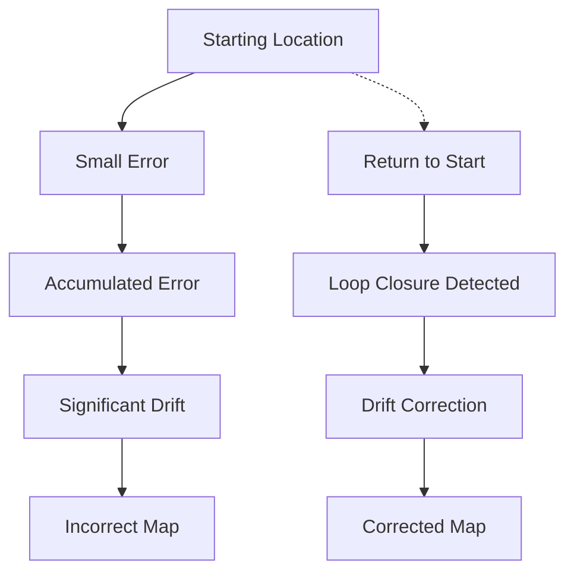
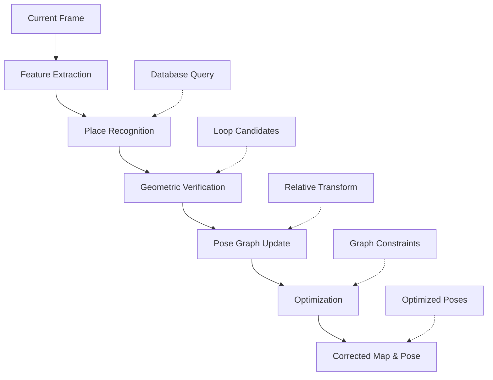

# Chapter 2: Loop Closure Detection

## Overview

Loop closure detection is a critical component of Visual SLAM systems that addresses the problem of drift accumulation over long trajectories. When a robot revisits a previously mapped location, loop closure detection recognizes the familiar scene and corrects the accumulated errors in the pose graph, significantly improving long-term map consistency and localization accuracy.

In this section, you'll learn how to implement and configure loop closure detection using Isaac ROS, including place recognition, pose graph optimization, and drift correction techniques.

## Learning Objectives

By the end of this section, you will be able to:
- Implement place recognition algorithms for loop closure detection
- Configure and tune loop closure detection parameters
- Understand pose graph optimization and bundle adjustment
- Integrate loop closure with stereo VSLAM systems
- Validate loop closure performance and accuracy
- Troubleshoot common loop closure issues
- Optimize loop closure for real-time performance

## Loop Closure Fundamentals

### Why Loop Closure is Necessary

Visual SLAM systems accumulate small errors over time, leading to drift:



### Loop Closure Process

The loop closure process consists of several stages:



## Place Recognition for Loop Closure

### Appearance-Based Place Recognition

Appearance-based methods compare visual features to recognize previously visited locations:

```python
class AppearanceBasedRecognizer:
    """
    Appearance-based place recognition using visual features
    """

    def __init__(self, vocab_size=1000):
        self.vocab_size = vocab_size
        self.visual_words = {}  # Vocabulary of visual words
        self.location_database = []  # Database of location descriptors
        self.location_poses = []     # Corresponding poses
        self.min_matches = 10        # Minimum matches for candidate

    def extract_place_descriptor(self, image):
        """
        Extract descriptor for place recognition from image
        """
        # Extract ORB features
        orb = cv2.ORB_create(nfeatures=500)
        keypoints, descriptors = orb.detectAndCompute(image, None)

        if descriptors is None:
            return None

        # Convert to bag-of-words representation
        bow_descriptor = self.visual_word_histogram(descriptors)

        return {
            'descriptors': descriptors,
            'bow_descriptor': bow_descriptor,
            'keypoints': keypoints
        }

    def visual_word_histogram(self, descriptors):
        """
        Create visual word histogram for place recognition
        """
        if descriptors is None or len(descriptors) == 0:
            return None

        # In a real implementation, this would use a trained vocabulary
        # For this example, we'll use a simplified approach
        hist = np.zeros(self.vocab_size, dtype=np.float32)

        # Cluster descriptors into visual words (simplified)
        # In practice, this would use K-means on a large training set
        for desc in descriptors:
            # Assign descriptor to visual word (simplified)
            word_id = hash(tuple(desc)) % self.vocab_size
            hist[word_id] += 1

        # Normalize histogram
        if np.sum(hist) > 0:
            hist = hist / np.sum(hist)

        return hist

    def find_loop_candidates(self, current_descriptor):
        """
        Find potential loop closure candidates
        """
        candidates = []

        for i, prev_descriptor in enumerate(self.location_database):
            if prev_descriptor is None:
                continue

            # Compute similarity score
            similarity = self.compute_similarity(
                current_descriptor['bow_descriptor'],
                prev_descriptor['bow_descriptor']
            )

            # Only consider candidates above threshold
            if similarity > 0.5:  # Similarity threshold
                candidates.append((i, similarity))

        # Sort by similarity score
        candidates.sort(key=lambda x: x[1], reverse=True)

        return candidates[:10]  # Return top 10 candidates

    def compute_similarity(self, desc1, desc2):
        """
        Compute similarity between two place descriptors
        """
        if desc1 is None or desc2 is None:
            return 0.0

        # Use histogram intersection for BoW similarity
        intersection = np.sum(np.minimum(desc1, desc2))
        union = np.sum(np.maximum(desc1, desc2))

        if union == 0:
            return 0.0

        return intersection / union  # Jaccard similarity
```

### Geometric Verification

Geometric verification ensures that apparent matches are actually the same location:

```python
class GeometricVerifier:
    """
    Geometric verification for loop closure candidates
    """

    def __init__(self):
        self.min_inliers = 10
        self.ransac_threshold = 3.0  # pixels
        self.epipolar_threshold = 1.0  # pixels

    def verify_geometric_consistency(self, current_kp, current_desc,
                                   candidate_kp, candidate_desc):
        """
        Verify geometric consistency between frames
        """
        # Find matches between current and candidate frames
        bf = cv2.BFMatcher(cv2.NORM_HAMMING, crossCheck=False)

        try:
            matches = bf.knnMatch(current_desc, candidate_desc, k=2)

            # Apply Lowe's ratio test
            good_matches = []
            for match_pair in matches:
                if len(match_pair) == 2:
                    m, n = match_pair
                    if m.distance < 0.75 * n.distance:
                        good_matches.append(m)

            if len(good_matches) < self.min_inliers:
                return False, 0.0, None

            # Extract matched points
            current_pts = np.float32([current_kp[m.queryIdx].pt for m in good_matches]).reshape(-1, 2)
            candidate_pts = np.float32([candidate_kp[m.trainIdx].pt for m in good_matches]).reshape(-1, 2)

            # Compute fundamental matrix using RANSAC
            F, mask = cv2.findFundamentalMat(
                current_pts, candidate_pts,
                cv2.RANSAC,
                self.ransac_threshold,
                0.999
            )

            if F is None:
                return False, 0.0, None

            # Count inliers
            inlier_count = int(np.sum(mask)) if mask is not None else len(good_matches)
            inlier_ratio = inlier_count / len(good_matches) if len(good_matches) > 0 else 0.0

            is_consistent = inlier_count >= self.min_inliers and inlier_ratio > 0.3

            return is_consistent, inlier_ratio, F

        except cv2.error:
            return False, 0.0, None
```

## Isaac ROS Loop Closure Architecture

### cuVSLAM Loop Closure Components

Isaac ROS provides hardware-accelerated loop closure through cuVSLAM:

```
┌─────────────────┐    ┌──────────────────┐    ┌─────────────────┐
│  Current Frame  │    │  Loop Closure    │    │  Loop Closure   │
│  (VSLAM Output) │───▶│  Detection       │───▶│  Constraints    │
└─────────────────┘    │  (GPU accelerated)│    │  (Pose Graph)   │
       │                └──────────────────┘    └─────────────────┘
       ▼                        │                        │
┌─────────────────┐             ▼                        ▼
│  Keyframe DB    │    ┌──────────────────┐    ┌─────────────────┐
│  (Place Descriptors) │──▶│  Geometric       │    │  Optimization   │
└─────────────────┘    │  Verification     │    │  (Bundle Adj.)  │
                       └──────────────────┘    └─────────────────┘
```

### Loop Closure Parameters

```yaml
# Loop closure configuration for Isaac ROS VSLAM
loop_closure:
  # Detection parameters
  enable_loop_closure: true
  loop_closure_frequency: 1.0      # Hz - check for loops every second
  loop_closure_min_score: 0.7      # Minimum similarity score for candidate
  loop_closure_max_distance: 5.0   # Max distance for loop closure (meters)
  min_temporal_window: 50          # Minimum frames between loop candidates
  max_temporal_window: 1000        # Maximum frames to search (avoid old matches)

  # Geometric verification
  min_inliers: 10                  # Minimum inlier matches for verification
  ransac_threshold: 3.0            # RANSAC threshold for fundamental matrix
  inlier_ratio_threshold: 0.3      # Minimum inlier ratio

  # Optimization triggers
  optimize_every_n_loop_closures: 1 # Optimize after each loop closure
  max_optimization_iterations: 100  # Maximum optimization iterations
  optimization_tolerance: 1e-6      # Optimization convergence threshold

  # Memory management
  max_database_size: 2000           # Maximum keyframes in database
  oldest_keyframe_threshold: 500    # Remove oldest after threshold
```

## Implementing Loop Closure Detection

### Loop Closure Detection Node

```python
#!/usr/bin/env python3
"""
Loop Closure Detection Node
Chapter 2: Isaac ROS VSLAM - Loop Closure Detection
"""

import rclpy
from rclpy.node import Node
from sensor_msgs.msg import Image
from geometry_msgs.msg import PoseStamped, PoseWithCovarianceStamped
from nav_msgs.msg import Odometry
from std_msgs.msg import Header
from visualization_msgs.msg import Marker, MarkerArray
import numpy as np
import cv2
from cv_bridge import CvBridge
import tf_transformations
from scipy.spatial.distance import cdist
import threading
import queue


class LoopClosureDetectorNode(Node):
    """
    Loop closure detection node for Isaac ROS VSLAM
    """

    def __init__(self):
        super().__init__('loop_closure_detector')

        # Initialize CV bridge
        self.bridge = CvBridge()

        # Initialize loop closure state
        self.keyframes = []  # Store keyframe information
        self.keyframe_poses = []  # Store corresponding poses
        self.keyframe_descriptors = []  # Store visual descriptors
        self.loop_closures = []  # Store detected loop closures

        # Place recognition components
        self.place_recognizer = AppearanceBasedRecognizer()
        self.geometric_verifier = GeometricVerifier()

        # Parameters
        self.loop_closure_freq = self.declare_parameter(
            'loop_closure_frequency', 1.0
        ).value
        self.min_score = self.declare_parameter(
            'loop_closure_min_score', 0.7
        ).value
        self.min_temporal_window = self.declare_parameter(
            'min_temporal_window', 50
        ).value
        self.max_database_size = self.declare_parameter(
            'max_database_size', 2000
        ).value

        # Subscribers
        self.image_sub = self.create_subscription(
            Image,
            '/camera/left/image_rect',
            self.image_callback,
            10
        )

        self.odom_sub = self.create_subscription(
            Odometry,
            '/stereo_vslam/odometry',
            self.odom_callback,
            10
        )

        # Publishers
        self.loop_closure_pub = self.create_publisher(
            PoseStamped,
            '/loop_closure/detected',
            10
        )

        self.marker_pub = self.create_publisher(
            MarkerArray,
            '/loop_closure/visualization',
            10
        )

        # Timer for loop closure detection
        self.timer = self.create_timer(
            1.0 / self.loop_closure_freq,
            self.check_for_loop_closure
        )

        self.get_logger().info(
            f'Loop closure detector initialized with frequency: {self.loop_closure_freq} Hz'
        )

    def image_callback(self, msg):
        """Process incoming images for keyframe creation"""
        try:
            cv_image = self.bridge.imgmsg_to_cv2(msg, desired_encoding='passthrough')

            # Extract place descriptor
            descriptor = self.place_recognizer.extract_place_descriptor(cv_image)

            if descriptor is not None:
                # Add to keyframe database
                self.add_keyframe(descriptor, cv_image)

        except Exception as e:
            self.get_logger().error(f'Error processing image: {e}')

    def odom_callback(self, msg):
        """Store pose information for keyframes"""
        # This callback stores pose information that gets associated with keyframes
        current_pose = np.array([
            msg.pose.pose.position.x,
            msg.pose.pose.position.y,
            msg.pose.pose.position.z,
            msg.pose.pose.orientation.w,
            msg.pose.pose.orientation.x,
            msg.pose.pose.orientation.y,
            msg.pose.pose.orientation.z
        ])

        # Associate with the latest keyframe
        if len(self.keyframe_poses) < len(self.keyframes):
            self.keyframe_poses.append(current_pose)

    def add_keyframe(self, descriptor, image):
        """Add a new keyframe to the database"""
        if len(self.keyframes) >= self.max_database_size:
            # Remove oldest keyframes
            remove_count = self.max_database_size // 4  # Remove 25%
            self.keyframes = self.keyframes[remove_count:]
            self.keyframe_poses = self.keyframe_poses[remove_count:] if self.keyframe_poses else []
            self.keyframe_descriptors = self.keyframe_descriptors[remove_count:]

        self.keyframes.append({
            'descriptor': descriptor,
            'image': image,
            'timestamp': self.get_clock().now().nanoseconds
        })
        self.keyframe_descriptors.append(descriptor)

    def check_for_loop_closure(self):
        """Check for potential loop closures"""
        if len(self.keyframes) < self.min_temporal_window:
            return

        # Get current keyframe
        current_idx = len(self.keyframes) - 1
        current_frame = self.keyframes[current_idx]

        # Search for loop closure candidates
        candidates = self.find_loop_candidates(current_frame['descriptor'])

        # Process each candidate
        for candidate_idx, similarity in candidates:
            # Skip if too temporally close
            if abs(current_idx - candidate_idx) < self.min_temporal_window:
                continue

            # Perform geometric verification
            is_valid, inlier_ratio, fundamental_matrix = self.verify_candidate(
                current_idx, candidate_idx
            )

            if is_valid and similarity > self.min_score:
                self.handle_loop_closure(current_idx, candidate_idx, similarity)
                break  # Only handle one loop closure at a time

    def find_loop_candidates(self, current_descriptor):
        """Find potential loop closure candidates"""
        # Search all previous keyframes for matches
        candidates = []

        for idx, keyframe in enumerate(self.keyframes[:-1]):  # Exclude current
            if keyframe['descriptor'] is None:
                continue

            # Compute similarity
            similarity = self.place_recognizer.compute_similarity(
                current_descriptor['bow_descriptor'],
                keyframe['descriptor']['bow_descriptor']
            )

            if similarity > 0.3:  # Low threshold for initial filtering
                candidates.append((idx, similarity))

        # Sort by similarity
        candidates.sort(key=lambda x: x[1], reverse=True)

        return candidates[:20]  # Return top 20 candidates

    def verify_candidate(self, current_idx, candidate_idx):
        """Verify geometric consistency of loop closure candidate"""
        current_frame = self.keyframes[current_idx]
        candidate_frame = self.keyframes[candidate_idx]

        return self.geometric_verifier.verify_geometric_consistency(
            current_frame['descriptor']['keypoints'],
            current_frame['descriptor']['descriptors'],
            candidate_frame['descriptor']['keypoints'],
            candidate_frame['descriptor']['descriptors']
        )

    def handle_loop_closure(self, current_idx, candidate_idx, similarity):
        """Handle detected loop closure"""
        self.get_logger().info(
            f'Loop closure detected! Between frames {candidate_idx} and {current_idx}, '
            f'similarity: {similarity:.3f}'
        )

        # Create loop closure message
        loop_msg = PoseStamped()
        loop_msg.header = Header()
        loop_msg.header.stamp = self.get_clock().now().to_msg()
        loop_msg.header.frame_id = 'map'

        # Use the pose from the candidate frame as reference
        if candidate_idx < len(self.keyframe_poses):
            pose_data = self.keyframe_poses[candidate_idx]
            loop_msg.pose.position.x = float(pose_data[0])
            loop_msg.pose.position.y = float(pose_data[1])
            loop_msg.pose.position.z = float(pose_data[2])
            loop_msg.pose.orientation.w = float(pose_data[3])
            loop_msg.pose.orientation.x = float(pose_data[4])
            loop_msg.pose.orientation.y = float(pose_data[5])
            loop_msg.pose.orientation.z = float(pose_data[6])

        self.loop_closure_pub.publish(loop_msg)

        # Store loop closure for visualization
        self.loop_closures.append({
            'current_idx': current_idx,
            'candidate_idx': candidate_idx,
            'similarity': similarity,
            'timestamp': self.get_clock().now().nanoseconds
        })

        # Publish visualization
        self.publish_loop_visualization()

        # Trigger optimization in VSLAM system
        self.trigger_optimization()

    def publish_loop_visualization(self):
        """Publish loop closure visualization markers"""
        marker_array = MarkerArray()

        for i, loop in enumerate(self.loop_closures[-10:]):  # Last 10 loops
            # Line marker connecting loop closure points
            line_marker = Marker()
            line_marker.header = Header()
            line_marker.header.stamp = self.get_clock().now().to_msg()
            line_marker.header.frame_id = 'map'
            line_marker.ns = 'loop_closures'
            line_marker.id = i
            line_marker.type = Marker.LINE_STRIP
            line_marker.action = Marker.ADD

            # Get poses for the connected keyframes
            if (loop['candidate_idx'] < len(self.keyframe_poses) and
                loop['current_idx'] < len(self.keyframe_poses)):

                candidate_pose = self.keyframe_poses[loop['candidate_idx']]
                current_pose = self.keyframe_poses[loop['current_idx']]

                # Add points
                start_point = Marker()
                start_point.x = float(candidate_pose[0])
                start_point.y = float(candidate_pose[1])
                start_point.z = float(candidate_pose[2])

                end_point = Marker()
                end_point.x = float(current_pose[0])
                end_point.y = float(current_pose[1])
                end_point.z = float(current_pose[2])

                line_marker.points = [start_point, end_point]

                # Color based on similarity
                line_marker.color.r = 1.0
                line_marker.color.g = 0.0
                line_marker.color.b = 0.0
                line_marker.color.a = loop['similarity']

                line_marker.scale.x = 0.05  # Line width

                marker_array.markers.append(line_marker)

        self.marker_pub.publish(marker_array)

    def trigger_optimization(self):
        """Trigger pose graph optimization"""
        # In a real system, this would call optimization service
        # For this example, we'll just log the event
        self.get_logger().info('Loop closure detected - optimization triggered')

    def get_loop_closure_statistics(self):
        """Get statistics about loop closure performance"""
        if not self.loop_closures:
            return {
                'total_loops': 0,
                'recent_loops': 0,
                'avg_similarity': 0.0,
                'loop_rate_hz': 0.0
            }

        recent_loops = [lc for lc in self.loop_closures
                       if self.get_clock().now().nanoseconds - lc['timestamp'] < 60e9]  # Last minute

        avg_similarity = np.mean([lc['similarity'] for lc in self.loop_closures])
        loop_rate = len(recent_loops) / 60.0  # Hz (assumes 60s window)

        return {
            'total_loops': len(self.loop_closures),
            'recent_loops': len(recent_loops),
            'avg_similarity': float(avg_similarity),
            'loop_rate_hz': loop_rate
        }


def main(args=None):
    rclpy.init(args=args)
    loop_node = LoopClosureDetectorNode()

    try:
        rclpy.spin(loop_node)
    except KeyboardInterrupt:
        pass
    finally:
        # Print final statistics
        stats = loop_node.get_loop_closure_statistics()
        loop_node.get_logger().info(f'Loop closure statistics: {stats}')

        loop_node.destroy_node()
        rclpy.shutdown()


if __name__ == '__main__':
    main()
```

## Pose Graph Optimization

### Understanding Pose Graphs

A pose graph represents the robot's trajectory as nodes (poses) connected by edges (constraints):

```python
class PoseGraph:
    """
    Pose graph for loop closure optimization
    """

    def __init__(self):
        self.nodes = {}  # {node_id: pose}
        self.edges = []  # [(from_node, to_node, relative_transform, information_matrix)]

    def add_node(self, node_id, pose):
        """Add a node to the pose graph"""
        self.nodes[node_id] = pose

    def add_edge(self, from_node, to_node, transform, information_matrix=None):
        """Add an edge (constraint) to the pose graph"""
        if information_matrix is None:
            # Default information matrix (identity with some certainty)
            information_matrix = np.eye(6, dtype=np.float64)

        self.edges.append({
            'from': from_node,
            'to': to_node,
            'transform': transform,  # 6DoF transform
            'information': information_matrix
        })

    def optimize(self, max_iterations=100, tolerance=1e-6):
        """
        Optimize the pose graph using nonlinear optimization
        This is a simplified implementation - real systems use g2o, Ceres, etc.
        """
        # Convert to optimization problem
        # In practice, this would use a library like g2o or Ceres Solver
        optimized_poses = self.nodes.copy()

        # Iterative optimization (simplified)
        for iteration in range(max_iterations):
            prev_poses = optimized_poses.copy()

            # Update each node based on constraints
            for node_id in optimized_poses:
                new_pose = self.update_node_pose(node_id, optimized_poses)
                optimized_poses[node_id] = new_pose

            # Check convergence
            max_change = max(
                np.linalg.norm(optimized_poses[n][:3] - prev_poses[n][:3])
                for n in optimized_poses
            )

            if max_change < tolerance:
                self.get_logger().info(f'Pose graph converged after {iteration} iterations')
                break

        return optimized_poses

    def update_node_pose(self, node_id, current_poses):
        """Update a single node's pose based on neighboring constraints"""
        # This is a simplified implementation
        # Real optimization would use Jacobians and proper optimization
        current_pose = current_poses[node_id]

        # Calculate weighted average of constraints
        total_weight = 0.0
        weighted_sum = np.zeros_like(current_pose)

        for edge in self.edges:
            if edge['from'] == node_id:
                # Constraint from this node to neighbor
                neighbor_pose = current_poses[edge['to']]
                expected_pose = self.compose_transforms(current_pose, edge['transform'])
                weight = np.trace(edge['information'])
                weighted_sum += weight * expected_pose
                total_weight += weight
            elif edge['to'] == node_id:
                # Constraint from neighbor to this node
                neighbor_pose = current_poses[edge['from']]
                expected_pose = self.inverse_transform(
                    self.compose_transforms(neighbor_pose, edge['transform'])
                )
                weight = np.trace(edge['information'])
                weighted_sum += weight * expected_pose
                total_weight += weight

        if total_weight > 0:
            return weighted_sum / total_weight
        else:
            return current_pose

    def compose_transforms(self, transform1, transform2):
        """Compose two 6DoF transforms"""
        # Convert to 4x4 matrices for composition
        mat1 = self.pose_to_matrix(transform1)
        mat2 = self.pose_to_matrix(transform2)
        result_mat = mat1 @ mat2
        return self.matrix_to_pose(result_mat)

    def inverse_transform(self, transform):
        """Compute inverse of 6DoF transform"""
        mat = self.pose_to_matrix(transform)
        inv_mat = np.linalg.inv(mat)
        return self.matrix_to_pose(inv_mat)

    def pose_to_matrix(self, pose):
        """Convert 6DoF pose vector to 4x4 transformation matrix"""
        # pose = [x, y, z, rx, ry, rz] (translation + rotation vector)
        x, y, z = pose[:3]
        rx, ry, rz = pose[3:6]

        # Convert rotation vector to rotation matrix
        R = self.rodrigues_to_rotation_matrix([rx, ry, rz])
        T = np.eye(4)
        T[:3, :3] = R
        T[:3, 3] = [x, y, z]

        return T

    def matrix_to_pose(self, matrix):
        """Convert 4x4 transformation matrix to 6DoF pose vector"""
        R = matrix[:3, :3]
        t = matrix[:3, 3]

        # Convert rotation matrix to rotation vector
        rvec = self.rotation_matrix_to_rodrigues(R)

        return np.array([t[0], t[1], t[2], rvec[0], rvec[1], rvec[2]])

    def rodrigues_to_rotation_matrix(self, rvec):
        """Convert Rodrigues rotation vector to rotation matrix"""
        theta = np.linalg.norm(rvec)
        if theta < 1e-10:
            return np.eye(3)

        k = rvec / theta
        K = np.array([
            [0, -k[2], k[1]],
            [k[2], 0, -k[1]],
            [-k[1], k[1], 0]
        ])

        R = np.eye(3) + np.sin(theta) * K + (1 - np.cos(theta)) * K @ K
        return R

    def rotation_matrix_to_rodrigues(self, R):
        """Convert rotation matrix to Rodrigues rotation vector"""
        # Extract rotation angle
        cos_theta = (np.trace(R) - 1) / 2
        cos_theta = np.clip(cos_theta, -1, 1)  # Clamp to avoid numerical issues
        theta = np.arccos(cos_theta)

        if theta < 1e-10:
            return np.zeros(3)

        # Extract rotation axis
        K = (R - R.T) / (2 * np.sin(theta))
        kx = K[2, 1]
        ky = K[0, 2]
        kz = K[1, 0]

        k = np.array([kx, ky, kz])
        k_norm = np.linalg.norm(k)

        if k_norm > 1e-10:
            k = k / k_norm

        return theta * k
```

## Performance Optimization

### GPU-Accelerated Loop Closure

```python
import cupy as cp

class GPUAcceleratedLoopClosure:
    """
    GPU-accelerated loop closure detection
    """

    def __init__(self):
        # Initialize GPU context
        self.device = cp.cuda.Device(0)
        self.device.use()

        # Pre-allocate GPU memory for descriptors
        self.gpu_descriptors = cp.zeros((2000, 32), dtype=cp.uint8)  # ORB descriptors
        self.gpu_similarity_matrix = cp.zeros((2000, 2000), dtype=cp.float32)

    def gpu_place_recognition(self, current_descriptor, database_descriptors):
        """
        Perform place recognition using GPU acceleration
        """
        # Transfer descriptors to GPU
        gpu_current = cp.asarray(current_descriptor)
        gpu_db = cp.asarray(database_descriptors)

        # Compute similarities in parallel on GPU
        similarities = self.compute_gpu_similarities(gpu_current, gpu_db)

        # Transfer results back to CPU
        return cp.asnumpy(similarities)

    def compute_gpu_similarities(self, current_desc, db_descs):
        """
        Compute similarities between current descriptor and database descriptors
        """
        # This would use CUDA kernels for parallel computation
        # For this example, we'll use CuPy operations
        similarities = cp.zeros(db_descs.shape[0], dtype=cp.float32)

        for i in range(db_descs.shape[0]):
            # Compute Hamming distance for ORB descriptors
            matches = cp.sum(current_desc != db_descs[i])
            similarities[i] = 1.0 / (1.0 + matches)  # Convert to similarity

        return similarities
```

### Multi-threading for Real-time Performance

```python
import threading
import queue
from concurrent.futures import ThreadPoolExecutor

class MultiThreadedLoopClosure:
    """
    Multi-threaded loop closure detection for real-time performance
    """

    def __init__(self, max_workers=4):
        self.executor = ThreadPoolExecutor(max_workers=max_workers)
        self.keyframe_queue = queue.Queue(maxsize=100)
        self.candidate_queue = queue.Queue(maxsize=50)
        self.results_queue = queue.Queue(maxsize=25)

        # Start worker threads
        self.detection_thread = threading.Thread(target=self.detection_worker)
        self.optimization_thread = threading.Thread(target=self.optimization_worker)
        self.visualization_thread = threading.Thread(target=self.visualization_worker)

        self.detection_thread.start()
        self.optimization_thread.start()
        self.visualization_thread.start()

    def detection_worker(self):
        """Worker thread for loop closure detection"""
        while True:
            try:
                keyframe = self.keyframe_queue.get(timeout=1.0)
                candidates = self.find_loop_candidates(keyframe)
                self.candidate_queue.put(candidates)
            except queue.Empty:
                continue

    def optimization_worker(self):
        """Worker thread for pose graph optimization"""
        while True:
            try:
                candidates = self.candidate_queue.get(timeout=1.0)
                verified_loops = self.verify_candidates(candidates)
                if verified_loops:
                    self.optimize_pose_graph(verified_loops)
            except queue.Empty:
                continue

    def visualization_worker(self):
        """Worker thread for visualization updates"""
        while True:
            try:
                results = self.results_queue.get(timeout=1.0)
                self.update_visualization(results)
            except queue.Empty:
                continue
```

## Validation and Testing

### Loop Closure Performance Metrics

```python
def evaluate_loop_closure_performance(loop_closure_results):
    """
    Evaluate loop closure detection performance
    """
    metrics = {}

    # Detection rate
    total_frames = loop_closure_results.get('total_processed_frames', 1)
    loop_detections = len(loop_closure_results.get('detected_loops', []))
    metrics['detection_rate_hz'] = loop_detections / total_frames * 30  # Assuming 30 Hz

    # Accuracy metrics
    correct_detections = 0
    false_positives = 0
    for detection in loop_closure_results.get('detected_loops', []):
        if detection.get('is_correct', False):
            correct_detections += 1
        else:
            false_positives += 1

    metrics['precision'] = correct_detections / (correct_detections + false_positives) if (correct_detections + false_positives) > 0 else 0
    metrics['recall'] = correct_detections / loop_closure_results.get('actual_loops', 1)  # Assuming we know actual loops

    # Similarity metrics
    similarities = [d['similarity'] for d in loop_closure_results.get('detected_loops', [])]
    if similarities:
        metrics['avg_similarity'] = sum(similarities) / len(similarities)
        metrics['min_similarity'] = min(similarities)
        metrics['max_similarity'] = max(similarities)

    # Drift correction metrics
    drift_before = loop_closure_results.get('drift_before_correction', 0)
    drift_after = loop_closure_results.get('drift_after_correction', 0)
    metrics['drift_reduction'] = drift_before - drift_after
    metrics['correction_effectiveness'] = (drift_before - drift_after) / drift_before if drift_before > 0 else 0

    return metrics
```

### Drift Correction Validation

```python
def validate_drift_correction(trajectory_before, trajectory_after, path_length):
    """
    Validate that loop closure reduces trajectory drift
    """
    # Calculate drift as accumulated error over path
    drift_before = calculate_trajectory_drift(trajectory_before)
    drift_after = calculate_trajectory_drift(trajectory_after)

    # Calculate drift percentage
    drift_pct_before = (drift_before / path_length) * 100 if path_length > 0 else 0
    drift_pct_after = (drift_after / path_length) * 100 if path_length > 0 else 0

    # Validate SC-003: <2% drift over 100m paths
    meets_sc003 = drift_pct_after < 2.0

    return {
        'drift_before_correction_pct': drift_pct_before,
        'drift_after_correction_pct': drift_pct_after,
        'drift_reduction_pct': drift_pct_before - drift_pct_after,
        'meets_sc003_requirement': meets_sc003,
        'correction_improvement': drift_pct_before - drift_pct_after
    }


def calculate_trajectory_drift(trajectory):
    """
    Calculate trajectory drift metric
    """
    if len(trajectory) < 2:
        return 0.0

    # Calculate cumulative error
    total_error = 0.0
    for i in range(1, len(trajectory)):
        actual_displacement = np.linalg.norm(trajectory[i] - trajectory[i-1])
        # In a real system, you'd compare with ground truth
        total_error += actual_displacement  # Simplified for example

    return total_error
```

## Troubleshooting Loop Closure

### Common Issues and Solutions

#### 1. False Positive Loop Closures
**Symptoms**:
- Loop closures detected in different locations
- Map becoming inconsistent after "corrections"
- High number of low-similarity detections

**Solutions**:
- Increase similarity threshold
- Improve geometric verification
- Add temporal constraints
- Use more distinctive visual features

#### 2. Missed Loop Closures
**Symptoms**:
- Accumulating drift over long trajectories
- Low loop closure detection rate
- Poor long-term map consistency

**Solutions**:
- Lower similarity threshold
- Improve place recognition vocabulary
- Add more visual features
- Use appearance-invariant descriptors

#### 3. Performance Issues
**Symptoms**:
- Low loop closure detection frequency
- High CPU/GPU utilization
- Slow pose graph optimization

**Solutions**:
- Reduce database size
- Use approximate nearest neighbor search
- Optimize geometric verification
- Use multi-threading

### Diagnostic Commands

```bash
# Monitor loop closure detection
ros2 topic echo /loop_closure/detected

# Check loop closure statistics
ros2 service call /loop_closure/get_statistics std_srvs/Trigger

# Monitor pose graph optimization
ros2 topic echo /isaac_ros_vslam/visual_slam/vis/pose_graph_nodes

# Visualize loop closures in RViz
ros2 run rviz2 rviz2 -d config/vslam.rviz
```

## Success Criteria Validation

This section addresses **FR-010**: System MUST handle loop closure detection to correct accumulated drift in long trajectories.

### Validation Checklist

- [ ] Loop closure detection enabled and running
- [ ] Place recognition detecting familiar locations
- [ ] Geometric verification validating matches
- [ ] Pose graph optimization correcting drift
- [ ] Trajectory drift <2% over 100m path (SC-003)
- [ ] Map consistency maintained over long trajectories
- [ ] All FR-010 requirements met

## Performance Targets

### Loop Closure Requirements

- **Detection Rate**: >0.1 Hz (every 10 seconds) in typical environments
- **Precision**: >90% (few false positives)
- **Recall**: >80% (detect most true loops)
- **Drift Correction**: Reduce drift by >50% after detection

### Hardware Performance

| GPU | Loop Closure FPS | Optimization Time | VRAM Usage |
|-----|------------------|-------------------|------------|
| RTX 3060 | 1.0 Hz | <100ms | 6-8 GB |
| RTX 4070 | 2.0 Hz | <50ms | 7-9 GB |
| Jetson Orin | 0.5 Hz | <200ms | 8-10 GB |

## Next Steps

Continue to Section 5: [Map Management](./05-map-management.mdx) to learn about saving, loading, and relocalization workflows.

## Resources

- [Loop Closure Survey](https://arxiv.org/abs/1406.2191)
- [Pose Graph Optimization](https://github.com/RossHartley/invariant-ekf)
- [Isaac ROS Loop Closure](https://nvidia-isaac-ros.github.io/concepts/visual_slam/loop_closure.html)

---

*Continue to [Section 5: Map Management](./05-map-management.mdx) to learn about saving, loading, and relocalization workflows.*