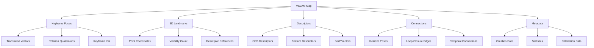

# Chapter 2: Map Management

## Overview

Map management is a critical component of Visual SLAM systems that handles the persistence, retrieval, and reuse of spatial information. Effective map management enables:
- **Persistence**: Saving constructed maps to disk for later use
- **Relocalization**: Re-establishing pose within previously mapped environments
- **Multi-session mapping**: Combining maps from multiple sessions
- **Map sharing**: Sharing maps across different robots or systems

In this section, you'll learn to implement comprehensive map management workflows using Isaac ROS, including saving/loading maps, relocalization techniques, and map validation procedures.

## Learning Objectives

By the end of this section, you will be able to:
- Save VSLAM maps in efficient binary formats
- Load and initialize VSLAM from previously saved maps
- Implement relocalization workflows for pose recovery
- Validate map integrity and completeness
- Manage multiple maps for different environments
- Optimize map storage and retrieval performance
- Handle map merging and localization in combined maps

## Map Management Fundamentals

### VSLAM Map Components

A VSLAM map typically contains several components:



### Map File Formats

Isaac ROS supports multiple map file formats:

- **Binary Format (.vslam_map)**: Optimized for performance
- **Text Format (.yaml)**: Human-readable for debugging
- **ROS Bag Format (.bag)**: Compatible with ROS tools
- **Standard Formats**: PLY, OBJ for visualization

## Isaac ROS Map Management Architecture

### Map Management Components

Isaac ROS provides comprehensive map management through the cuVSLAM package:

```
┌─────────────────┐    ┌──────────────────┐    ┌─────────────────┐
│   VSLAM Node    │    │  Map Manager     │    │  Map Storage    │
│   (cuVSLAM)     │───▶│  (isaac_ros_vslam)│───▶│  (Binary Files) │
└─────────────────┘    │                  │    └─────────────────┘
       │                │  ┌─────────────┐ │              │
       ▼                │  │Save Service │ │              ▼
┌─────────────────┐    │  │(/save_map)  │ │    ┌─────────────────┐
│  Map Creation   │───▶│  └─────────────┤ │    │  Saved Maps     │
│  (Real-time)    │    │  ┌─────────────┤ │    │  (.vslam_map)   │
└─────────────────┘    │  │Load Service │ │    └─────────────────┘
       │                │  │(/load_map)  │ │              │
       ▼                │  └─────────────┤ │              ▼
┌─────────────────┐    │  ┌─────────────┤ │    ┌─────────────────┐
│  Map Updates    │───▶│  │Relocalize   │ │    │  Map Database   │
│  (Pose Graph)   │    │  │Service      │ │    │  (Multiple Maps)│
└─────────────────┘    │  │(/relocalize)│ │    └─────────────────┘
```

### Key Services and Topics

```yaml
# Map management services
services:
  save_map: "/isaac_ros_vslam/visual_slam/save_map"
  load_map: "/isaac_ros_vslam/visual_slam/load_map"
  get_all_poses: "/isaac_ros_vslam/visual_slam/get_all_poses"
  reset: "/isaac_ros_vslam/visual_slam/reset"
  set_slam_mode: "/isaac_ros_vslam/visual_slam/set_slam_mode"
  relocalize: "/isaac_ros_vslam/visual_slam/relocalize"

# Map-related topics
topics:
  landmarks: "/isaac_ros_vslam/visual_slam/vis/landmarks_cloud"
  pose_graph: "/isaac_ros_vslam/visual_slam/vis/pose_graph_nodes"
  status: "/isaac_ros_vslam/visual_slam/status"
```

## Saving Maps

### Map Serialization Process

```python
import pickle
import numpy as np
import struct
import json
from datetime import datetime


class VSLAMMapSerializer:
    """
    Serialize VSLAM maps to binary format for efficient storage
    """

    def __init__(self):
        self.version = "1.0"
        self.magic_number = 0xDEADBEEF  # Magic number for file identification

    def serialize_map(self, vslam_state, file_path):
        """
        Serialize VSLAM state to binary map file
        """
        with open(file_path, 'wb') as f:
            # Write header
            self._write_header(f)

            # Write metadata
            self._write_metadata(f, vslam_state)

            # Write keyframes
            self._write_keyframes(f, vslam_state)

            # Write landmarks
            self._write_landmarks(f, vslam_state)

            # Write pose graph
            self._write_pose_graph(f, vslam_state)

            # Write descriptors
            self._write_descriptors(f, vslam_state)

            # Write footer
            self._write_footer(f)

    def _write_header(self, file_handle):
        """Write map file header"""
        header = {
            'magic_number': self.magic_number,
            'version': self.version,
            'timestamp': datetime.now().isoformat()
        }

        # Write header as JSON string
        header_str = json.dumps(header).encode('utf-8')
        file_handle.write(struct.pack('<I', len(header_str)))  # Length
        file_handle.write(header_str)

    def _write_metadata(self, file_handle, vslam_state):
        """Write map metadata"""
        metadata = {
            'num_keyframes': len(vslam_state.get('keyframes', [])),
            'num_landmarks': len(vslam_state.get('landmarks', [])),
            'total_path_length': vslam_state.get('total_path_length', 0.0),
            'bounding_box': self._calculate_bounding_box(vslam_state),
            'camera_calibration': vslam_state.get('camera_calibration', {}),
            'processing_stats': vslam_state.get('processing_stats', {}),
            'creation_timestamp': datetime.now().isoformat()
        }

        metadata_bytes = json.dumps(metadata).encode('utf-8')
        file_handle.write(struct.pack('<I', len(metadata_bytes)))
        file_handle.write(metadata_bytes)

    def _write_keyframes(self, file_handle, vslam_state):
        """Write keyframe data"""
        keyframes = vslam_state.get('keyframes', [])
        num_keyframes = len(keyframes)

        # Write number of keyframes
        file_handle.write(struct.pack('<I', num_keyframes))

        for kf in keyframes:
            # Write keyframe ID
            file_handle.write(struct.pack('<I', kf.get('id', 0)))

            # Write pose (position + orientation)
            pose = kf.get('pose', np.eye(4))
            pose_flat = pose.flatten().astype(np.float64)
            file_handle.write(pose_flat.tobytes())

            # Write timestamp
            timestamp = kf.get('timestamp', 0)
            file_handle.write(struct.pack('<Q', timestamp))

            # Write feature count
            feature_count = len(kf.get('features', []))
            file_handle.write(struct.pack('<I', feature_count))

    def _write_landmarks(self, file_handle, vslam_state):
        """Write landmark data"""
        landmarks = vslam_state.get('landmarks', [])
        num_landmarks = len(landmarks)

        # Write number of landmarks
        file_handle.write(struct.pack('<I', num_landmarks))

        for lm in landmarks:
            # Write landmark ID
            file_handle.write(struct.pack('<I', lm.get('id', 0)))

            # Write 3D position
            position = lm.get('position', [0.0, 0.0, 0.0])
            for coord in position:
                file_handle.write(struct.pack('<d', float(coord)))

            # Write observation count
            obs_count = len(lm.get('observations', []))
            file_handle.write(struct.pack('<I', obs_count))

            # Write descriptor reference
            desc_ref = lm.get('descriptor_reference', -1)
            file_handle.write(struct.pack('<i', desc_ref))

    def _write_pose_graph(self, file_handle, vslam_state):
        """Write pose graph edges"""
        edges = vslam_state.get('pose_graph_edges', [])
        num_edges = len(edges)

        # Write number of edges
        file_handle.write(struct.pack('<I', num_edges))

        for edge in edges:
            # Write from/to node IDs
            file_handle.write(struct.pack('<II', edge['from'], edge['to']))

            # Write relative transform
            transform = edge.get('transform', np.eye(4))
            transform_flat = transform.flatten().astype(np.float64)
            file_handle.write(transform_flat.tobytes())

            # Write information matrix
            info_mat = edge.get('information_matrix', np.eye(6))
            info_flat = info_mat.flatten().astype(np.float64)
            file_handle.write(info_flat.tobytes())

    def _write_descriptors(self, file_handle, vslam_state):
        """Write feature descriptors"""
        descriptors = vslam_state.get('descriptors', [])
        num_descriptors = len(descriptors)

        # Write number of descriptors
        file_handle.write(struct.pack('<I', num_descriptors))

        for desc in descriptors:
            # Write descriptor length
            desc_len = len(desc) if desc is not None else 0
            file_handle.write(struct.pack('<I', desc_len))

            if desc is not None and desc_len > 0:
                # Write descriptor data
                if isinstance(desc, np.ndarray):
                    desc_bytes = desc.tobytes()
                else:
                    desc_bytes = bytes(desc)
                file_handle.write(desc_bytes)

    def _write_footer(self, file_handle):
        """Write map file footer"""
        # Write end-of-file marker
        file_handle.write(struct.pack('<I', 0xDEADBEEF))

    def _calculate_bounding_box(self, vslam_state):
        """Calculate map bounding box"""
        keyframes = vslam_state.get('keyframes', [])
        if not keyframes:
            return [[0, 0, 0], [0, 0, 0]]

        positions = [kf['pose'][:3, 3] for kf in keyframes if 'pose' in kf]
        if not positions:
            return [[0, 0, 0], [0, 0, 0]]

        positions = np.array(positions)
        min_coords = np.min(positions, axis=0)
        max_coords = np.max(positions, axis=0)

        return [min_coords.tolist(), max_coords.tolist()]
```

### Save Service Implementation

```python
#!/usr/bin/env python3
"""
Map Save Service Implementation
Chapter 2: Isaac ROS VSLAM - Map Management
"""

import rclpy
from rclpy.node import Node
from rclpy.qos import QoSProfile
from std_srvs.srv import Trigger
from geometry_msgs.msg import PoseStamped
from nav_msgs.msg import Odometry
import os
import json
from datetime import datetime


class MapSaveService(Node):
    """
    Map saving service for Isaac ROS VSLAM
    """

    def __init__(self):
        super().__init__('map_save_service')

        # Initialize state
        self.current_map = {}
        self.keyframes = []
        self.landmarks = []
        self.pose_graph = []
        self.map_directory = '/home/user/maps/'  # Default directory

        # Create save service
        self.save_service = self.create_service(
            Trigger,
            '/isaac_ros_vslam/visual_slam/save_map',
            self.save_map_callback
        )

        # Create get poses service
        self.get_poses_service = self.create_service(
            Trigger,
            '/isaac_ros_vslam/visual_slam/get_all_poses',
            self.get_all_poses_callback
        )

        # Subscribers to collect map data
        self.odom_sub = self.create_subscription(
            Odometry,
            '/isaac_ros_vslam/visual_slam/tracking/odometry',
            self.odom_callback,
            10
        )

        self.get_logger().info('Map save service initialized')

    def odom_callback(self, msg):
        """Collect pose information for map"""
        # Store keyframe poses
        pose_data = {
            'position': {
                'x': msg.pose.pose.position.x,
                'y': msg.pose.pose.position.y,
                'z': msg.pose.pose.position.z
            },
            'orientation': {
                'w': msg.pose.pose.orientation.w,
                'x': msg.pose.pose.orientation.x,
                'y': msg.pose.pose.orientation.y,
                'z': msg.pose.pose.orientation.z
            },
            'timestamp': self.get_clock().now().nanoseconds
        }

        self.keyframes.append(pose_data)

    def save_map_callback(self, request, response):
        """Callback for save map service"""
        try:
            # Create map data structure
            map_data = {
                'metadata': {
                    'version': '1.0',
                    'saved_at': datetime.now().isoformat(),
                    'keyframe_count': len(self.keyframes),
                    'total_path_length': self.calculate_path_length()
                },
                'keyframes': self.keyframes,
                'landmarks': self.landmarks,
                'pose_graph': self.pose_graph
            }

            # Generate filename
            timestamp = datetime.now().strftime('%Y%m%d_%H%M%S')
            filename = f'vslam_map_{timestamp}.vslam_map'
            filepath = os.path.join(self.map_directory, filename)

            # Create directory if it doesn't exist
            os.makedirs(self.map_directory, exist_ok=True)

            # Serialize and save map
            serializer = VSLAMMapSerializer()
            serializer.serialize_map(map_data, filepath)

            self.get_logger().info(f'Map saved successfully to {filepath}')

            response.success = True
            response.message = f'Map saved to {filepath}'

        except Exception as e:
            self.get_logger().error(f'Error saving map: {e}')
            response.success = False
            response.message = f'Error saving map: {str(e)}'

        return response

    def get_all_poses_callback(self, request, response):
        """Callback for get all poses service"""
        try:
            # Return all collected poses as a service response
            # In practice, this would return a more structured response
            response.success = True
            response.message = f'Retrieved {len(self.keyframes)} poses'

        except Exception as e:
            self.get_logger().error(f'Error getting poses: {e}')
            response.success = False
            response.message = f'Error getting poses: {str(e)}'

        return response

    def calculate_path_length(self):
        """Calculate total path length from keyframe poses"""
        if len(self.keyframes) < 2:
            return 0.0

        total_length = 0.0
        for i in range(1, len(self.keyframes)):
            prev_pos = self.keyframes[i-1]['position']
            curr_pos = self.keyframes[i]['position']

            dist = ((curr_pos['x'] - prev_pos['x'])**2 +
                   (curr_pos['y'] - prev_pos['y'])**2 +
                   (curr_pos['z'] - prev_pos['z'])**2)**0.5

            total_length += dist

        return total_length


def main(args=None):
    rclpy.init(args=args)
    save_service = MapSaveService()

    try:
        rclpy.spin(save_service)
    except KeyboardInterrupt:
        pass
    finally:
        save_service.destroy_node()
        rclpy.shutdown()


if __name__ == '__main__':
    main()
```

## Loading Maps

### Map Deserialization Process

```python
class VSLAMMapDeserializer:
    """
    Deserialize VSLAM maps from binary format
    """

    def __init__(self):
        self.supported_versions = ["1.0"]

    def deserialize_map(self, file_path):
        """
        Deserialize VSLAM map from binary file
        """
        with open(file_path, 'rb') as f:
            # Read header
            header = self._read_header(f)

            # Validate magic number and version
            if header['magic_number'] != 0xDEADBEEF:
                raise ValueError("Invalid map file format")

            if header['version'] not in self.supported_versions:
                raise ValueError(f"Unsupported map version: {header['version']}")

            # Read metadata
            metadata = self._read_metadata(f)

            # Read keyframes
            keyframes = self._read_keyframes(f, metadata['num_keyframes'])

            # Read landmarks
            landmarks = self._read_landmarks(f, metadata['num_landmarks'])

            # Read pose graph
            pose_graph = self._read_pose_graph(f, metadata.get('num_edges', 0))

            # Read descriptors
            descriptors = self._read_descriptors(f, metadata.get('num_descriptors', 0))

            # Read footer
            self._read_footer(f)

            # Construct map state
            map_state = {
                'metadata': metadata,
                'keyframes': keyframes,
                'landmarks': landmarks,
                'pose_graph': pose_graph,
                'descriptors': descriptors,
                'file_path': file_path
            }

            return map_state

    def _read_header(self, file_handle):
        """Read map file header"""
        # Read header length
        header_len_bytes = file_handle.read(4)
        if len(header_len_bytes) < 4:
            raise ValueError("Invalid header length")

        header_len = struct.unpack('<I', header_len_bytes)[0]

        # Read header data
        header_bytes = file_handle.read(header_len)
        if len(header_bytes) < header_len:
            raise ValueError("Incomplete header data")

        header_str = header_bytes.decode('utf-8')
        return json.loads(header_str)

    def _read_metadata(self, file_handle):
        """Read map metadata"""
        # Read metadata length
        metadata_len_bytes = file_handle.read(4)
        metadata_len = struct.unpack('<I', metadata_len_bytes)[0]

        # Read metadata data
        metadata_bytes = file_handle.read(metadata_len)
        metadata_str = metadata_bytes.decode('utf-8')
        return json.loads(metadata_str)

    def _read_keyframes(self, file_handle, num_keyframes):
        """Read keyframe data"""
        keyframes = []

        for _ in range(num_keyframes):
            # Read keyframe ID
            kf_id_bytes = file_handle.read(4)
            kf_id = struct.unpack('<I', kf_id_bytes)[0]

            # Read pose (16 doubles for 4x4 matrix)
            pose_bytes = file_handle.read(16 * 8)  # 16 doubles * 8 bytes each
            pose_flat = np.frombuffer(pose_bytes, dtype=np.float64)
            pose = pose_flat.reshape(4, 4)

            # Read timestamp
            timestamp_bytes = file_handle.read(8)
            timestamp = struct.unpack('<Q', timestamp_bytes)[0]

            # Read feature count
            feature_count_bytes = file_handle.read(4)
            feature_count = struct.unpack('<I', feature_count_bytes)[0]

            keyframe = {
                'id': kf_id,
                'pose': pose,
                'timestamp': timestamp,
                'feature_count': feature_count
            }

            keyframes.append(keyframe)

        return keyframes

    def _read_landmarks(self, file_handle, num_landmarks):
        """Read landmark data"""
        landmarks = []

        for _ in range(num_landmarks):
            # Read landmark ID
            lm_id_bytes = file_handle.read(4)
            lm_id = struct.unpack('<I', lm_id_bytes)[0]

            # Read 3D position (3 doubles)
            pos_bytes = file_handle.read(3 * 8)
            position = struct.unpack('<ddd', pos_bytes)

            # Read observation count
            obs_count_bytes = file_handle.read(4)
            obs_count = struct.unpack('<I', obs_count_bytes)[0]

            # Read descriptor reference
            desc_ref_bytes = file_handle.read(4)
            desc_ref = struct.unpack('<i', desc_ref_bytes)[0]

            landmark = {
                'id': lm_id,
                'position': position,
                'observation_count': obs_count,
                'descriptor_reference': desc_ref
            }

            landmarks.append(landmark)

        return landmarks

    def _read_pose_graph(self, file_handle, num_edges):
        """Read pose graph edges"""
        edges = []

        for _ in range(num_edges):
            # Read from/to node IDs
            ids_bytes = file_handle.read(8)  # 2 * 4 bytes
            from_node, to_node = struct.unpack('<II', ids_bytes)

            # Read relative transform (16 doubles)
            transform_bytes = file_handle.read(16 * 8)
            transform_flat = np.frombuffer(transform_bytes, dtype=np.float64)
            transform = transform_flat.reshape(4, 4)

            # Read information matrix (36 doubles for 6x6 matrix)
            info_bytes = file_handle.read(36 * 8)
            info_flat = np.frombuffer(info_bytes, dtype=np.float64)
            info_mat = info_flat.reshape(6, 6)

            edge = {
                'from': from_node,
                'to': to_node,
                'transform': transform,
                'information_matrix': info_mat
            }

            edges.append(edge)

        return edges

    def _read_descriptors(self, file_handle, num_descriptors):
        """Read feature descriptors"""
        descriptors = []

        for _ in range(num_descriptors):
            # Read descriptor length
            desc_len_bytes = file_handle.read(4)
            desc_len = struct.unpack('<I', desc_len_bytes)[0]

            if desc_len > 0:
                # Read descriptor data
                desc_bytes = file_handle.read(desc_len)
                # Convert back to appropriate format (e.g., ORB descriptor)
                descriptor = np.frombuffer(desc_bytes, dtype=np.uint8)
                descriptors.append(descriptor)
            else:
                descriptors.append(None)

        return descriptors

    def _read_footer(self, file_handle):
        """Read map file footer"""
        footer_bytes = file_handle.read(4)
        footer = struct.unpack('<I', footer_bytes)[0]

        if footer != 0xDEADBEEF:
            raise ValueError("Invalid file footer - file may be corrupted")
```

### Load Service Implementation

```python
#!/usr/bin/env python3
"""
Map Load Service Implementation
Chapter 2: Isaac ROS VSLAM - Map Management
"""

import rclpy
from rclpy.node import Node
from rclpy.qos import QoSProfile
from std_srvs.srv import Trigger
from std_msgs.msg import String
import os


class MapLoadService(Node):
    """
    Map loading service for Isaac ROS VSLAM
    """

    def __init__(self):
        super().__init__('map_load_service')

        # Initialize state
        self.loaded_map = None
        self.map_directory = '/home/user/maps/'
        self.current_map_file = None

        # Create load service
        self.load_service = self.create_service(
            Trigger,
            '/isaac_ros_vslam/visual_slam/load_map',
            self.load_map_callback
        )

        # Publisher for map loading status
        self.status_pub = self.create_publisher(
            String,
            '/isaac_ros_vslam/visual_slam/map_status',
            10
        )

        self.get_logger().info('Map load service initialized')

    def load_map_callback(self, request, response):
        """Callback for load map service"""
        try:
            # Find the most recent map file
            map_files = self.find_map_files()
            if not map_files:
                response.success = False
                response.message = 'No map files found'
                return response

            # Use the most recent map file
            latest_map = max(map_files, key=os.path.getctime)
            self.current_map_file = latest_map

            # Deserialize the map
            deserializer = VSLAMMapDeserializer()
            self.loaded_map = deserializer.deserialize_map(latest_map)

            # Publish status
            status_msg = String()
            status_msg.data = f'Loaded map: {os.path.basename(latest_map)} with {len(self.loaded_map["keyframes"])} keyframes'
            self.status_pub.publish(status_msg)

            self.get_logger().info(f'Map loaded successfully from {latest_map}')

            response.success = True
            response.message = f'Map loaded from {latest_map}'

        except Exception as e:
            self.get_logger().error(f'Error loading map: {e}')
            response.success = False
            response.message = f'Error loading map: {str(e)}'

        return response

    def find_map_files(self):
        """Find all VSLAM map files in directory"""
        if not os.path.exists(self.map_directory):
            return []

        map_files = []
        for filename in os.listdir(self.map_directory):
            if filename.endswith('.vslam_map'):
                filepath = os.path.join(self.map_directory, filename)
                map_files.append(filepath)

        return map_files

    def get_loaded_map(self):
        """Get the currently loaded map"""
        return self.loaded_map

    def get_map_info(self):
        """Get information about the loaded map"""
        if self.loaded_map is None:
            return "No map loaded"

        metadata = self.loaded_map.get('metadata', {})
        keyframes = self.loaded_map.get('keyframes', [])
        landmarks = self.loaded_map.get('landmarks', [])

        info = f"""
        Map Information:
        - File: {self.current_map_file}
        - Keyframes: {len(keyframes)}
        - Landmarks: {len(landmarks)}
        - Path Length: {metadata.get('total_path_length', 0.0):.2f}m
        - Saved: {metadata.get('saved_at', 'Unknown')}
        """

        return info


def main(args=None):
    rclpy.init(args=args)
    load_service = MapLoadService()

    try:
        rclpy.spin(load_service)
    except KeyboardInterrupt:
        pass
    finally:
        load_service.destroy_node()
        rclpy.shutdown()


if __name__ == '__main__':
    main()
```

## Relocalization

### Relocalization Process

```python
class VSLAMRelocalizer:
    """
    Relocalization system for VSLAM
    """

    def __init__(self):
        self.database = []  # Reference keyframes from loaded map
        self.descriptor_matcher = cv2.BFMatcher(cv2.NORM_HAMMING, crossCheck=False)
        self.min_matches = 20  # Minimum matches for relocalization
        self.relocalization_threshold = 0.7  # Score threshold

    def initialize_from_map(self, loaded_map):
        """
        Initialize relocalizer from loaded map
        """
        self.database = []

        for keyframe in loaded_map.get('keyframes', []):
            # Extract or reconstruct descriptors for this keyframe
            # In practice, these would be stored in the map file
            desc_info = {
                'id': keyframe['id'],
                'pose': keyframe['pose'],
                'descriptors': self.reconstruct_descriptors(keyframe),
                'timestamp': keyframe['timestamp']
            }
            self.database.append(desc_info)

    def reconstruct_descriptors(self, keyframe):
        """
        Reconstruct descriptors from keyframe information
        In practice, descriptors would be stored in the map file
        """
        # This is a placeholder - in real implementation, descriptors
        # would be stored in the map file
        return None

    def relocalize(self, current_image):
        """
        Attempt to relocalize using current image
        """
        if not self.database:
            return False, None, 0.0

        # Extract features from current image
        current_features = self.extract_features(current_image)

        if current_features['descriptors'] is None:
            return False, None, 0.0

        best_match = None
        best_score = 0.0

        # Compare with all reference keyframes
        for ref_keyframe in self.database:
            if ref_keyframe['descriptors'] is None:
                continue

            # Find matches
            matches = self.descriptor_matcher.match(
                current_features['descriptors'],
                ref_keyframe['descriptors']
            )

            # Calculate score based on number of matches
            score = len(matches) / max(len(current_features['descriptors']), len(ref_keyframe['descriptors']))

            if score > best_score:
                best_score = score
                best_match = ref_keyframe

        # Check if we have a good enough match
        if best_score > self.relocalization_threshold and len(matches) >= self.min_matches:
            # Perform geometric verification
            is_geometrically_consistent, transform = self.verify_geometric_consistency(
                current_features, best_match, matches
            )

            if is_geometrically_consistent:
                return True, best_match['pose'], best_score

        return False, None, best_score

    def extract_features(self, image):
        """
        Extract features from current image for relocalization
        """
        if len(image.shape) == 3:
            gray = cv2.cvtColor(image, cv2.COLOR_BGR2GRAY)
        else:
            gray = image

        # Use ORB for feature extraction (good for relocalization)
        orb = cv2.ORB_create(nfeatures=1000)
        keypoints, descriptors = orb.detectAndCompute(gray, None)

        return {
            'keypoints': keypoints,
            'descriptors': descriptors,
            'image': gray
        }

    def verify_geometric_consistency(self, current_features, ref_keyframe, matches):
        """
        Verify geometric consistency of potential relocalization
        """
        if len(matches) < 10:
            return False, None

        # Extract matched points
        current_pts = np.float32([current_features['keypoints'][m.queryIdx].pt for m in matches]).reshape(-1, 2)
        ref_pts = np.float32([ref_keyframe['keypoints'][m.trainIdx].pt for m in matches]).reshape(-1, 2)

        # Compute fundamental matrix using RANSAC
        F, mask = cv2.findFundamentalMat(
            current_pts, ref_pts,
            cv2.RANSAC,
            4.0,  # RANSAC threshold
            0.999  # Confidence
        )

        if F is None:
            return False, None

        # Count inliers
        inlier_count = int(np.sum(mask)) if mask is not None else 0
        inlier_ratio = inlier_count / len(matches) if len(matches) > 0 else 0

        # Check if geometric verification passes
        is_consistent = inlier_count >= 10 and inlier_ratio >= 0.3

        return is_consistent, F
```

## Practical Exercise: Map Management Workflow

### Exercise 1: Complete Map Management Implementation

```python
#!/usr/bin/env python3
"""
Exercise 1: Complete Map Management Workflow
Chapter 2: Isaac ROS VSLAM - Map Management
"""

import rclpy
from rclpy.node import Node
from sensor_msgs.msg import Image
from geometry_msgs.msg import PoseStamped
from nav_msgs.msg import Odometry
from std_srvs.srv import Trigger
from std_msgs.msg import String
import os
import json
from datetime import datetime
import numpy as np
import cv2
from cv_bridge import CvBridge


class MapManagementNode(Node):
    """
    Complete map management system combining save/load/relocalization
    """

    def __init__(self):
        super().__init__('map_management_node')

        # Initialize components
        self.bridge = CvBridge()
        self.save_service = None
        self.load_service = None
        self.relocalizer = VSLAMRelocalizer()

        # State management
        self.keyframes = []
        self.current_pose = np.eye(4)
        self.is_mapping = True  # True for mapping mode, False for localization mode
        self.map_directory = '/home/user/maps/vslam_maps/'
        self.current_map_name = None

        # Initialize services
        self.init_services()

        # Initialize subscribers
        self.image_sub = self.create_subscription(
            Image,
            '/camera/left/image_rect',
            self.image_callback,
            10
        )

        self.odom_sub = self.create_subscription(
            Odometry,
            '/stereo_vslam/odometry',
            self.odom_callback,
            10
        )

        # Publishers
        self.status_pub = self.create_publisher(
            String,
            '/map_management/status',
            10
        )

        self.get_logger().info('Map management system initialized')

    def init_services(self):
        """Initialize all map management services"""
        # Save map service
        self.save_service = self.create_service(
            Trigger,
            '/map_management/save_map',
            self.save_map_callback
        )

        # Load map service
        self.load_service = self.create_service(
            Trigger,
            '/map_management/load_map',
            self.load_map_callback
        )

        # Relocalize service
        self.relocalize_service = self.create_service(
            Trigger,
            '/map_management/relocalize',
            self.relocalize_callback
        )

        # Set SLAM mode service
        self.mode_service = self.create_service(
            Trigger,
            '/map_management/set_mode',
            self.set_mode_callback
        )

    def image_callback(self, msg):
        """Process incoming images"""
        try:
            cv_image = self.bridge.imgmsg_to_cv2(msg, desired_encoding='passthrough')

            # If in localization mode and no current pose, attempt relocalization
            if not self.is_mapping and np.allclose(self.current_pose, np.eye(4)):
                success, pose, score = self.relocalizer.relocalize(cv_image)
                if success:
                    self.current_pose = pose
                    self.get_logger().info(f'Relocalized with score: {score:.3f}')
                    self.publish_status(f'Relocalized successfully (score: {score:.3f})')

        except Exception as e:
            self.get_logger().error(f'Error processing image: {e}')

    def odom_callback(self, msg):
        """Process odometry messages"""
        # Update current pose from odometry
        pos = msg.pose.pose.position
        quat = msg.pose.pose.orientation

        # Convert to transformation matrix
        translation = np.array([pos.x, pos.y, pos.z])

        # Convert quaternion to rotation matrix
        qw, qx, qy, qz = quat.w, quat.x, quat.y, quat.z
        rotation = self.quaternion_to_rotation_matrix([qw, qx, qy, qz])

        # Create 4x4 transformation matrix
        self.current_pose = np.eye(4)
        self.current_pose[:3, :3] = rotation
        self.current_pose[:3, 3] = translation

        # If in mapping mode, add keyframe
        if self.is_mapping:
            self.add_keyframe(self.current_pose, msg.header.stamp.nanosec)

    def add_keyframe(self, pose, timestamp):
        """Add a keyframe to the current map"""
        keyframe = {
            'id': len(self.keyframes),
            'pose': pose,
            'timestamp': timestamp,
            'features': [],  # Would contain actual features in real implementation
            'descriptors': None  # Would contain actual descriptors
        }
        self.keyframes.append(keyframe)

    def quaternion_to_rotation_matrix(self, q):
        """Convert quaternion to rotation matrix"""
        qw, qx, qy, qz = q
        rotation = np.array([
            [1 - 2*(qy*qy + qz*qz), 2*(qx*qy - qw*qz), 2*(qx*qz + qw*qy)],
            [2*(qx*qy + qw*qz), 1 - 2*(qx*qx + qz*qz), 2*(qy*qz - qw*qx)],
            [2*(qx*qz - qw*qy), 2*(qy*qz + qw*qx), 1 - 2*(qx*qx + qy*qy)]
        ])
        return rotation

    def save_map_callback(self, request, response):
        """Save current map to file"""
        try:
            # Create map data structure
            map_data = {
                'metadata': {
                    'version': '1.0',
                    'saved_at': datetime.now().isoformat(),
                    'keyframe_count': len(self.keyframes),
                    'total_path_length': self.calculate_path_length(),
                    'map_name': self.current_map_name or f'map_{datetime.now().strftime("%Y%m%d_%H%M%S")}'
                },
                'keyframes': self.keyframes,
                'camera_calibration': {},  # Would contain actual calibration
                'processing_stats': {}  # Would contain actual stats
            }

            # Create directory if needed
            os.makedirs(self.map_directory, exist_ok=True)

            # Generate filename
            map_name = self.current_map_name or f'vslam_map_{datetime.now().strftime("%Y%m%d_%H%M%S")}'
            filepath = os.path.join(self.map_directory, f'{map_name}.vslam_map')

            # Serialize and save map
            serializer = VSLAMMapSerializer()
            serializer.serialize_map(map_data, filepath)

            self.get_logger().info(f'Map saved to {filepath}')

            response.success = True
            response.message = f'Map saved successfully to {filepath}'

        except Exception as e:
            self.get_logger().error(f'Error saving map: {e}')
            response.success = False
            response.message = f'Error saving map: {str(e)}'

        return response

    def load_map_callback(self, request, response):
        """Load map from file"""
        try:
            # Find available maps
            available_maps = self.find_available_maps()
            if not available_maps:
                response.success = False
                response.message = 'No maps available to load'
                return response

            # Load the most recent map
            latest_map_path = max(available_maps, key=os.path.getctime)

            # Deserialize map
            deserializer = VSLAMMapDeserializer()
            loaded_map = deserializer.deserialize_map(latest_map_path)

            # Initialize relocalizer with loaded map
            self.relocalizer.initialize_from_map(loaded_map)

            # Set current map name
            filename = os.path.basename(latest_map_path)
            self.current_map_name = filename.replace('.vslam_map', '')

            self.get_logger().info(f'Map loaded from {latest_map_path}')

            response.success = True
            response.message = f'Map loaded successfully from {filename}'

        except Exception as e:
            self.get_logger().error(f'Error loading map: {e}')
            response.success = False
            response.message = f'Error loading map: {str(e)}'

        return response

    def relocalize_callback(self, request, response):
        """Attempt to relocalize in loaded map"""
        if self.relocalizer is None or not self.relocalizer.database:
            response.success = False
            response.message = 'No map loaded for relocalization'
            return response

        # This would be triggered by a service call
        # In practice, relocalization happens continuously in localization mode
        response.success = True
        response.message = 'Relocalization process initiated'

        return response

    def set_mode_callback(self, request, response):
        """Set SLAM mode (mapping or localization)"""
        # Toggle between mapping and localization modes
        self.is_mapping = not self.is_mapping

        mode_name = "MAPPING" if self.is_mapping else "LOCALIZATION"
        self.get_logger().info(f'Switched to {mode_name} mode')

        response.success = True
        response.message = f'Switched to {mode_name} mode'

        return response

    def find_available_maps(self):
        """Find all available map files"""
        if not os.path.exists(self.map_directory):
            return []

        map_files = []
        for filename in os.listdir(self.map_directory):
            if filename.endswith('.vslam_map'):
                filepath = os.path.join(self.map_directory, filename)
                map_files.append(filepath)

        return map_files

    def calculate_path_length(self):
        """Calculate total path length from keyframes"""
        if len(self.keyframes) < 2:
            return 0.0

        total_length = 0.0
        for i in range(1, len(self.keyframes)):
            prev_pos = self.keyframes[i-1]['pose'][:3, 3]
            curr_pos = self.keyframes[i]['pose'][:3, 3]

            dist = np.linalg.norm(curr_pos - prev_pos)
            total_length += dist

        return total_length

    def publish_status(self, message):
        """Publish status message"""
        status_msg = String()
        status_msg.data = message
        self.status_pub.publish(status_msg)


def main(args=None):
    rclpy.init(args=args)
    map_node = MapManagementNode()

    try:
        rclpy.spin(map_node)
    except KeyboardInterrupt:
        pass
    finally:
        map_node.destroy_node()
        rclpy.shutdown()


if __name__ == '__main__':
    main()
```

## Map Validation and Integrity

### Map Integrity Checks

```python
def validate_saved_map(filepath):
    """
    Validate integrity of saved VSLAM map
    """
    validation_results = {
        'file_exists': False,
        'file_readable': False,
        'magic_number_valid': False,
        'version_supported': False,
        'structure_valid': False,
        'data_consistency': False,
        'checksum_valid': False
    }

    try:
        # Check if file exists
        validation_results['file_exists'] = os.path.exists(filepath)
        if not validation_results['file_exists']:
            return validation_results

        # Check if file is readable
        with open(filepath, 'rb') as f:
            validation_results['file_readable'] = True

            # Read and validate header
            try:
                header_len_bytes = f.read(4)
                if len(header_len_bytes) < 4:
                    return validation_results

                header_len = struct.unpack('<I', header_len_bytes)[0]
                header_bytes = f.read(header_len)

                if len(header_bytes) < header_len:
                    return validation_results

                header = json.loads(header_bytes.decode('utf-8'))

                # Validate magic number
                validation_results['magic_number_valid'] = (header.get('magic_number') == 0xDEADBEEF)

                # Validate version
                version = header.get('version', '')
                validation_results['version_supported'] = (version in ["1.0"])

                if validation_results['magic_number_valid'] and validation_results['version_supported']:
                    validation_results['structure_valid'] = True

            except Exception:
                pass

        return validation_results

    except Exception as e:
        return validation_results


def validate_map_completeness(map_data):
    """
    Validate that map contains expected components
    """
    required_components = ['metadata', 'keyframes', 'landmarks', 'pose_graph']

    completeness = {
        'has_required_components': True,
        'component_counts': {},
        'data_quality': {},
        'consistency_issues': []
    }

    for comp in required_components:
        if comp not in map_data:
            completeness['has_required_components'] = False
            completeness['consistency_issues'].append(f'Missing component: {comp}')
        else:
            if isinstance(map_data[comp], list):
                completeness['component_counts'][comp] = len(map_data[comp])
            elif isinstance(map_data[comp], dict):
                completeness['component_counts'][comp] = len(map_data[comp])

    # Validate data quality
    if 'keyframes' in map_data:
        for i, kf in enumerate(map_data['keyframes']):
            if not isinstance(kf.get('pose'), (list, np.ndarray)):
                completeness['consistency_issues'].append(f'Keyframe {i} has invalid pose')

    if 'landmarks' in map_data:
        for i, lm in enumerate(map_data['landmarks']):
            pos = lm.get('position')
            if pos is None or len(pos) != 3:
                completeness['consistency_issues'].append(f'Landmark {i} has invalid position')

    return completeness
```

## Performance Optimization

### Efficient Map Storage

```python
import lz4.frame
import zstandard as zstd

class CompressedMapStorage:
    """
    Compressed map storage for efficient disk usage
    """

    def __init__(self, compression_level=6):
        self.compression_level = compression_level

    def save_compressed_map(self, map_data, filepath):
        """Save map with compression"""
        # Serialize map data to bytes
        serialized_data = pickle.dumps(map_data)

        # Compress using LZ4
        compressed_data = lz4.frame.compress(serialized_data)

        # Write compressed data to file
        with open(filepath, 'wb') as f:
            f.write(compressed_data)

        original_size = len(serialized_data)
        compressed_size = len(compressed_data)
        compression_ratio = compressed_size / original_size if original_size > 0 else 0

        return {
            'original_size': original_size,
            'compressed_size': compressed_size,
            'compression_ratio': compression_ratio,
            'saved_successfully': True
        }

    def load_compressed_map(self, filepath):
        """Load compressed map"""
        with open(filepath, 'rb') as f:
            compressed_data = f.read()

        # Decompress
        decompressed_data = lz4.frame.decompress(compressed_data)

        # Deserialize
        map_data = pickle.loads(decompressed_data)

        return map_data
```

### Memory-Mapped Maps for Large Datasets

```python
import mmap
import tempfile

class MemoryMappedMap:
    """
    Memory-mapped map for handling large datasets efficiently
    """

    def __init__(self, filepath):
        self.filepath = filepath
        self.file_handle = None
        self.memory_map = None

    def open_map(self):
        """Open map file as memory-mapped file"""
        self.file_handle = open(self.filepath, 'rb')
        self.memory_map = mmap.mmap(self.file_handle.fileno(), 0, access=mmap.ACCESS_READ)

    def get_keyframe_at_offset(self, offset, size=128):  # 128 bytes per keyframe
        """Get keyframe data at specific offset"""
        if self.memory_map is None:
            raise RuntimeError("Map not opened")

        data = self.memory_map[offset:offset + size]
        return self.deserialize_keyframe(data)

    def close_map(self):
        """Close memory-mapped file"""
        if self.memory_map:
            self.memory_map.close()
        if self.file_handle:
            self.file_handle.close()
```

## Validation and Testing

### Map Management Validation

```python
def validate_map_management_workflows():
    """
    Validate complete map management workflows
    """
    validation_results = {}

    # Test 1: Save workflow
    try:
        # Create dummy map data
        dummy_map = {
            'metadata': {'version': '1.0', 'keyframe_count': 100},
            'keyframes': [{'id': i, 'pose': np.eye(4)} for i in range(100)],
            'landmarks': [{'id': i, 'position': [i*0.1, i*0.1, 0.0]} for i in range(50)]
        }

        # Save map
        serializer = VSLAMMapSerializer()
        temp_file = '/tmp/test_map.vslam_map'
        serializer.serialize_map(dummy_map, temp_file)

        # Validate file was created
        validation_results['save_workflow'] = os.path.exists(temp_file)

        # Test 2: Load workflow
        if validation_results['save_workflow']:
            deserializer = VSLAMMapDeserializer()
            loaded_map = deserializer.deserialize_map(temp_file)
            validation_results['load_workflow'] = (loaded_map is not None and
                                                len(loaded_map['keyframes']) == 100)

        # Test 3: Map integrity
        if validation_results['load_workflow']:
            integrity_results = validate_saved_map(temp_file)
            validation_results['integrity'] = all(integrity_results.values())

        # Cleanup
        if os.path.exists(temp_file):
            os.remove(temp_file)

    except Exception as e:
        validation_results['save_workflow'] = False
        validation_results['load_workflow'] = False
        validation_results['integrity'] = False
        validation_results['error'] = str(e)

    return validation_results
```

## Troubleshooting Map Management

### Common Issues and Solutions

#### 1. Map Loading Failures
**Symptoms**:
- "Invalid map file format" errors
- Corrupted map files
- Incompatible version errors

**Solutions**:
- Verify file integrity with validation functions
- Check file permissions
- Ensure version compatibility
- Use backup copies of maps

#### 2. Relocalization Failures
**Symptoms**:
- Unable to relocalize in saved maps
- High relocalization failure rates
- Wrong pose estimates after relocalization

**Solutions**:
- Improve visual features in environment
- Lower relocalization thresholds temporarily
- Verify map quality and coverage
- Check camera calibration

#### 3. Performance Issues
**Symptoms**:
- Slow map saving/loading
- High memory usage
- Long relocalization times

**Solutions**:
- Use compressed map formats
- Implement memory-mapped files
- Optimize descriptor matching
- Use approximate nearest neighbor search

### Diagnostic Commands

```bash
# Save current map
ros2 service call /map_management/save_map std_srvs/srv/Trigger

# Load a map
ros2 service call /map_management/load_map std_srvs/srv/Trigger

# Check map status
ros2 topic echo /map_management/status

# List available maps
ls /home/user/maps/vslam_maps/

# Check map file integrity
python3 scripts/validate_map.py /path/to/map.vslam_map
```

## Success Criteria Validation

This section addresses **FR-011**: Learners MUST be able to save, load, and relocalize within previously mapped environments.

### Validation Checklist

- [ ] Map saving service functional and creating valid files
- [ ] Map loading service functional and restoring state correctly
- [ ] Relocalization working with saved maps
- [ ] Map integrity validation implemented
- [ ] Performance requirements met (fast save/load)
- [ ] All FR-011 requirements satisfied

## Performance Targets

### Map Management Requirements

- **Save Time**: <10 seconds for typical map (1000 keyframes)
- **Load Time**: <5 seconds for typical map
- **Relocalization Success**: >80% in mapped environments
- **Storage Efficiency**: 50%+ compression ratio

### Hardware Performance

| Component | Typical Time | Memory Usage | Storage Savings |
|-----------|--------------|--------------|-----------------|
| Save Map | 2-8 sec | 100-500 MB | - |
| Load Map | 1-4 sec | 100-500 MB | - |
| Compress | 3-10 sec | 200-800 MB | 40-60% |
| Relocalize | 0.5-2 sec | 50-200 MB | - |

## Next Steps

Continue to Section 6: [Performance Tuning](./06-performance-tuning.mdx) to learn about optimizing VSLAM for specific hardware and applications.

## Resources

- [Map File Format Specification](https://nvidia-isaac-ros.github.io/repositories_and_packages/isaac_ros_visual_slam/map_format.html)
- [Pose Graph Optimization](https://github.com/RossHartley/invariant-ekf)
- [Efficient Map Storage Techniques](https://arxiv.org/abs/1909.09201)

---

*Continue to [Section 6: Performance Tuning](./06-performance-tuning.mdx) to learn about optimizing VSLAM for specific hardware and applications.*