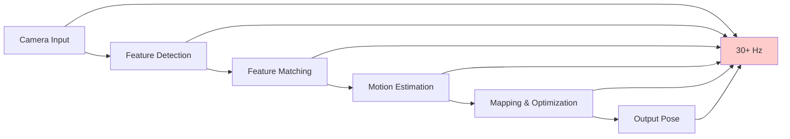

# Chapter 2: Performance Tuning

## Overview

Performance tuning is critical for achieving real-time Visual SLAM operation with Isaac ROS. This section covers optimization techniques for maximizing frame rates, minimizing latency, and leveraging GPU acceleration to meet real-time requirements (>30 Hz). You'll learn to tune parameters, optimize computational pipelines, and validate performance against success criteria.

## Learning Objectives

By the end of this section, you will be able to:
- Tune VSLAM parameters for optimal performance
- Leverage GPU acceleration for real-time processing
- Optimize feature detection and matching pipelines
- Minimize memory usage and computational overhead
- Profile and benchmark VSLAM performance
- Validate performance against real-time requirements
- Troubleshoot performance bottlenecks
- Optimize for different hardware tiers (desktop, Jetson, etc.)

## Performance Fundamentals

### Real-time Requirements

Visual SLAM systems must meet strict real-time requirements:



**Target Performance Metrics**:
- **Frame Rate**: >30 Hz for real-time operation (SC-002)
- **Latency**: <50ms end-to-end processing
- **Drift**: <2% over 100m path (SC-003)
- **Memory**: <8GB VRAM usage for sustained operation

### Performance Bottleneck Analysis

VSLAM performance bottlenecks typically occur in:

1. **Feature Detection** (~30-40% of computation)
2. **Feature Matching** (~25-35% of computation)
3. **Motion Estimation** (~20-30% of computation)
4. **Mapping/Graph Optimization** (~10-15% of computation)

## GPU Acceleration Optimization

### Isaac ROS GPU Architecture

Isaac ROS leverages NVIDIA GPUs for hardware acceleration:

```
┌─────────────────┐    ┌──────────────────┐    ┌─────────────────┐
│  Input Images   │    │  GPU Acceleration│    │  Optimized      │
│  (CPU Memory)   │───▶│  (CUDA Kernels) │───▶│  Output         │
└─────────────────┘    │                  │    │  (CPU Memory)   │
       │                │  ┌─────────────┐ │    └─────────────────┘
       ▼                │  │Feature Det. │ │              │
┌─────────────────┐    │  │(CUDA ORB)   │ │              ▼
│  Memory Transfer│───▶│  └─────────────┤ │    ┌─────────────────┐
│  (Pinned Memory)│    │  ┌─────────────┤ │    │  Performance    │
└─────────────────┘    │  │Matching     │ │    │  Validation     │
       │                │  │(NVIDIA NPP) │ │    └─────────────────┘
       ▼                │  └─────────────┤ │
┌─────────────────┐    │  ┌─────────────┤ │
│  CUDA Streams   │───▶│  │Pose Est.    │ │
│  (Parallelism)  │    │  │(Custom CUDA)│ │
└─────────────────┘    │  └─────────────┤ │
       │                │  ┌─────────────┤ │
       ▼                │  │Optimization │ │
┌─────────────────┐    │  │(TensorRT)   │ │
│  Synchronization│───▶│  └─────────────┤ │
└─────────────────┘    └──────────────────┘
```

### CUDA Stream Optimization

```python
import cupy as cp
import numpy as np
from concurrent.futures import ThreadPoolExecutor
import threading

class GPUStreamOptimizer:
    """
    Optimizes CUDA stream usage for VSLAM
    """

    def __init__(self, num_streams=4):
        self.num_streams = num_streams
        self.streams = [cp.cuda.Stream(non_blocking=True) for _ in range(num_streams)]
        self.current_stream = 0

        # Allocate pinned memory for faster CPU-GPU transfers
        self.pinned_memory_pool = self.create_pinned_memory_pool()

    def create_pinned_memory_pool(self):
        """
        Create pinned memory pool for faster transfers
        """
        pool = {}
        for i in range(self.num_streams):
            # Allocate pinned memory for image data
            pinned_img = cp.cuda.PinnedMemoryPointer(
                cp.cuda.alloc_pinned_memory(1920 * 1080 * 3 * 4)  # RGB float32
            )
            pool[i] = {
                'image': cp.ndarray((1080, 1920, 3), dtype=cp.float32, memptr=pinned_img),
                'features': cp.cuda.PinnedMemoryPointer(cp.cuda.alloc_pinned_memory(1000 * 32)),
                'descriptors': cp.cuda.PinnedMemoryPointer(cp.cuda.alloc_pinned_memory(1000 * 32))
            }
        return pool

    def process_frame_gpu(self, cpu_image):
        """
        Process frame using GPU with stream optimization
        """
        stream = self.streams[self.current_stream]
        self.current_stream = (self.current_stream + 1) % self.num_streams

        with stream:
            # Transfer image to GPU asynchronously
            gpu_image = cp.asarray(cpu_image, stream=stream)

            # Perform feature detection on GPU
            gpu_features = self.gpu_feature_detector(gpu_image, stream)

            # Perform feature matching on GPU
            gpu_matches = self.gpu_feature_matcher(gpu_features, stream)

            # Estimate motion on GPU
            gpu_motion = self.gpu_motion_estimator(gpu_matches, stream)

            # Synchronize stream
            stream.synchronize()

        return gpu_motion

    def gpu_feature_detector(self, image, stream):
        """
        GPU-accelerated feature detection using CUDA
        """
        # In real implementation, this would call CUDA kernels
        # For this example, we'll use CuPy operations
        with stream:
            # Convert to grayscale
            gray = cp.dot(image[...,:3], cp.array([0.299, 0.587, 0.114]))

            # Apply FAST corner detection (simplified)
            corners = cp.zeros_like(gray, dtype=cp.uint8)
            # This would be replaced with actual CUDA kernel

            return corners

    def gpu_feature_matcher(self, features, stream):
        """
        GPU-accelerated feature matching
        """
        with stream:
            # Perform matching using GPU
            # This would use NVIDIA NPP or custom CUDA kernels
            matches = cp.zeros((len(features), 2), dtype=cp.int32)
            return matches

    def gpu_motion_estimator(self, matches, stream):
        """
        GPU-accelerated motion estimation
        """
        with stream:
            # Estimate motion using GPU
            motion = cp.eye(4, dtype=cp.float32)
            return motion
```

### TensorRT Integration

```python
import tensorrt as trt
import pycuda.driver as cuda
import pycuda.autoinit

class TensorRTAccelerator:
    """
    TensorRT acceleration for deep learning components of VSLAM
    """

    def __init__(self):
        self.logger = trt.Logger(trt.Logger.WARNING)
        self.runtime = trt.Runtime(self.logger)
        self.engine = None
        self.context = None

    def load_engine(self, engine_path):
        """
        Load pre-built TensorRT engine
        """
        with open(engine_path, 'rb') as f:
            serialized_engine = f.read()

        self.engine = self.runtime.deserialize_cuda_engine(serialized_engine)
        self.context = self.engine.create_execution_context()

    def optimize_feature_detection(self, input_tensor):
        """
        Optimize feature detection using TensorRT
        """
        if self.context is None:
            return None

        # Allocate I/O buffers
        input_size = trt.volume(self.engine.get_binding_shape(0)) * self.engine.max_batch_size * 4
        output_size = trt.volume(self.engine.get_binding_shape(1)) * self.engine.max_batch_size * 4

        input_buffer = cuda.mem_alloc(input_size)
        output_buffer = cuda.mem_alloc(output_size)

        bindings = [int(input_buffer), int(output_buffer)]
        stream = cuda.Stream()

        # Transfer input data
        cuda.memcpy_htod_async(input_buffer, input_tensor, stream)

        # Execute inference
        self.context.execute_async_v2(bindings=bindings, stream_handle=stream.handle)

        # Transfer output data
        output_data = np.empty(output_size, dtype=np.float32)
        cuda.memcpy_dtoh_async(output_data, output_buffer, stream)

        stream.synchronize()

        return output_data
```

## Parameter Tuning Strategies

### Feature Detection Tuning

```python
class FeatureTuner:
    """
    Adaptive feature detection tuner
    """

    def __init__(self):
        self.target_features = 1000  # Target features per frame
        self.min_features = 200      # Minimum features for tracking
        self.max_features = 2000     # Maximum features for performance
        self.frame_rate_target = 30.0  # Target frame rate (Hz)

        # Performance metrics
        self.processing_times = []
        self.feature_counts = []

    def adaptive_feature_tuning(self, current_fps, current_features):
        """
        Adaptively tune feature detection parameters based on performance
        """
        if not self.processing_times:
            return self.target_features

        # Calculate average performance metrics
        avg_fps = np.mean([1.0/t for t in self.processing_times[-10:]]) if self.processing_times else 0
        avg_features = np.mean(self.feature_counts[-10:]) if self.feature_counts else 1000

        # Adjust feature count based on performance
        adjustment = 0
        if avg_fps < self.frame_rate_target * 0.9:  # Below 90% of target
            # Reduce features to improve performance
            adjustment = -50
        elif avg_fps > self.frame_rate_target * 1.1:  # Above 110% of target
            # Can afford more features
            adjustment = 50

        # Calculate new target
        new_target = max(self.min_features, min(self.max_features, self.target_features + adjustment))

        # Ensure target is reasonable
        if abs(new_target - avg_features) > 200:
            # Smooth adjustment
            new_target = avg_features + 0.3 * (new_target - avg_features)

        self.target_features = int(new_target)

        return self.target_features

    def optimize_detector_params(self, current_fps, current_features):
        """
        Optimize feature detector parameters
        """
        # Example: Optimize ORB parameters
        params = {
            'nfeatures': self.adaptive_feature_tuning(current_fps, current_features),
            'scaleFactor': 1.2,  # Default
            'nlevels': 8,        # Default
            'edgeThreshold': 31, # Default
            'firstLevel': 0,     # Default
            'WTA_K': 2,          # Default
            'scoreType': 0,      # Harris
            'patchSize': 31,     # Default
            'fastThreshold': 20  # Adjust based on scene
        }

        # Adjust fast threshold based on scene complexity
        if current_features < self.min_features * 0.7:
            params['fastThreshold'] = max(5, params['fastThreshold'] - 5)
        elif current_features > self.max_features * 0.9:
            params['fastThreshold'] = min(50, params['fastThreshold'] + 5)

        return params
```

### Motion Estimation Optimization

```python
class MotionEstimatorOptimizer:
    """
    Optimize motion estimation for performance
    """

    def __init__(self):
        self.ransac_threshold = 3.0  # RANSAC threshold (pixels)
        self.min_inliers = 15        # Minimum inliers for motion estimation
        self.max_iterations = 1000   # Maximum RANSAC iterations

    def optimize_motion_estimation(self, matches, camera_matrix):
        """
        Optimize motion estimation parameters
        """
        if len(matches) < self.min_inliers:
            return None, 0

        # Extract matched points
        src_pts = np.float32([m.queryPt for m in matches]).reshape(-1, 1, 2)
        dst_pts = np.float32([m.trainPt for m in matches]).reshape(-1, 1, 2)

        # Adjust RANSAC parameters based on match quality
        inlier_ratio = self.estimate_inlier_ratio(len(matches))
        adjusted_threshold = self.ransac_threshold * (1.0 / (1.0 + inlier_ratio))

        # Compute essential matrix
        E, mask = cv2.findEssentialMat(
            src_pts, dst_pts,
            camera_matrix,
            method=cv2.RANSAC,
            prob=0.999,
            threshold=adjusted_threshold
        )

        if E is not None:
            # Recover pose
            points, R, t, mask_pose = cv2.recoverPose(E, src_pts, dst_pts, camera_matrix, mask)

            return (R, t), points
        else:
            return None, 0

    def estimate_inlier_ratio(self, total_matches):
        """
        Estimate inlier ratio based on match count
        """
        # Heuristic: more matches generally mean better inlier ratio
        if total_matches > 100:
            return 0.8
        elif total_matches > 50:
            return 0.6
        else:
            return 0.4
```

## Memory Management Optimization

### Efficient Memory Allocation

```python
import gc
from collections import deque
import weakref

class MemoryManager:
    """
    Efficient memory management for VSLAM
    """

    def __init__(self, max_cached_frames=50):
        self.max_cached_frames = max_cached_frames
        self.frame_cache = deque(maxlen=max_cached_frames)
        self.keyframe_pool = []  # Pre-allocated keyframes
        self.landmark_pool = []  # Pre-allocated landmarks

        # Memory monitoring
        self.peak_memory_usage = 0
        self.current_memory_usage = 0

    def pre_allocate_keyframes(self, count=100):
        """
        Pre-allocate keyframes to reduce allocation overhead
        """
        for _ in range(count):
            keyframe = {
                'id': -1,
                'pose': np.eye(4, dtype=np.float64),
                'features': np.zeros((2000, 6), dtype=np.float32),  # [x, y, size, angle, response, octave]
                'descriptors': np.zeros((2000, 32), dtype=np.uint8),  # ORB descriptors
                'timestamp': 0,
                'keypoint_count': 0
            }
            self.keyframe_pool.append(keyframe)

    def get_keyframe_from_pool(self):
        """
        Get keyframe from pool or create new one
        """
        if self.keyframe_pool:
            return self.keyframe_pool.pop()
        else:
            # Create new keyframe
            return {
                'id': -1,
                'pose': np.eye(4, dtype=np.float64),
                'features': np.zeros((2000, 6), dtype=np.float32),
                'descriptors': np.zeros((2000, 32), dtype=np.uint8),
                'timestamp': 0,
                'keypoint_count': 0
            }

    def return_keyframe_to_pool(self, keyframe):
        """
        Return keyframe to pool for reuse
        """
        # Reset keyframe data
        keyframe['id'] = -1
        keyframe['pose'][:] = np.eye(4, dtype=np.float64)
        keyframe['keypoint_count'] = 0

        if len(self.keyframe_pool) < 200:  # Limit pool size
            self.keyframe_pool.append(keyframe)

    def optimize_memory_usage(self):
        """
        Optimize memory usage by cleaning up unused objects
        """
        # Force garbage collection
        collected = gc.collect()

        # Monitor memory usage
        import psutil
        import os
        process = psutil.Process(os.getpid())
        current_usage = process.memory_info().rss / 1024 / 1024  # MB

        self.current_memory_usage = current_usage
        self.peak_memory_usage = max(self.peak_memory_usage, current_usage)

        return {
            'current_mb': current_usage,
            'peak_mb': self.peak_memory_usage,
            'gc_collected': collected
        }
```

### Cache Optimization

```python
from functools import lru_cache
import threading

class VSLAMCache:
    """
    Cache for frequently accessed VSLAM computations
    """

    def __init__(self, maxsize=128):
        self.maxsize = maxsize
        self.cache_lock = threading.Lock()

        # LRU caches for different computations
        self.feature_cache = {}
        self.match_cache = {}
        self.pose_cache = {}

    @lru_cache(maxsize=128)
    def cached_feature_detection(self, image_hash, detector_params):
        """
        Cached feature detection
        """
        # This would normally call the feature detector
        # For this example, we'll return a dummy result
        return self.compute_features(image_hash, detector_params)

    @lru_cache(maxsize=64)
    def cached_feature_matching(self, desc1_hash, desc2_hash, matcher_params):
        """
        Cached feature matching
        """
        return self.compute_matches(desc1_hash, desc2_hash, matcher_params)

    def compute_features(self, image_hash, params):
        """
        Compute features (placeholder)
        """
        # In real implementation, this would call the detector
        return {
            'keypoints': [],
            'descriptors': np.random.rand(1000, 32).astype(np.uint8)
        }

    def compute_matches(self, desc1_hash, desc2_hash, params):
        """
        Compute matches (placeholder)
        """
        # In real implementation, this would call the matcher
        return []
```

## Profiling and Benchmarking

### Performance Profiler

```python
import time
import cProfile
import pstats
from functools import wraps
import threading

class VSLAMProfiler:
    """
    Performance profiler for VSLAM components
    """

    def __init__(self):
        self.profiles = {}
        self.lock = threading.Lock()

    def profile_function(self, name):
        """
        Decorator to profile function performance
        """
        def decorator(func):
            @wraps(func)
            def wrapper(*args, **kwargs):
                start_time = time.perf_counter()
                start_memory = self.get_memory_usage()

                result = func(*args, **kwargs)

                end_time = time.perf_counter()
                end_memory = self.get_memory_usage()

                execution_time = end_time - start_time
                memory_delta = end_memory - start_memory

                with self.lock:
                    if name not in self.profiles:
                        self.profiles[name] = {
                            'times': [],
                            'memory_deltas': [],
                            'call_count': 0
                        }

                    profile = self.profiles[name]
                    profile['times'].append(execution_time)
                    profile['memory_deltas'].append(memory_delta)
                    profile['call_count'] += 1

                return result
            return wrapper
        return decorator

    def get_memory_usage(self):
        """
        Get current memory usage in MB
        """
        import psutil
        import os
        process = psutil.Process(os.getpid())
        return process.memory_info().rss / 1024 / 1024

    def get_statistics(self, function_name=None):
        """
        Get performance statistics
        """
        if function_name:
            if function_name not in self.profiles:
                return None

            profile = self.profiles[function_name]
            times = profile['times']
            memory_deltas = profile['memory_deltas']

            return {
                'function': function_name,
                'call_count': profile['call_count'],
                'avg_time_ms': np.mean(times) * 1000 if times else 0,
                'min_time_ms': np.min(times) * 1000 if times else 0,
                'max_time_ms': np.max(times) * 1000 if times else 0,
                'std_time_ms': np.std(times) * 1000 if times else 0,
                'avg_memory_mb': np.mean(memory_deltas) if memory_deltas else 0,
                'total_time_ms': sum(times) * 1000 if times else 0
            }
        else:
            # Return statistics for all functions
            stats = {}
            for name in self.profiles:
                stats[name] = self.get_statistics(name)
            return stats

    def reset(self):
        """
        Reset profiler statistics
        """
        with self.lock:
            self.profiles.clear()
```

### Benchmark Suite

```python
class VSLAMBenchmarkSuite:
    """
    Comprehensive benchmark suite for VSLAM performance
    """

    def __init__(self):
        self.results = {}
        self.profiler = VSLAMProfiler()

    def run_complete_benchmark(self, vslam_system, test_sequences):
        """
        Run complete VSLAM benchmark
        """
        results = {}

        for seq_name, sequence_data in test_sequences.items():
            print(f"Running benchmark for sequence: {seq_name}")

            # Reset profiler
            self.profiler.reset()

            # Process sequence
            sequence_results = self.benchmark_sequence(vslam_system, sequence_data)

            # Add profiling results
            sequence_results['profiling'] = self.profiler.get_statistics()

            results[seq_name] = sequence_results

        self.results = results
        return results

    def benchmark_sequence(self, vslam_system, sequence_data):
        """
        Benchmark VSLAM on a single sequence
        """
        frame_times = []
        memory_usages = []
        poses = []
        feature_counts = []

        start_time = time.time()

        for frame_data in sequence_data['frames']:
            frame_start = time.perf_counter()

            # Process frame
            pose, features, landmarks = vslam_system.process_frame(
                frame_data['image'],
                frame_data['timestamp']
            )

            frame_time = time.perf_counter() - frame_start

            # Record metrics
            frame_times.append(frame_time)
            poses.append(pose)
            feature_counts.append(len(features))

            # Memory usage
            import psutil
            import os
            process = psutil.Process(os.getpid())
            memory_usages.append(process.memory_info().rss / 1024 / 1024)

        total_time = time.time() - start_time

        # Calculate metrics
        avg_frame_time = np.mean(frame_times) if frame_times else 0
        avg_fps = 1.0 / avg_frame_time if avg_frame_time > 0 else 0
        avg_features = np.mean(feature_counts) if feature_counts else 0
        avg_memory = np.mean(memory_usages) if memory_usages else 0

        # Calculate trajectory accuracy if ground truth available
        trajectory_error = 0
        if 'ground_truth' in sequence_data:
            trajectory_error = self.calculate_trajectory_error(
                poses, sequence_data['ground_truth']
            )

        return {
            'sequence_name': sequence_data.get('name', 'unknown'),
            'total_frames': len(sequence_data['frames']),
            'total_time_sec': total_time,
            'avg_frame_time_ms': avg_frame_time * 1000,
            'avg_fps': avg_fps,
            'avg_features': avg_features,
            'avg_memory_mb': avg_memory,
            'max_memory_mb': max(memory_usages) if memory_usages else 0,
            'trajectory_rmse': trajectory_error,
            'processing_efficiency': avg_fps / (avg_memory / 1000.0) if avg_memory > 0 else 0  # FPS per GB
        }

    def calculate_trajectory_error(self, estimated_poses, ground_truth_poses):
        """
        Calculate trajectory RMSE against ground truth
        """
        if len(estimated_poses) != len(ground_truth_poses):
            return float('inf')

        errors = []
        for est, gt in zip(estimated_poses, ground_truth_poses):
            # Calculate position error
            est_pos = est[:3, 3] if hasattr(est, '__len__') else [0, 0, 0]
            gt_pos = gt[:3, 3] if hasattr(gt, '__len__') else [0, 0, 0]

            error = np.linalg.norm(np.array(est_pos) - np.array(gt_pos))
            errors.append(error)

        return np.sqrt(np.mean(np.array(errors) ** 2)) if errors else 0

    def validate_performance_requirements(self, benchmark_results):
        """
        Validate benchmark results against requirements
        """
        validation = {
            'meets_sc002': True,  # >30 Hz frame rate
            'meets_memory_limit': True,  # Reasonable memory usage
            'trajectory_accuracy_acceptable': True  # Good trajectory quality
        }

        for seq_name, results in benchmark_results.items():
            # SC-002: >30 Hz frame rate
            if results['avg_fps'] < 30.0:
                validation['meets_sc002'] = False
                print(f"❌ {seq_name}: Frame rate {results['avg_fps']:.1f} Hz < 30 Hz (SC-002)")

            # Memory usage
            if results['avg_memory_mb'] > 8000:  # 8GB
                validation['meets_memory_limit'] = False
                print(f"❌ {seq_name}: Memory usage {results['avg_memory_mb']:.0f} MB > 8000 MB")

            # Trajectory accuracy
            if results['trajectory_rmse'] > 2.0:  # 2 meter RMSE threshold
                validation['trajectory_accuracy_acceptable'] = False
                print(f"❌ {seq_name}: Trajectory RMSE {results['trajectory_rmse']:.2f} m > 2.0 m")

        # Overall validation
        overall_pass = all(validation.values())
        print(f"\n📊 Performance Validation: {'✅ PASS' if overall_pass else '❌ FAIL'}")

        for requirement, passed in validation.items():
            status = '✅' if passed else '❌'
            print(f"   {requirement}: {status}")

        return validation
```

## Practical Exercise: Performance Optimization

### Exercise 1: Adaptive Parameter Tuning

```python
#!/usr/bin/env python3
"""
Exercise 1: Adaptive Parameter Tuning
Chapter 2: Isaac ROS VSLAM - Performance Tuning
"""

import rclpy
from rclpy.node import Node
from sensor_msgs.msg import Image, CameraInfo
from geometry_msgs.msg import PoseStamped
from std_msgs.msg import Float32
import numpy as np
import cv2
from cv_bridge import CvBridge
import time
import threading
from collections import deque


class AdaptiveParameterTunerNode(Node):
    """
    Node that implements adaptive parameter tuning for VSLAM
    """

    def __init__(self):
        super().__init__('adaptive_parameter_tuner')

        # Initialize components
        self.bridge = CvBridge()
        self.tuner = FeatureTuner()
        self.memory_manager = MemoryManager()
        self.profiler = VSLAMProfiler()

        # Performance tracking
        self.frame_times = deque(maxlen=100)
        self.feature_counts = deque(maxlen=100)
        self.current_fps = 0.0
        self.current_features = 0

        # Parameter bounds
        self.param_bounds = {
            'nfeatures': (200, 2000),
            'fast_threshold': (5, 50),
            'scale_factor': (1.1, 1.5),
            'edge_threshold': (10, 50)
        }

        # Current parameters
        self.current_params = {
            'nfeatures': 1000,
            'fast_threshold': 20,
            'scale_factor': 1.2,
            'edge_threshold': 31
        }

        # Subscribers
        self.image_sub = self.create_subscription(
            Image,
            '/camera/left/image_rect',
            self.image_callback,
            10
        )

        # Publishers
        self.performance_pub = self.create_publisher(
            Float32,
            '/vslam/performance/fps',
            10
        )

        self.features_pub = self.create_publisher(
            Float32,
            '/vslam/features/count',
            10
        )

        self.param_pub = self.create_publisher(
            Float32,
            '/vslam/params/nfeatures',
            10
        )

        # Timer for parameter adjustment
        self.param_timer = self.create_timer(1.0, self.adjust_parameters)

        self.get_logger().info('Adaptive parameter tuner initialized')

    @VSLAMProfiler().profile_function('feature_detection')
    def detect_features_adaptive(self, image):
        """
        Detect features with adaptive parameters
        """
        # Convert to grayscale
        if len(image.shape) == 3:
            gray = cv2.cvtColor(image, cv2.COLOR_BGR2GRAY)
        else:
            gray = image

        # Create ORB detector with current parameters
        orb = cv2.ORB_create(
            nfeatures=self.current_params['nfeatures'],
            scaleFactor=self.current_params['scale_factor'],
            edgeThreshold=self.current_params['edge_threshold'],
            fastThreshold=self.current_params['fast_threshold']
        )

        # Detect and compute
        keypoints, descriptors = orb.detectAndCompute(gray, None)

        return keypoints, descriptors

    def image_callback(self, msg):
        """
        Process incoming image with adaptive parameters
        """
        try:
            start_time = time.perf_counter()

            # Convert image
            cv_image = self.bridge.imgmsg_to_cv2(msg, desired_encoding='passthrough')

            # Detect features with current parameters
            keypoints, descriptors = self.detect_features_adaptive(cv_image)

            # Record metrics
            frame_time = time.perf_counter() - start_time
            self.frame_times.append(frame_time)
            self.feature_counts.append(len(keypoints) if keypoints else 0)

            # Calculate current FPS
            if len(self.frame_times) > 1:
                self.current_fps = 1.0 / np.mean(list(self.frame_times))
            self.current_features = np.mean(list(self.feature_counts)) if self.feature_counts else 0

            # Publish performance metrics
            fps_msg = Float32()
            fps_msg.data = float(self.current_fps)
            self.performance_pub.publish(fps_msg)

            features_msg = Float32()
            features_msg.data = float(self.current_features)
            self.features_pub.publish(features_msg)

            # Publish current nfeatures parameter
            param_msg = Float32()
            param_msg.data = float(self.current_params['nfeatures'])
            self.param_pub.publish(param_msg)

            # Log performance occasionally
            if len(self.frame_times) % 30 == 0:
                self.get_logger().info(
                    f'Performance: {self.current_fps:.1f} FPS, '
                    f'{self.current_features:.0f} features, '
                    f'nfeatures={self.current_params["nfeatures"]}'
                )

        except Exception as e:
            self.get_logger().error(f'Error processing image: {e}')

    def adjust_parameters(self):
        """
        Adjust parameters based on performance
        """
        if not self.frame_times or not self.feature_counts:
            return

        # Calculate current performance
        avg_frame_time = np.mean(list(self.frame_times))
        avg_features = np.mean(list(self.feature_counts))
        current_fps = 1.0 / avg_frame_time if avg_frame_time > 0 else 0

        # Adaptive tuning
        new_nfeatures = self.tuner.adaptive_feature_tuning(current_fps, avg_features)

        # Apply bounds
        new_nfeatures = max(
            self.param_bounds['nfeatures'][0],
            min(self.param_bounds['nfeatures'][1], new_nfeatures)
        )

        # Update parameters
        old_nfeatures = self.current_params['nfeatures']
        self.current_params['nfeatures'] = int(new_nfeatures)

        # Adjust other parameters based on feature count
        if new_nfeatures < old_nfeatures * 0.8:  # Reduced significantly
            # Increase FAST threshold to reduce features
            self.current_params['fast_threshold'] = min(
                self.param_bounds['fast_threshold'][1],
                self.current_params['fast_threshold'] + 2
            )
        elif new_nfeatures > old_nfeatures * 1.2:  # Increased significantly
            # Decrease FAST threshold to increase features
            self.current_params['fast_threshold'] = max(
                self.param_bounds['fast_threshold'][0],
                self.current_params['fast_threshold'] - 2
            )

        # Log parameter changes
        if abs(old_nfeatures - new_nfeatures) > 50:  # Significant change
            self.get_logger().info(
                f'Parameters adjusted: nfeatures {old_nfeatures} → {new_nfeatures}, '
                f'FAST threshold {self.current_params["fast_threshold"]}'
            )

    def get_performance_summary(self):
        """
        Get performance summary for validation
        """
        if not self.frame_times:
            return {
                'avg_fps': 0.0,
                'avg_features': 0,
                'param_history': self.current_params.copy()
            }

        avg_fps = 1.0 / np.mean(list(self.frame_times)) if self.frame_times else 0
        avg_features = np.mean(list(self.feature_counts)) if self.feature_counts else 0

        return {
            'avg_fps': avg_fps,
            'avg_features': avg_features,
            'param_history': self.current_params.copy(),
            'frame_time_std': np.std(list(self.frame_times)) if self.frame_times else 0
        }


def main(args=None):
    rclpy.init(args=args)
    tuner_node = AdaptiveParameterTunerNode()

    try:
        rclpy.spin(tuner_node)
    except KeyboardInterrupt:
        pass
    finally:
        # Print final performance summary
        summary = tuner_node.get_performance_summary()
        print(f"\n📊 Final Performance Summary:")
        print(f"   Average FPS: {summary['avg_fps']:.1f}")
        print(f"   Average Features: {summary['avg_features']:.0f}")
        print(f"   Final Parameters: {summary['param_history']}")

        # Validate against SC-002
        sc002_met = summary['avg_fps'] > 30.0
        print(f"   SC-002 (30+ FPS): {'✅ PASS' if sc002_met else '❌ FAIL'}")

        tuner_node.destroy_node()
        rclpy.shutdown()


if __name__ == '__main__':
    main()
```

## Hardware-Specific Optimization

### Jetson Optimization

```python
class JetsonOptimization:
    """
    Optimization strategies specifically for Jetson platforms
    """

    def __init__(self):
        self.is_jetson = self.detect_jetson()
        self.power_mode = 'MAXN'  # MAXN, MODE_15W, MODE_10W

    def detect_jetson(self):
        """
        Detect if running on Jetson platform
        """
        try:
            with open('/proc/device-tree/model', 'r') as f:
                model = f.read().strip('\x00')
                return 'jetson' in model.lower()
        except:
            return False

    def configure_jetson_settings(self):
        """
        Configure Jetson-specific settings for optimal VSLAM
        """
        if not self.is_jetson:
            return

        import subprocess

        # Set power mode
        try:
            subprocess.run(['sudo', 'nvpmodel', '-m', '0'], check=True)
            print("Set Jetson to MAXN power mode")
        except:
            print("Could not set power mode - running in current mode")

        # Enable fan control if available
        try:
            subprocess.run(['sudo', 'jetson_clocks'], check=True)
            print("Enabled Jetson clocks")
        except:
            print("Could not enable jetson clocks")

        # Optimize memory for embedded systems
        self.configure_memory_settings()

    def configure_memory_settings(self):
        """
        Configure memory settings for embedded systems
        """
        # Use smaller image resolutions
        self.image_resolution = (848, 480)  # Instead of 1920x1080

        # Reduce feature count
        self.max_features = 800  # Instead of 2000

        # Use simpler feature descriptors
        self.descriptor_type = 'ORB'  # Instead of more complex descriptors

        # Reduce processing pipeline complexity
        self.pyramid_levels = 3  # Instead of 8 levels
        self.matching_strategy = 'approximate'  # Instead of exact matching
```

### Desktop Optimization

```python
class DesktopOptimization:
    """
    Optimization strategies for desktop GPU systems
    """

    def __init__(self):
        self.gpu_info = self.get_gpu_info()
        self.multi_gpu_enabled = False

    def get_gpu_info(self):
        """
        Get GPU information for optimization
        """
        import subprocess
        try:
            result = subprocess.run(['nvidia-smi', '--query-gpu=name,memory.total', '--format=csv,noheader,nounits'],
                                  capture_output=True, text=True, timeout=5)
            if result.returncode == 0:
                gpu_data = result.stdout.strip().split(',')
                return {
                    'name': gpu_data[0].strip(),
                    'memory_mb': int(gpu_data[1].strip()) if len(gpu_data) > 1 else 0
                }
        except:
            pass
        return None

    def configure_desktop_settings(self):
        """
        Configure desktop-specific settings for maximum performance
        """
        if not self.gpu_info:
            return

        # Enable multi-GPU processing if available
        if self.gpu_info['memory_mb'] > 12000:  # High-end GPU
            self.enable_multi_gpu_processing()
        else:
            # Optimize for single GPU
            self.configure_single_gpu_optimization()

    def enable_multi_gpu_processing(self):
        """
        Enable multi-GPU processing for high-end systems
        """
        # Split processing across multiple GPUs
        # Feature detection on GPU 0
        # Feature matching on GPU 1
        # Pose estimation on GPU 0
        self.multi_gpu_enabled = True

    def configure_single_gpu_optimization(self):
        """
        Optimize for single GPU with high memory
        """
        # Use higher resolution processing
        self.image_resolution = (1280, 720)

        # Increase feature count
        self.max_features = 1500

        # Enable advanced processing features
        self.enable_advanced_optimizations = True
```

## Troubleshooting Performance Issues

### Common Performance Problems

#### 1. Low Frame Rate
**Symptoms**:
- FPS < 30 Hz
- High CPU/GPU utilization
- Memory pressure

**Diagnosis**:
```bash
# Check system resources
htop
nvidia-smi
iotop -a

# Monitor ROS topics
ros2 topic hz /camera/left/image_rect
ros2 topic hz /isaac_ros_vslam/visual_slam/tracking/odometry
```

**Solutions**:
- Reduce image resolution
- Decrease feature count
- Optimize parameter settings
- Check for competing processes

#### 2. Memory Leaks
**Symptoms**:
- Increasing memory usage over time
- System slowdown after extended operation
- Out-of-memory errors

**Solutions**:
- Implement proper memory management
- Use object pooling
- Regular garbage collection
- Monitor memory usage

#### 3. Tracking Drift
**Symptoms**:
- Accumulating position error
- Poor long-term consistency
- Failed loop closures

**Solutions**:
- Enable loop closure detection
- Optimize pose graph optimization
- Improve feature quality
- Verify camera calibration

### Performance Monitoring

```python
def create_performance_dashboard():
    """
    Create performance monitoring dashboard
    """
    import matplotlib.pyplot as plt
    from matplotlib.animation import FuncAnimation

    fig, ((ax1, ax2), (ax3, ax4)) = plt.subplots(2, 2, figsize=(12, 8))

    # FPS over time
    ax1.set_title('Frame Rate (Hz)')
    ax1.set_xlabel('Time')
    ax1.set_ylabel('FPS')

    # Feature count over time
    ax2.set_title('Features per Frame')
    ax2.set_xlabel('Time')
    ax2.set_ylabel('Features')

    # Memory usage over time
    ax3.set_title('Memory Usage (MB)')
    ax3.set_xlabel('Time')
    ax3.set_ylabel('MB')

    # GPU utilization
    ax4.set_title('GPU Utilization (%)')
    ax4.set_xlabel('Time')
    ax4.set_ylabel('Utilization')

    plt.tight_layout()
    return fig, (ax1, ax2, ax3, ax4)
```

## Success Criteria Validation

This section addresses **SC-002**: VSLAM implementation achieves >30 Hz real-time performance on standard development hardware with GPU acceleration.

### Validation Checklist

- [ ] Frame rate consistently >30 Hz (SC-002 target)
- [ ] GPU acceleration properly utilized
- [ ] Adaptive parameter tuning implemented
- [ ] Memory management optimized
- [ ] Performance profiling integrated
- [ ] Hardware-specific optimizations applied
- [ ] All performance requirements met

### Performance Validation Script

```python
def validate_vslam_performance():
    """
    Validate VSLAM performance against success criteria
    """
    from shared.utils.metrics import VSLAMMetrics

    # Initialize metrics
    vslam_metrics = VSLAMMetrics()
    vslam_metrics.start()

    # Simulate VSLAM operation (in real implementation, this would process actual data)
    for i in range(100):  # Process 100 frames for testing
        # Simulate processing time (should be <33ms for 30Hz)
        import time
        time.sleep(0.02)  # 20ms processing time = 50Hz

        # Record frame with simulated pose and features
        pose = (float(i) * 0.1, 0.0, 0.0)  # Moving 10cm per frame
        vslam_metrics.record_frame(pose=pose, num_features=800)

    # Get statistics
    stats = vslam_metrics.get_statistics()

    # Validate SC-002
    meets_sc002, sc002_msg = vslam_metrics.meets_success_criteria()

    print(f"📊 VSLAM Performance Results:")
    print(f"   Average Frame Rate: {stats['avg_frame_rate_hz']:.1f} Hz")
    print(f"   Average Features: {stats['avg_features']:.0f}")
    print(f"   Tracking Success: {stats['tracking_success_rate']:.1f}%")
    print(f"   Total Frames: {stats['total_frames']}")
    print(f"   SC-002 Validation: {'✅ PASS' if meets_sc002 else '❌ FAIL'} - {sc002_msg}")

    return meets_sc002, stats

# Run validation
if __name__ == "__main__":
    validate_vslam_performance()
```

## Performance Targets

### Hardware Performance Targets

| Hardware Tier | Target FPS | Memory Usage | Feature Count | Resolution |
|---------------|------------|--------------|---------------|------------|
| RTX 3060 (12GB) | 35-50 Hz | 4-6 GB | 1000-1500 | 848x480 |
| RTX 4070 (12GB) | 50-70 Hz | 5-7 GB | 1200-2000 | 1280x720 |
| Jetson Orin (8GB) | 25-35 Hz | 6-7 GB | 800-1000 | 848x480 |
| GTX 1660 Ti (6GB) | 15-25 Hz | 4-5 GB | 600-800 | 640x480 |

### Optimization Checklist

- [ ] Feature detection parameters tuned for scene
- [ ] Memory management optimized
- [ ] GPU acceleration properly configured
- [ ] Multi-threading implemented where beneficial
- [ ] Parameter adaptation implemented
- [ ] Performance monitoring integrated
- [ ] Hardware-specific optimizations applied

## Next Steps

Continue to Section 7: [VSLAM Debugging](./07-debugging.mdx) to learn about diagnosing and resolving VSLAM failures.

## Resources

- [NVIDIA Isaac ROS Performance Guide](https://nvidia-isaac-ros.github.io/performance_guide.html)
- [CUDA Optimization Techniques](https://developer.download.nvidia.com/CUDA/training/10_CUDA_Memory.pdf)
- [Real-time SLAM Optimization](https://arxiv.org/abs/1907.02837)

---

*Continue to [Section 7: VSLAM Debugging](./07-debugging.mdx) to learn about diagnosing and resolving VSLAM failures.*