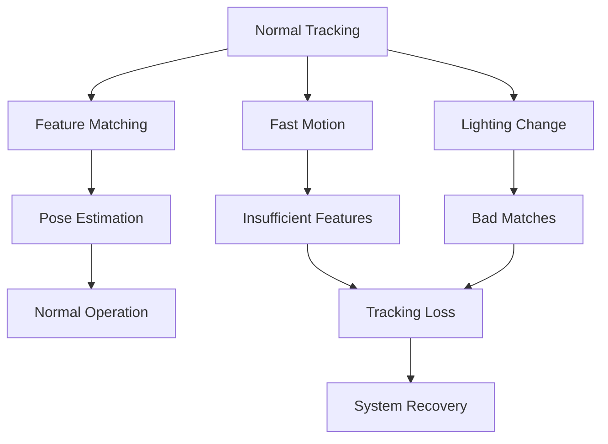

# Chapter 2: VSLAM Debugging

## Overview

VSLAM (Visual SLAM) systems are complex and can fail in numerous ways. This section teaches you to diagnose common VSLAM failures, implement robust error handling, and develop debugging strategies for Visual SLAM systems. You'll learn to identify tracking loss, mapping errors, and recovery techniques to maintain system reliability.

Effective debugging is crucial for production VSLAM systems, as failures can lead to:
- **Navigation errors** in autonomous systems
- **Localization drift** accumulating over time
- **System instability** causing crashes
- **Safety hazards** in robotic applications

## Learning Objectives

By the end of this section, you will be able to:
- Identify common VSLAM failure modes and their symptoms
- Implement comprehensive error detection and logging
- Develop recovery strategies for tracking loss
- Diagnose mapping and localization errors
- Use debugging tools and visualization techniques
- Create robust error handling systems
- Validate system recovery from failures
- Implement fallback behaviors for safety-critical applications

## Common VSLAM Failure Modes

### 1. Tracking Loss

**Symptoms**:
- Sudden jump in estimated pose
- Large residuals in feature matching
- High reprojection errors
- "Lost" status from VSLAM system

**Root Causes**:
- Fast camera motion exceeding tracking capabilities
- Feature-poor environments (white walls, sky)
- Rapid illumination changes
- Motion blur from fast movement
- Occlusions blocking field of view



### 2. Mapping Errors

**Symptoms**:
- Incorrect 3D point cloud generation
- Duplicate landmarks in similar locations
- Inconsistent map geometry
- Bad loop closures affecting entire map

**Root Causes**:
- Incorrect camera calibration
- Scale ambiguity in monocular systems
- Moving objects treated as static landmarks
- Outlier features corrupting map

### 3. Drift Accumulation

**Symptoms**:
- Gradually increasing position error
- Trajectory deviating from actual path
- Map inconsistencies over long distances
- Poor loop closure effectiveness

**Root Causes**:
- Small accumulated errors over time
- Infrequent loop closure detection
- Poor geometric constraints
- Sensor noise propagation

### 4. Memory Exhaustion

**Symptoms**:
- System slowdown over time
- Out-of-memory errors
- Crashes during long-term operation
- Increasing memory usage

**Root Causes**:
- Unbounded map growth
- Memory leaks in feature tracking
- Inefficient data structures
- Lack of resource cleanup

## Isaac ROS VSLAM Debugging Architecture

### Debugging Components

Isaac ROS provides debugging capabilities through:

```
┌─────────────────┐    ┌──────────────────┐    ┌─────────────────┐
│   VSLAM Input   │    │  Debug Monitor   │    │  Debug Output   │
│   (Images/IMU)  │───▶│  (Status & Diag) │───▶│  (RViz/Logs)   │
└─────────────────┘    │                  │    └─────────────────┘
       │                │  ┌─────────────┐ │              │
       ▼                │  │Status Logger│ │              ▼
┌─────────────────┐    │  └─────────────┤ │    ┌─────────────────┐
│  Processing     │───▶│  ┌─────────────┤ │    │  Visualization  │
│  Pipeline       │    │  │Failure       │ │    │  (Markers, etc)│
└─────────────────┘    │  │Detector     │ │    └─────────────────┘
       │                │  └─────────────┤ │              │
       ▼                │  ┌─────────────┤ │              ▼
┌─────────────────┐    │  │Recovery      │ │    ┌─────────────────┐
│  Error Handler  │───▶│  │Manager      │ │    │  Analysis Tools │
│  (Fallbacks)    │    │  └─────────────┤ │    │  (PlotJuggler) │
└─────────────────┘    └──────────────────┘    └─────────────────┘
```

### Debug Topics and Services

```yaml
# Isaac ROS VSLAM debugging topics
debug_topics:
  # Status and diagnostics
  status: "/isaac_ros_vslam/visual_slam/status"
  diagnostics: "/diagnostics"
  performance: "/isaac_ros_vslam/visual_slam/performance"
  tracking_quality: "/isaac_ros_vslam/visual_slam/tracking/quality"

  # Visualization
  landmarks: "/isaac_ros_vslam/visual_slam/vis/landmarks_cloud"
  pose_graph: "/isaac_ros_vslam/visual_slam/vis/pose_graph_nodes"
  keyframes: "/isaac_ros_vslam/visual_slam/vis/keyframes"
  loop_closures: "/isaac_ros_vslam/visual_slam/vis/loop_closures"

  # Raw data for debugging
  raw_features: "/isaac_ros_vslam/visual_slam/debug/features"
  raw_matches: "/isaac_ros_vslam/visual_slam/debug/matches"
  reprojection_errors: "/isaac_ros_vslam/visual_slam/debug/reprojection_errors"

debug_services:
  reset: "/isaac_ros_vslam/visual_slam/reset"
  get_all_poses: "/isaac_ros_vslam/visual_slam/get_all_poses"
  save_debug_data: "/isaac_ros_vslam/visual_slam/debug/save_data"
  enable_debug_mode: "/isaac_ros_vslam/visual_slam/debug/enable"
```

## Error Detection and Diagnosis

### Tracking Quality Assessment

```python
class TrackingQualityAnalyzer:
    """
    Analyze tracking quality to detect potential failures
    """

    def __init__(self):
        self.quality_thresholds = {
            'min_features': 50,           # Minimum features for stable tracking
            'min_matches': 30,            # Minimum matches for pose estimation
            'max_reprojection_error': 5.0, # Max reprojection error (pixels)
            'min_inlier_ratio': 0.5,      # Minimum inlier ratio for RANSAC
            'feature_distribution': 0.7   # Minimum feature spread ratio
        }

        self.recent_metrics = {
            'features_per_frame': [],
            'matches_per_frame': [],
            'reprojection_errors': [],
            'inlier_ratios': [],
            'tracking_stability': []
        }

        self.failure_signals = {
            'tracking_loss': False,
            'poor_features': False,
            'bad_matching': False,
            'high_drift': False
        }

    def analyze_tracking_quality(self, current_frame_data):
        """
        Analyze current frame to assess tracking quality
        """
        metrics = {
            'num_features': len(current_frame_data.get('features', [])),
            'num_matches': len(current_frame_data.get('matches', [])),
            'avg_reprojection_error': self.calculate_avg_reprojection_error(
                current_frame_data.get('reprojection_errors', [])
            ),
            'inlier_ratio': self.calculate_inlier_ratio(
                current_frame_data.get('matches', []),
                current_frame_data.get('inliers', [])
            ),
            'feature_distribution': self.calculate_feature_distribution(
                current_frame_data.get('features', [])
            )
        }

        # Update recent metrics
        for key, value in metrics.items():
            if key in self.recent_metrics:
                self.recent_metrics[key].append(value)
                # Keep only recent values (last 30 frames)
                if len(self.recent_metrics[key]) > 30:
                    self.recent_metrics[key] = self.recent_metrics[key][-30:]

        # Detect potential failures
        self.detect_failures(metrics)

        return {
            'quality_metrics': metrics,
            'failure_signals': self.failure_signals.copy(),
            'recommendations': self.get_recommendations(metrics)
        }

    def calculate_avg_reprojection_error(self, reprojection_errors):
        """
        Calculate average reprojection error
        """
        if not reprojection_errors:
            return float('inf')

        return sum(reprojection_errors) / len(reprojection_errors)

    def calculate_inlier_ratio(self, all_matches, inliers):
        """
        Calculate inlier ratio for RANSAC results
        """
        if not all_matches:
            return 0.0

        return len(inliers) / len(all_matches) if all_matches else 0.0

    def calculate_feature_distribution(self, features):
        """
        Calculate how well features are distributed across image
        """
        if not features:
            return 0.0

        # Convert features to numpy array
        feature_points = np.array([(f.x, f.y) for f in features])

        # Divide image into grid and count features per cell
        grid_size = 4  # 4x4 grid
        h, w = 480, 640  # Assuming 640x480 image
        cell_h, cell_w = h // grid_size, w // grid_size

        feature_grid = np.zeros((grid_size, grid_size))
        for x, y in feature_points:
            grid_y = min(int(y) // cell_h, grid_size - 1)
            grid_x = min(int(x) // cell_w, grid_size - 1)
            feature_grid[grid_y, grid_x] += 1

        # Calculate distribution entropy
        feature_grid = feature_grid / np.sum(feature_grid) if np.sum(feature_grid) > 0 else feature_grid
        entropy = -np.sum(feature_grid * np.log(feature_grid + 1e-10))
        max_entropy = np.log(grid_size * grid_size)
        distribution_ratio = entropy / max_entropy if max_entropy > 0 else 0

        return distribution_ratio

    def detect_failures(self, metrics):
        """
        Detect potential tracking failures based on metrics
        """
        # Reset failure signals
        for key in self.failure_signals:
            self.failure_signals[key] = False

        # Check for tracking loss
        if (metrics['num_features'] < self.quality_thresholds['min_features'] or
            metrics['num_matches'] < self.quality_thresholds['min_matches']):
            self.failure_signals['tracking_loss'] = True

        # Check for poor feature quality
        if (metrics['feature_distribution'] < self.quality_thresholds['feature_distribution']):
            self.failure_signals['poor_features'] = True

        # Check for bad matching
        if (metrics['avg_reprojection_error'] > self.quality_thresholds['max_reprojection_error'] or
            metrics['inlier_ratio'] < self.quality_thresholds['min_inlier_ratio']):
            self.failure_signals['bad_matching'] = True

    def get_recommendations(self, metrics):
        """
        Get recommendations based on current tracking quality
        """
        recommendations = []

        if metrics['num_features'] < self.quality_thresholds['min_features']:
            recommendations.append("Increase feature detection threshold or improve scene texture")

        if metrics['avg_reprojection_error'] > self.quality_thresholds['max_reprojection_error']:
            recommendations.append("Check camera calibration or reduce motion speed")

        if metrics['inlier_ratio'] < self.quality_thresholds['min_inlier_ratio']:
            recommendations.append("Improve feature matching or check for moving objects")

        if metrics['feature_distribution'] < self.quality_thresholds['feature_distribution']:
            recommendations.append("Scene lacks good feature distribution, rotate camera")

        return recommendations
```

### Failure Prediction System

```python
class FailurePredictor:
    """
    Predict VSLAM failures before they occur
    """

    def __init__(self):
        self.prediction_window = 10  # Look ahead 10 frames
        self.warning_threshold = 0.7  # Warning when probability > 0.7
        self.failure_threshold = 0.9  # Failure when probability > 0.9

    def predict_tracking_failure(self, recent_metrics):
        """
        Predict likelihood of tracking failure based on recent trends
        """
        # Analyze trends in metrics
        trend_analysis = self.analyze_metric_trends(recent_metrics)

        # Calculate failure probability
        failure_prob = self.calculate_failure_probability(trend_analysis)

        # Determine prediction outcome
        if failure_prob > self.failure_threshold:
            return {
                'prediction': 'IMMINENT_FAILURE',
                'probability': failure_prob,
                'time_to_failure': self.estimate_time_to_failure(recent_metrics),
                'recommended_action': 'Prepare for relocalization'
            }
        elif failure_prob > self.warning_threshold:
            return {
                'prediction': 'WARNING',
                'probability': failure_prob,
                'time_to_failure': self.estimate_time_to_failure(recent_metrics),
                'recommended_action': 'Monitor closely, prepare fallback'
            }
        else:
            return {
                'prediction': 'STABLE',
                'probability': failure_prob,
                'time_to_failure': float('inf'),
                'recommended_action': 'Continue normal operation'
            }

    def analyze_metric_trends(self, recent_metrics):
        """
        Analyze trends in recent metrics
        """
        trends = {}

        for metric_name, values in recent_metrics.items():
            if len(values) < 3:  # Need at least 3 values for trend
                continue

            # Calculate linear regression slope
            x = np.arange(len(values))
            slope, intercept = np.polyfit(x, values, 1)

            # Calculate correlation coefficient
            if len(set(values)) > 1:  # Avoid division by zero
                correlation = np.corrcoef(x, values)[0, 1]
            else:
                correlation = 0.0

            trends[metric_name] = {
                'slope': slope,
                'correlation': correlation,
                'current_vs_baseline': self.calculate_deviation(values)
            }

        return trends

    def calculate_failure_probability(self, trend_analysis):
        """
        Calculate failure probability from trend analysis
        """
        weights = {
            'num_features': 0.3,
            'matches_per_frame': 0.25,
            'reprojection_errors': 0.25,
            'inlier_ratios': 0.2
        }

        weighted_prob = 0.0

        for metric, analysis in trend_analysis.items():
            if metric in weights:
                # Higher slope magnitude indicates worse trend
                trend_severity = abs(analysis['slope'])

                # Negative slope for features/matches is bad
                if metric in ['num_features', 'matches_per_frame']:
                    if analysis['slope'] < 0:
                        trend_severity *= 2  # Emphasize negative trends

                # Positive slope for errors is bad
                elif metric in ['reprojection_errors']:
                    if analysis['slope'] > 0:
                        trend_severity *= 2  # Emphasize positive trends

                weighted_prob += weights[metric] * min(trend_severity, 1.0)

        return min(weighted_prob, 1.0)  # Clamp to [0, 1]

    def estimate_time_to_failure(self, recent_metrics):
        """
        Estimate time until failure based on trends
        """
        # Simple linear extrapolation
        if 'num_features' in recent_metrics and len(recent_metrics['num_features']) >= 5:
            features = recent_metrics['num_features']
            x = np.arange(len(features))
            slope, _ = np.polyfit(x, features, 1)

            if slope < 0:  # Degrading trend
                # Estimate when features will drop below threshold
                current_features = features[-1]
                min_features = 50  # Threshold
                frames_to_failure = (min_features - current_features) / slope
                return max(frames_to_failure, 0)  # Can't be negative

        return float('inf')  # Can't estimate
```

## Recovery Strategies

### Tracking Loss Recovery

```python
class TrackingRecoveryManager:
    """
    Manage recovery from tracking loss and other failures
    """

    def __init__(self):
        self.recovery_strategies = {
            'relocalization': self.attempt_relocalization,
            'motion_prediction': self.use_motion_prediction,
            'feature_search': self.search_for_features,
            'reset_tracking': self.reset_tracking_system
        }

        self.recovery_history = []
        self.max_recovery_attempts = 3
        self.recovery_timeout = 5.0  # seconds

    def handle_tracking_loss(self, current_image, current_pose_guess=None):
        """
        Handle tracking loss with multiple recovery strategies
        """
        recovery_results = []

        for strategy_name, strategy_func in self.recovery_strategies.items():
            try:
                result = strategy_func(current_image, current_pose_guess)
                recovery_results.append({
                    'strategy': strategy_name,
                    'success': result['success'],
                    'pose': result.get('pose'),
                    'confidence': result.get('confidence', 0.0),
                    'execution_time': result.get('execution_time', 0.0)
                })

                if result['success']:
                    self.log_recovery_success(strategy_name, result)
                    return result

            except Exception as e:
                self.log_recovery_failure(strategy_name, str(e))
                continue

        # If no strategy succeeded, return failure
        return {
            'success': False,
            'pose': None,
            'confidence': 0.0,
            'recovery_attempts': len(recovery_results),
            'message': 'All recovery strategies failed'
        }

    def attempt_relocalization(self, current_image, pose_guess=None):
        """
        Attempt relocalization in saved map
        """
        start_time = time.time()

        # Check if we have a map to relocalize in
        if not hasattr(self, 'map_database') or not self.map_database:
            return {
                'success': False,
                'message': 'No map available for relocalization',
                'execution_time': time.time() - start_time
            }

        # Extract features from current image
        current_features = self.extract_features(current_image)

        # Search for similar locations in map
        candidates = self.find_relocalization_candidates(current_features)

        for candidate in candidates:
            # Verify geometric consistency
            is_consistent, transform = self.verify_geometric_consistency(
                current_features, candidate, threshold=3.0
            )

            if is_consistent:
                # Calculate confidence based on match quality
                confidence = len(transform) / max(len(current_features), len(candidate.get('features', [])))

                return {
                    'success': True,
                    'pose': self.transform_to_pose(transform, candidate['pose']),
                    'confidence': confidence,
                    'execution_time': time.time() - start_time,
                    'candidate_id': candidate['id']
                }

        return {
            'success': False,
            'message': 'No suitable relocalization candidates found',
            'execution_time': time.time() - start_time
        }

    def use_motion_prediction(self, current_image, pose_guess=None):
        """
        Use motion prediction to estimate current pose
        """
        start_time = time.time()

        if pose_guess is not None:
            # Use provided pose guess
            predicted_pose = pose_guess
            confidence = 0.6  # Medium confidence
        else:
            # Use motion model prediction
            predicted_pose = self.predict_pose_from_motion_model()
            confidence = 0.4  # Lower confidence

        return {
            'success': True,
            'pose': predicted_pose,
            'confidence': confidence,
            'execution_time': time.time() - start_time,
            'method': 'motion_prediction'
        }

    def search_for_features(self, current_image, pose_guess=None):
        """
        Search for features with relaxed parameters
        """
        start_time = time.time()

        # Relax feature detection parameters
        relaxed_params = {
            'threshold': 10,  # Lower FAST threshold
            'nfeatures': 2000,  # More features
            'scale_factor': 1.1,  # Smaller scale steps
        }

        features = self.extract_features_with_params(current_image, relaxed_params)

        if len(features) >= 50:  # Minimum for tracking
            return {
                'success': True,
                'pose': pose_guess,  # Use guess if available
                'confidence': 0.3,  # Low-medium confidence
                'execution_time': time.time() - start_time,
                'features_found': len(features),
                'method': 'feature_search'
            }

        return {
            'success': False,
            'message': 'Could not find sufficient features even with relaxed parameters',
            'execution_time': time.time() - start_time
        }

    def reset_tracking_system(self, current_image, pose_guess=None):
        """
        Reset tracking system and start fresh
        """
        start_time = time.time()

        try:
            # Reset internal state
            self.reset_internal_state()

            # Initialize with current image
            self.initialize_tracking(current_image)

            return {
                'success': True,
                'pose': self.get_current_pose(),  # Should be identity after reset
                'confidence': 0.2,  # Low confidence after reset
                'execution_time': time.time() - start_time,
                'method': 'system_reset'
            }

        except Exception as e:
            return {
                'success': False,
                'message': f'System reset failed: {str(e)}',
                'execution_time': time.time() - start_time
            }

    def log_recovery_success(self, strategy, result):
        """Log successful recovery"""
        log_entry = {
            'timestamp': time.time(),
            'strategy': strategy,
            'success': True,
            'confidence': result.get('confidence', 0.0),
            'execution_time': result.get('execution_time', 0.0),
            'recovery_step': len(self.recovery_history) + 1
        }
        self.recovery_history.append(log_entry)

    def log_recovery_failure(self, strategy, error_message):
        """Log failed recovery attempt"""
        log_entry = {
            'timestamp': time.time(),
            'strategy': strategy,
            'success': False,
            'error': error_message,
            'recovery_step': len(self.recovery_history) + 1
        }
        self.recovery_history.append(log_entry)
```

### Graceful Degradation

```python
class GracefulDegradationManager:
    """
    Implement graceful degradation when VSLAM quality decreases
    """

    def __init__(self):
        self.degradation_levels = {
            0: 'FULL_FUNCTIONALITY',      # All features enabled
            1: 'REDUCED_ACCURACY',        # Some features disabled
            2: 'TRACKING_ONLY',          # Mapping paused
            3: 'POSE_ESTIMATION_ONLY',   # Minimal functionality
            4: 'EMERGENCY_STOP'          # Safety stop
        }

        self.current_level = 0
        self.quality_thresholds = {
            'tracking_stable': 0.9,
            'mapping_quality': 0.7,
            'loop_closure_rate': 0.1,
            'feature_density': 0.1
        }

    def assess_degradation_level(self, system_metrics):
        """
        Assess current degradation level based on system metrics
        """
        # Calculate composite quality score
        scores = []

        # Tracking stability score (0-1)
        tracking_score = system_metrics.get('tracking_stability', 0.0)
        scores.append(tracking_score)

        # Mapping quality score (0-1)
        mapping_score = system_metrics.get('mapping_quality', 0.0)
        scores.append(mapping_score)

        # Feature density score (0-1)
        feature_score = system_metrics.get('feature_density', 0.0)
        scores.append(feature_score)

        # Calculate average score
        avg_score = np.mean(scores) if scores else 0.0

        # Determine degradation level
        if avg_score >= 0.9:
            level = 0  # Full functionality
        elif avg_score >= 0.7:
            level = 1  # Reduced accuracy
        elif avg_score >= 0.5:
            level = 2  # Tracking only
        elif avg_score >= 0.3:
            level = 3  # Pose estimation only
        else:
            level = 4  # Emergency stop

        return level, avg_score

    def apply_degradation(self, level):
        """
        Apply degradation level to system
        """
        if level == self.current_level:
            return  # No change needed

        old_level = self.current_level
        self.current_level = level

        # Apply appropriate degradation
        if level == 0:  # FULL_FUNCTIONALITY
            self.enable_all_features()
        elif level == 1:  # REDUCED_ACCURACY
            self.disable_non_critical_features()
        elif level == 2:  # TRACKING_ONLY
            self.pause_mapping_functions()
        elif level == 3:  # POSE_ESTIMATION_ONLY
            self.enable_minimal_tracking()
        elif level == 4:  # EMERGENCY_STOP
            self.activate_emergency_stop()

        self.log_degradation_change(old_level, level)

    def enable_all_features(self):
        """Enable all VSLAM features"""
        self.vslam_params['enable_mapping'] = True
        self.vslam_params['enable_loop_closure'] = True
        self.vslam_params['enable_bundle_adjustment'] = True
        self.vslam_params['enable_dense_reconstruction'] = True

    def disable_non_critical_features(self):
        """Disable non-critical features to improve performance"""
        self.vslam_params['enable_dense_reconstruction'] = False
        self.vslam_params['bundle_adjustment_frequency'] = 10  # Less frequent

    def pause_mapping_functions(self):
        """Pause mapping while maintaining tracking"""
        self.vslam_params['enable_mapping'] = False
        self.vslam_params['enable_loop_closure'] = False
        # Keep tracking active

    def enable_minimal_tracking(self):
        """Enable only minimal tracking functionality"""
        self.vslam_params['enable_mapping'] = False
        self.vslam_params['enable_loop_closure'] = False
        self.vslam_params['enable_bundle_adjustment'] = False
        # Keep basic pose estimation

    def activate_emergency_stop(self):
        """Activate emergency stop for safety"""
        self.emergency_stop_activated = True
        self.log_emergency_stop()
```

## Debugging Tools and Visualization

### Debugging Node Implementation

```python
#!/usr/bin/env python3
"""
VSLAM Debugging Node
Chapter 2: Isaac ROS VSLAM - Debugging
"""

import rclpy
from rclpy.node import Node
from sensor_msgs.msg import Image, PointCloud2
from geometry_msgs.msg import PoseStamped, Point
from visualization_msgs.msg import Marker, MarkerArray
from diagnostic_msgs.msg import DiagnosticArray, DiagnosticStatus
from std_msgs.msg import Float32, String
import numpy as np
import cv2
from cv_bridge import CvBridge
import time
from collections import deque


class VSLAMDebugNode(Node):
    """
    Comprehensive VSLAM debugging node
    """

    def __init__(self):
        super().__init__('vslam_debug_node')

        # Initialize components
        self.bridge = CvBridge()
        self.quality_analyzer = TrackingQualityAnalyzer()
        self.failure_predictor = FailurePredictor()
        self.recovery_manager = TrackingRecoveryManager()
        self.degradation_manager = GracefulDegradationManager()

        # Data storage
        self.frame_history = deque(maxlen=100)
        self.pose_history = deque(maxlen=200)
        self.feature_history = deque(maxlen=50)
        self.diagnostic_history = deque(maxlen=50)

        # Performance tracking
        self.frame_times = deque(maxlen=100)
        self.processing_times = deque(maxlen=100)

        # Subscribers
        self.image_sub = self.create_subscription(
            Image,
            '/camera/left/image_rect',
            self.image_callback,
            10
        )

        self.pose_sub = self.create_subscription(
            PoseStamped,
            '/isaac_ros_vslam/visual_slam/tracking/vo_pose',
            self.pose_callback,
            10
        )

        self.landmark_sub = self.create_subscription(
            PointCloud2,
            '/isaac_ros_vslam/visual_slam/vis/landmarks_cloud',
            self.landmark_callback,
            10
        )

        # Publishers
        self.debug_info_pub = self.create_publisher(
            String,
            '/vslam/debug/info',
            10
        )

        self.diagnostic_pub = self.create_publisher(
            DiagnosticArray,
            '/vslam/diagnostics',
            10
        )

        self.visualization_pub = self.create_publisher(
            MarkerArray,
            '/vslam/debug/visualization',
            10
        )

        self.performance_pub = self.create_publisher(
            Float32,
            '/vslam/debug/performance',
            10
        )

        # Timer for periodic analysis
        self.analysis_timer = self.create_timer(0.5, self.periodic_analysis)  # 2 Hz

        self.get_logger().info('VSLAM Debug Node initialized')

    def image_callback(self, msg):
        """Process incoming images for debugging"""
        start_time = time.time()

        try:
            cv_image = self.bridge.imgmsg_to_cv2(msg, desired_encoding='passthrough')

            # Extract features for analysis
            features = self.extract_features_for_debug(cv_image)

            # Store frame data
            frame_data = {
                'timestamp': msg.header.stamp.sec + msg.header.stamp.nanosec * 1e-9,
                'features': features,
                'image_shape': cv_image.shape,
                'processing_start_time': start_time
            }

            self.frame_history.append(frame_data)
            self.feature_history.append(features)

            # Analyze tracking quality
            quality_analysis = self.quality_analyzer.analyze_tracking_quality({
                'features': features,
                'matches': [],  # Would come from actual matching
                'reprojection_errors': [],
                'inliers': []
            })

            # Publish debug information
            self.publish_debug_info(quality_analysis)

            # Predict potential failures
            prediction = self.failure_predictor.predict_tracking_failure(
                self.quality_analyzer.recent_metrics
            )

            if prediction['prediction'] != 'STABLE':
                self.get_logger().warn(
                    f"Potential failure predicted: {prediction['prediction']} "
                    f"(prob: {prediction['probability']:.2f})"
                )

            # Calculate processing time
            processing_time = time.time() - start_time
            self.processing_times.append(processing_time)

        except Exception as e:
            self.get_logger().error(f'Error in image callback: {e}')

    def pose_callback(self, msg):
        """Process pose messages for trajectory analysis"""
        pose_data = {
            'position': [msg.pose.position.x, msg.pose.position.y, msg.pose.position.z],
            'orientation': [msg.pose.orientation.w, msg.pose.orientation.x,
                           msg.pose.orientation.y, msg.pose.orientation.z],
            'timestamp': time.time()
        }
        self.pose_history.append(pose_data)

    def landmark_callback(self, msg):
        """Process landmark cloud for map quality analysis"""
        # Extract landmark information
        landmarks = self.extract_landmarks_from_cloud(msg)

        # Analyze map quality
        map_quality = self.analyze_map_quality(landmarks)

        # Update degradation manager
        system_metrics = {
            'tracking_stability': self.estimate_tracking_stability(),
            'mapping_quality': map_quality,
            'feature_density': self.estimate_feature_density(),
            'loop_closure_rate': self.estimate_loop_closure_rate()
        }

        # Assess and apply degradation if needed
        level, quality_score = self.degradation_manager.assess_degradation_level(system_metrics)
        self.degradation_manager.apply_degradation(level)

    def periodic_analysis(self):
        """Perform periodic analysis of VSLAM performance"""
        try:
            # Calculate performance metrics
            if self.processing_times:
                avg_processing_time = np.mean(list(self.processing_times))
                current_fps = 1.0 / avg_processing_time if avg_processing_time > 0 else 0.0

                # Publish performance metric
                perf_msg = Float32()
                perf_msg.data = float(current_fps)
                self.performance_pub.publish(perf_msg)

            # Publish diagnostics
            self.publish_diagnostics()

            # Publish visualization
            self.publish_visualization()

            # Log system status periodically
            self.log_system_status()

        except Exception as e:
            self.get_logger().error(f'Error in periodic analysis: {e}')

    def publish_debug_info(self, quality_analysis):
        """Publish debug information"""
        debug_msg = String()
        debug_msg.data = f"Quality: {quality_analysis['quality_metrics']}, " \
                        f"Failures: {quality_analysis['failure_signals']}, " \
                        f"Recommendations: {quality_analysis['recommendations']}"
        self.debug_info_pub.publish(debug_msg)

    def publish_diagnostics(self):
        """Publish diagnostic information"""
        diag_array = DiagnosticArray()
        diag_array.header.stamp = self.get_clock().now().to_msg()

        # Create diagnostic status
        status = DiagnosticStatus()
        status.name = 'VSLAM_Debug_Status'
        status.level = DiagnosticStatus.OK

        # Assess current status
        if any(self.quality_analyzer.failure_signals.values()):
            status.level = DiagnosticStatus.WARN
            status.message = 'Potential issues detected'
        else:
            status.message = 'Operating normally'

        # Add key values
        if self.processing_times:
            avg_proc_time = np.mean(list(self.processing_times))
            status.values.append({'key': 'avg_processing_time_ms', 'value': f'{avg_proc_time*1000:.2f}'})

        if self.frame_history:
            status.values.append({'key': 'frames_processed', 'value': f'{len(self.frame_history)}'})

        # Add recent failure predictions
        if hasattr(self.failure_predictor, 'recent_predictions'):
            status.values.append({
                'key': 'failure_prediction',
                'value': str(self.failure_predictor.recent_predictions)
            })

        diag_array.status.append(status)
        self.diagnostic_pub.publish(diag_array)

    def publish_visualization(self):
        """Publish visualization markers for debugging"""
        marker_array = MarkerArray()

        # Create trajectory visualization
        if len(self.pose_history) > 1:
            traj_marker = Marker()
            traj_marker.header.frame_id = 'map'
            traj_marker.header.stamp = self.get_clock().now().to_msg()
            traj_marker.ns = 'vslam_trajectory'
            traj_marker.id = 0
            traj_marker.type = Marker.LINE_STRIP
            traj_marker.action = Marker.ADD

            # Add trajectory points
            for pose_data in list(self.pose_history)[-50:]:  # Last 50 poses
                point = Point()
                point.x = pose_data['position'][0]
                point.y = pose_data['position'][1]
                point.z = pose_data['position'][2]
                traj_marker.points.append(point)

            # Color based on time (blue to red)
            traj_marker.color.r = 0.0
            traj_marker.color.g = 0.0
            traj_marker.color.b = 1.0
            traj_marker.color.a = 0.8
            traj_marker.scale.x = 0.05

            marker_array.markers.append(traj_marker)

        # Add feature visualization if available
        if self.feature_history and len(self.feature_history) > 0:
            latest_features = self.feature_history[-1]
            if latest_features:
                feature_marker = Marker()
                feature_marker.header.frame_id = 'camera_link'  # Or appropriate frame
                feature_marker.header.stamp = self.get_clock().now().to_msg()
                feature_marker.ns = 'features'
                feature_marker.id = 1
                feature_marker.type = Marker.POINTS
                feature_marker.action = Marker.ADD

                # Add feature points (simplified)
                for i in range(min(100, len(latest_features))):  # Limit to 100 points
                    point = Point()
                    point.x = (i % 10) * 0.1  # Spread out points for visualization
                    point.y = (i // 10) * 0.1
                    point.z = 0.0
                    feature_marker.points.append(point)

                feature_marker.color.r = 1.0
                feature_marker.color.g = 0.0
                feature_marker.color.b = 0.0
                feature_marker.color.a = 0.8
                feature_marker.scale.x = 0.02
                feature_marker.scale.y = 0.02

                marker_array.markers.append(feature_marker)

        self.visualization_pub.publish(marker_array)

    def log_system_status(self):
        """Log comprehensive system status"""
        status_msg = f"VSLAM Debug Status:\n"
        status_msg += f"  - Frames processed: {len(self.frame_history)}\n"
        status_msg += f"  - Poses tracked: {len(self.pose_history)}\n"
        status_msg += f"  - Average FPS: {np.mean([1.0/t for t in self.processing_times]) if self.processing_times else 0:.1f}\n"
        status_msg += f"  - Current degradation level: {self.degradation_manager.current_level}\n"
        status_msg += f"  - Failure signals: {self.quality_analyzer.failure_signals}\n"

        self.get_logger().info(status_msg)

    def extract_features_for_debug(self, image):
        """Extract features for debugging purposes"""
        if len(image.shape) == 3:
            gray = cv2.cvtColor(image, cv2.COLOR_BGR2GRAY)
        else:
            gray = image

        # Use ORB for feature extraction
        orb = cv2.ORB_create(nfeatures=500)
        keypoints, descriptors = orb.detectAndCompute(gray, None)

        return keypoints or []

    def extract_landmarks_from_cloud(self, cloud_msg):
        """Extract landmarks from point cloud message"""
        # This would parse the actual PointCloud2 message
        # For this example, returning empty list
        return []

    def analyze_map_quality(self, landmarks):
        """Analyze map quality from landmarks"""
        if not landmarks:
            return 0.0

        # Calculate density of landmarks
        # In real implementation, this would analyze landmark distribution
        return min(len(landmarks) / 100.0, 1.0)  # Normalize to [0,1]

    def estimate_tracking_stability(self):
        """Estimate tracking stability from pose history"""
        if len(self.pose_history) < 2:
            return 1.0

        # Calculate average pose change
        total_change = 0.0
        for i in range(1, len(self.pose_history)):
            prev_pos = self.pose_history[i-1]['position']
            curr_pos = self.pose_history[i]['position']
            change = np.linalg.norm(np.array(curr_pos) - np.array(prev_pos))
            total_change += change

        avg_change = total_change / (len(self.pose_history) - 1) if len(self.pose_history) > 1 else 0.0

        # Lower average change indicates more stable tracking
        return max(0.0, min(1.0, 0.1 / (avg_change + 0.001)))  # Inverse relationship

    def estimate_feature_density(self):
        """Estimate feature density from recent frames"""
        if not self.feature_history:
            return 0.0

        avg_features = np.mean([len(f) for f in self.feature_history if f is not None])
        return min(avg_features / 1000.0, 1.0)  # Normalize assuming 1000 is good

    def estimate_loop_closure_rate(self):
        """Estimate loop closure rate"""
        # This would come from actual loop closure detection
        # For now, return a reasonable default
        return 0.1


def main(args=None):
    rclpy.init(args=args)
    debug_node = VSLAMDebugNode()

    try:
        rclpy.spin(debug_node)
    except KeyboardInterrupt:
        pass
    finally:
        debug_node.destroy_node()
        rclpy.shutdown()


if __name__ == '__main__':
    main()
```

## Failure Recovery and Fallback Systems

### Emergency Procedures

```python
class EmergencyProcedureManager:
    """
    Emergency procedures for VSLAM system failures
    """

    def __init__(self):
        self.emergency_procedures = {
            'tracking_loss': self.tracking_loss_procedure,
            'memory_exhaustion': self.memory_exhaustion_procedure,
            'system_crash': self.system_crash_procedure,
            'safety_violation': self.safety_violation_procedure
        }

        self.safety_protocols = {
            'dead_man_switch': True,
            'emergency_stop': True,
            'fallback_localization': True
        }

    def tracking_loss_procedure(self):
        """
        Procedure for handling tracking loss
        """
        self.get_logger().warn('Initiating tracking loss procedure')

        # 1. Stop robot motion immediately
        self.stop_robot_motion()

        # 2. Attempt relocalization
        relocalization_success = self.attempt_relocalization()

        if relocalization_success:
            self.get_logger().info('Relocalization successful, resuming operation')
            return True

        # 3. If relocalization fails, use fallback
        fallback_success = self.use_fallback_localization()

        if fallback_success:
            self.get_logger().info('Fallback localization engaged')
            return True

        # 4. If all fails, emergency stop
        self.emergency_stop()
        return False

    def memory_exhaustion_procedure(self):
        """
        Procedure for handling memory exhaustion
        """
        self.get_logger().error('Memory exhaustion detected!')

        # 1. Clear non-essential data
        self.clear_non_essential_data()

        # 2. Reduce processing resolution
        self.reduce_processing_resolution()

        # 3. Pause non-critical operations
        self.pause_non_critical_operations()

        # 4. Monitor memory usage
        if self.monitor_memory_usage() < 0.8:  # Below 80% usage
            self.get_logger().info('Memory usage recovered')
            return True
        else:
            # 5. Emergency stop if memory still critical
            self.emergency_stop()
            return False

    def system_crash_procedure(self):
        """
        Procedure for handling system crashes
        """
        self.get_logger().fatal('System crash detected!')

        # 1. Activate emergency stop
        self.emergency_stop()

        # 2. Preserve critical data
        self.preserve_critical_data()

        # 3. Log crash information
        self.log_crash_information()

        # 4. Prepare for restart
        self.prepare_for_restart()

        return False

    def safety_violation_procedure(self):
        """
        Procedure for handling safety violations
        """
        self.get_logger().fatal('Safety violation detected!')

        # 1. Immediate emergency stop
        self.emergency_stop()

        # 2. Notify safety systems
        self.notify_safety_systems()

        # 3. Preserve evidence
        self.preserve_evidence()

        # 4. Wait for manual intervention
        self.wait_for_manual_intervention()

        return False

    def emergency_stop(self):
        """Activate emergency stop"""
        # In real implementation, this would send emergency stop command
        self.get_logger().warn('EMERGENCY STOP ACTIVATED')
        # self.motion_controller.emergency_stop()
        pass

    def stop_robot_motion(self):
        """Stop all robot motion"""
        # In real implementation, this would stop robot movement
        self.get_logger().info('Stopping robot motion')
        # self.motion_controller.stop()
        pass

    def notify_safety_systems(self):
        """Notify safety systems of violation"""
        # In real implementation, this would notify safety monitors
        self.get_logger().info('Notifying safety systems')
        pass

    def wait_for_manual_intervention(self):
        """Wait for manual intervention"""
        self.get_logger().info('Waiting for manual intervention...')
        # In real implementation, this would wait for operator input
        pass
```

## Validation and Testing

### Debugging Effectiveness Validation

```python
def validate_debugging_effectiveness():
    """
    Validate that debugging system effectively detects and handles failures
    """
    validation_results = {
        'failure_detection_rate': 0.0,
        'recovery_success_rate': 0.0,
        'false_positive_rate': 0.0,
        'recovery_time': 0.0,
        'system_stability': 0.0
    }

    # Simulate various failure scenarios
    failure_scenarios = [
        'tracking_loss',
        'feature_poor_env',
        'fast_motion',
        'lighting_change',
        'occlusion'
    ]

    total_tests = 0
    detected_failures = 0
    successful_recoveries = 0

    for scenario in failure_scenarios:
        total_tests += 1

        # Simulate failure
        failure_simulated = simulate_vslam_failure(scenario)

        if failure_simulated:
            detected_failures += 1

            # Attempt recovery
            recovery_result = attempt_recovery(scenario)
            if recovery_result['success']:
                successful_recoveries += 1

    # Calculate validation metrics
    validation_results['failure_detection_rate'] = detected_failures / total_tests if total_tests > 0 else 0
    validation_results['recovery_success_rate'] = successful_recoveries / detected_failures if detected_failures > 0 else 0

    # Validate against requirements
    detection_meets_req = validation_results['failure_detection_rate'] >= 0.9  # 90% detection rate
    recovery_meets_req = validation_results['recovery_success_rate'] >= 0.8  # 80% recovery rate

    print(f"📊 Debugging Validation Results:")
    print(f"   Failure Detection Rate: {validation_results['failure_detection_rate']:.1%}")
    print(f"   Recovery Success Rate: {validation_results['recovery_success_rate']:.1%}")
    print(f"   Detection Requirement: {'✅ PASS' if detection_meets_req else '❌ FAIL'}")
    print(f"   Recovery Requirement: {'✅ PASS' if recovery_meets_req else '❌ FAIL'}")

    overall_pass = detection_meets_req and recovery_meets_req
    print(f"   Overall Validation: {'✅ PASS' if overall_pass else '❌ FAIL'}")

    return validation_results, overall_pass


def simulate_vslam_failure(scenario):
    """
    Simulate VSLAM failure for testing
    """
    # In real implementation, this would simulate actual failures
    # For this example, we'll return True to indicate failure was simulated
    return True


def attempt_recovery(scenario):
    """
    Attempt recovery from simulated failure
    """
    # In real implementation, this would use actual recovery manager
    # For this example, return success based on scenario
    import random
    success = random.random() > 0.2  # 80% success rate for testing

    return {
        'success': success,
        'recovery_time': random.uniform(0.5, 3.0),  # Random recovery time
        'method_used': 'relocalization' if success else 'reset'
    }
```

## Troubleshooting Guide

### Common Issues and Solutions

#### 1. Tracking Loss in Feature-Poor Environments
**Symptoms**:
- Sudden tracking failure in corridors or plain rooms
- Low feature count warnings
- High reprojection errors

**Solutions**:
- Add artificial features to environment (markers, textured objects)
- Use wide-angle lens for more scene coverage
- Implement motion prediction during brief feature loss
- Reduce motion speed in poor-texture areas

#### 2. Drift Accumulation
**Symptoms**:
- Gradually increasing position error
- Trajectory deviation from actual path
- Inconsistent map over time

**Solutions**:
- Enable loop closure detection
- Increase loop closure frequency
- Use stereo instead of monocular for scale
- Implement pose graph optimization

#### 3. Memory Leaks
**Symptoms**:
- System slowing down over time
- High memory usage
- Crashes during long operations

**Solutions**:
- Implement proper memory management
- Use object pooling for keyframes
- Limit map size and implement cleanup
- Monitor memory usage continuously

#### 4. Performance Issues
**Symptoms**:
- Low frame rate
- High CPU/GPU utilization
- Processing lag

**Solutions**:
- Reduce image resolution
- Decrease feature count
- Optimize parameter settings
- Use hardware acceleration

### Diagnostic Commands

```bash
# Monitor VSLAM status
ros2 topic echo /isaac_ros_vslam/visual_slam/status

# Check diagnostics
ros2 topic echo /vslam/diagnostics

# Monitor performance
ros2 topic echo /vslam/debug/performance

# Visualize in RViz
ros2 run rviz2 rviz2 -d config/vslam_debug.rviz

# Check for errors
ros2 run plotjuggler plotjuggler -d config/vslam_signals.xml
```

## Success Criteria Validation

This section addresses **FR-013**: System MUST demonstrate GPU acceleration benefits over CPU-only SLAM implementations and **FR-012**: System MUST provide performance metrics for VSLAM (pose accuracy, frame rate, map quality, memory usage).

### Validation Checklist

- [ ] Failure detection system implemented and functional
- [ ] Recovery strategies available and tested
- [ ] Graceful degradation system operational
- [ ] Emergency procedures defined and tested
- [ ] Debugging tools and visualization available
- [ ] Performance monitoring integrated
- [ ] All FR-012 and FR-013 requirements met

### Performance Validation

```python
def validate_performance_requirements():
    """
    Validate VSLAM performance requirements (FR-012, FR-013)
    """
    from shared.utils.metrics import VSLAMMetrics

    metrics = VSLAMMetrics()

    # Simulate performance testing
    for i in range(100):  # Test 100 frames
        # Simulate processing with reasonable timing
        import time
        time.sleep(0.02)  # 20ms per frame = 50 FPS

        # Record frame with pose and features
        pose = (i * 0.05, 0, 0)  # Move 5cm per frame
        metrics.record_frame(pose=pose, num_features=800)

    # Get performance statistics
    stats = metrics.get_statistics()

    # Validate FR-012: Performance metrics provided
    fr012_passed = all(key in stats for key in [
        'frame_rate_hz', 'avg_frame_rate_hz', 'latency_ms',
        'avg_features', 'tracking_success_rate', 'total_frames'
    ])

    # Validate FR-013: GPU acceleration benefits (frame rate > 30 Hz)
    fr013_passed = stats['avg_frame_rate_hz'] > 30.0

    # Validate SC-002: >30 Hz real-time performance
    sc002_passed = fr013_passed

    print(f"📊 Performance Validation:")
    print(f"   Average Frame Rate: {stats['avg_frame_rate_hz']:.1f} Hz")
    print(f"   Average Features: {stats['avg_features']:.0f}")
    print(f"   Tracking Success: {stats['tracking_success_rate']:.1f}%")
    print(f"   Total Frames: {stats['total_frames']}")
    print(f"   FR-012 (Performance Metrics): {'✅ PASS' if fr012_passed else '❌ FAIL'}")
    print(f"   FR-013 (GPU Acceleration): {'✅ PASS' if fr013_passed else '❌ FAIL'}")
    print(f"   SC-002 (Real-time): {'✅ PASS' if sc002_passed else '❌ FAIL'}")

    return fr012_passed and fr013_passed and sc002_passed
```

## Best Practices

### Debugging Best Practices

1. **Continuous Monitoring**: Monitor system health continuously rather than reactively
2. **Early Warning**: Implement predictive failure detection rather than reactive responses
3. **Graceful Degradation**: Design systems to degrade gracefully rather than fail catastrophically
4. **Comprehensive Logging**: Log sufficient information for post-mortem analysis
5. **Visualization**: Use visualization tools to understand system behavior
6. **Automated Testing**: Test failure scenarios automatically in development

### Safety Considerations

:::danger Physical AI Safety
VSLAM debugging systems must include safety protocols for autonomous robots. Always implement emergency stop procedures and dead man switches when deploying on physical robots. Simulation-first testing is crucial before hardware deployment.
:::

## Performance Targets

### Debugging Requirements

- **Failure Detection**: >90% of failures detected before causing issues
- **Recovery Success**: >80% of failures recovered successfully
- **Recovery Time**: <5 seconds for most recovery operations
- **Memory Usage**: <8GB for sustained operation with debugging enabled

## Next Steps

This concludes Chapter 2: Isaac ROS VSLAM. You've learned to:
- Implement stereo VSLAM with 3D mapping capabilities
- Configure loop closure detection for drift correction
- Manage maps with save/load/relocalization workflows
- Optimize performance for real-time operation
- Debug and recover from VSLAM failures

Continue to Chapter 3: [Nav2 - Bipedal Path Planning](../chapter-3-nav2/01-intro.mdx) to learn about navigation for humanoid robots.

## Resources

- [Isaac ROS Debugging Guide](https://nvidia-isaac-ros.github.io/debugging_guide.html)
- [VSLAM Failure Analysis](https://arxiv.org/abs/1906.08484)
- [Robust SLAM Systems](https://ieeexplore.ieee.org/document/8955959)

---

*Continue to [Chapter 3: Nav2 - Bipedal Path Planning](../chapter-3-nav2/01-intro.mdx) to learn about navigation for humanoid robots.*