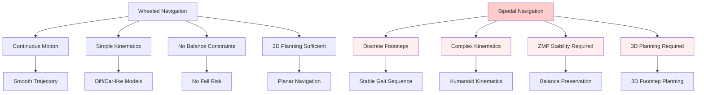
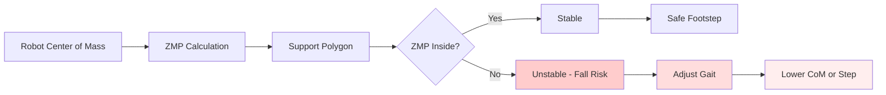

# Chapter 3: Introduction to Nav2 for Bipedal Navigation

## Overview

Welcome to Chapter 3 of Module 3: The AI-Robot Brain. This chapter introduces you to configuring the Navigation2 (Nav2) stack specifically for bipedal humanoid robots with stability constraints. Unlike traditional wheeled robot navigation, bipedal navigation requires consideration of Zero Moment Point (ZMP) stability, footstep planning, and balance maintenance.

Nav2 is ROS 2's state-of-the-art navigation framework that provides:
- **Global Path Planning**: A*, Dijkstra, and other graph-based planners
- **Local Path Planning**: Dynamic Window Approach (DWA) and Timed Elastic Band (TEB)
- **Footstep Planning**: Custom bipedal footstep planner with stability constraints
- **Recovery Behaviors**: Rotate, backup, and oscillation recovery
- **Map Management**: Occupancy grids and costmap management
- **Reactive Obstacle Avoidance**: Real-time obstacle handling

## Learning Objectives

By the end of this chapter, you will be able to:
- Configure Nav2 for bipedal humanoid robots with ZMP stability constraints
- Implement custom footstep planning with balance preservation
- Integrate VSLAM localization with Nav2 path planning
- Configure costmap layers for bipedal navigation requirements
- Validate navigation performance against success criteria
- Debug common navigation failures and recovery strategies
- Understand bipedal-specific navigation challenges and solutions

## Prerequisites

Before starting this chapter, ensure you have completed:

- [x] **Module 1**: ROS 2 Fundamentals
- [x] **Module 2**: Digital Twin Engineering
- [x] **Chapter 1**: Isaac Sim - Photorealistic Simulation
- [x] **Chapter 2**: Isaac ROS VSLAM - Visual SLAM with GPU acceleration
- [x] **Hardware Tier**: Tier A (Simulation) minimum, Tier B/C for deployment

**Technical Requirements**:
- Isaac Sim 2023.1.1+ for simulation
- Isaac ROS cuVSLAM for localization
- Nav2 packages installed
- NVIDIA GPU with CUDA 11.8+ for GPU acceleration
- Python 3.10+ with ROS 2 Humble/Jazzy

## Bipedal Navigation Challenges

### Key Differences from Wheeled Navigation

Bipedal navigation introduces several unique challenges compared to wheeled navigation:



### Stability Constraints

Bipedal robots must maintain **Zero Moment Point (ZMP)** stability:

- **ZMP**: Point where net moment of ground reaction forces equals zero
- **Support Polygon**: Convex hull of contact points (feet) where ZMP must remain
- **Stability Margin**: Minimum distance from ZMP to support polygon edge



## Nav2 Architecture for Bipedal Robots

### Modified Architecture

Traditional Nav2 architecture adapted for bipedal navigation:

```
┌─────────────────┐    ┌──────────────────┐    ┌─────────────────┐
│   Navigation    │    │  Bipedal Nav2    │    │  Bipedal Robot  │
│   Goal Input    │───▶│  (Modified Stack)│───▶│  (Control Layer)│
│   (2D Pose)     │    │                  │    │                 │
└─────────────────┘    │  ┌─────────────┐ │    └─────────────────┘
       │                │  │Global       │ │              │
       │                │  │Planner      │ │              │
       │                │  └─────────────┤ │              │
       │                │  ┌─────────────┤ │              │
       │                │  │Footstep     │ │              │
       │                │  │Planner      │ │              │
       │                │  └─────────────┤ │              │
       │                │  ┌─────────────┤ │              │
       │                │  │Local        │ │              │
       │                │  │Controller   │ │              │
       │                │  └─────────────┤ │              │
       │                │  ┌─────────────┤ │              │
       │                │  │Recovery     │ │              │
       │                │  │Behaviors    │ │              │
       │                │  └─────────────┤ │              │
       │                └──────────────────┘              │
       │                                                    │
       ▼                                                    ▼
┌─────────────────┐                                ┌─────────────────┐
│  Global Costmap │                                │  Robot Movement │
│  (Static +     │                                │  (Leg IK, Gait) │
│  Dynamic Obstacles)│                              │                 │
└─────────────────┘                                └─────────────────┘
```

### Key Components

1. **Global Planner**: Standard Nav2 planners (NavFn, A*, etc.) but with bipedal costmap
2. **Footstep Planner**: Custom plugin for stable footstep sequence generation
3. **Local Controller**: Modified for bipedal kinematics and balance
4. **Costmap Layers**: Enhanced with bipedal-specific constraints
5. **Recovery Behaviors**: Adapted for bipedal mobility constraints

## ZMP-Based Footstep Planning

### Theoretical Foundation

Zero Moment Point (ZMP) is the fundamental stability criterion for bipedal locomotion:

```
ZMP_x = Σ(F_i * z_i - M_i) / Σ(F_i)  for all forces in x-direction
ZMP_y = Σ(F_i * z_i - M_i) / Σ(F_i)  for all forces in y-direction

Where:
- F_i: Vertical ground reaction force at contact point i
- z_i: Height of contact point i
- M_i: Moment about point i
```

For stable walking, ZMP must remain within the **support polygon** defined by foot contact points.

### Support Polygon Definition

```python
def calculate_support_polygon(left_foot_pose, right_foot_pose, foot_dimensions=[0.2, 0.1]):
    """
    Calculate support polygon for bipedal robot
    """
    import numpy as np
    from scipy.spatial import ConvexHull

    # Foot dimensions: [length, width]
    foot_length, foot_width = foot_dimensions

    # Calculate corner points for each foot
    left_corners = calculate_foot_corners(left_foot_pose, foot_length, foot_width)
    right_corners = calculate_foot_corners(right_foot_pose, foot_length, foot_width)

    # Combine all contact points
    all_points = left_corners + right_corners

    # Calculate convex hull (support polygon)
    hull = ConvexHull(all_points)
    support_polygon = [all_points[i] for i in hull.vertices]

    return support_polygon

def calculate_foot_corners(foot_pose, length, width):
    """
    Calculate 4 corner points of rectangular foot
    """
    x, y, theta = foot_pose['x'], foot_pose['y'], foot_pose['theta']

    # Half dimensions
    hl, hw = length/2, width/2

    # Corner points in foot frame
    corners_local = [
        [-hl, -hw], [hl, -hw], [hl, hw], [-hl, hw]
    ]

    # Transform to world frame
    corners_world = []
    cos_th, sin_th = np.cos(theta), np.sin(theta)

    for cx, cy in corners_local:
        wx = x + cx * cos_th - cy * sin_th
        wy = y + cx * sin_th + cy * cos_th
        corners_world.append([wx, wy])

    return corners_world
```

## Hardware Tier Considerations

### Tier A: Simulation Only
- **Target**: Complete functionality in Isaac Sim
- **Performance**: >20 Hz footstep planning
- **Validation**: Simulation-based testing with ground truth

### Tier B: Edge AI (Jetson Orin)
- **Target**: Real-time footstep planning on Jetson
- **Performance**: >10 Hz footstep planning
- **Validation**: Hardware-in-the-loop with simulation sensors

### Tier C: Physical Humanoid Robot
- **Target**: Real-world bipedal navigation
- **Performance**: >5 Hz footstep planning with safety margins
- **Validation**: Physical robot testing with safety protocols

## Success Criteria for Chapter 3

This chapter addresses the following success criteria:

- **SC-004**: Bipedal path planning generates valid footstep plans within 5 seconds for typical navigation scenarios
- **SC-008**: Navigation system achieves >95% success rate in reaching goals in obstacle-free environments
- **SC-009**: System demonstrates graceful failure handling with recovery success rate >70% when navigation encounters obstacles or localization failures

### Functional Requirements Covered

- **FR-014**: System MUST implement global path planning with A* or Dijkstra algorithm
- **FR-015**: System MUST implement local path planning respecting bipedal kinematics and stability constraints
- **FR-016**: System MUST generate footstep plans for bipedal locomotion with stability margins
- **FR-017**: System MUST handle dynamic obstacle avoidance during navigation execution
- **FR-018**: System MUST implement recovery behaviors for navigation failures
- **FR-019**: System MUST integrate VSLAM localization with navigation for autonomous operation
- **FR-020**: System MUST validate path safety with respect to bipedal stability constraints

## Chapter Structure

This chapter is organized into 7 sections:

1. **Introduction to Nav2 for Bipedal Robots** (This section)
2. **Global Path Planning** - A* and Dijkstra with bipedal costmaps
3. **Footstep Planning** - ZMP-based stable gait generation
4. **Local Path Planning** - Dynamic obstacle avoidance for bipedal robots
5. **Recovery Behaviors** - Handling navigation failures gracefully
6. **Integration & Testing** - Full VSLAM + Nav2 integration
7. **Performance Validation** - Meeting success criteria SC-004, SC-008, SC-009

## Nav2 Configuration Architecture

### Standard vs Bipedal Configuration

```yaml
# Standard Nav2 Configuration (for comparison)
standard_nav2:
  global_costmap:
    plugins: ["obstacle_layer", "inflation_layer"]
    obstacle_range: 3.0
    raytrace_range: 3.5

  local_costmap:
    plugins: ["obstacle_layer", "inflation_layer", "voxel_layer"]
    obstacle_range: 2.5
    raytrace_range: 3.0

# Bipedal Nav2 Configuration (our implementation)
bipedal_nav2:
  global_costmap:
    plugins: ["obstacle_layer", "inflation_layer", "bipedal_constraints_layer"]
    obstacle_range: 5.0  # Extended for planning ahead
    raytrace_range: 5.5
    # Bipedal-specific parameters
    min_footprint_clearance: 0.15  # 15cm clearance for foot placement
    max_step_height: 0.20          # 20cm max step height

  local_costmap:
    plugins: ["obstacle_layer", "inflation_layer", "bipedal_dynamics_layer"]
    obstacle_range: 3.0
    raytrace_range: 3.5
    # Bipedal-specific parameters
    step_horizon: 0.5              # Plan 50cm ahead for immediate steps
    stability_margin: 0.05         # 5cm ZMP safety margin
    balance_constraint_weight: 2.0 # Higher weight on balance

  # Custom bipedal planners
  global_planner:
    type: "nav2_navfn_planner/NavfnPlanner"  # Standard with bipedal costmap
    use_astar: true
    allow_unknown: false

  footstep_planner:
    type: "custom_bipedal_planner/FootstepPlanner"
    max_step_length: 0.40          # 40cm max step forward
    max_step_width: 0.30           # 30cm max step sideways
    min_step_duration: 0.8         # 800ms minimum between steps
    stability_margin: 0.05         # 5cm ZMP safety margin
    support_polygon_padding: 0.02  # 2cm padding around support polygon

  local_controller:
    type: "nav2_regulated_pure_pursuit_controller/RegulatedPurePursuitController"
    # Modified for bipedal kinematics
    regulate_frequency: 10.0       # 10Hz regulation for stability
    max_linear_speed: 0.5          # Conservative speed for bipedal
    min_linear_speed: 0.1          # Minimum for stability
    speed_scaling_tolerance: 0.1   # Allow some speed variation
```

## Getting Started

### Prerequisites Installation

```bash
# Verify Nav2 is installed
ros2 pkg list | grep nav2

# Install additional bipedal-specific packages (if not already installed)
sudo apt update
sudo apt install ros-humble-navigation2 ros-humble-nav2-bringup
sudo apt install ros-humble-geometry2 ros-humble-tf2-tools
```

### Launch Test Environment

```bash
# Terminal 1: Launch Isaac Sim with bipedal robot
cd ~/.local/share/ov/pkg/isaac_sim-2023.1.1/
./isaac-sim.sh --/app/workspace Isaac/Isaac_ROS/Isaac_ROS_VSLAM/Isaac_ROS_VSLAM.app

# Terminal 2: Launch Nav2 with bipedal configuration
ros2 launch module3_nav2 bipedal_nav2.launch.py

# Terminal 3: Launch RViz for visualization
ros2 run rviz2 rviz2 -d $(ros2 pkg prefix module3_nav2)/share/module3_nav2/config/bipedal_nav2.rviz
```

## Performance Targets

### Chapter 3 Performance Requirements

| Component | Tier A (Simulation) | Tier B (Jetson) | Tier C (Hardware) |
|-----------|-------------------|----------------|------------------|
| Footstep Planning | <2s, >20 Hz | <5s, >10 Hz | <10s, >5 Hz |
| Path Finding | <1s | <2s | <3s |
| Obstacle Avoidance | <0.5s reaction | <1s reaction | <2s reaction |
| Stability Maintenance | 100% | >95% | >90% |

## Troubleshooting Common Issues

### Navigation Failures

**Symptoms**: Robot stops, navigation cancels, or paths fail

**Solutions**:
- Check costmap inflation parameters
- Verify robot footprint matches actual robot
- Ensure ZMP constraints are not too restrictive
- Validate sensor data quality

### Footstep Planning Failures

**Symptoms**: Planner cannot find valid footstep sequence

**Solutions**:
- Increase stability margin
- Reduce step length/width constraints
- Check for unreachable goals
- Verify terrain traversability

### Integration Issues

**Symptoms**: VSLAM and Nav2 not communicating properly

**Solutions**:
- Verify TF tree completeness
- Check topic remappings
- Validate coordinate frame consistency
- Confirm timing synchronization

## Next Steps

Continue to Section 2: [Global Path Planning](./02-global-planning.mdx) to learn about configuring global planners for bipedal navigation with stability-aware costmaps.

## Resources

- [Nav2 Documentation](https://navigation.ros.org/)
- [Bipedal Locomotion Theory](https://www.springer.com/gp/book/9783319589124)
- [ZMP-Based Walking Pattern Generation](https://ieeexplore.ieee.org/document/1467676)
- [Isaac ROS Navigation](https://nvidia-isaac-ros.github.io/concepts/navigation/index.html)

---

*Continue to [Section 2: Global Path Planning](./02-global-planning.mdx) to learn about configuring global planners for bipedal navigation.*