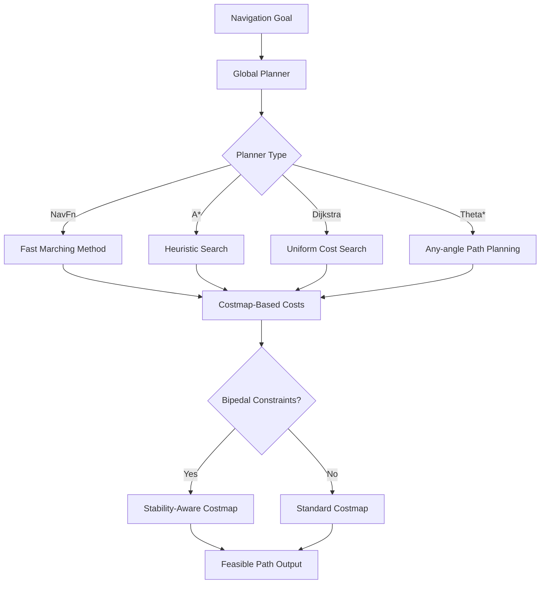

# Chapter 3: Global Path Planning

## Overview

Global path planning computes a high-level path from start to goal that accounts for static obstacles and bipedal-specific constraints. This section covers configuring Nav2's global planners (A*, Dijkstra, etc.) with custom costmaps that incorporate Zero Moment Point (ZMP) stability requirements and bipedal kinematic constraints.

## Learning Objectives

By the end of this section, you will be able to:
- Configure Nav2 global planners (NavFn, A*, Dijkstra) for bipedal navigation
- Create custom costmap layers for bipedal stability constraints
- Implement ZMP-aware path cost functions
- Validate global paths for bipedal feasibility
- Tune global planning parameters for optimal performance
- Integrate global planning with VSLAM localization

## Nav2 Global Planner Architecture

### Standard Global Planners

Nav2 provides several global planners optimized for different scenarios:



### Bipedal-Specific Enhancements

For bipedal navigation, we extend standard planners with:

1. **Stability-Aware Cost Functions**: Incorporate ZMP stability margins
2. **Footstep Feasibility**: Ensure path allows for stable foot placement
3. **Kinematic Constraints**: Account for bipedal reach and step limitations
4. **Dynamic Terrain Costs**: Weight unstable terrain higher

## Costmap Configuration for Bipedal Navigation

### Standard vs Bipedal Costmap Layers

```yaml
# Standard costmap configuration (for comparison)
standard_costmap:
  plugins:
    - {name: obstacles, type: "nav2_costmap_2d::ObstacleLayer"}
    - {name: inflation, type: "nav2_costmap_2d::InflationLayer"}

# Bipedal-enhanced costmap configuration
bipedal_costmap:
  plugins:
    - {name: obstacles, type: "nav2_costmap_2d::ObstacleLayer"}
    - {name: stability_constraints, type: "custom_layers::ZMPConstraintLayer"}
    - {name: footstep_feasibility, type: "custom_layers::FootstepFeasibilityLayer"}
    - {name: inflation, type: "nav2_costmap_2d::InflationLayer"}
    - {name: bipedal_dynamics, type: "custom_layers::BipedalDynamicsLayer"}
```

### Stability Constraint Layer

The stability constraint layer adds costs based on ZMP stability requirements:

```yaml
# Bipedal-specific costmap configuration
bipedal_global_costmap:
  global_frame: map
  robot_base_frame: base_link
  update_frequency: 5.0
  publish_frequency: 2.0
  transform_tolerance: 0.5
  resolution: 0.05  # 5cm resolution for fine-grained planning

  plugins:
    # Standard layers
    - {name: obstacle_layer, type: "nav2_costmap_2d::ObstacleLayer"}
    - {name: static_layer, type: "nav2_costmap_2d::StaticLayer"}

    # Bipedal-specific layers
    - {name: stability_constraint_layer, type: "bipedal_layers/StabilityConstraintLayer"}
    - {name: footstep_feasibility_layer, type: "bipedal_layers/FootstepFeasibilityLayer"}
    - {name: inflation_layer, type: "nav2_costmap_2d::InflationLayer"}
    - {name: bipedal_dynamics_layer, type: "bipedal_layers/BipedalDynamicsLayer"}

  # Bipedal-specific parameters
  stability_constraint_layer:
    enabled: true
    zmp_margin_threshold: 0.05  # 5cm minimum ZMP margin
    support_polygon_padding: 0.02  # 2cm padding around support polygon
    cost_multiplier: 2.0  # Increase cost in unstable areas
    max_unstable_area_cost: 254  # Maximum cost (lethal obstacle)

  footstep_feasibility_layer:
    enabled: true
    foot_size: [0.25, 0.15]  # 25cm x 15cm foot
    min_foot_clearance: 0.05  # 5cm minimum clearance
    max_step_height: 0.15  # 15cm maximum step height
    cost_when_unfeasible: 200  # High cost for unfeasible footstep locations

  inflation_layer:
    enabled: true
    inflation_radius: 0.8  # Larger inflation for bipedal safety
    cost_scaling_factor: 3.0  # More aggressive inflation for bipedal safety
    inflate_unknown: false
    inflate_around_unknown: true

  bipedal_dynamics_layer:
    enabled: true
    max_slope_angle: 15.0  # Maximum traversable slope (degrees)
    max_roughness_height: 0.05  # Maximum surface roughness (m)
    dynamic_cost_multiplier: 1.5  # Additional cost for dynamic obstacles
    stability_priority: 0.8  # Weight of stability vs efficiency (0-1)
```

### Costmap Layer Implementation

```python
# Example custom costmap layer for ZMP constraints
import numpy as np
from nav2_costmap_2d.layers import CostmapLayer
from nav2_costmap_2d import Costmap2D
from geometry_msgs.msg import Point
import math


class ZMPConstraintLayer(CostmapLayer):
    """
    Costmap layer that adds costs based on ZMP stability requirements
    """

    def __init__(self):
        super().__init__()
        self.layer_name = "zmp_constraint_layer"
        self.enabled = True
        self.zmp_margin_threshold = 0.05  # meters
        self.cost_multiplier = 2.0
        self.max_cost = 254  # lethal obstacle

    def onInitialize(self):
        """Initialize the layer"""
        super.onInitialize()
        self.get_logger().info(f"Initialized {self.layer_name} with ZMP constraints")

        # Get parameters
        self.zmp_margin_threshold = self.get_parameter(
            f"{self.layer_name}.zmp_margin_threshold", 0.05
        ).value
        self.cost_multiplier = self.get_parameter(
            f"{self.layer_name}.cost_multiplier", 2.0
        ).value
        self.max_cost = self.get_parameter(
            f"{self.layer_name}.max_unstable_area_cost", 254
        ).value

    def updateBounds(self, robot_x, robot_y, robot_yaw, min_x, min_y, max_x, max_y):
        """
        Update bounds for this layer
        """
        if not self.enabled:
            return

        # Call parent to update bounds
        super.updateBounds(robot_x, robot_y, robot_yaw, min_x, min_y, max_x, max_y)

    def updateCosts(self, master_grid, min_i, min_j, max_i, max_j):
        """
        Update costs in the costmap based on ZMP stability
        """
        if not self.enabled:
            return

        # Get master grid dimensions
        width = master_grid.getSizeInCellsX()
        height = master_grid.getSizeInCellsY()

        for j in range(max(min_j, 0), min(max_j, height)):
            for i in range(max(min_i, 0), min(max_i, width)):
                # Get world coordinates
                world_x, world_y = self.worldToMap(i, j)

                # Calculate ZMP stability at this location
                stability_score = self.calculate_zmp_stability_at_location(world_x, world_y)

                # Convert stability to cost
                if stability_score < self.zmp_margin_threshold:
                    # Unstable area - high cost
                    cost = min(self.max_cost, int((1.0 - stability_score/self.zmp_margin_threshold) * self.max_cost))
                else:
                    # Stable area - low cost
                    cost = 0

                # Apply cost to master grid if higher than current
                current_cost = master_grid.getCost(i, j)
                new_cost = max(current_cost, cost)
                master_grid.setCost(i, j, new_cost)

    def calculate_zmp_stability_at_location(self, x, y):
        """
        Calculate ZMP stability score at a specific location
        Returns value between 0.0 (unstable) and 1.0 (highly stable)
        """
        # This is a simplified example - in real implementation, this would:
        # 1. Analyze terrain roughness at location
        # 2. Check for obstacles that would interfere with foot placement
        # 3. Calculate potential support polygon with nearby obstacles
        # 4. Determine ZMP margin for potential foot placement

        # For this example, we'll use a simple heuristic based on:
        # - Distance to nearest obstacles
        # - Terrain slope (if elevation data available)
        # - Surface roughness

        # Get obstacle information from obstacle layer
        obstacle_cost = self.get_cost_from_obstacle_layer(x, y)

        # Calculate stability based on obstacle proximity
        if obstacle_cost > 200:  # High obstacle cost
            return 0.0  # Highly unstable
        elif obstacle_cost > 100:  # Medium obstacle cost
            return 0.2  # Somewhat unstable
        elif obstacle_cost > 50:  # Low obstacle cost
            return 0.5  # Moderately stable
        else:  # No obstacles nearby
            return 1.0  # Highly stable

    def get_cost_from_obstacle_layer(self, x, y):
        """
        Get obstacle cost at location from obstacle layer
        """
        # In real implementation, this would query the obstacle layer
        # For this example, we'll return a simulated value
        return 0


class FootstepFeasibilityLayer(CostmapLayer):
    """
    Costmap layer that evaluates footstep feasibility
    """

    def __init__(self):
        super().__init__()
        self.layer_name = "footstep_feasibility_layer"
        self.enabled = True
        self.foot_size = [0.25, 0.15]  # [length, width] in meters
        self.min_foot_clearance = 0.05  # meters
        self.max_step_height = 0.15  # meters

    def onInitialize(self):
        """Initialize the layer"""
        super().onInitialize()
        self.get_logger().info(f"Initialized {self.layer_name}")

        # Get parameters
        self.foot_size = self.get_parameter(
            f"{self.layer_name}.foot_size", [0.25, 0.15]
        ).value
        self.min_foot_clearance = self.get_parameter(
            f"{self.layer_name}.min_foot_clearance", 0.05
        ).value
        self.max_step_height = self.get_parameter(
            f"{self.layer_name}.max_step_height", 0.15
        ).value

    def updateCosts(self, master_grid, min_i, min_j, max_i, max_j):
        """
        Update costs based on footstep feasibility
        """
        if not self.enabled:
            return

        width = master_grid.getSizeInCellsX()
        height = master_grid.getSizeInCellsY()

        # Calculate foot dimensions in costmap cells
        foot_cells_x = int(math.ceil(self.foot_size[0] / self.resolution))
        foot_cells_y = int(math.ceil(self.foot_size[1] / self.resolution))

        for j in range(max(min_j, foot_cells_y//2), min(max_j, height - foot_cells_y//2)):
            for i in range(max(min_i, foot_cells_x//2), min(max_i, width - foot_cells_x//2)):
                # Check if this cell can accommodate a foot with required clearance
                can_place_foot = self.can_place_foot_at_cell(i, j, foot_cells_x, foot_cells_y)

                if not can_place_foot:
                    # High cost for unfeasible footstep locations
                    current_cost = master_grid.getCost(i, j)
                    new_cost = max(current_cost, 200)  # Very high cost
                    master_grid.setCost(i, j, new_cost)

    def can_place_foot_at_cell(self, center_i, center_j, foot_cells_x, foot_cells_y):
        """
        Check if a foot can be placed at the given cell with required clearance
        """
        half_foot_x = foot_cells_x // 2
        half_foot_y = foot_cells_y // 2

        # Check all cells that would be covered by the foot
        for dj in range(-half_foot_y, half_foot_y + 1):
            for di in range(-half_foot_x, half_foot_x + 1):
                cell_i = center_i + di
                cell_j = center_j + dj

                # Check if cell is within bounds
                if (cell_i < 0 or cell_i >= self.size_x_ or
                    cell_j < 0 or cell_j >= self.size_y_):
                    return False

                # Check if cell has lethal or inscribed obstacle
                cost = self.getCost(cell_i, cell_j)
                if cost >= 254:  # LETHAL_OBSTACLE
                    return False

        return True
```

## Global Planner Configuration

### NavFn Planner with Bipedal Constraints

```yaml
# Global planner configuration
bt_navigator:
  ros__parameters:
    use_sim_time: False
    global_frame: map
    robot_base_frame: base_link
    odom_topic: /odom
    bt_xml_filename: /opt/ros/humble/share/nav2_bt_navigator/behavior_trees/navigate_w_replanning_and_recovery.xml
    default_server_timeout: 20
    enable_groot_monitoring: True
    groot_zmq_publisher_port: 1666
    groot_zmq_server_port: 1667
    interrupt_on_battery_fraction: 0.25
    battery_topic: /battery_status

    # Recovery behaviors
    recovery_plugins: ["spin", "backup", "wait"]
    spin:
      plugin: "nav2_recoveries/Spin"
    backup:
      plugin: "nav2_recoveries/BackUp"
    wait:
      plugin: "nav2_recoveries/Wait"

    goal_checker_plugins: ["general_goal_checker"]
    general_goal_checker:
      plugin: "nav2_controller::SimpleGoalChecker"
      xy_goal_tolerance: 0.25  # Increased for bipedal stability
      yaw_goal_tolerance: 0.25
      stateful: True

global_planner:
  ros__parameters:
    use_sim_time: False
    planner_plugins: ["GridBased"]
    GridBased:
      plugin: "nav2_navfn_planner/NavfnPlanner"
      tolerance: 0.5  # Increased tolerance for bipedal navigation
      use_astar: true  # Use A* instead of Dijkstra for efficiency
      allow_unknown: false  # Don't plan through unknown areas (safety)

# Bipedal-specific global planner parameters
bipedal_global_planner:
  ros__parameters:
    use_sim_time: False
    planner_plugins: ["BipedalGridPlanner"]
    BipedalGridPlanner:
      plugin: "bipedal_nav2_planners/BipedalGridPlanner"

      # Standard NavFn parameters
      tolerance: 0.5  # meters - allow more tolerance for bipedal
      use_astar: true
      allow_unknown: false

      # Bipedal-specific parameters
      stability_weight: 0.7  # Weight given to stability vs shortest path
      footstep_feasibility_weight: 0.3  # Weight given to footstep feasibility
      max_step_length: 0.4  # Maximum step length in meters
      max_step_width: 0.3   # Maximum lateral step width in meters
      min_stability_margin: 0.05  # Minimum ZMP stability margin (meters)

      # Path smoothing for bipedal gait
      enable_path_smoothing: true
      path_smoothing_weight: 0.1  # Gentle smoothing for stable gaits
      max_deviation_from_original_path: 0.5  # Don't deviate too much

      # Kinematic constraints
      min_turn_radius: 0.3  # Minimum turning radius for bipedal
      max_angular_deviation: 0.5  # Maximum angular change between steps (radians)
```

### Custom Bipedal Global Planner Plugin

```cpp
// Example C++ implementation of bipedal global planner plugin
// bipedal_global_planner.cpp

#include <memory>
#include <vector>
#include <cmath>

#include "bipedal_nav2_planners/bipedal_global_planner.hpp"
#include "nav2_costmap_2d/cost_values.hpp"
#include "nav2_util/node_utils.hpp"
#include "pluginlib/class_list_macros.hpp"

namespace bipedal_nav2_planners
{

BipedalGlobalPlanner::BipedalGlobalPlanner()
{
}

BipedalGlobalPlanner::~BipedalGlobalPlanner()
{
  // Cleanup
}

void BipedalGlobalPlanner::configure(
  const rclcpp_lifecycle::LifecycleNode::SharedPtr & node,
  std::string name, const std::shared_ptr<tf2_ros::Buffer> & tf,
  const std::shared_ptr<nav2_costmap_2d::Costmap2DROS> & costmap_ros)
{
  node_ = node;
  name_ = name;
  tf_ = tf;
  costmap_ = costmap_ros->getCostmap();
  global_frame_ = costmap_ros->getGlobalFrameID();

  // Declare parameters
  node_->declare_parameter(name_ + ".tolerance", rclcpp::ParameterValue(0.5));
  node_->declare_parameter(name_ + ".use_astar", rclcpp::ParameterValue(true));
  node_->declare_parameter(name_ + ".stability_weight", rclcpp::ParameterValue(0.7));
  node_->declare_parameter(name_ + ".footstep_feasibility_weight", rclcpp::ParameterValue(0.3));
  node_->declare_parameter(name_ + ".max_step_length", rclcpp::ParameterValue(0.4));
  node_->declare_parameter(name_ + ".min_stability_margin", rclcpp::ParameterValue(0.05));

  // Get parameters
  tolerance_ = node_->get_parameter(name_ + ".tolerance").as_double();
  use_astar_ = node_->get_parameter(name_ + ".use_astar").as_bool();
  stability_weight_ = node_->get_parameter(name_ + ".stability_weight").as_double();
  footstep_feasibility_weight_ = node_->get_parameter(name_ + ".footstep_feasibility_weight").as_double();
  max_step_length_ = node_->get_parameter(name_ + ".max_step_length").as_double();
  min_stability_margin_ = node_->get_parameter(name_ + ".min_stability_margin").as_double();

  RCLCPP_INFO(
    node_->get_logger(), "Configured bipedal global planner with name: %s", name_.c_str());
}

void BipedalGlobalPlanner::cleanup()
{
  RCLCPP_INFO(
    node_->get_logger(), "Cleaning up bipedal global planner: %s", name_.c_str());
}

void BipedalGlobalPlanner::activate()
{
  RCLCPP_INFO(
    node_->get_logger(), "Activating bipedal global planner: %s", name_.c_str());
}

void BipedalGlobalPlanner::deactivate()
{
  RCLCPP_INFO(
    node_->get_logger(), "Deactivating bipedal global planner: %s", name_.c_str());
}

nav_msgs::msg::Path BipedalGlobalPlanner::createPlan(
  const geometry_msgs::msg::PoseStamped & start,
  const geometry_msgs::msg::PoseStamped & goal)
{
  // Initialize result path
  nav_msgs::msg::Path path;

  // Convert start and goal to costmap coordinates
  double start_x = start.pose.position.x;
  double start_y = start.pose.position.y;
  double goal_x = goal.pose.position.x;
  double goal_y = goal.pose.position.y;

  // Validate start and goal are in costmap bounds
  unsigned int start_index, goal_index;
  if (!worldToMap(start_x, start_y, start_index) || !worldToMap(goal_x, goal_y, goal_index)) {
    RCLCPP_WARN(
      node_->get_logger(),
      "Start or goal is out of bounds - cannot create plan");
    return path;
  }

  // Check if goal is in obstacle space
  unsigned char goal_cost = costmap_->getCost(goal_index);
  if (goal_cost >= nav2_costmap_2d::LETHAL_OBSTACLE) {
    RCLCPP_WARN(
      node_->get_logger(),
      "Goal is in obstacle space - cannot create plan");
    return path;
  }

  // Perform A* path planning with bipedal cost function
  std::vector<unsigned int> plan;

  if (use_astar_) {
    plan = planAStar(start_index, goal_index);
  } else {
    plan = planDijkstra(start_index, goal_index);
  }

  if (plan.empty()) {
    RCLCPP_WARN(
      node_->get_logger(),
      "Could not find a valid plan to goal");
    return path;
  }

  // Convert plan indices back to world coordinates
  path = convertPlanToWorldCoordinates(plan);

  // Apply bipedal-specific path validation and smoothing
  path = validateAndSmoothPath(path);

  // Log path statistics
  double path_length = calculatePathLength(path);
  RCLCPP_INFO(
    node_->get_logger(),
    "Generated bipedal-compatible path with length: %.2f meters, %zu waypoints",
    path_length, path.poses.size());

  return path;
}

double BipedalGlobalPlanner::calculateCost(unsigned int index, unsigned int neighbor_index)
{
  // Calculate cost considering bipedal-specific factors
  double base_cost = getBaseCost(index, neighbor_index);
  double stability_cost = getStabilityCost(index, neighbor_index);
  double footstep_cost = getFootstepFeasibilityCost(index, neighbor_index);

  // Weighted combination of costs
  double total_cost = base_cost +
                     stability_weight_ * stability_cost +
                     footstep_feasibility_weight_ * footstep_cost;

  return total_cost;
}

double BipedalGlobalPlanner::getStabilityCost(unsigned int index, unsigned int neighbor_index)
{
  // Calculate stability cost based on terrain characteristics
  // Higher cost for unstable terrain (sloped, rough, near obstacles)

  double stability_cost = 0.0;

  // Get world coordinates for both cells
  double x1, y1, x2, y2;
  mapToWorld(costmap_->getIndexX(index), costmap_->getIndexY(index), x1, y1);
  mapToWorld(costmap_->getIndexX(neighbor_index), costmap_->getIndexY(neighbor_index), x2, y2);

  // Check terrain slope between cells (simplified)
  double slope_cost = getSlopeCost(x1, y1, x2, y2);
  stability_cost += slope_cost;

  // Check proximity to obstacles that might affect foot placement
  double obstacle_proximity_cost = getObstacleProximityCost(x2, y2);
  stability_cost += obstacle_proximity_cost;

  return stability_cost;
}

double BipedalGlobalPlanner::getFootstepFeasibilityCost(unsigned int index, unsigned int neighbor_index)
{
  // Calculate cost based on footstep feasibility
  // Higher cost for areas that don't allow stable foot placement

  double x2, y2;
  mapToWorld(costmap_->getIndexX(neighbor_index), costmap_->getIndexY(neighbor_index), x2, y2);

  // Check if foot can be placed at destination
  if (!isFootstepFeasible(x2, y2)) {
    return 1000.0;  // Very high cost for infeasible footstep
  }

  // Lower cost for more stable footstep locations
  double stability_margin = getStabilityMargin(x2, y2);
  if (stability_margin < min_stability_margin_) {
    return (min_stability_margin_ - stability_margin) * 5000.0;  // Penalty for insufficient margin
  }

  return 0.0;  // Low cost for feasible footstep
}

bool BipedalGlobalPlanner::isFootstepFeasible(double x, double y)
{
  // Check if a footstep can be placed at (x, y) with required clearance
  unsigned int cell_x, cell_y;
  if (!worldToMap(x, y, cell_x, cell_y)) {
    return false;  // Outside costmap bounds
  }

  unsigned char cost = costmap_->getCost(cell_x, cell_y);

  // Check if cell is traversable
  if (cost >= nav2_costmap_2d::INSCRIBED_INFLATED_OBSTACLE) {
    return false;
  }

  // Additional checks for bipedal-specific constraints
  // (slope, surface roughness, etc.) would go here

  return true;
}

nav_msgs::msg::Path BipedalGlobalPlanner::validateAndSmoothPath(const nav_msgs::msg::Path & raw_path)
{
  // Validate and smooth the raw path for bipedal feasibility
  nav_msgs::msg::Path smoothed_path;

  if (raw_path.poses.empty()) {
    return smoothed_path;
  }

  // Copy header
  smoothed_path.header = raw_path.header;

  // Add start point
  smoothed_path.poses.push_back(raw_path.poses[0]);

  // Validate path segments for bipedal feasibility
  for (size_t i = 1; i < raw_path.poses.size(); ++i) {
    geometry_msgs::msg::PoseStamped current_pose = raw_path.poses[i];
    geometry_msgs::msg::PoseStamped previous_pose = smoothed_path.poses.back();

    // Check if step is feasible for bipedal robot
    double step_distance = sqrt(
      pow(current_pose.pose.position.x - previous_pose.pose.position.x, 2) +
      pow(current_pose.pose.position.y - previous_pose.pose.position.y, 2)
    );

    if (step_distance <= max_step_length_) {
      // Step is feasible, add to path
      smoothed_path.poses.push_back(current_pose);
    } else {
      // Step is too long, need to interpolate intermediate steps
      // (This would be handled by the footstep planner later)
      // For now, just add the point but log the issue
      RCLCPP_WARN_THROTTLE(
        node_->get_logger(),
        *node_->get_clock(), 1000,
        "Long step detected in global plan: %.2fm > max %.2fm",
        step_distance, max_step_length_);
      smoothed_path.poses.push_back(current_pose);
    }
  }

  // Apply gentle smoothing to reduce sharp turns
  if (smoothed_path.poses.size() > 2) {
    smoothed_path = applyPathSmoothing(smoothed_path);
  }

  return smoothed_path;
}

}  // namespace bipedal_nav2_planners

// Register this plugin
PLUGINLIB_EXPORT_CLASS(
  bipedal_nav2_planners::BipedalGlobalPlanner,
  nav2_core::GlobalPlanner)
```

## Path Validation and Optimization

### Bipedal Path Validation

```python
class BipedalPathValidator:
    """
    Validate paths for bipedal feasibility
    """

    def __init__(self, max_step_length=0.4, max_step_width=0.3, min_stability_margin=0.05):
        self.max_step_length = max_step_length
        self.max_step_width = max_step_width
        self.min_stability_margin = min_stability_margin

    def validate_path(self, path, costmap):
        """
        Validate that a path is feasible for bipedal navigation
        """
        validation_result = {
            'is_valid': True,
            'violations': [],
            'suggestions': [],
            'metrics': {}
        }

        if len(path.poses) < 2:
            validation_result['is_valid'] = False
            validation_result['violations'].append("Path must have at least 2 waypoints")
            return validation_result

        # Check step feasibility
        for i in range(1, len(path.poses)):
            current_pose = path.poses[i]
            previous_pose = path.poses[i-1]

            # Calculate step distance
            step_distance = self.calculate_2d_distance(current_pose.pose.position, previous_pose.pose.position)

            if step_distance > self.max_step_length:
                validation_result['is_valid'] = False
                validation_result['violations'].append(
                    f"Step {i} too long: {step_distance:.2f}m > {self.max_step_length:.2f}m"
                )

            # Check for obstacles in path
            path_clear = self.check_path_clearance(previous_pose.pose.position, current_pose.pose.position, costmap)
            if not path_clear:
                validation_result['is_valid'] = False
                validation_result['violations'].append(f"Path segment {i} intersects obstacles")

        # Calculate path metrics
        validation_result['metrics'] = self.calculate_path_metrics(path)

        # Generate suggestions if invalid
        if not validation_result['is_valid']:
            validation_result['suggestions'] = self.generate_suggestions(validation_result['violations'])

        return validation_result

    def calculate_2d_distance(self, pos1, pos2):
        """Calculate 2D Euclidean distance between two positions"""
        return math.sqrt((pos2.x - pos1.x)**2 + (pos2.y - pos1.y)**2)

    def check_path_clearance(self, start_pos, end_pos, costmap):
        """
        Check if path segment has sufficient clearance for bipedal navigation
        """
        # Sample points along the path segment
        num_samples = max(10, int(self.calculate_2d_distance(start_pos, end_pos) / 0.1))  # Sample every 10cm

        for i in range(num_samples + 1):
            t = i / num_samples if num_samples > 0 else 0
            sample_x = start_pos.x + t * (end_pos.x - start_pos.x)
            sample_y = start_pos.y + t * (end_pos.y - start_pos.y)

            # Convert to costmap coordinates
            map_x, map_y = self.world_to_map_coordinates(sample_x, sample_y, costmap)

            if 0 <= map_x < costmap.size_x and 0 <= map_y < costmap.size_y:
                # Check cost at this location
                cost_index = map_y * costmap.size_x + map_x
                cost = costmap.get_cost(cost_index)

                # Check if location is traversable for bipedal
                if cost >= 200:  # High cost area
                    return False
            else:
                # Outside costmap bounds
                return False

        return True

    def calculate_path_metrics(self, path):
        """
        Calculate metrics for path evaluation
        """
        if len(path.poses) < 2:
            return {}

        total_length = 0.0
        turn_angles = []

        for i in range(1, len(path.poses)):
            current_pose = path.poses[i]
            previous_pose = path.poses[i-1]

            # Calculate segment length
            segment_length = self.calculate_2d_distance(current_pose.pose.position, previous_pose.pose.position)
            total_length += segment_length

            # Calculate turn angle if we have enough points
            if i >= 2:
                prev_previous_pose = path.poses[i-2]
                turn_angle = self.calculate_turn_angle(prev_previous_pose, previous_pose, current_pose)
                turn_angles.append(turn_angle)

        avg_turn_angle = np.mean(turn_angles) if turn_angles else 0.0
        max_turn_angle = np.max(turn_angles) if turn_angles else 0.0

        return {
            'total_length': total_length,
            'num_waypoints': len(path.poses),
            'avg_step_length': total_length / max(1, len(path.poses) - 1),
            'avg_turn_angle_rad': avg_turn_angle,
            'max_turn_angle_rad': max_turn_angle,
            'avg_turn_angle_deg': math.degrees(avg_turn_angle),
            'max_turn_angle_deg': math.degrees(max_turn_angle)
        }

    def calculate_turn_angle(self, p1, p2, p3):
        """
        Calculate turn angle at point p2 between segments p1-p2 and p2-p3
        """
        # Vector from p1 to p2
        v1 = np.array([p2.pose.position.x - p1.pose.position.x,
                      p2.pose.position.y - p1.pose.position.y])

        # Vector from p2 to p3
        v2 = np.array([p3.pose.position.x - p2.pose.position.x,
                      p3.pose.position.y - p2.pose.position.y])

        # Calculate angle between vectors
        cos_angle = np.dot(v1, v2) / (np.linalg.norm(v1) * np.linalg.norm(v2))
        cos_angle = np.clip(cos_angle, -1.0, 1.0)  # Clamp to avoid numerical errors

        return np.arccos(abs(cos_angle))  # Return absolute turn angle

    def generate_suggestions(self, violations):
        """
        Generate suggestions for fixing path violations
        """
        suggestions = []

        for violation in violations:
            if "step" in violation.lower() and "too long" in violation.lower():
                suggestions.append("Consider using a footstep planner to generate intermediate steps")
            elif "obstacle" in violation.lower():
                suggestions.append("Try increasing inflation radius in costmap configuration")
            elif "turn" in violation.lower():
                suggestions.append("Consider path smoothing to reduce sharp turns")

        return suggestions
```

## Practical Exercise: Global Planning with Stability Constraints

### Exercise 1: Configure Global Planner for Warehouse Navigation

```python
#!/usr/bin/env python3
"""
Exercise 1: Global Planning with Stability Constraints
Chapter 3: Global Path Planning
"""

import rclpy
from rclpy.node import Node
from geometry_msgs.msg import PoseStamped
from nav_msgs.msg import Path
from visualization_msgs.msg import Marker, MarkerArray
from std_msgs.msg import ColorRGBA
import numpy as np
import yaml


class GlobalPlanningExerciseNode(Node):
    """
    Exercise node to demonstrate global planning with bipedal constraints
    """

    def __init__(self):
        super().__init__('global_planning_exercise')

        # Parameters for bipedal navigation
        self.declare_parameter('max_step_length', 0.4)
        self.declare_parameter('min_stability_margin', 0.05)
        self.declare_parameter('path_smoothing_weight', 0.1)

        self.max_step_length = self.get_parameter('max_step_length').value
        self.min_stability_margin = self.get_parameter('min_stability_margin').value
        self.path_smoothing_weight = self.get_parameter('path_smoothing_weight').value

        # Publishers
        self.global_plan_pub = self.create_publisher(
            Path,
            '/global_plan',
            10
        )

        self.visualization_pub = self.create_publisher(
            MarkerArray,
            '/global_plan_visualization',
            10
        )

        # Subscribers
        self.goal_sub = self.create_subscription(
            PoseStamped,
            '/goal_pose',
            self.goal_callback,
            10
        )

        self.get_logger().info('Global Planning Exercise node initialized')

        # Path validation
        self.path_validator = BipedalPathValidator(
            max_step_length=self.max_step_length,
            min_stability_margin=self.min_stability_margin
        )

    def goal_callback(self, goal_msg):
        """
        Handle goal pose and plan global path
        """
        self.get_logger().info(f'Received goal: ({goal_msg.pose.position.x:.2f}, {goal_msg.pose.position.y:.2f})')

        # In real implementation, this would call the global planner
        # For this exercise, we'll simulate planning with validation
        simulated_path = self.simulate_global_plan(goal_msg)

        # Validate the planned path
        validation_result = self.path_validator.validate_path(simulated_path, self.get_costmap())

        if validation_result['is_valid']:
            self.get_logger().info('✅ Global path is valid for bipedal navigation')

            # Publish the valid path
            self.global_plan_pub.publish(simulated_path)

            # Publish visualization
            self.publish_path_visualization(simulated_path)

            # Log metrics
            metrics = validation_result['metrics']
            self.get_logger().info(
                f'Path metrics - Length: {metrics["total_length"]:.2f}m, '
                f'Waypoints: {metrics["num_waypoints"]}, '
                f'Avg step: {metrics["avg_step_length"]:.2f}m'
            )
        else:
            self.get_logger().error('❌ Global path validation failed')
            for violation in validation_result['violations']:
                self.get_logger().error(f'  - {violation}')

            # Try to suggest corrections
            for suggestion in validation_result['suggestions']:
                self.get_logger().info(f'  💡 {suggestion}')

    def simulate_global_plan(self, goal_msg):
        """
        Simulate global planning (in real implementation, this would call Nav2 planner)
        """
        # For this exercise, create a simple path from current position to goal
        # In real implementation, this would use Nav2's global planner

        # Assume current position is origin for simplicity
        current_pos = [0.0, 0.0, 0.0]  # [x, y, z]
        goal_pos = [
            goal_msg.pose.position.x,
            goal_msg.pose.position.y,
            goal_msg.pose.position.z
        ]

        # Create a straight-line path with intermediate waypoints
        path = Path()
        path.header.stamp = self.get_clock().now().to_msg()
        path.header.frame_id = 'map'

        # Calculate number of waypoints based on distance and max step length
        distance = np.linalg.norm(np.array(goal_pos[:2]) - np.array(current_pos[:2]))
        num_waypoints = max(2, int(distance / (self.max_step_length * 0.8)))  # 80% of max for safety

        for i in range(num_waypoints + 1):
            t = i / num_waypoints if num_waypoints > 0 else 0

            # Interpolate position
            interp_pos = [
                current_pos[0] + t * (goal_pos[0] - current_pos[0]),
                current_pos[1] + t * (goal_pos[1] - current_pos[1]),
                current_pos[2] + t * (goal_pos[2] - current_pos[2])
            ]

            # Create pose
            pose_stamped = PoseStamped()
            pose_stamped.header.stamp = self.get_clock().now().to_msg()
            pose_stamped.header.frame_id = 'map'

            pose_stamped.pose.position.x = float(interp_pos[0])
            pose_stamped.pose.position.y = float(interp_pos[1])
            pose_stamped.pose.position.z = float(interp_pos[2])

            # Simple orientation pointing toward goal
            dx = goal_pos[0] - current_pos[0]
            dy = goal_pos[1] - current_pos[1]
            yaw = np.arctan2(dy, dx)

            # Convert yaw to quaternion
            cy = np.cos(yaw * 0.5)
            sy = np.sin(yaw * 0.5)
            pose_stamped.pose.orientation.w = float(cy)
            pose_stamped.pose.orientation.x = 0.0
            pose_stamped.pose.orientation.y = 0.0
            pose_stamped.pose.orientation.z = float(sy)

            path.poses.append(pose_stamped)

        return path

    def get_costmap(self):
        """
        Get current costmap (simulated for this exercise)
        """
        # In real implementation, this would get the actual costmap
        # For this exercise, return a mock costmap object
        class MockCostmap:
            def __init__(self):
                self.size_x = 1000  # cells
                self.size_y = 1000  # cells
                self.resolution = 0.05  # meters per cell
                self.origin_x = -25.0  # meters
                self.origin_y = -25.0  # meters

            def get_cost(self, index):
                # Return a simulated cost (0-254)
                # In real implementation, this would query the actual costmap
                return np.random.randint(0, 50)  # Mostly free space with some cost

        return MockCostmap()

    def publish_path_visualization(self, path):
        """
        Publish path visualization markers
        """
        marker_array = MarkerArray()

        # Create line strip for path
        path_marker = Marker()
        path_marker.header = path.header
        path_marker.ns = 'global_path'
        path_marker.id = 0
        path_marker.type = Marker.LINE_STRIP
        path_marker.action = Marker.ADD

        # Add points to path
        for pose_stamped in path.poses:
            point = path_marker.points.add()
            point.x = pose_stamped.pose.position.x
            point.y = pose_stamped.pose.position.y
            point.z = pose_stamped.pose.position.z

        path_marker.scale.x = 0.05  # Line width
        path_marker.color.r = 0.0
        path_marker.color.g = 0.0
        path_marker.color.b = 1.0  # Blue path
        path_marker.color.a = 0.8

        marker_array.markers.append(path_marker)

        # Add waypoints as spheres
        for i, pose_stamped in enumerate(path.poses):
            waypoint_marker = Marker()
            waypoint_marker.header = path.header
            waypoint_marker.ns = 'waypoints'
            waypoint_marker.id = i + 1
            waypoint_marker.type = Marker.SPHERE
            waypoint_marker.action = Marker.ADD

            waypoint_marker.pose = pose_stamped.pose
            waypoint_marker.scale.x = 0.1
            waypoint_marker.scale.y = 0.1
            waypoint_marker.scale.z = 0.1

            waypoint_marker.color.r = 1.0  # Red waypoints
            waypoint_marker.color.g = 0.0
            waypoint_marker.color.b = 0.0
            waypoint_marker.color.a = 0.8

            marker_array.markers.append(waypoint_marker)

        self.visualization_pub.publish(marker_array)


def main(args=None):
    rclpy.init(args=args)
    exercise_node = GlobalPlanningExerciseNode()

    try:
        rclpy.spin(exercise_node)
    except KeyboardInterrupt:
        exercise_node.get_logger().info('Shutting down Global Planning Exercise node...')
    finally:
        exercise_node.destroy_node()
        rclpy.shutdown()


if __name__ == '__main__':
    main()