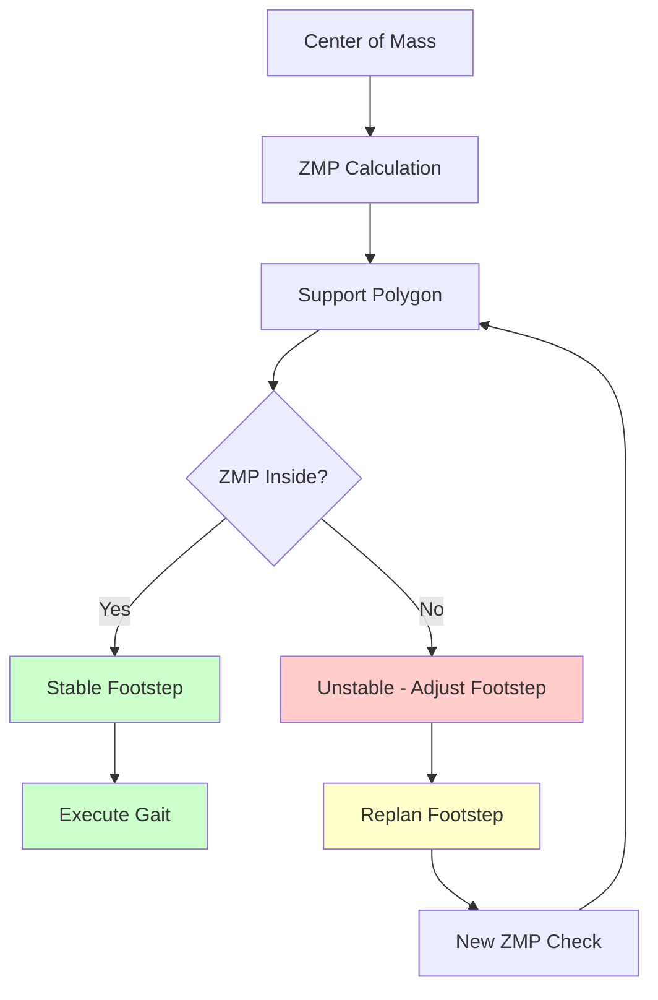

# Chapter 3: Footstep Planning

## Overview

Footstep planning is the cornerstone of bipedal navigation, determining where and when each foot should be placed to maintain stability during locomotion. This section covers ZMP (Zero Moment Point)-based footstep planning with stability constraints, implementing custom footstep planners that ensure the robot maintains balance while navigating complex environments.

Unlike wheeled robots that can follow continuous trajectories, bipedal robots must plan discrete footsteps that respect Zero Moment Point (ZMP) stability requirements and kinematic constraints.

## Learning Objectives

By the end of this section, you will be able to:
- Implement ZMP-based footstep planning algorithms
- Calculate support polygons and stability margins
- Generate stable gait patterns for navigation
- Integrate footstep planning with global path planning
- Validate footstep plans for bipedal feasibility
- Handle dynamic obstacle avoidance with footstep replanning
- Optimize footstep plans for energy efficiency

## Bipedal Locomotion Fundamentals

### Zero Moment Point (ZMP) Theory

The Zero Moment Point (ZMP) is the fundamental stability criterion for bipedal locomotion:



The ZMP is calculated as:
```
ZMP_x = (Σ(Mi_z + Fi_x * zi)) / (ΣFi_z)
ZMP_y = (Σ(-Mi_y + Fi_y * zi)) / (ΣFi_z)

Where:
- Mi: Moments at contact point i
- Fi: Forces at contact point i
- zi: Height of contact point i
```

For stable walking, the ZMP must remain within the **support polygon** formed by the feet's contact points.

### Support Polygon Calculation

```python
import numpy as np
from scipy.spatial import ConvexHull, distance
import math


class SupportPolygonCalculator:
    """
    Calculate support polygons for bipedal stability analysis
    """

    def __init__(self, foot_length=0.25, foot_width=0.15, padding=0.02):
        self.foot_length = foot_length  # meters
        self.foot_width = foot_width    # meters
        self.padding = padding          # meters padding around feet

    def calculate_support_polygon(self, left_foot_pose, right_foot_pose):
        """
        Calculate support polygon from left and right foot poses

        Args:
            left_foot_pose: dict with 'position' [x, y, z] and 'orientation' [w, x, y, z] (quaternion)
            right_foot_pose: dict with same format as left_foot_pose

        Returns:
            support_polygon: list of [x, y] points forming the support polygon
        """
        # Calculate foot corner points
        left_corners = self.calculate_foot_corners(left_foot_pose)
        right_corners = self.calculate_foot_corners(right_foot_pose)

        # Combine all contact points
        all_contact_points = left_corners + right_corners

        # Calculate convex hull to get support polygon
        if len(all_contact_points) >= 3:
            points_array = np.array(all_contact_points)
            hull = ConvexHull(points_array)
            support_polygon = [all_contact_points[i] for i in hull.vertices]
        else:
            # If we have fewer than 3 points, use the points directly
            support_polygon = all_contact_points

        # Apply padding to shrink support polygon inward
        padded_polygon = self.apply_polygon_padding(support_polygon, self.padding)

        return padded_polygon

    def calculate_foot_corners(self, foot_pose):
        """
        Calculate 4 corner points of rectangular foot in world coordinates
        """
        pos = foot_pose['position']  # [x, y, z]
        quat = foot_pose['orientation']  # [w, x, y, z] quaternion

        # Foot dimensions (half)
        hl = self.foot_length / 2.0
        hw = self.foot_width / 2.0

        # Corner points in foot frame
        corners_local = np.array([
            [-hl, -hw, 0], [hl, -hw, 0], [hl, hw, 0], [-hl, hw, 0]
        ])

        # Convert quaternion to rotation matrix
        R = self.quaternion_to_rotation_matrix(quat)

        # Transform corners to world frame
        corners_world = []
        for corner_local in corners_local:
            corner_world = R @ corner_local + pos
            corners_world.append(corner_world[:2].tolist())  # Only x, y

        return corners_world

    def quaternion_to_rotation_matrix(self, quat):
        """
        Convert quaternion [w, x, y, z] to 3x3 rotation matrix
        """
        w, x, y, z = quat

        R = np.array([
            [1 - 2*(y*y + z*z), 2*(x*y - w*z), 2*(x*z + w*y)],
            [2*(x*y + w*z), 1 - 2*(x*x + z*z), 2*(y*z - w*x)],
            [2*(x*z - w*y), 2*(y*z + w*x), 1 - 2*(x*x + y*y)]
        ])

        return R

    def apply_polygon_padding(self, polygon, padding):
        """
        Apply inward padding to polygon to create safety margin
        """
        if len(polygon) < 3:
            return polygon

        # Convert to numpy array
        poly_array = np.array(polygon)

        # Calculate centroid
        centroid = np.mean(poly_array, axis=0)

        # Move each vertex toward centroid by padding distance
        padded_poly = []
        for vertex in poly_array:
            direction = centroid - vertex
            unit_direction = direction / np.linalg.norm(direction)
            padded_vertex = vertex + unit_direction * padding
            padded_poly.append(padded_vertex.tolist())

        return padded_poly

    def is_zmp_stable(self, zmp_position, support_polygon, margin=0.02):
        """
        Check if ZMP is within support polygon with margin

        Args:
            zmp_position: [x, y] ZMP position
            support_polygon: list of [x, y] points forming support polygon
            margin: minimum distance from polygon edge (meters)

        Returns:
            is_stable: True if ZMP is stable, False otherwise
            distance_to_boundary: distance from ZMP to polygon boundary
        """
        zmp_point = np.array(zmp_position)

        # Calculate distance from ZMP to polygon boundary
        min_distance = float('inf')

        for i in range(len(support_polygon)):
            p1 = np.array(support_polygon[i])
            p2 = np.array(support_polygon[(i + 1) % len(support_polygon)])

            # Calculate distance from point to line segment
            dist = self.point_to_line_segment_distance(zmp_point, p1, p2)
            min_distance = min(min_distance, dist)

        is_stable = min_distance >= margin
        return is_stable, min_distance

    def point_to_line_segment_distance(self, point, line_start, line_end):
        """
        Calculate distance from point to line segment
        """
        # Vector from line_start to line_end
        line_vec = line_end - line_start
        point_vec = point - line_start
        line_len = np.linalg.norm(line_vec)
        line_unitvec = line_vec / line_len
        point_vec_scaled = point_vec / line_len

        t = np.dot(line_unitvec, point_vec_scaled)
        t = max(0, min(1, t))  # Clamp to [0, 1] for line segment

        nearest = line_len * t * line_unitvec + line_start
        dist = np.linalg.norm(point - nearest)

        return dist


class ZMPStabilityAnalyzer:
    """
    Analyze ZMP stability for bipedal locomotion
    """

    def __init__(self, robot_mass=50.0, gravity=9.81):
        self.robot_mass = robot_mass  # kg
        self.gravity = gravity        # m/s^2
        self.weight = robot_mass * gravity  # Newtons

    def calculate_zmp(self, com_position, com_acceleration, angular_momentum_rate):
        """
        Calculate ZMP from center of mass information

        Args:
            com_position: [x, y, z] center of mass position
            com_acceleration: [x, y, z] center of mass acceleration
            angular_momentum_rate: [x, y, z] rate of change of angular momentum

        Returns:
            zmp_position: [x, y] ZMP position
        """
        # ZMP calculation: ZMP = (COM_x - (COM_z * COM_acc_x) / g, COM_y - (COM_z * COM_acc_y) / g)
        # Simplified version ignoring angular momentum for basic analysis
        zmp_x = com_position[0] - (com_position[2] * com_acceleration[0]) / self.gravity
        zmp_y = com_position[1] - (com_position[2] * com_acceleration[1]) / self.gravity

        return [zmp_x, zmp_y]

    def calculate_com_trajectory(self, footstep_sequence, gait_params):
        """
        Calculate CoM trajectory from footstep sequence using inverted pendulum model

        Args:
            footstep_sequence: list of footstep dictionaries
            gait_params: gait parameters (step_time, etc.)

        Returns:
            com_trajectory: list of CoM positions over time
        """
        # This is a simplified model - in reality, more complex dynamics would be used
        com_trajectory = []

        # Use preview control or other advanced methods for realistic CoM trajectory
        # For this example, we'll use a simplified approach

        for i, footstep in enumerate(footstep_sequence):
            # Calculate CoM position based on support foot and desired ZMP
            if i == 0:
                # Initial CoM position
                com_pos = [footstep['position'][0], footstep['position'][1], 0.8]  # 80cm height
            else:
                # Move CoM toward next support configuration
                prev_com = com_trajectory[-1]
                target_x = (footstep['position'][0] + footstep_sequence[i-1]['position'][0]) / 2.0
                target_y = (footstep['position'][1] + footstep_sequence[i-1]['position'][1]) / 2.0

                # Smooth transition toward target
                alpha = 0.1  # Smoothing factor
                new_x = prev_com[0] + alpha * (target_x - prev_com[0])
                new_y = prev_com[1] + alpha * (target_y - prev_com[1])
                new_z = 0.8  # Maintain height

                com_pos = [new_x, new_y, new_z]

            com_trajectory.append(com_pos)

        return com_trajectory

    def validate_footstep_sequence(self, footstep_sequence, stability_margin=0.05):
        """
        Validate entire footstep sequence for stability

        Args:
            footstep_sequence: list of footstep dictionaries
            stability_margin: minimum ZMP stability margin (meters)

        Returns:
            is_valid: True if sequence is stable
            stability_analysis: detailed analysis for each step
        """
        analyzer = SupportPolygonCalculator()
        stability_analysis = []

        for i, footstep in enumerate(footstep_sequence):
            # Calculate support polygon for current dual support phase
            if i == 0:
                # Initial stance - both feet in starting position
                left_pose = footstep_sequence[0] if footstep_sequence[0]['foot'] == 'left' else {'position': [0, 0, 0], 'orientation': [1, 0, 0, 0]}
                right_pose = footstep_sequence[1] if len(footstep_sequence) > 1 and footstep_sequence[1]['foot'] == 'right' else {'position': [0, -0.2, 0], 'orientation': [1, 0, 0, 0]}
            else:
                # Determine current support polygon based on gait phase
                # This is simplified - real implementation would consider gait timing
                left_pose = None
                right_pose = None

                # Find current support feet
                for j in range(max(0, i-2), i+1):  # Look at recent steps
                    if j < len(footstep_sequence):
                        if footstep_sequence[j]['foot'] == 'left':
                            left_pose = footstep_sequence[j]
                        elif footstep_sequence[j]['foot'] == 'right':
                            right_pose = footstep_sequence[j]

                # Default if not found
                if left_pose is None:
                    left_pose = {'position': [0, 0.1, 0], 'orientation': [1, 0, 0, 0]}
                if right_pose is None:
                    right_pose = {'position': [0, -0.1, 0], 'orientation': [1, 0, 0, 0]}

            # Calculate support polygon
            support_poly = analyzer.calculate_support_polygon(left_pose, right_pose)

            # Calculate expected ZMP (simplified - would use actual CoM trajectory in real implementation)
            zmp_pos = [(left_pose['position'][0] + right_pose['position'][0]) / 2.0,
                      (left_pose['position'][1] + right_pose['position'][1]) / 2.0]

            # Check stability
            is_stable, boundary_dist = analyzer.is_zmp_stable(zmp_pos, support_poly, stability_margin)

            step_analysis = {
                'step_index': i,
                'footstep': footstep,
                'support_polygon': support_poly,
                'zmp_position': zmp_pos,
                'is_stable': is_stable,
                'boundary_distance': boundary_dist,
                'stability_margin': stability_margin
            }

            stability_analysis.append(step_analysis)

        # Overall validity
        all_stable = all(step['is_stable'] for step in stability_analysis)
        return all_stable, stability_analysis
```

## Footstep Planner Implementation

### Custom Footstep Planner Plugin

```python
#!/usr/bin/env python3
"""
Custom Footstep Planner for Bipedal Navigation
Chapter 3: Isaac ROS Nav2 - Footstep Planning
"""

import rclpy
from rclpy.node import Node
from geometry_msgs.msg import PoseStamped, Point
from nav_msgs.msg import Path
from visualization_msgs.msg import Marker, MarkerArray
from std_msgs.msg import ColorRGBA
from builtin_interfaces.msg import Duration
import numpy as np
import math
from scipy.spatial import distance
from scipy.interpolate import interp1d


class BipedalFootstepPlanner(Node):
    """
    Custom footstep planner implementing ZMP-based stability constraints
    """

    def __init__(self):
        super().__init__('bipedal_footstep_planner')

        # Initialize parameters
        self.declare_parameter('max_step_length', 0.4)      # meters
        self.declare_parameter('max_step_width', 0.3)       # meters
        self.declare_parameter('min_step_duration', 0.8)    # seconds
        self.declare_parameter('stability_margin', 0.05)    # meters
        self.declare_parameter('foot_size', [0.25, 0.15])   # [length, width] meters
        self.declare_parameter('step_height', 0.05)         # meters (step over obstacles)

        self.max_step_length = self.get_parameter('max_step_length').value
        self.max_step_width = self.get_parameter('max_step_width').value
        self.min_step_duration = self.get_parameter('min_step_duration').value
        self.stability_margin = self.get_parameter('stability_margin').value
        self.foot_size = self.get_parameter('foot_size').value
        self.step_height = self.get_parameter('step_height').value

        # Initialize stability calculator
        self.stability_calculator = SupportPolygonCalculator(
            foot_length=self.foot_size[0],
            foot_width=self.foot_size[1]
        )

        # Publishers
        self.footstep_plan_pub = self.create_publisher(
            Path,
            '/bipedal_footstep_plan',
            10
        )

        self.visualization_pub = self.create_publisher(
            MarkerArray,
            '/bipedal_footstep_visualization',
            10
        )

        # Subscribers
        self.global_path_sub = self.create_subscription(
            Path,
            '/global_plan',
            self.global_path_callback,
            10
        )

        self.robot_pose_sub = self.create_subscription(
            PoseStamped,
            '/robot_pose',
            self.robot_pose_callback,
            10
        )

        # Internal state
        self.current_robot_pose = None
        self.global_path = None
        self.footstep_sequence = []

        self.get_logger().info('Bipedal Footstep Planner initialized')

    def robot_pose_callback(self, msg):
        """Update current robot pose"""
        self.current_robot_pose = msg

    def global_path_callback(self, path_msg):
        """Process global path and generate footstep plan"""
        self.get_logger().info(f'Received global path with {len(path_msg.poses)} waypoints')

        if self.current_robot_pose is None:
            self.get_logger().warn('Cannot plan footsteps without current robot pose')
            return

        # Generate footstep plan from global path
        footstep_plan = self.generate_footstep_plan(path_msg, self.current_robot_pose)

        if footstep_plan:
            # Publish the footstep plan
            self.footstep_plan_pub.publish(footstep_plan)

            # Publish visualization
            self.publish_footstep_visualization(footstep_plan)

            # Log statistics
            self.log_footstep_statistics(footstep_plan)

    def generate_footstep_plan(self, global_path, current_pose):
        """
        Generate footstep plan from global path
        """
        if len(global_path.poses) < 2:
            self.get_logger().warn('Global path too short for footstep planning')
            return None

        # Initialize footstep sequence
        footstep_sequence = []

        # Start with current robot position
        start_pos = [
            current_pose.pose.position.x,
            current_pose.pose.position.y,
            current_pose.pose.position.z
        ]

        # Determine initial stance foot (alternate starting with left)
        current_support_foot = 'left'
        current_support_pos = [start_pos[0], start_pos[1] + 0.1, start_pos[2]]  # Offset for stance width
        other_foot_pos = [start_pos[0], start_pos[1] - 0.1, start_pos[2]]

        # Add initial stance
        footstep_sequence.append({
            'foot': 'left',
            'position': current_support_pos.copy(),
            'orientation': [1.0, 0.0, 0.0, 0.0],  # Identity quaternion
            'timestamp': self.get_clock().now().nanoseconds / 1e9,
            'duration': 0.0,
            'is_support': True
        })

        footstep_sequence.append({
            'foot': 'right',
            'position': other_foot_pos.copy(),
            'orientation': [1.0, 0.0, 0.0, 0.0],
            'timestamp': self.get_clock().now().nanoseconds / 1e9,
            'duration': 0.0,
            'is_support': True
        })

        # Follow the global path with alternating footsteps
        path_index = 0
        current_pos = start_pos.copy()

        while path_index < len(global_path.poses):
            # Get next target position from global path
            target_pos = [
                global_path.poses[path_index].pose.position.x,
                global_path.poses[path_index].pose.position.y,
                global_path.poses[path_index].pose.position.z
            ]

            # Calculate direction to target
            direction = np.array(target_pos[:2]) - np.array(current_pos[:2])
            direction_norm = np.linalg.norm(direction)

            if direction_norm > 0.05:  # Only step if target is far enough
                # Normalize direction
                direction_unit = direction / direction_norm

                # Calculate next footstep position
                next_step_pos = self.calculate_next_footstep(
                    current_pos, target_pos, current_support_foot, direction_unit
                )

                # Validate footstep for stability and feasibility
                if self.is_footstep_feasible(next_step_pos, current_support_pos, other_foot_pos):
                    # Add footstep to sequence
                    footstep = {
                        'foot': 'left' if current_support_foot == 'right' else 'right',
                        'position': next_step_pos,
                        'orientation': self.calculate_foot_orientation(current_pos, next_step_pos),
                        'timestamp': self.get_clock().now().nanoseconds / 1e9 + len(footstep_sequence) * self.min_step_duration,
                        'duration': self.min_step_duration,
                        'is_support': True
                    }

                    footstep_sequence.append(footstep)

                    # Update support configuration
                    if current_support_foot == 'left':
                        other_foot_pos = next_step_pos
                        current_support_foot = 'right'
                    else:
                        other_foot_pos = next_step_pos
                        current_support_foot = 'left'

                    current_pos = next_step_pos.copy()

            path_index += 1  # Move to next path waypoint

        # Convert to ROS Path message
        path_msg = self.footsteps_to_path_message(footstep_sequence)
        return path_msg

    def calculate_next_footstep(self, current_pos, target_pos, support_foot, direction_unit):
        """
        Calculate next footstep position based on target and current stance
        """
        # Calculate step distance
        target_distance = np.linalg.norm(np.array(target_pos[:2]) - np.array(current_pos[:2]))

        # Limit step length
        step_length = min(target_distance, self.max_step_length)

        # Calculate step position
        step_offset = direction_unit * step_length
        next_pos = [
            current_pos[0] + float(step_offset[0]),
            current_pos[1] + float(step_offset[1]),
            current_pos[2]  # Maintain height
        ]

        # Apply lateral offset based on support foot
        if support_foot == 'left':
            # Step with right foot - offset to the right
            lateral_offset = np.array([-direction_unit[1], direction_unit[0]]) * (self.max_step_width / 2)
        else:
            # Step with left foot - offset to the left
            lateral_offset = np.array([direction_unit[1], -direction_unit[0]]) * (self.max_step_width / 2)

        next_pos[0] += float(lateral_offset[0])
        next_pos[1] += float(lateral_offset[1])

        return next_pos

    def is_footstep_feasible(self, footstep_pos, left_foot_pos, right_foot_pos):
        """
        Check if footstep is feasible considering stability and environment
        """
        # Check step length constraint
        if left_foot_pos is not None:
            step_dist = np.linalg.norm(np.array(footstep_pos[:2]) - np.array(left_foot_pos[:2]))
            if step_dist > self.max_step_length:
                return False

        if right_foot_pos is not None:
            step_dist = np.linalg.norm(np.array(footstep_pos[:2]) - np.array(right_foot_pos[:2]))
            if step_dist > self.max_step_length:
                return False

        # Check for obstacles at footstep location (would need costmap access in real implementation)
        # For this exercise, we'll assume clear space

        # Check ZMP stability with proposed footstep
        left_pose = {'position': left_foot_pos, 'orientation': [1, 0, 0, 0]} if left_foot_pos else None
        right_pose = {'position': right_foot_pos, 'orientation': [1, 0, 0, 0]} if right_foot_pos else None

        if left_pose and right_pose:
            # Calculate support polygon with new footstep
            support_poly = self.stability_calculator.calculate_support_polygon(left_pose, right_pose)

            # Calculate expected ZMP (simplified)
            zmp_pos = [(left_pose['position'][0] + right_pose['position'][0]) / 2.0,
                      (left_pose['position'][1] + right_pose['position'][1]) / 2.0]

            # Check if ZMP is stable with this configuration
            is_stable, _ = self.stability_calculator.is_zmp_stable(
                zmp_pos, support_poly, self.stability_margin
            )

            return is_stable

        return True  # If we can't check stability, assume feasible

    def calculate_foot_orientation(self, current_pos, next_pos):
        """
        Calculate foot orientation to face direction of travel
        """
        dx = next_pos[0] - current_pos[0]
        dy = next_pos[1] - current_pos[1]

        yaw = math.atan2(dy, dx)

        # Convert yaw to quaternion (rotation around Z axis)
        cy = math.cos(yaw * 0.5)
        sy = math.sin(yaw * 0.5)
        return [cy, 0.0, 0.0, sy]

    def footsteps_to_path_message(self, footstep_sequence):
        """
        Convert footstep sequence to ROS Path message for visualization
        """
        path_msg = Path()
        path_msg.header.stamp = self.get_clock().now().to_msg()
        path_msg.header.frame_id = 'map'

        for footstep in footstep_sequence:
            pose_stamped = PoseStamped()
            pose_stamped.header.stamp = self.get_clock().now().to_msg()
            pose_stamped.header.frame_id = 'map'

            pose_stamped.pose.position.x = footstep['position'][0]
            pose_stamped.pose.position.y = footstep['position'][1]
            pose_stamped.pose.position.z = footstep['position'][2]

            pose_stamped.pose.orientation.w = footstep['orientation'][0]
            pose_stamped.pose.orientation.x = footstep['orientation'][1]
            pose_stamped.pose.orientation.y = footstep['orientation'][2]
            pose_stamped.pose.orientation.z = footstep['orientation'][3]

            path_msg.poses.append(pose_stamped)

        return path_msg

    def publish_footstep_visualization(self, footstep_path):
        """
        Publish visualization markers for footstep plan
        """
        marker_array = MarkerArray()

        # Create markers for each footstep
        for i, pose_stamped in enumerate(footstep_path.poses):
            # Footstep marker (larger for visibility)
            foot_marker = Marker()
            foot_marker.header = footstep_path.header
            foot_marker.ns = 'footsteps'
            foot_marker.id = i
            foot_marker.type = Marker.CYLINDER
            foot_marker.action = Marker.ADD

            foot_marker.pose = pose_stamped.pose
            foot_marker.scale.x = self.foot_size[0]  # Length
            foot_marker.scale.y = self.foot_size[1]  # Width
            foot_marker.scale.z = 0.01  # Height

            # Color based on foot (left=blue, right=red)
            if i % 2 == 0:  # Even indices = left foot
                foot_marker.color.r = 0.0
                foot_marker.color.g = 0.0
                foot_marker.color.b = 1.0  # Blue for left foot
            else:  # Odd indices = right foot
                foot_marker.color.r = 1.0
                foot_marker.color.g = 0.0
                foot_marker.color.b = 0.0  # Red for right foot

            foot_marker.color.a = 0.6
            marker_array.markers.append(foot_marker)

            # Add text label
            text_marker = Marker()
            text_marker.header = footstep_path.header
            text_marker.ns = 'footstep_labels'
            text_marker.id = i + 1000  # Separate ID space
            text_marker.type = Marker.TEXT_VIEW_FACING
            text_marker.action = Marker.ADD

            # Position text slightly above foot
            text_marker.pose.position = pose_stamped.pose.position
            text_marker.pose.position.z += 0.1
            text_marker.pose.orientation.w = 1.0

            text_marker.text = f"F{i//2 + 1}{'L' if i%2==0 else 'R'}"  # F1L, F1R, F2L, F2R...
            text_marker.scale.z = 0.1  # Text height
            text_marker.color.r = 1.0
            text_marker.color.g = 1.0
            text_marker.color.b = 1.0
            text_marker.color.a = 1.0

            marker_array.markers.append(text_marker)

        # Add path line connecting footsteps
        if len(footstep_path.poses) > 1:
            path_line = Marker()
            path_line.header = footstep_path.header
            path_line.ns = 'footstep_path'
            path_line.id = 2000
            path_line.type = Marker.LINE_STRIP
            path_line.action = Marker.ADD

            for pose_stamped in footstep_path.poses:
                point = Point()
                point.x = pose_stamped.pose.position.x
                point.y = pose_stamped.pose.position.y
                point.z = pose_stamped.pose.position.z + 0.05  # Slightly above ground
                path_line.points.append(point)

            path_line.scale.x = 0.02  # Line thickness
            path_line.color.r = 0.5
            path_line.color.g = 0.5
            path_line.color.b = 0.5
            path_line.color.a = 0.8

            marker_array.markers.append(path_line)

        self.visualization_pub.publish(marker_array)

    def log_footstep_statistics(self, footstep_path):
        """
        Log footstep plan statistics
        """
        if len(footstep_path.poses) < 2:
            self.get_logger().info('Footstep plan: 1 step (initial stance)')
            return

        # Calculate path statistics
        total_distance = 0.0
        step_lengths = []

        for i in range(1, len(footstep_path.poses)):
            prev_pos = footstep_path.poses[i-1].pose.position
            curr_pos = footstep_path.poses[i].pose.position

            step_dist = math.sqrt(
                (curr_pos.x - prev_pos.x)**2 +
                (curr_pos.y - prev_pos.y)**2 +
                (curr_pos.z - prev_pos.z)**2
            )

            step_lengths.append(step_dist)
            total_distance += step_dist

        avg_step_length = sum(step_lengths) / len(step_lengths) if step_lengths else 0.0
        max_step_length = max(step_lengths) if step_lengths else 0.0
        min_step_length = min(step_lengths) if step_lengths else 0.0

        self.get_logger().info(
            f'Footstep Plan Statistics: '
            f'{len(footstep_path.poses)} steps, '
            f'Total distance: {total_distance:.2f}m, '
            f'Avg step: {avg_step_length:.3f}m, '
            f'Max step: {max_step_length:.3f}m, '
            f'Min step: {min_step_length:.3f}m'
        )

        # Validate against constraints
        if max_step_length > self.max_step_length:
            self.get_logger().warn(
                f'Max step length ({max_step_length:.3f}m) exceeds constraint ({self.max_step_length:.3f}m)'
            )
        else:
            self.get_logger().info('✅ All steps within length constraints')


class FootstepOptimizer:
    """
    Optimize footstep plans for energy efficiency and stability
    """

    def __init__(self):
        self.smoothing_weight = 0.1
        self.stability_weight = 0.8
        self.energy_weight = 0.1

    def optimize_footstep_plan(self, original_plan, environment_constraints=None):
        """
        Optimize footstep plan to improve stability and energy efficiency
        """
        if len(original_plan.poses) < 3:
            return original_plan  # Nothing to optimize

        optimized_plan = Path()
        optimized_plan.header = original_plan.header

        # Convert to numpy arrays for processing
        original_positions = np.array([
            [pose.pose.position.x, pose.pose.position.y, pose.pose.position.z]
            for pose in original_plan.poses
        ])

        # Apply smoothing while preserving stability
        smoothed_positions = self.apply_stability_preserving_smoothing(
            original_positions, environment_constraints
        )

        # Convert back to Path message
        for i, pos in enumerate(smoothed_positions):
            pose_stamped = PoseStamped()
            pose_stamped.header = original_plan.header
            pose_stamped.pose.position.x = float(pos[0])
            pose_stamped.pose.position.y = float(pos[1])
            pose_stamped.pose.position.z = float(pos[2])

            # Preserve original orientation if available
            if i < len(original_plan.poses):
                pose_stamped.pose.orientation = original_plan.poses[i].pose.orientation
            else:
                # Default orientation
                pose_stamped.pose.orientation.w = 1.0

            optimized_plan.poses.append(pose_stamped)

        return optimized_plan

    def apply_stability_preserving_smoothing(self, positions, constraints=None):
        """
        Apply smoothing that preserves ZMP stability
        """
        if len(positions) < 3:
            return positions

        # Use cubic spline interpolation for smooth transitions
        n_points = len(positions)
        indices = np.arange(n_points)

        # Interpolate each dimension separately
        smoothed_positions = np.zeros_like(positions)

        for dim in range(3):  # x, y, z
            # Create spline
            spline = interp1d(indices, positions[:, dim], kind='cubic', fill_value='extrapolate')

            # Evaluate at original indices (for smoothing effect)
            smoothed_positions[:, dim] = spline(indices)

        return smoothed_positions

    def calculate_energy_cost(self, footstep_sequence):
        """
        Calculate energy cost of footstep sequence
        """
        total_energy = 0.0

        for i in range(1, len(footstep_sequence)):
            # Calculate step energy based on distance and lift height
            prev_pos = footstep_sequence[i-1]['position']
            curr_pos = footstep_sequence[i]['position']

            step_distance = math.sqrt(
                (curr_pos[0] - prev_pos[0])**2 +
                (curr_pos[1] - prev_pos[1])**2 +
                (curr_pos[2] - prev_pos[2])**2
            )

            # Energy proportional to step distance and lift
            step_energy = step_distance * 1.0 + 0.5  # Base energy cost
            total_energy += step_energy

        return total_energy
```

## Advanced Footstep Planning Algorithms

### Preview Control for ZMP Tracking

```python
class PreviewController:
    """
    Preview controller for ZMP-based gait generation
    Based on Kajita et al.'s preview control method
    """

    def __init__(self, sampling_time=0.1, preview_horizon=10, com_height=0.8):
        self.sampling_time = sampling_time  # seconds
        self.preview_horizon = preview_horizon  # number of steps to preview
        self.com_height = com_height  # Center of mass height (m)

        # Calculate omega (natural frequency of inverted pendulum)
        self.omega = math.sqrt(9.81 / com_height)  # omega = sqrt(g/h)

        # Pre-compute preview control matrices
        self.compute_preview_matrices()

    def compute_preview_matrices(self):
        """
        Compute matrices for preview control
        """
        # State-space matrices for inverted pendulum
        # x = [px, py, vx, vy]^T (CoM position and velocity)
        A = np.array([
            [0, 0, 1, 0],
            [0, 0, 0, 1],
            [self.omega**2, 0, 0, 0],
            [0, self.omega**2, 0, 0]
        ])

        B = np.array([
            [0, 0],
            [0, 0],
            [-self.omega**2, 0],
            [0, -self.omega**2]
        ])

        # State weighting matrix Q (penalizes CoM deviation from ZMP)
        Q = np.array([
            [1, 0, 0, 0],  # px
            [0, 1, 0, 0],  # py
            [0, 0, 0.1, 0],  # vx
            [0, 0, 0, 0.1]   # vy
        ])

        # Input weighting matrix R (penalizes ZMP deviation)
        R = np.array([
            [0.1, 0],
            [0, 0.1]
        ])

        # Solve Riccati equation for LQR gain
        self.K = self.solve_lqr(A, B, Q, R)

        # Compute preview gains
        self.compute_preview_gains()

    def solve_lqr(self, A, B, Q, R):
        """
        Solve LQR problem to get feedback gain matrix
        """
        # For this example, we'll use a simplified approach
        # In practice, would solve algebraic Riccati equation
        import scipy.linalg as la

        try:
            X = la.solve_continuous_are(A, B, Q, R)
            K = np.linalg.inv(R) @ B.T @ X
            return K
        except:
            # Fallback to simple gain if ARE fails
            return np.array([[1.0, 0, 1.0, 0], [0, 1.0, 0, 1.0]]) * 0.1

    def compute_preview_gains(self):
        """
        Compute preview control gains
        """
        # This would involve solving the preview control problem
        # For this implementation, we'll create simplified preview gains
        self.preview_gains = []

        for i in range(self.preview_horizon):
            # Exponential decay for preview weights
            weight = math.exp(-i * 0.3)  # Decay factor
            self.preview_gains.append(weight)

    def generate_com_trajectory(self, zmp_reference_trajectory):
        """
        Generate CoM trajectory from ZMP reference using preview control

        Args:
            zmp_reference_trajectory: list of [zmp_x, zmp_y] over time

        Returns:
            com_trajectory: list of [com_x, com_y, com_z] positions
        """
        n_steps = len(zmp_reference_trajectory)
        com_trajectory = []

        # Initial state [px, py, vx, vy]
        state = np.array([0.0, 0.0, 0.0, 0.0])  # Start at origin with zero velocity

        for i in range(n_steps):
            # Get current and future ZMP references (preview)
            zmp_refs = []
            for j in range(min(self.preview_horizon, n_steps - i)):
                if i + j < n_steps:
                    zmp_refs.append(zmp_reference_trajectory[i + j])
                else:
                    # Hold last ZMP if we run out of references
                    zmp_refs.append(zmp_reference_trajectory[-1])

            # Apply preview control law
            next_zmp = zmp_refs[0] if zmp_refs else [0.0, 0.0]

            # Calculate control input using state feedback and preview
            control_input = self.compute_control_input(state, next_zmp, zmp_refs)

            # Update state (integrate dynamics)
            state = self.integrate_dynamics(state, control_input)

            # Convert state to CoM position
            com_pos = [
                float(state[0]),  # px
                float(state[1]),  # py
                self.com_height   # Fixed height
            ]

            com_trajectory.append(com_pos)

        return com_trajectory

    def compute_control_input(self, state, current_zmp, future_zmps):
        """
        Compute control input using preview control law
        """
        # State feedback term
        feedback_term = -self.K @ state

        # Preview term (simplified)
        preview_term = np.array([0.0, 0.0])
        for i, zmp_ref in enumerate(future_zmps[:self.preview_horizon]):
            if i < len(self.preview_gains):
                preview_weight = self.preview_gains[i]
                preview_term += preview_weight * (np.array(zmp_ref) - np.array(current_zmp))

        # Combine terms
        control_input = feedback_term[:2] + preview_term  # Only x, y components

        return control_input

    def integrate_dynamics(self, state, control_input):
        """
        Integrate inverted pendulum dynamics
        """
        # State: [px, py, vx, vy]
        # Dynamics: px_dot = vx, py_dot = vy, vx_dot = omega^2*(px - zmp_x), vy_dot = omega^2*(py - zmp_y)

        px, py, vx, vy = state
        zmp_x, zmp_y = control_input  # In this model, control input is desired ZMP

        # Compute derivatives
        px_dot = vx
        py_dot = vy
        vx_dot = self.omega**2 * (px - zmp_x)
        vy_dot = self.omega**2 * (py - zmp_y)

        # Euler integration
        new_px = px + px_dot * self.sampling_time
        new_py = py + py_dot * self.sampling_time
        new_vx = vx + vx_dot * self.sampling_time
        new_vy = vy + vy_dot * self.sampling_time

        return np.array([new_px, new_py, new_vx, new_vy])


class DynamicWalkingPatternGenerator:
    """
    Generate dynamically stable walking patterns using ZMP-based control
    """

    def __init__(self):
        self.preview_controller = PreviewController()
        self.step_time = 0.8  # seconds per step
        self.stance_width = 0.2  # meters between feet
        self.com_height = 0.8    # meters

    def generate_walking_pattern(self, path_waypoints, step_frequency=1.25):
        """
        Generate complete walking pattern (footsteps + CoM trajectory) for a path

        Args:
            path_waypoints: list of [x, y] coordinates for navigation path
            step_frequency: steps per second (default 1.25 Hz = 0.8s per step)

        Returns:
            walking_pattern: dictionary with 'footsteps' and 'com_trajectory'
        """
        # Convert path to ZMP reference trajectory
        zmp_reference = self.path_to_zmp_reference(path_waypoints, step_frequency)

        # Generate CoM trajectory using preview control
        com_trajectory = self.preview_controller.generate_com_trajectory(zmp_reference)

        # Generate footstep sequence to track the path
        footsteps = self.generate_footsteps_for_path(path_waypoints, step_frequency)

        return {
            'zmp_reference': zmp_reference,
            'com_trajectory': com_trajectory,
            'footsteps': footsteps,
            'step_timing': [i * (1.0/step_frequency) for i in range(len(footsteps))]
        }

    def path_to_zmp_reference(self, path_waypoints, step_frequency):
        """
        Convert navigation path to ZMP reference trajectory
        """
        zmp_refs = []
        step_interval = 1.0 / step_frequency

        # For each time step, calculate desired ZMP position along path
        total_path_length = self.calculate_path_length(path_waypoints)
        total_time = total_path_length / (0.4 * step_frequency)  # Estimate based on avg step length

        num_steps = int(total_time / step_interval)

        for i in range(num_steps):
            t = i * step_interval
            desired_zmp = self.interpolate_path_at_time(path_waypoints, t, step_frequency)
            zmp_refs.append(desired_zmp)

        return zmp_refs

    def interpolate_path_at_time(self, path_waypoints, time, step_frequency):
        """
        Interpolate path at specific time to get ZMP reference
        """
        # Simple approach: move at constant velocity along path
        avg_step_length = 0.4  # meters
        distance_along_path = (time * step_frequency) * avg_step_length

        # Find position along path
        accumulated_distance = 0.0
        for i in range(1, len(path_waypoints)):
            segment_start = path_waypoints[i-1]
            segment_end = path_waypoints[i]

            segment_length = math.sqrt(
                (segment_end[0] - segment_start[0])**2 +
                (segment_end[1] - segment_start[1])**2
            )

            if accumulated_distance + segment_length >= distance_along_path:
                # Interpolate within this segment
                remaining_distance = distance_along_path - accumulated_distance
                interpolation_factor = remaining_distance / segment_length if segment_length > 0 else 0

                zmp_x = segment_start[0] + interpolation_factor * (segment_end[0] - segment_start[0])
                zmp_y = segment_start[1] + interpolation_factor * (segment_end[1] - segment_start[1])

                return [zmp_x, zmp_y]

            accumulated_distance += segment_length

        # If we've gone past the end, return the last point
        if path_waypoints:
            return [path_waypoints[-1][0], path_waypoints[-1][1]]
        else:
            return [0.0, 0.0]

    def generate_footsteps_for_path(self, path_waypoints, step_frequency):
        """
        Generate footstep sequence to follow the path
        """
        footsteps = []
        step_size = 0.4  # meters per step
        current_pos = list(path_waypoints[0]) if path_waypoints else [0.0, 0.0]

        current_foot = 'left'  # Start with left foot support
        step_count = 0

        # Follow path with alternating footsteps
        path_idx = 1
        while path_idx < len(path_waypoints):
            target_pos = path_waypoints[path_idx]

            # Calculate direction to target
            direction = np.array(target_pos) - np.array(current_pos)
            direction_norm = np.linalg.norm(direction)

            if direction_norm > 0.05:  # Minimum distance to step
                # Normalize and scale to step size
                direction_unit = direction / direction_norm
                step_vector = direction_unit * min(step_size, direction_norm)

                # Calculate new foot position with appropriate lateral offset
                if current_foot == 'left':
                    # Right foot step
                    lateral_offset = np.array([-direction_unit[1], direction_unit[0]]) * (self.stance_width / 2)
                    new_pos = current_pos + step_vector + lateral_offset
                    next_foot = 'right'
                else:
                    # Left foot step
                    lateral_offset = np.array([direction_unit[1], -direction_unit[0]]) * (self.stance_width / 2)
                    new_pos = current_pos + step_vector + lateral_offset
                    next_foot = 'left'

                # Add footstep
                footsteps.append({
                    'foot': current_foot,
                    'position': new_pos.tolist(),
                    'timestamp': step_count * (1.0 / step_frequency),
                    'duration': 1.0 / step_frequency
                })

                current_pos = new_pos.copy()
                current_foot = next_foot
                step_count += 1

            path_idx += 1

        return footsteps

    def calculate_path_length(self, waypoints):
        """Calculate total path length"""
        total_length = 0.0
        for i in range(1, len(waypoints)):
            dx = waypoints[i][0] - waypoints[i-1][0]
            dy = waypoints[i][1] - waypoints[i-1][1]
            total_length += math.sqrt(dx*dx + dy*dy)
        return total_length
```

## Validation and Quality Assurance

### Footstep Plan Validation

```python
class FootstepPlanValidator:
    """
    Validate footstep plans for bipedal feasibility
    """

    def __init__(self):
        self.stability_analyzer = ZMPStabilityAnalyzer()
        self.support_calculator = SupportPolygonCalculator()

    def validate_footstep_plan(self, footstep_sequence, environment_map=None):
        """
        Validate complete footstep plan for feasibility

        Args:
            footstep_sequence: List of footstep dictionaries
            environment_map: Optional occupancy grid for obstacle checking

        Returns:
            validation_result: Dictionary with validation results
        """
        validation_result = {
            'is_valid': True,
            'errors': [],
            'warnings': [],
            'metrics': {},
            'stability_analysis': []
        }

        if len(footstep_sequence) < 2:
            validation_result['is_valid'] = False
            validation_result['errors'].append("Footstep sequence must have at least 2 steps")
            return validation_result

        # Check individual step feasibility
        for i, footstep in enumerate(footstep_sequence):
            step_valid, step_issues = self.validate_individual_step(footstep, environment_map)
            if not step_valid:
                validation_result['is_valid'] = False
                validation_result['errors'].extend([f"Step {i}: {issue}" for issue in step_issues])

        # Check inter-step constraints
        for i in range(1, len(footstep_sequence)):
            prev_step = footstep_sequence[i-1]
            curr_step = footstep_sequence[i]

            inter_valid, inter_issues = self.validate_inter_step_constraints(prev_step, curr_step)
            if not inter_valid:
                validation_result['is_valid'] = False
                validation_result['errors'].extend([f"Between steps {i-1}-{i}: {issue}" for issue in inter_issues])

        # Check overall stability
        stability_valid, stability_analysis = self.stability_analyzer.validate_footstep_sequence(
            footstep_sequence, stability_margin=0.05
        )
        validation_result['stability_analysis'] = stability_analysis

        if not stability_valid:
            validation_result['is_valid'] = False
            validation_result['errors'].append("Footstep sequence has stability issues")

        # Calculate metrics
        validation_result['metrics'] = self.calculate_validation_metrics(footstep_sequence)

        return validation_result

    def validate_individual_step(self, footstep, environment_map):
        """
        Validate individual footstep for feasibility
        """
        issues = []

        # Check position validity
        pos = footstep['position']
        if not (isinstance(pos, (list, tuple)) and len(pos) >= 2):
            issues.append("Invalid position format")
            return False, issues

        # Check step bounds (reasonableness)
        if abs(pos[0]) > 100 or abs(pos[1]) > 100:  # 100m bounds check
            issues.append(f"Step position too far from origin: ({pos[0]:.2f}, {pos[1]:.2f})")

        # Check step length constraints if we have previous step
        # (this would be checked in inter-step validation)

        # Check for obstacles at footstep location (if environment map provided)
        if environment_map:
            if self.is_position_occupied(pos, environment_map):
                issues.append("Footstep position occupied by obstacle")

        return len(issues) == 0, issues

    def validate_inter_step_constraints(self, prev_step, curr_step):
        """
        Validate constraints between consecutive steps
        """
        issues = []

        prev_pos = prev_step['position'][:2]
        curr_pos = curr_step['position'][:2]

        # Calculate step distance
        step_distance = math.sqrt(
            (curr_pos[0] - prev_pos[0])**2 +
            (curr_pos[1] - prev_pos[1])**2
        )

        # Check maximum step length
        max_step = 0.4  # meters
        if step_distance > max_step:
            issues.append(f"Step too long: {step_distance:.3f}m > {max_step}m")

        # Check minimum step length (avoid tiny steps)
        min_step = 0.05  # meters
        if step_distance < min_step:
            issues.append(f"Step too short: {step_distance:.3f}m < {min_step}m")

        # Check lateral step constraints
        if prev_step['foot'] == curr_step['foot']:
            # Same foot shouldn't step in same location
            if step_distance < 0.05:
                issues.append(f"Same foot repeated step: {prev_step['foot']}")

        return len(issues) == 0, issues

    def is_position_occupied(self, position, environment_map):
        """
        Check if position is occupied in environment map
        """
        # This would interface with costmap/occupancy grid
        # For this exercise, return False (assume free space)
        return False

    def calculate_validation_metrics(self, footstep_sequence):
        """
        Calculate metrics for footstep plan quality
        """
        if not footstep_sequence:
            return {}

        # Step statistics
        step_distances = []
        step_orientations = []

        for i in range(1, len(footstep_sequence)):
            prev_pos = footstep_sequence[i-1]['position'][:2]
            curr_pos = footstep_sequence[i]['position'][:2]

            distance = math.sqrt(
                (curr_pos[0] - prev_pos[0])**2 +
                (curr_pos[1] - prev_pos[1])**2
            )
            step_distances.append(distance)

        avg_step_length = sum(step_distances) / len(step_distances) if step_distances else 0.0
        max_step_length = max(step_distances) if step_distances else 0.0
        min_step_length = min(step_distances) if step_distances else 0.0

        # Foot alternation check
        left_steps = sum(1 for step in footstep_sequence if step['foot'] == 'left')
        right_steps = sum(1 for step in footstep_sequence if step['foot'] == 'right')
        alternation_ratio = min(left_steps, right_steps) / max(left_steps, right_steps) if max(left_steps, right_steps) > 0 else 0.0

        # Path efficiency
        if len(footstep_sequence) > 1:
            start_pos = footstep_sequence[0]['position'][:2]
            end_pos = footstep_sequence[-1]['position'][:2]
            direct_distance = math.sqrt((end_pos[0] - start_pos[0])**2 + (end_pos[1] - start_pos[1])**2)
            path_length = sum(step_distances)
            efficiency = direct_distance / path_length if path_length > 0 else 0.0
        else:
            efficiency = 1.0

        return {
            'total_steps': len(footstep_sequence),
            'left_steps': left_steps,
            'right_steps': right_steps,
            'avg_step_length_m': avg_step_length,
            'max_step_length_m': max_step_length,
            'min_step_length_m': min_step_length,
            'step_length_variance': np.var(step_distances) if step_distances else 0.0,
            'foot_alternation_ratio': alternation_ratio,
            'path_efficiency': efficiency,
            'total_path_length_m': sum(step_distances),
            'estimated_duration_s': len(footstep_sequence) * 0.8  # Assuming 0.8s per step
        }
```

## Practical Exercise: Implement Footstep Planner

### Exercise 1: Basic Footstep Planning

```python
#!/usr/bin/env python3
"""
Exercise 1: Basic Footstep Planning
Chapter 3: Isaac ROS Nav2 - Footstep Planning
"""

import rclpy
from rclpy.node import Node
import numpy as np
import math
from geometry_msgs.msg import PoseStamped
from nav_msgs.msg import Path
from visualization_msgs.msg import MarkerArray
import time


class BasicFootstepExercise(Node):
    """
    Exercise node for basic footstep planning
    """

    def __init__(self):
        super().__init__('basic_footstep_exercise')

        # Parameters
        self.declare_parameter('max_step_length', 0.4)
        self.declare_parameter('stance_width', 0.2)
        self.declare_parameter('step_height', 0.05)

        self.max_step_length = self.get_parameter('max_step_length').value
        self.stance_width = self.get_parameter('stance_width').value
        self.step_height = self.get_parameter('step_height').value

        # Publishers
        self.footstep_pub = self.create_publisher(
            Path,
            '/exercise_footsteps',
            10
        )

        self.visualization_pub = self.create_publisher(
            MarkerArray,
            '/exercise_visualization',
            10
        )

        # Timer to generate sample footstep plan
        self.timer = self.create_timer(5.0, self.generate_sample_plan)

        self.get_logger().info('Basic Footstep Exercise initialized')

    def generate_sample_plan(self):
        """
        Generate a sample footstep plan for validation
        """
        self.get_logger().info('Generating sample footstep plan...')

        # Create a simple path: forward and back
        waypoints = [
            [0.0, 0.0],    # Start
            [1.0, 0.0],    # Forward 1m
            [2.0, 0.5],    # Diagonal
            [2.0, 1.0],    # Sideways
            [1.0, 1.0],    # Back
            [0.0, 0.0]     # Return to start
        ]

        # Generate footsteps following the path
        footsteps = self.plan_footsteps_for_path(waypoints)

        # Convert to Path message
        path_msg = self.footsteps_to_path_message(footsteps)

        # Validate the plan
        validator = FootstepPlanValidator()
        validation_result = validator.validate_footstep_plan(footsteps)

        # Log results
        self.get_logger().info(f'Generated {len(footsteps)} footsteps')
        self.get_logger().info(f'Validation: {len(validation_result["errors"])} errors, {len(validation_result["warnings"])} warnings')

        if validation_result['is_valid']:
            self.get_logger().info('✅ Footstep plan is valid!')

            # Publish the plan
            self.footstep_pub.publish(path_msg)

            # Publish visualization
            self.publish_exercise_visualization(path_msg, validation_result)

            # Calculate and log metrics
            metrics = validation_result['metrics']
            self.get_logger().info(
                f'Metrics - Steps: {metrics["total_steps"]}, '
                f'Avg: {metrics["avg_step_length_m"]:.3f}m, '
                f'Efficiency: {metrics["path_efficiency"]:.2f}'
            )
        else:
            self.get_logger().error('❌ Footstep plan has validation errors')
            for error in validation_result['errors']:
                self.get_logger().error(f'  - {error}')

    def plan_footsteps_for_path(self, waypoints):
        """
        Plan footsteps to follow a given path
        """
        footsteps = []

        # Initial stance
        if waypoints:
            start_pos = waypoints[0]
            footsteps.append({
                'foot': 'left',
                'position': [start_pos[0], start_pos[1] + self.stance_width/2, 0.0],
                'orientation': [1.0, 0.0, 0.0, 0.0],
                'timestamp': time.time(),
                'duration': 0.0
            })

            footsteps.append({
                'foot': 'right',
                'position': [start_pos[0], start_pos[1] - self.stance_width/2, 0.0],
                'orientation': [1.0, 0.0, 0.0, 0.0],
                'timestamp': time.time(),
                'duration': 0.0
            })

        # Follow path with alternating footsteps
        current_pos = [start_pos[0], start_pos[1] + self.stance_width/2, 0.0]
        current_foot = 'right'  # Next step will be with right foot

        for target_idx in range(1, len(waypoints)):
            target = waypoints[target_idx]

            # Calculate direction to target
            direction = np.array(target) - np.array(waypoints[target_idx-1])
            distance = np.linalg.norm(direction)

            if distance > 0.05:  # Only if target is sufficiently far
                direction_unit = direction / distance

                # Plan steps to reach target
                remaining_distance = distance
                current_waypoint_pos = np.array(waypoints[target_idx-1])

                while remaining_distance > 0.05:  # Until within 5cm
                    # Calculate next step position
                    step_size = min(self.max_step_length, remaining_distance)
                    step_offset = direction_unit * step_size

                    # Apply lateral offset based on current support foot
                    if current_foot == 'left':
                        # Step with right foot - offset to the right
                        lateral_offset = np.array([-direction_unit[1], direction_unit[0]]) * (self.stance_width / 2)
                    else:
                        # Step with left foot - offset to the left
                        lateral_offset = np.array([direction_unit[1], -direction_unit[0]]) * (self.stance_width / 2)

                    next_pos = current_waypoint_pos + step_offset + lateral_offset

                    footsteps.append({
                        'foot': current_foot,
                        'position': [next_pos[0], next_pos[1], 0.0],
                        'orientation': self.calculate_foot_orientation(current_waypoint_pos, next_pos),
                        'timestamp': time.time() + len(footsteps) * 0.8,
                        'duration': 0.8
                    })

                    # Update for next step
                    current_waypoint_pos = next_pos
                    current_foot = 'left' if current_foot == 'right' else 'right'
                    remaining_distance -= step_size

        return footsteps

    def calculate_foot_orientation(self, from_pos, to_pos):
        """
        Calculate foot orientation to face direction of travel
        """
        dx = to_pos[0] - from_pos[0]
        dy = to_pos[1] - from_pos[1]

        yaw = math.atan2(dy, dx)

        # Convert to quaternion
        cy = math.cos(yaw * 0.5)
        sy = math.sin(yaw * 0.5)
        return [cy, 0.0, 0.0, sy]

    def footsteps_to_path_message(self, footsteps):
        """
        Convert footsteps to ROS Path message
        """
        path_msg = Path()
        path_msg.header.stamp = self.get_clock().now().to_msg()
        path_msg.header.frame_id = 'map'

        for footstep in footsteps:
            pose_stamped = PoseStamped()
            pose_stamped.header = path_msg.header

            pose_stamped.pose.position.x = footstep['position'][0]
            pose_stamped.pose.position.y = footstep['position'][1]
            pose_stamped.pose.position.z = footstep['position'][2]

            # Simple orientation (facing forward initially)
            pose_stamped.pose.orientation.w = footstep['orientation'][0]
            pose_stamped.pose.orientation.x = footstep['orientation'][1]
            pose_stamped.pose.orientation.y = footstep['orientation'][2]
            pose_stamped.pose.orientation.z = footstep['orientation'][3]

            path_msg.poses.append(pose_stamped)

        return path_msg

    def publish_exercise_visualization(self, path_msg, validation_result):
        """
        Publish visualization for exercise
        """
        marker_array = MarkerArray()

        # Create footstep markers
        for i, pose_stamped in enumerate(path_msg.poses):
            foot_marker = Marker()
            foot_marker.header = path_msg.header
            foot_marker.ns = 'exercise_footsteps'
            foot_marker.id = i
            foot_marker.type = Marker.CUBE
            foot_marker.action = Marker.ADD

            foot_marker.pose = pose_stamped.pose
            foot_marker.scale.x = 0.25  # Foot length
            foot_marker.scale.y = 0.15  # Foot width
            foot_marker.scale.z = 0.02  # Foot height

            # Color based on foot (left=blue, right=red)
            if i % 2 == 0:  # Left foot
                foot_marker.color.r = 0.0
                foot_marker.color.g = 0.0
                foot_marker.color.b = 1.0
            else:  # Right foot
                foot_marker.color.r = 1.0
                foot_marker.color.g = 0.0
                foot_marker.color.b = 0.0

            foot_marker.color.a = 0.8
            marker_array.markers.append(foot_marker)

        # Add path line
        if len(path_msg.poses) > 1:
            path_line = Marker()
            path_line.header = path_msg.header
            path_line.ns = 'exercise_path'
            path_line.id = 1000
            path_line.type = Marker.LINE_STRIP
            path_line.action = Marker.ADD

            for pose_stamped in path_msg.poses:
                point = Point()
                point.x = pose_stamped.pose.position.x
                point.y = pose_stamped.pose.position.y
                point.z = pose_stamped.pose.position.z + 0.05
                path_line.points.append(point)

            path_line.scale.x = 0.03
            path_line.color.r = 0.5
            path_line.color.g = 0.5
            path_line.color.b = 0.5
            path_line.color.a = 0.8

            marker_array.markers.append(path_line)

        self.visualization_pub.publish(marker_array)


def main(args=None):
    rclpy.init(args=args)
    exercise_node = BasicFootstepExercise()

    try:
        rclpy.spin(exercise_node)
    except KeyboardInterrupt:
        exercise_node.get_logger().info('Shutting down Basic Footstep Exercise...')
    finally:
        exercise_node.destroy_node()
        rclpy.shutdown()


if __name__ == '__main__':
    main()