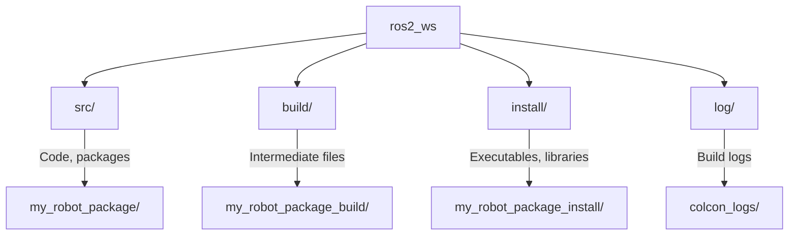

# Chapter 1: ROS 2 Installation and Workspace Setup

## The First Step: Bringing ROS 2 to Life

Welcome to the foundational chapter of Module 1! Before we dive into the exciting world of robot communication and control, we need to set up our development environment. This chapter will guide you through installing ROS 2 (Robot Operating System 2), creating your first workspace, and familiarizing yourself with the essential command-line interface (CLI) tools that are your window into a running ROS 2 system.

A robust setup is crucial. While installation might seem like a mere formality, it's where many beginners encounter their first hurdles. We'll cover common operating systems and provide troubleshooting tips to ensure you have a smooth start.

### Learning Outcomes

By the end of this chapter, you will be able to:

- **Install** ROS 2 Humble or Jazzy on Ubuntu/WSL2 without errors.
- **Create** a ROS 2 workspace using `colcon` and understand its directory structure.
- **Use** `ros2` CLI tools to inspect running nodes and topics.

---

## ROS 2 Installation Guide (FR-001)

ROS 2 is designed to run primarily on Linux. For Windows users, we recommend using Windows Subsystem for Linux (WSL2) to get a native Linux experience. You will need an active internet connection to download packages.

### Option 1: Ubuntu 22.04 LTS (Recommended)

This section details the installation for Ubuntu 22.04 LTS. If you are using a newer Ubuntu version, such as 24.04, you would typically install the corresponding ROS 2 distribution, like ROS 2 Jazzy. The steps are largely similar across Ubuntu versions, only the ROS distribution name changes.


Ubuntu 22.04 LTS (Jammy Jellyfish) is the recommended operating system for ROS 2 Humble. If you are using a newer Ubuntu version, you may need to install ROS 2 Jazzy (supported on Ubuntu 24.04).

1.  **Set Up Your Locale**: Ensure you have a "no UTF-8" locale.

    ```bash
    sudo apt update && sudo apt install locales
    sudo locale-gen en_US en_US.UTF-8
    sudo update-locale LC_ALL=en_US.UTF-8 LANG=en_US.UTF-8
    export LANG=en_US.UTF-8
    ```

2.  **Add ROS 2 Repository**: Add the ROS 2 apt repository to your system.

    ```bash
    sudo apt install software-properties-common
    sudo add-apt-repository universe
    sudo apt update && sudo apt install curl -y
    sudo curl -sSL https://raw.githubusercontent.com/ros/rosdistro/master/ros.key -o /usr/share/keyrings/ros-archive-keyring.gpg
    echo "deb [arch=$(dpkg --print-architecture) signed-by=/usr/share/keyrings/ros-archive-keyring.gpg] http://packages.ros.org/ros2/ubuntu $(. /etc/os-release && echo UBUNTU_CODENAME) main" | sudo tee /etc/apt/sources.list.d/ros2.list > /dev/null
    ```

3.  **Install ROS 2 Development Tools**: Install the full ROS 2 desktop environment. For Humble on Ubuntu 22.04:

    ```bash
    sudo apt update
    sudo apt upgrade -y
    sudo apt install ros-humble-desktop-full -y
    ```

    For Jazzy on Ubuntu 24.04 (if applicable):

    ```bash
    sudo apt update
    sudo apt upgrade -y
    sudo apt install ros-jazzy-desktop-full -y
    ```

4.  **Source the Setup Script**: This makes ROS 2 commands available in your current shell. You'll need to do this for every new terminal session.

    ```bash
    source /opt/ros/humble/setup.bash # For Humble
    # source /opt/ros/jazzy/setup.bash # For Jazzy
    ```

    :::tip Make it Permanent
    To avoid sourcing the setup script every time, add it to your `~/.bashrc` file:
    `echo "source /opt/ros/humble/setup.bash" >> ~/.bashrc`
    Then, apply the changes: `source ~/.bashrc`
    :::

5.  **Install autocompletion**: For convenience, install argument completion for `ros2` commands.

    ```bash
    sudo apt install python3-argcomplete
    ```

### Option 2: Windows 11 with WSL2

For Windows users, WSL2 provides a full Linux environment directly integrated with Windows. This is highly recommended over native Windows installations due to better tooling and compatibility.

1.  **Install WSL2**: Follow Microsoft's official guide to install WSL2 and a preferred Linux distribution (e.g., Ubuntu 22.04).
    [Microsoft WSL2 Installation Guide](https://docs.microsoft.com/en-us/windows/wsl/install)

2.  **Install Ubuntu within WSL2**: Once WSL2 is enabled, install Ubuntu from the Microsoft Store.

3.  **Follow Ubuntu Installation Steps**: Inside your WSL2 Ubuntu terminal, follow **Steps 1-5 from "Option 1: Ubuntu 22.04 LTS"** above.

:::caution Important for WSL2 Users
Ensure you are always working within your WSL2 Ubuntu terminal when interacting with ROS 2. Windows-native applications will not recognize ROS 2 commands or environment variables.
:::

---

## Exercise 1: Install ROS 2 and Verify Installation (SC-001)

**Goal**: Successfully install ROS 2 and confirm its functionality.
**Type**: CLI
**Difficulty**: Guided
**Estimated Time**: 20 minutes

1.  Follow the installation instructions for your chosen operating system (Ubuntu 22.04 or WSL2).
2.  After sourcing the setup script, open a new terminal and type:

    ```bash
    ros2 --version
    ```

    You should see output similar to:
    ```
    ROS 2 C++ package: ros_base
    ROS 2 Python package: rclpy
    ROS 2 distribution: humble
    ```

3.  Now, try running a basic demo node:

    ```bash
    ros2 run demo_nodes_cpp talker
    ```

    You should see messages being printed to your terminal, like:
    ```
    [INFO] [talker]: Publishing: 'Hello World from C++: 1'
    [INFO] [talker]: Publishing: 'Hello World from C++: 2'
    ...
    ```

4.  Open a **second terminal** and source your ROS 2 setup again.
5.  In the second terminal, run a listener node:

    ```bash
    ros2 run demo_nodes_py listener
    ```

    You should see the listener receiving the messages from the talker in the first terminal:
    ```
    [INFO] [listener]: I heard: 'Hello World from C++: 1'
    [INFO] [listener]: I heard: 'Hello World from C++: 2'
    ...
    ```

If you see both talker and listener running and exchanging messages, congratulations! Your ROS 2 installation is successful.

---

## Understanding the ROS 2 Workspace (FR-002)

In ROS 2, a "workspace" is a directory that holds your ROS 2 packages. It's where you develop, build, and install your robotic applications. The `colcon` build tool manages this workspace.

### Workspace Directory Structure

A typical ROS 2 workspace (after building) consists of four main directories:



-   `src/`: This is where your ROS 2 packages (source code) reside. Each package is typically its own folder within `src/`.
-   `build/`: This directory stores intermediate files generated during the build process (e.g., object files, build artifacts).
-   `install/`: This is where the final built products of your packages are placed (e.g., executables, libraries, Python modules, launch files). Sourcing the `setup.bash` (or `setup.ps1` for PowerShell) from this directory makes your custom packages available to ROS 2.
-   `log/`: Contains detailed logs from the `colcon` build process.

### `colcon` Build Tool

`colcon` is the primary build tool for ROS 2. It identifies packages in your `src/` directory, resolves their dependencies, and orchestrates the build process. Unlike `catkin_make` in ROS 1, `colcon` is designed to be more flexible and support a wider range of build systems.

**Basic `colcon` Commands**:
-   `colcon build`: Builds all packages in the workspace.
-   `colcon build --packages-select <package_name>`: Builds only a specific package.
-   `colcon test`: Runs tests for all packages.
-   `colcon test --packages-select <package_name>`: Runs tests for a specific package.

---

## Exercise 2: Create Your First Workspace

**Goal**: Create a new ROS 2 workspace and build it successfully.
**Type**: CLI
**Difficulty**: Guided
**Estimated Time**: 15 minutes

1.  Open a new terminal and make sure your ROS 2 environment is sourced (e.g., `source /opt/ros/humble/setup.bash`).
2.  Create a new directory for your workspace (we'll call it `ros2_ws`):

    ```bash
    mkdir -p ~/ros2_ws/src
    cd ~/ros2_ws
    ```

3.  Now, build the empty workspace using `colcon`. `colcon` will detect that there are no packages in `src/` yet, but it will still create the necessary `build/`, `install/`, and `log/` directories.

    ```bash
    colcon build
    ```

    You should see output similar to:
    ```
    Starting >>> colcon_core
    Finished <<< colcon_core [0.01s]
    Summary: 1 package finished [0.04s]
    ```

4.  After the build, list the contents of your `ros2_ws` directory:

    ```bash
    ls -F
    ```

    You should see:
    ```
    build/  install/  log/  src/
    ```

5.  Source your new workspace's setup file. This is crucial for ROS 2 to find any packages you later develop within this workspace.

    ```bash
    source install/setup.bash
    ```

Congratulations! You've successfully created and sourced your first ROS 2 workspace. This is the foundation for all your future ROS 2 development.

---

## Essential ROS 2 CLI Tools (FR-003)

The `ros2` command-line interface is your primary tool for interacting with a running ROS 2 system. It allows you to inspect nodes, topics, services, and parameters without writing any code. Mastering these commands is essential for debugging and understanding your robotic applications.

Here's a table of commonly used `ros2` CLI tools:

| Command          | Description                                         | Example Usage                                    |
| :--------------- | :-------------------------------------------------- | :----------------------------------------------- |
| `ros2 run`       | Run an executable from a package.                   | `ros2 run demo_nodes_cpp talker`                 |
| `ros2 node list` | List all active nodes.                              | `ros2 node list`                                 |
| `ros2 node info` | Display information about a specific node.          | `ros2 node info /talker`                         |
| `ros2 topic list`| List all active topics.                             | `ros2 topic list`                                |
| `ros2 topic echo`| Print messages being published on a topic.          | `ros2 topic echo /chatter`                       |
| `ros2 topic info`| Display information about a topic.                  | `ros2 topic info /chatter`                       |
| `ros2 topic pub` | Publish data to a topic from the command line.      | `ros2 topic pub /cmd_vel geometry_msgs/msg/Twist`|
| `ros2 service list`| List all active services.                         | `ros2 service list`                              |
| `ros2 service call`| Call a service from the command line.             | `ros2 service call /add_two_ints example_interfaces/srv/AddTwoInts '{a: 1, b: 2}'` |
| `ros2 param list`| List all parameters on a node.                      | `ros2 param list /talker`                        |
| `ros2 param get` | Get the value of a parameter.                       | `ros2 param get /talker use_sim_time`            |
| `ros2 pkg list`  | List all available ROS 2 packages.                  | `ros2 pkg list`                                  |
| `ros2 interface show` | Display details of message/service/action types. | `ros2 interface show std_msgs/msg/String`        |

---

## Exercise 3: Explore Talker/Listener Demo with CLI Tools (FR-004)

**Goal**: Use ROS 2 CLI tools to interact with the basic talker/listener demo.
**Type**: CLI
**Difficulty**: Semi-guided
**Estimated Time**: 25 minutes

1.  Open a new terminal and make sure your ROS 2 environment is sourced.
2.  Start the C++ `talker` node:

    ```bash
    ros2 run demo_nodes_cpp talker
    ```

3.  Open a **second terminal**, source your ROS 2 environment, and start the Python `listener` node:

    ```bash
    ros2 run demo_nodes_py listener
    ```

4.  Open a **third terminal**, source your ROS 2 environment. Now, let's use the CLI tools:

    -   **List active nodes**:

        ```bash
        ros2 node list
        ```
        You should see `/talker` and `/listener` (and possibly `/rqt_gui_py_xxxx` if you launched the GUI).

    -   **Get info about the `talker` node**:

        ```bash
        ros2 node info /talker
        ```
        This will show its publishers, subscribers, services, and parameters.

    -   **List active topics**:

        ```bash
        ros2 topic list
        ```
        You should see `/chatter` (the topic connecting talker and listener).

    -   **Echo messages on the `/chatter` topic**:

        ```bash
        ros2 topic echo /chatter
        ```
        You should see the "Hello World from C++: X" messages being printed in real-time.

    -   **Get info about the `/chatter` topic**:

        ```bash
        ros2 topic info /chatter
        ```
        This will show the message type (`std_msgs/msg/String`) and which nodes are publishing/subscribing to it.

5.  Experiment with `ros2 param list` and `ros2 param get /talker use_sim_time` (even though `talker` doesn't define custom parameters, it inherits common ones).

6.  When done, close all three terminals. This will automatically stop the ROS 2 nodes.

This exercise demonstrates how powerful the CLI tools are for understanding the runtime state of your ROS 2 system, even before you write any custom code.

---

## Troubleshooting Common Installation & Setup Errors

Even with clear instructions, you might encounter issues. Here are some common problems and their solutions:

### Issue: `ros2` command not found

-   **Cause**: You likely haven't sourced the ROS 2 setup script in your current terminal session.
-   **Solution**: Run `source /opt/ros/humble/setup.bash` (replace `humble` with `jazzy` if applicable). If you want it permanent, add it to your `~/.bashrc` file and then `source ~/.bashrc`.

### Issue: `ros2 run` finds package but not executable

-   **Cause**: The package might be built, but its executables are not correctly installed or sourced.
-   **Solution**: After `colcon build`, always run `source install/setup.bash` from your workspace root (`~/ros2_ws`). This adds your workspace's install directory to the ROS 2 environment path.

### Issue: Missing dependencies (`rosdep` errors)

-   **Cause**: You've cloned a ROS 2 package that requires additional system dependencies (e.g., `python3-colcon-common-extensions`).
-   **Solution**: From your workspace root (`~/ros2_ws`), run:
    ```bash
    sudo rosdep init # Only first time
    rosdep update
    rosdep install --from-paths src --ignore-src -r -y
    ```
    This will install all missing system dependencies.

### Issue: `colcon build` fails with C++ errors or linking issues

-   **Cause**: Often due to missing build tools or incorrect compiler setup.
-   **Solution**: Ensure you have the full build essential tools:
    `sudo apt install build-essential`
    Also, try cleaning your workspace: `rm -rf build install log && colcon build`

### Issue: Gazebo or RViz fails to launch

-   **Cause**: Display server issues (especially in WSL2 without X-server configuration) or missing packages.
-   **Solution**: For WSL2, ensure you have an X server running on Windows (e.g., VcXsrv or MobaXterm). For missing packages, install them:
    `sudo apt install ros-humble-gazebo-ros-pkgs ros-humble-rviz2 -y`

If you encounter persistent issues not covered here, please refer to the [official ROS 2 troubleshooting guide](https://docs.ros.org/en/humble/Troubleshooting/Linux-Installation.html) or seek help on the [ROS Discourse forum](https://discourse.ros.org/).
