import Tabs from '@theme/Tabs';
import TabItem from '@theme/TabItem';

# Chapter 1: Physics Simulation in Gazebo

:::info Learning Outcomes (Bloom's Level: ANALYZE)
By the end of this chapter, you will be able to:
- **Analyze** how Gazebo simulates gravity, friction, and collision physics
- **Calculate** mass and inertia tensors for stable robot simulations
- **Diagnose** common physics errors (exploding robots, pass-through collisions, unstable joints)
- **Create** URDF models with proper physics properties for realistic behavior
- **Validate** simulation accuracy against theoretical predictions (Newton's laws)
:::

## Prerequisites

**Required Knowledge**:
- Module 1: ROS 2 Fundamentals (nodes, topics, URDF basics)
- Basic physics: Newton's laws, mass, inertia, friction coefficients
- Familiarity with XML syntax (for URDF editing)

**Software Requirements**:
<Tabs groupId="operating-systems">
  <TabItem value="docker" label="Docker (Recommended)" default>
    ```bash
    # Pull pre-configured environment
    docker pull module2-gazebo:humble
    docker run -it --rm --network host -e DISPLAY=$DISPLAY module2-gazebo:humble
    ```
  </TabItem>
  <TabItem value="linux" label="Ubuntu 22.04/24.04">
    ```bash
    # Install Gazebo Harmonic
    sudo apt update
    sudo apt install gz-harmonic

    # Install ROS 2 + Gazebo integration
    sudo apt install ros-humble-ros-gz ros-humble-gazebo-ros-pkgs \
                     ros-humble-robot-state-publisher
    ```
  </TabItem>
</Tabs>

**Hardware Requirements**:
- **Tier A (Simulation Only)**: 8GB RAM, integrated GPU (Intel UHD 620 or better)
- **Tier B (Edge AI)**: Not required for this chapter (pure simulation)
- **Tier C (Physical Robot)**: Not required for this chapter

---

## Why Physics Simulation Matters

Before deploying code to a physical robot, you need confidence it will behave safely and correctly. Physics simulation allows you to:

- **Test dangerous scenarios safely**: High speeds, collisions, edge cases that could damage hardware
- **Iterate rapidly**: Make changes and test instantly - no waiting for hardware setup
- **Understand failure modes**: See why robots tip over, slip, or collide before it happens in the real world
- **Validate control algorithms**: Ensure your PID controllers, planners, and perception systems work with realistic physics

In this chapter, you'll learn how Gazebo's physics engine simulates the laws of motion, and how to configure robot models to behave realistically.

---

## Section 1: Physics Concepts in Gazebo

### How Gazebo Simulates the Physical World

Gazebo uses a **physics engine** (default: DART or Bullet) to compute forces, torques, and constraints at each timestep (typically 1000 Hz). The simulation pipeline works as follows:


<details>
<summary>Text alternative for Physics Pipeline diagram</summary>

The Gazebo physics simulation pipeline:
1. **URDF Model** defines mass, inertia tensors, and collision geometry
2. **Physics Engine** (DART or Bullet) computes forces from gravity, friction, and contact constraints
3. **Forces Computation** calculates net force and torque on each link
4. **Numerical Integration** updates positions and velocities using Newton's laws (F=ma, τ=Iα)
5. **Rendering** visualizes the updated robot state in Gazebo GUI
6. **ROS 2 Topics** publish joint states and TF transforms for other nodes

This loop runs at ~1000 Hz for accurate simulation.
</details>

### The Three Pillars of Physics Simulation

#### 1. Gravity

Gazebo applies a constant gravitational acceleration (default: 9.81 m/s² downward) to all bodies. Without proper collision geometry, objects will fall infinitely.

**Key Parameters**:
- Gravity vector: `<gravity>0 0 -9.81</gravity>` in world SDF
- Can be changed per-world (e.g., Mars: -3.71 m/s²)

#### 2. Collisions

Collision detection prevents bodies from passing through each other. Gazebo uses **simplified collision meshes** (boxes, cylinders, spheres) for performance.

**Critical URDF Tags**:
```xml
<collision>
  <geometry>
    <box size="1.0 0.5 0.3"/>  <!-- Simplified collision shape -->
  </geometry>
  <surface>
    <friction>
      <ode>
        <mu>0.8</mu>  <!-- Coefficient of friction -->
        <mu2>0.8</mu2>
      </ode>
    </friction>
  </surface>
</collision>
```

**Common Mistake**: Using high-polygon visual meshes for collision → slow simulation and instability. Always use simple primitives.

**Collision Detection Pipeline**:


<details>
<summary>Text alternative for Collision Detection Flow</summary>

The Gazebo collision detection pipeline has 5 stages:

1. **URDF Collision Geometry** provides simplified shapes (boxes, cylinders, spheres) to the physics engine
2. **Broad-Phase Detection** quickly identifies potential collisions using Axis-Aligned Bounding Boxes (AABB) - eliminates pairs that are far apart
3. **Narrow-Phase Detection** performs precise geometry checks for potential pairs using algorithms like GJK (Gilbert-Johnson-Keerthi) and EPA (Expanding Polytope Algorithm)
4. **Contact Solver** computes contact points, surface normals, penetration depth, and calculates repulsion forces with friction
5. **Force Application** applies impulses to separate interpenetrating bodies and update velocities

This pipeline runs at every physics timestep (~1000 Hz) to ensure continuous collision response.

</details>

#### 3. Mass and Inertia

Every link **must** have realistic mass and inertia tensors. Incorrect values cause:
- **Exploding robots**: Inertia too small → unstable numerical integration
- **Sluggish motion**: Mass too large → motors can't move joints
- **Unrealistic tumbling**: Inertia tensor not aligned with link geometry

**Inertia Tensor Formula** (solid cuboid):
```
Ixx = (1/12) * m * (h² + d²)
Iyy = (1/12) * m * (w² + d²)
Izz = (1/12) * m * (w² + h²)
```

Where `m` = mass (kg), `w` = width, `h` = height, `d` = depth (all in meters).

**URDF Example**:
```xml
<inertial>
  <mass value="2.5"/>  <!-- kg -->
  <inertia ixx="0.0208" ixy="0.0" ixz="0.0"
           iyy="0.0208" iyz="0.0"
           izz="0.0104"/>
</inertial>
```

:::danger Common Pitfall
**Never use zero or negative mass/inertia values.** Gazebo will either crash or exhibit unpredictable behavior. If unsure, use online inertia calculators or the `check_urdf` tool.
:::

---

## Section 2: Gazebo Setup and Workflow

### Verifying Your Installation

**Test Gazebo Standalone**:
```bash
# Launch empty world
gz sim empty.sdf

# You should see an empty 3D world with a ground plane
```

**Test ROS 2 + Gazebo Integration**:
```bash
# Source ROS 2
source /opt/ros/humble/setup.bash

# Launch Gazebo via ROS 2
ros2 launch gazebo_ros gazebo.launch.py

# In another terminal, check topics
ros2 topic list
# Expected output includes: /clock, /parameter_events
```

### Understanding the Gazebo GUI

When you launch Gazebo, you'll see:

1. **3D Viewport**: Main simulation view (left-click drag to orbit camera, right-click drag to pan, scroll to zoom)
2. **World Tree Panel** (left): Hierarchy of models and lights
3. **Model Editor** (top toolbar): Insert models, set pose, delete objects
4. **Time Controls** (bottom): Play/pause simulation, adjust real-time factor

**Key Shortcuts**:
- `Ctrl+R`: Reset simulation to initial state
- `Space`: Play/pause simulation
- `T`: Show/hide transparent mode (see collision geometry)

### Workflow: From URDF to Simulation

The standard workflow for testing robot physics:

```mermaid
sequenceDiagram
    participant Dev as Developer
    participant URDF as URDF File
    participant Check as check_urdf
    participant Launch as Launch File
    participant Gazebo as Gazebo Simulator
    participant RViz as RViz2 (Optional)

    Dev->>URDF: Edit mass, inertia, collision
    URDF->>Check: Validate syntax
    Check-->>Dev: Report errors (if any)
    Dev->>Launch: ros2 launch spawn_robot.launch.py
    Launch->>Gazebo: Spawn entity
    Gazebo->>Gazebo: Apply physics (gravity, contacts)
    Gazebo->>RViz: Publish /joint_states, /tf
    RViz-->>Dev: Visualize robot state

    Note over Dev,RViz: Iterate: Modify URDF → Re-spawn → Observe → Repeat
```



<details>
<summary>Text alternative for Gazebo Workflow diagram</summary>

The typical development workflow:
1. Developer edits URDF file (mass, inertia, collision geometry)
2. Run `check_urdf` to validate XML syntax and detect errors
3. Launch robot spawning script with `ros2 launch`
4. Gazebo spawns the robot model and applies physics simulation
5. RViz2 subscribes to `/joint_states` and `/tf` to visualize robot state
6. Developer observes behavior, identifies issues, and iterates

This cycle repeats until the robot behaves as expected.
</details>

---

## Section 3: Hands-On Example - Spawning a Rigid Body

### Example 1: Simple Rigid Body with Gravity

**What you'll learn**: Spawn a basic cuboid, observe gravity, validate collision detection

**Code location**: `module-2-digital-twin/src/ch1_gazebo_physics/`

**Step-by-Step Instructions**:

1. **Clone the code repository**:
   ```bash
   git clone https://github.com/physicalai/module-2-digital-twin.git ~/ros2_ws/src/module-2-digital-twin
   cd ~/ros2_ws
   ```

2. **Build the workspace**:
   ```bash
   colcon build --packages-select ch1_gazebo_physics
   source install/setup.bash
   ```

3. **Run the example**:
   <Tabs groupId="example-tabs">
     <TabItem value="launch" label="Using Launch File" default>
       ```bash
       ros2 launch ch1_gazebo_physics spawn_rigid_body.launch.py
       ```
     </TabItem>
     <TabItem value="manual" label="Manual Execution">
       ```bash
       # Terminal 1: Launch Gazebo
       ros2 launch gazebo_ros gazebo.launch.py

       # Terminal 2: Spawn robot
       ros2 run gazebo_ros spawn_entity.py -entity rigid_body \
           -file ~/ros2_ws/src/module-2-digital-twin/src/ch1_gazebo_physics/urdf/rigid_body.urdf \
           -x 0.0 -y 0.0 -z 2.0
       ```
     </TabItem>
   </Tabs>

4. **Verify expected behavior**:
   - ✅ Cuboid spawns 2 meters above ground
   - ✅ Falls under gravity (accelerates at 9.81 m/s²)
   - ✅ Hits ground plane and stops (collision works)
   - ✅ Does NOT pass through ground or explode

**Understanding the URDF**:

```xml title="rigid_body.urdf" showLineNumbers
<?xml version="1.0"?>
<robot name="rigid_body">
  <link name="base_link">
    <!-- Visual representation (what you see in Gazebo) -->
    <visual>
      <geometry>
        <box size="0.5 0.3 0.2"/>  <!-- 50cm x 30cm x 20cm -->
      </geometry>
      <material name="blue">
        <color rgba="0.0 0.0 1.0 1.0"/>
      </material>
    </visual>

    <!-- Collision geometry (simplified for physics) -->
    <collision>
      <geometry>
        <box size="0.5 0.3 0.2"/>  <!-- Match visual for simple shapes -->
      </geometry>
    </collision>

    <!-- Inertial properties (CRITICAL for physics) -->
    <inertial>
      <mass value="5.0"/>  <!-- 5 kg aluminum block -->
      <inertia ixx="0.048" ixy="0.0" ixz="0.0"
               iyy="0.125" iyz="0.0"
               izz="0.158"/>
      <!-- Calculated using cuboid formula:
           Ixx = (1/12) * 5.0 * (0.3² + 0.2²) = 0.048
           Iyy = (1/12) * 5.0 * (0.5² + 0.2²) = 0.125
           Izz = (1/12) * 5.0 * (0.5² + 0.3²) = 0.158 -->
    </inertial>
  </link>
</robot>
```

<details>
<summary>Line-by-line explanation</summary>

- **Line 3**: `name="rigid_body"` - Robot identifier used in ROS 2 topics
- **Line 4**: `<link name="base_link">` - Every URDF must have at least one link
- **Lines 6-12**: Visual geometry (rendered in Gazebo GUI) - box primitive with blue material
- **Lines 15-19**: Collision geometry (used by physics engine) - matches visual for simple shapes
- **Lines 22-28**: Inertial properties - **most critical part for physics**:
  - `mass`: 5 kg (typical for small robot component)
  - `ixx, iyy, izz`: Moments of inertia about X, Y, Z axes (kg·m²)
  - Off-diagonal terms (`ixy, ixz, iyz`) are zero for axis-aligned shapes
- **Lines 29-32**: Comment showing inertia calculation - always document your math!

</details>

**Validation Check**:
```bash
# Validate URDF syntax
check_urdf rigid_body.urdf

# Expected output:
# robot name is: rigid_body
# ---------- Successfully Parsed XML ---------------
# root Link: base_link has 0 child(ren)
```

### TF Tree for Rigid Body

The rigid body has a simple TF (Transform) tree with only one frame:


<details>
<summary>Text alternative for TF Tree</summary>

This diagram shows the coordinate frame hierarchy for the rigid body:
- **world** (fixed global frame) - The Gazebo world's origin point
  - **base_link** (rigid body's center of mass) - The robot's main body frame

Since this is a single-link robot with no joints, the TF tree has only one transformation: from the world frame to the base_link frame. This transform is published by `robot_state_publisher` and updated by Gazebo as the robot moves due to physics simulation.

</details>

---

## Exercises

### Exercise 1.1: Modify Mass and Observe Changes

**Difficulty**: 🟢 Beginner

**Task**: Edit `rigid_body.urdf` to change the mass from 5 kg to 20 kg. Predict and observe how this affects:
1. Fall speed (hint: check acceleration due to gravity formula)
2. Impact force when hitting the ground

**Starter Code**: Use `rigid_body.urdf` from Example 1.

**Acceptance Criteria**:
- [ ] URDF validates with `check_urdf`
- [ ] Robot spawns without errors
- [ ] You can explain why heavier objects DON'T fall faster in vacuum (constant g)
- [ ] You observe greater ground reaction force (check contact sensors if available)

**Hints** (click to reveal):

<details>
<summary>Hint 1: Recalculating Inertia</summary>

When you change mass from 5 kg to 20 kg, you MUST also update the inertia tensor. The formula scales linearly with mass:

```
I_new = I_old * (m_new / m_old)
```

For example: `Ixx_new = 0.048 * (20 / 5) = 0.192`

Don't forget to update `iyy` and `izz` as well!

</details>

<details>
<summary>Hint 2: Understanding Galileo's Principle</summary>

In a vacuum (no air resistance), all objects fall at the same rate regardless of mass. Gazebo simulates this correctly - you should see the 20 kg block fall at the same acceleration (9.81 m/s²) as the 5 kg block.

However, the **impact force** (F = ma) will be 4x greater for the heavier block.

</details>

---

### Exercise 1.2: Debug Unstable Joints

**Difficulty**: 🟡 Intermediate

**Task**: You'll be given a URDF file with intentionally incorrect inertia values that cause the robot to "explode" or vibrate uncontrollably. Identify and fix the errors.

**Starter Code**: Download `unstable_robot.urdf` from the exercises folder.

**Acceptance Criteria**:
- [ ] Identify which link has incorrect inertia (use process of elimination)
- [ ] Recalculate correct inertia tensor using formulas or online tools
- [ ] Robot spawns and remains stable for 10+ seconds of simulation time
- [ ] Document your debugging process in a short write-up

**Hints** (click to reveal):

<details>
<summary>Hint 1: Common Inertia Mistakes</summary>

Check for these red flags:
- **Zero inertia**: `ixx="0.0"` → Will cause divide-by-zero errors
- **Negative inertia**: Physically impossible
- **Inertia >> mass**: E.g., `mass="1.0"` but `ixx="100.0"` → Likely a unit error (kg vs g)
- **Diagonal terms not ordered**: For a box aligned with axes, typically `ixx < iyy < izz` or similar pattern

Use this sanity check: For a uniform density object, inertia ≈ mass * (size²)

</details>

<details>
<summary>Hint 2: Debugging Strategy</summary>

1. Run `check_urdf unstable_robot.urdf` - catches syntax errors but NOT physics errors
2. Spawn robot and observe which link vibrates or explodes
3. Isolate that link: comment out other links temporarily
4. Recalculate inertia using [this online calculator](http://www.kwon3d.com/theory/moi/iten.html)
5. Test again - repeat until stable

</details>

---

### Exercise 1.3: Create Custom Collision World

**Difficulty**: 🟡 Intermediate

**Task**: Create a Gazebo world file (`obstacle_course.sdf`) with:
- A ground plane
- 5 static obstacles (boxes, cylinders, or spheres)
- Proper collision geometry for all objects

Then spawn the wheeled robot and navigate it through the course (manual teleoperation).

**Starter Code**: Use `empty_world.sdf` as a template.

**Acceptance Criteria**:
- [ ] World loads without errors in Gazebo
- [ ] All obstacles are visible and have collision geometry
- [ ] Wheeled robot CANNOT pass through obstacles (proper collision detection)
- [ ] World file is properly formatted SDF (validate with `gz sdf --check obstacle_course.sdf`)

**Hints** (click to reveal):

<details>
<summary>Hint 1: SDF World Structure</summary>

A minimal SDF world file:

```xml
<?xml version="1.0" ?>
<sdf version="1.8">
  <world name="obstacle_course">
    <!-- Ground plane -->
    <include>
      <uri>model://ground_plane</uri>
    </include>

    <!-- Static obstacle example -->
    <model name="box_obstacle_1">
      <static>true</static>
      <pose>2 0 0.5 0 0 0</pose>  <!-- x y z roll pitch yaw -->
      <link name="link">
        <collision name="collision">
          <geometry>
            <box><size>1 2 1</size></box>
          </geometry>
        </collision>
        <visual name="visual">
          <geometry>
            <box><size>1 2 1</size></box>
          </geometry>
        </visual>
      </link>
    </model>

    <!-- Add 4 more obstacles here... -->
  </world>
</sdf>
```

</details>

<details>
<summary>Hint 2: Testing Collision</summary>

To verify collisions work:
1. Launch your world: `gz sim obstacle_course.sdf`
2. Use the GUI "Translate" tool to try moving obstacles through each other
3. They should resist overlap if collision geometry is correct
4. Spawn the wheeled robot and drive it into an obstacle - it should stop, not pass through

</details>

---

## Troubleshooting

<details>
<summary><strong>Issue</strong>: Robot spawns but immediately falls through the ground</summary>

**Cause**: Missing or incorrect collision geometry in URDF.

**Solution**:
1. Check that every `<link>` has a `<collision>` tag:
   ```xml
   <collision>
     <geometry>
       <box size="0.5 0.3 0.2"/>  <!-- Must match approximate visual size -->
     </geometry>
   </collision>
   ```
2. Verify collision geometry is NOT a mesh with holes or inverted normals
3. Ensure the robot is spawned above the ground (`-z 0.5` in spawn command)

**Advanced**: Enable collision visualization in Gazebo:
```bash
# In Gazebo GUI: View → Collisions (shows collision geometry in pink wireframe)
```

</details>

<details>
<summary><strong>Issue</strong>: Robot "explodes" (links fly apart violently) upon spawn</summary>

**Cause**: Inertia tensor values are too small, causing numerical instability.

**Solution**:
1. Recalculate inertia using correct formulas (see Section 1.3)
2. Ensure inertia values are NOT zero: `ixx`, `iyy`, `izz` must all be > 0.0001
3. Check that mass is realistic (1-100 kg for most robots, not 0.001 kg)
4. Verify off-diagonal inertia terms (`ixy`, `ixz`, `iyz`) are small or zero for symmetric objects

**Quick Fix**: Use a conservative estimate:
```xml
<inertia ixx="0.01" iyy="0.01" izz="0.01" ixy="0.0" ixz="0.0" iyz="0.0"/>
```
(Works for small test objects, but recalculate properly for production)

</details>

<details>
<summary><strong>Issue</strong>: Simulation runs extremely slowly (< 0.1x real-time)</summary>

**Cause**: Collision meshes are too detailed, or physics solver timestep is too small.

**Solution**:
1. **Simplify collision geometry**: Use primitives (box, cylinder, sphere) instead of meshes:
   ```xml
   <!-- BAD: Complex mesh with 10,000+ triangles -->
   <collision>
     <geometry>
       <mesh><uri>model://my_robot/meshes/high_poly.dae</uri></mesh>
     </geometry>
   </collision>

   <!-- GOOD: Simple primitive -->
   <collision>
     <geometry>
       <cylinder><radius>0.1</radius><length>0.5</length></cylinder>
     </geometry>
   </collision>
   ```
2. **Increase physics timestep** (in world SDF):
   ```xml
   <physics type="ode">
     <max_step_size>0.001</max_step_size>  <!-- Default: 0.001s = 1000 Hz -->
     <real_time_update_rate>1000</real_time_update_rate>
   </physics>
   ```
   Try doubling `max_step_size` to 0.002 (500 Hz) for faster simulation.

3. **Reduce contact surface complexity**: Limit contact points per collision pair

</details>

<details>
<summary><strong>Issue</strong>: `check_urdf` passes, but Gazebo shows errors about missing inertia</summary>

**Cause**: `check_urdf` only validates XML syntax, not physical plausibility.

**Solution**:
Every `<link>` **must** have an `<inertial>` block, even if it seems redundant:
```xml
<link name="wheel_link">
  <visual>...</visual>
  <collision>...</collision>
  <inertial>  <!-- DO NOT OMIT THIS -->
    <mass value="0.5"/>
    <inertia ixx="0.001" iyy="0.001" izz="0.001" ixy="0" ixz="0" iyz="0"/>
  </inertial>
</link>
```

**Validation Command**:
```bash
gz sdf -p your_robot.urdf  # Converts URDF to SDF and checks for physics errors
```

</details>

<details>
<summary><strong>Issue</strong>: Gazebo GUI is blank or shows "Failed to load plugin" errors</summary>

**Cause**: Graphics drivers or missing Gazebo plugins.

**Solution**:
1. **Update graphics drivers** (especially for NVIDIA/AMD GPUs)
2. **Test with software rendering**:
   ```bash
   LIBGL_ALWAYS_SOFTWARE=1 gz sim
   ```
   (Slow but works without GPU drivers)
3. **Reinstall Gazebo plugins**:
   ```bash
   sudo apt install --reinstall ros-humble-gazebo-ros-pkgs
   ```

</details>

---

## Key Takeaways

:::tip Summary
- **Physics engines simulate Newton's laws**: Gazebo computes forces, torques, and integrates motion at ~1000 Hz
- **Three critical properties**: Every link needs (1) mass, (2) inertia tensor, (3) collision geometry
- **Inertia matters**: Incorrect inertia causes explosions or sluggish behavior - always calculate accurately
- **Simplify collisions**: Use primitives (box, cylinder, sphere) for collision geometry, NOT high-poly meshes
- **Validate early**: Use `check_urdf` and `gz sdf` to catch errors before spawning
- **Iteration is key**: Expect to spawn → observe → tweak → repeat multiple times
:::

---

## Next Steps

**For Self-Paced Learners**:
- [ ] Complete Exercise 1.1 (mass modification)
- [ ] Complete Exercise 1.2 (debug unstable robot)
- [ ] Complete Exercise 1.3 (obstacle course)
- [ ] Explore the "Advanced Extensions" below (optional)
- [ ] Proceed to **Chapter 2: High-Fidelity Rendering in Unity**

**For Cohort-Based Learners** (Week 6, Days 1-3):
- [ ] Complete Exercises 1.1-1.2 (core concepts)
- [ ] Join discussion forum to share obstacle course designs (Exercise 1.3)
- [ ] Submit Exercise 1.2 debugging write-up for peer review (optional)

---

## Advanced Extensions (Optional)

:::note For Experts
If you found this chapter straightforward, try these additional challenges:

1. **Soft-Body Physics**: Research Gazebo's soft-body plugins and simulate a deformable object (rope, cloth)
2. **Custom Physics Engine**: Switch from ODE to Bullet or DART and compare behavior (modify world SDF)
3. **Contact Sensors**: Add `<sensor type="contact">` to links and publish collision events to ROS 2 topics
4. **Friction Experiments**: Vary `<mu>` values on different surfaces and measure robot sliding behavior
5. **Inertia Validation**: Write a Python script to auto-generate inertia tensors from STL mesh files
:::

---

## Additional Resources

- 📖 [Gazebo Harmonic Physics Documentation](https://gazebosim.org/docs/harmonic/physics)
- 📖 [URDF Tutorials - Inertia](https://wiki.ros.org/urdf/Tutorials/Adding%20Physical%20and%20Collision%20Properties%20to%20a%20URDF%20Model)
- 🎥 [Video: Debugging Exploding Robots in Gazebo](https://youtube.com/watch?v=dQw4w9WgXcQ)
- 📄 [Research Paper: Stable Simulation of Articulated Robots](https://arxiv.org/abs/example)
- 🔧 [Online Inertia Calculator](http://www.kwon3d.com/theory/moi/iten.html)

---

**Chapter Navigation**:
- ← Previous: [Module 2 Overview](./module-overview)
- → Next: [Chapter 2: High-Fidelity Rendering in Unity](./chapter2-unity-rendering)
