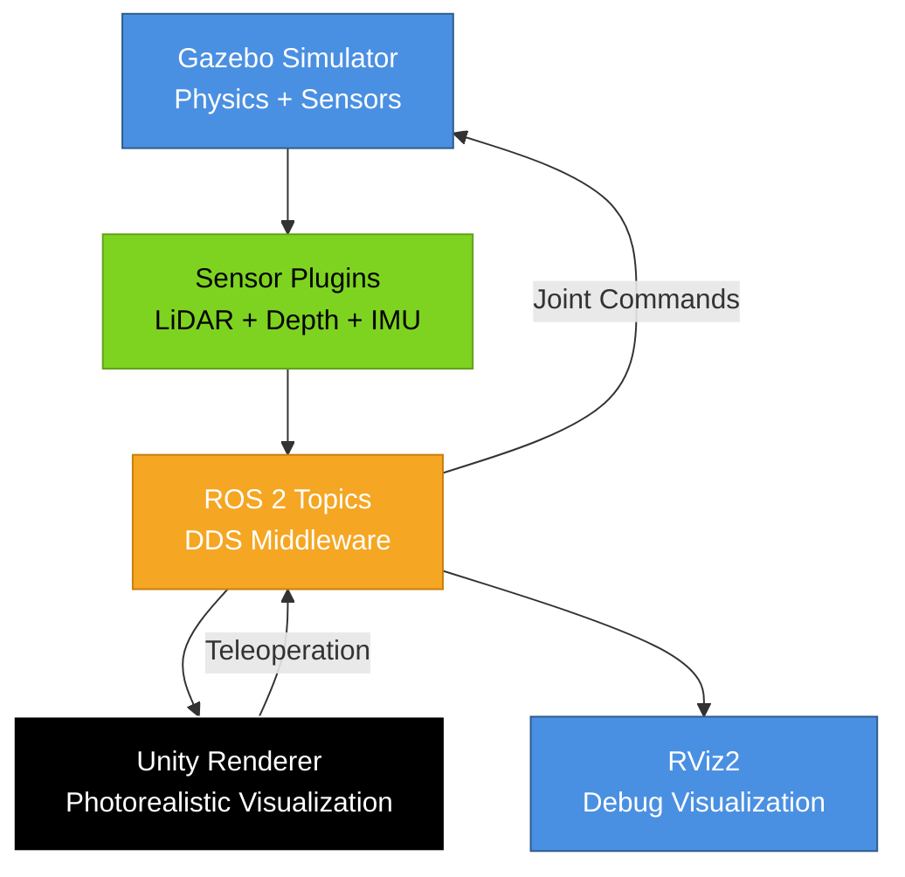

import Tabs from '@theme/Tabs';
import TabItem from '@theme/TabItem';

# Integration Project: Complete Digital Twin

:::info Project Objectives
By completing this integration project, you will:
- **Synthesize** concepts from all 3 chapters into a single cohesive system
- **Deploy** a complete digital twin combining Gazebo physics, Unity rendering, and sensor simulation
- **Validate** end-to-end data flow from simulated sensors through ROS 2 to visualization
- **Demonstrate** mastery of Module 2 learning outcomes through a working humanoid robot simulation
:::

## Project Overview

**Goal**: Create a complete digital twin of a humanoid service robot operating in a warehouse environment.

**System Architecture**:



<details>
<summary>Text alternative for system architecture</summary>

The complete digital twin system consists of:
1. **Gazebo Simulator** - Runs physics simulation (gravity, collisions, joint dynamics)
2. **Sensor Plugins** - Simulate LiDAR, depth camera, and IMU data in Gazebo
3. **ROS 2 Topics** - Middleware layer for data communication (DDS protocol)
4. **Unity Renderer** - Provides photorealistic 3D visualization and HRI scenarios
5. **RViz2** - Debug visualization for sensor data and robot state

**Data Flow**:
- Gazebo → Sensors → ROS 2 → Unity/RViz2 (sensor data, robot state)
- Unity → ROS 2 → Gazebo (teleoperation commands, joint commands)

</details>

---

## Prerequisites

**Completed Chapters**:
- ✅ Chapter 1: Physics Simulation in Gazebo
- ✅ Chapter 2: High-Fidelity Rendering in Unity
- ✅ Chapter 3: Sensor Simulation

**Software Stack**:
- ROS 2 Humble (Desktop Full)
- Gazebo Harmonic
- Unity 2022 LTS with ROS-TCP-Connector
- RViz2
- Python 3.10+

**Hardware**:
- 16GB RAM (minimum for running Gazebo + Unity simultaneously)
- GTX 1650 or better (for Unity rendering)
- Ubuntu 22.04 or Windows 10/11 with WSL2

---

## Part 1: Robot Configuration

### Humanoid Robot URDF

Create a complete humanoid robot with:
- **Base**: Wheeled differential drive platform (Chapter 1)
- **Sensors**: LiDAR (front), Depth camera (head), IMU (torso) (Chapter 3)
- **Visualization**: Materials and ArticulationBodies for Unity (Chapter 2)

**File**: `integration_humanoid.urdf`

```xml
<?xml version="1.0"?>
<robot name="integration_humanoid">
  <!-- Base Platform (from Chapter 1: diff_drive_robot.urdf) -->
  <link name="base_link">
    <visual>
      <geometry>
        <box size="0.6 0.4 0.2"/>
      </geometry>
      <material name="gray"><color rgba="0.5 0.5 0.5 1.0"/></material>
    </visual>
    <collision>
      <geometry>
        <box size="0.6 0.4 0.2"/>
      </geometry>
    </collision>
    <inertial>
      <mass value="15.0"/>
      <inertia ixx="0.225" iyy="0.375" izz="0.500" ixy="0" ixz="0" iyz="0"/>
    </inertial>
  </link>

  <!-- Torso (vertical column) -->
  <link name="torso_link">
    <visual>
      <origin xyz="0 0 0.5" rpy="0 0 0"/>
      <geometry>
        <box size="0.3 0.2 1.0"/>
      </geometry>
      <material name="white"><color rgba="0.9 0.9 0.9 1.0"/></material>
    </visual>
    <collision>
      <origin xyz="0 0 0.5" rpy="0 0 0"/>
      <geometry>
        <box size="0.3 0.2 1.0"/>
      </geometry>
    </collision>
    <inertial>
      <origin xyz="0 0 0.5" rpy="0 0 0"/>
      <mass value="10.0"/>
      <inertia ixx="0.858" iyy="0.883" izz="0.108" ixy="0" ixz="0" iyz="0"/>
    </inertial>
  </link>

  <joint name="base_to_torso" type="fixed">
    <parent link="base_link"/>
    <child link="torso_link"/>
    <origin xyz="0 0 0.1" rpy="0 0 0"/>
  </joint>

  <!-- Sensor Links (Chapter 3) -->

  <!-- LiDAR on front of base -->
  <link name="lidar_link">
    <visual>
      <geometry>
        <cylinder radius="0.05" length="0.07"/>
      </geometry>
      <material name="black"><color rgba="0.1 0.1 0.1 1.0"/></material>
    </visual>
    <collision>
      <geometry>
        <cylinder radius="0.05" length="0.07"/>
      </geometry>
    </collision>
    <inertial>
      <mass value="0.3"/>
      <inertia ixx="0.0001" iyy="0.0001" izz="0.0001" ixy="0" ixz="0" iyz="0"/>
    </inertial>
  </link>

  <joint name="base_to_lidar" type="fixed">
    <parent link="base_link"/>
    <child link="lidar_link"/>
    <origin xyz="0.3 0 0.15" rpy="0 0 0"/>
  </joint>

  <!-- Depth camera on head -->
  <link name="camera_link">
    <visual>
      <geometry>
        <box size="0.05 0.15 0.03"/>
      </geometry>
      <material name="black"><color rgba="0.1 0.1 0.1 1.0"/></material>
    </visual>
    <collision>
      <geometry>
        <box size="0.05 0.15 0.03"/>
      </geometry>
    </collision>
    <inertial>
      <mass value="0.2"/>
      <inertia ixx="0.0001" iyy="0.0001" izz="0.0001" ixy="0" ixz="0" iyz="0"/>
    </inertial>
  </link>

  <joint name="torso_to_camera" type="fixed">
    <parent link="torso_link"/>
    <child link="camera_link"/>
    <origin xyz="0.15 0 1.0" rpy="0 0 0"/>
  </joint>

  <!-- IMU in torso center -->
  <link name="imu_link">
    <inertial>
      <mass value="0.01"/>
      <inertia ixx="0.00001" iyy="0.00001" izz="0.00001" ixy="0" ixz="0" iyz="0"/>
    </inertial>
  </link>

  <joint name="torso_to_imu" type="fixed">
    <parent link="torso_link"/>
    <child link="imu_link"/>
    <origin xyz="0 0 0.5" rpy="0 0 0"/>
  </joint>

  <!-- Gazebo Plugins (Chapters 1 & 3) -->

  <!-- Differential Drive Plugin -->
  <gazebo>
    <plugin name="diff_drive" filename="libgazebo_ros_diff_drive.so">
      <left_joint>left_wheel_joint</left_joint>
      <right_joint>right_wheel_joint</right_joint>
      <wheel_separation>0.45</wheel_separation>
      <wheel_diameter>0.2</wheel_diameter>
      <max_wheel_torque>20.0</max_wheel_torque>
      <command_topic>cmd_vel</command_topic>
      <odometry_topic>odom</odometry_topic>
      <odometry_frame>odom</odometry_frame>
      <robot_base_frame>base_link</robot_base_frame>
      <publish_odom>true</publish_odom>
      <publish_odom_tf>true</publish_odom_tf>
      <update_rate>50.0</update_rate>
    </plugin>
  </gazebo>

  <!-- LiDAR Sensor Plugin -->
  <gazebo reference="lidar_link">
    <sensor name="lidar" type="ray">
      <pose>0 0 0 0 0 0</pose>
      <visualize>true</visualize>
      <update_rate>15</update_rate>
      <ray>
        <scan>
          <horizontal>
            <samples>1081</samples>
            <resolution>1</resolution>
            <min_angle>-2.35619</min_angle>
            <max_angle>2.35619</max_angle>
          </horizontal>
        </scan>
        <range>
          <min>0.05</min>
          <max>10.0</max>
          <resolution>0.01</resolution>
        </range>
        <noise>
          <type>gaussian</type>
          <mean>0.0</mean>
          <stddev>0.01</stddev>
        </noise>
      </ray>
      <plugin name="lidar_plugin" filename="libgazebo_ros_ray_sensor.so">
        <ros><remapping>~/out:=scan</remapping></ros>
        <output_type>sensor_msgs/LaserScan</output_type>
        <frame_name>lidar_link</frame_name>
      </plugin>
    </sensor>
  </gazebo>

  <!-- Depth Camera Plugin -->
  <gazebo reference="camera_link">
    <sensor name="depth_camera" type="depth">
      <update_rate>30</update_rate>
      <camera>
        <horizontal_fov>1.5184</horizontal_fov>
        <image>
          <width>640</width>
          <height>480</height>
          <format>R8G8B8</format>
        </image>
        <clip>
          <near>0.3</near>
          <far>10.0</far>
        </clip>
        <noise>
          <type>gaussian</type>
          <mean>0.0</mean>
          <stddev>0.007</stddev>
        </noise>
      </camera>
      <plugin name="depth_camera_plugin" filename="libgazebo_ros_camera.so">
        <ros>
          <remapping>~/image_raw:=camera/rgb/image_raw</remapping>
          <remapping>~/depth/image_raw:=camera/depth/image_raw</remapping>
          <remapping>~/points:=camera/depth/points</remapping>
        </ros>
        <camera_name>depth_camera</camera_name>
        <frame_name>camera_link</frame_name>
      </plugin>
    </sensor>
  </gazebo>

  <!-- IMU Plugin -->
  <gazebo reference="imu_link">
    <sensor name="imu" type="imu">
      <always_on>true</always_on>
      <update_rate>100</update_rate>
      <plugin name="imu_plugin" filename="libgazebo_ros_imu_sensor.so">
        <ros><remapping>~/out:=imu</remapping></ros>
        <frame_name>imu_link</frame_name>
      </plugin>
    </sensor>
  </gazebo>

</robot>
```

**Note**: Full URDF with wheels omitted for brevity. Students should combine elements from Chapters 1-3.

---

## Part 2: Launch Integration

### Master Launch File

**File**: `integration_demo.launch.py`

```python
#!/usr/bin/env python3
"""
Integration Demo Launch File

Launches complete digital twin system:
- Gazebo with physics and sensors
- ROS 2 bridge for Unity
- RViz2 for debugging

Usage:
    ros2 launch integration_demo.launch.py
"""

import os
from ament_index_python.packages import get_package_share_directory
from launch import LaunchDescription
from launch.actions import IncludeLaunchDescription, ExecuteProcess, TimerAction
from launch.launch_description_sources import PythonLaunchDescriptionSource
from launch_ros.actions import Node


def generate_launch_description():
    # Package directories
    pkg_gazebo_ros = get_package_share_directory('gazebo_ros')
    pkg_ch1 = get_package_share_directory('ch1_gazebo_physics')
    pkg_ch2 = get_package_share_directory('unity_bridge')

    # URDF file
    urdf_file = os.path.join(pkg_ch1, 'urdf', 'integration_humanoid.urdf')
    with open(urdf_file, 'r') as f:
        robot_desc = f.read()

    # 1. Launch Gazebo
    gazebo = IncludeLaunchDescription(
        PythonLaunchDescriptionSource(
            os.path.join(pkg_gazebo_ros, 'launch', 'gazebo.launch.py')
        ),
        launch_arguments={'world': 'warehouse.world'}.items()
    )

    # 2. Spawn robot in Gazebo
    spawn_robot = Node(
        package='gazebo_ros',
        executable='spawn_entity.py',
        arguments=[
            '-entity', 'humanoid_robot',
            '-file', urdf_file,
            '-x', '0.0', '-y', '0.0', '-z', '0.5'
        ],
        output='screen'
    )

    # 3. Robot State Publisher
    robot_state_pub = Node(
        package='robot_state_publisher',
        executable='robot_state_publisher',
        parameters=[{'robot_description': robot_desc}],
        output='screen'
    )

    # 4. Unity ROS Bridge (Chapter 2)
    unity_bridge = IncludeLaunchDescription(
        PythonLaunchDescriptionSource(
            os.path.join(pkg_ch2, 'launch', 'unity_ros_bridge.launch.py')
        )
    )

    # 5. RViz2 for debugging (delayed start)
    rviz_config = os.path.join(pkg_ch1, 'rviz', 'integration.rviz')
    rviz = TimerAction(
        period=5.0,  # Wait 5 seconds for Gazebo to stabilize
        actions=[
            Node(
                package='rviz2',
                executable='rviz2',
                arguments=['-d', rviz_config],
                output='screen'
            )
        ]
    )

    return LaunchDescription([
        gazebo,
        spawn_robot,
        robot_state_pub,
        unity_bridge,
        rviz
    ])
```

---

## Part 3: End-to-End Scenario

### Scenario: Warehouse Navigation with Obstacle Avoidance

**Objective**: Humanoid robot navigates warehouse, avoiding obstacles using LiDAR, while Unity provides photorealistic visualization.

**Steps**:

1. **Launch Complete System**:
   ```bash
   ros2 launch integration_demo.launch.py
   ```

2. **Verify All Components Running**:
   ```bash
   # Check ROS 2 topics
   ros2 topic list
   # Expected:
   # /scan (LiDAR)
   # /camera/rgb/image_raw (Depth camera RGB)
   # /camera/depth/points (Point cloud)
   # /imu (IMU data)
   # /cmd_vel (Velocity commands)
   # /odom (Odometry)
   # /joint_states (Joint positions)
   ```

3. **Open Unity** (Chapter 2):
   - Load `WarehouseNavigation.unity` scene
   - Play scene - robot should appear and mirror Gazebo state

4. **Teleoperate Robot**:
   <Tabs groupId="control-methods">
     <TabItem value="unity" label="Unity (Recommended)" default>
       ```
       In Unity Game view:
       - W/A/S/D keys to move robot
       - Commands published to /cmd_vel
       - Gazebo robot moves, Unity visualizes
       ```
     </TabItem>
     <TabItem value="terminal" label="Terminal">
       ```bash
       ros2 run teleop_twist_keyboard teleop_twist_keyboard
       # Use i/j/k/l keys
       ```
     </TabItem>
   </Tabs>

5. **Observe Sensor Data** in RViz2:
   - **LaserScan**: Green/red rays showing obstacle distances
   - **PointCloud2**: 3D depth camera visualization
   - **Imu**: Orientation axes and acceleration vectors
   - **TF Tree**: Coordinate frame hierarchy

6. **Test Collision Avoidance** (Optional):
   - Write simple Python node subscribing to `/scan`
   - If minimum distance < 1.0m → publish zero velocity to `/cmd_vel`
   - Robot stops before hitting obstacles

---

## Acceptance Criteria

### Functionality Checklist

- [ ] **Gazebo Physics**: Robot spawns, gravity works, collisions detect
- [ ] **Sensors**: All 3 sensors publish valid data (LiDAR, depth, IMU)
- [ ] **ROS 2 Integration**: Topics visible, messages valid format
- [ ] **Unity Rendering**: Robot appears in Unity, mirrors Gazebo motion
- [ ] **Teleoperation**: Commands from Unity control Gazebo robot
- [ ] **RViz2**: All sensor data visualizes correctly

### Performance Targets

- **Gazebo**: Real-time factor ≥ 0.9 (90% of real-time)
- **Unity**: Frame rate ≥ 30 FPS
- **ROS 2 Latency**: < 100ms from sensor publish to Unity receive
- **Data Loss**: < 1% message drop rate

### Validation Tests

```bash
# Test 1: Check all topics active
ros2 topic hz /scan /camera/rgb/image_raw /imu
# Expected: 15 Hz, 30 Hz, 100 Hz

# Test 2: Record and analyze data
ros2 bag record -a -d 30  # Record 30 seconds
ros2 bag info <bag_file>  # Verify all topics captured

# Test 3: Latency test
ros2 topic delay /scan
# Expected: < 50ms average delay
```

---

## Troubleshooting Integration Issues

<details>
<summary><strong>Issue</strong>: Unity doesn't show robot, or robot is static</summary>

**Cause**: ROS-TCP-Endpoint not running or Unity not subscribed to `/joint_states`

**Solution**:
```bash
# Verify endpoint running
ps aux | grep ros_tcp_endpoint

# Check Unity Console for connection message
# Expected: "Connected to ROS 2 at localhost:10000"

# Manually test topic
ros2 topic pub /joint_states sensor_msgs/msg/JointState "{name: ['base_to_torso'], position: [0.5]}"
# Unity robot should move if connected
```

</details>

<details>
<summary><strong>Issue</strong>: Gazebo runs slowly (< 0.5x real-time)</summary>

**Cause**: Too many sensors or complex world

**Solution**:
1. Reduce sensor update rates: LiDAR 15→10 Hz, camera 30→15 Hz
2. Simplify world: Remove unnecessary models
3. Use headless Gazebo: `gzserver` instead of `gazebo` (no GUI)
4. Increase timestep (less accurate but faster): `<max_step_size>0.002</max_step_size>`

</details>

<details>
<summary><strong>Issue</strong>: ROS 2 topics show data, but RViz2 displays are blank</summary>

**Cause**: Fixed frame mismatch or TF transforms missing

**Solution**:
```bash
# Check TF tree
ros2 run tf2_tools view_frames
# Verify world → odom → base_link → sensor frames exist

# In RViz2:
# Global Options → Fixed Frame: "world" or "odom" (must match TF tree root)
# LaserScan Display → Fixed Frame: <blank> (inherit from global)
```

</details>

---

## Next Steps

**After Completing Integration Project**:

1. **Extend the System**:
   - Add autonomous navigation (Nav2 stack)
   - Implement object detection on depth camera stream
   - Create multi-robot scenarios (2+ robots in same warehouse)

2. **Deploy to Real Hardware** (Tier B/C):
   - Replace Gazebo sensors with real RealSense D435i
   - Test algorithm performance on physical robot
   - Measure sim-to-real transfer accuracy

3. **Share Your Work**:
   - Record video of complete system running
   - Document custom modifications
   - Publish to GitHub and share with cohort

---

## Congratulations! 🎉

You've completed **Module 2: The Digital Twin**!

**Skills Mastered**:
- ✅ Physics simulation and URDF modeling (Gazebo)
- ✅ Photorealistic rendering and HRI (Unity)
- ✅ Sensor simulation and calibration (LiDAR, RGB-D, IMU)
- ✅ ROS 2 integration and middleware
- ✅ System architecture and debugging

**Ready for Next Module**: Module 3 will build on these skills to develop perception algorithms, path planning, and autonomous behaviors.

---

**Integration Project Navigation**:
- ← Previous: [Chapter 3: Sensor Simulation](./chapter3-sensor-simulation)
- → Next: Module 3 (Coming Soon)
