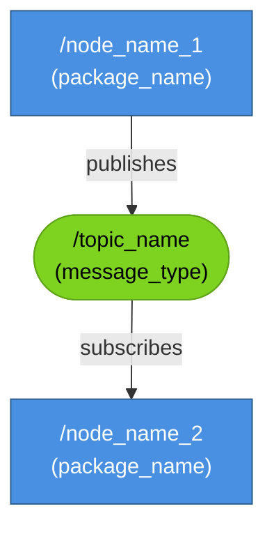
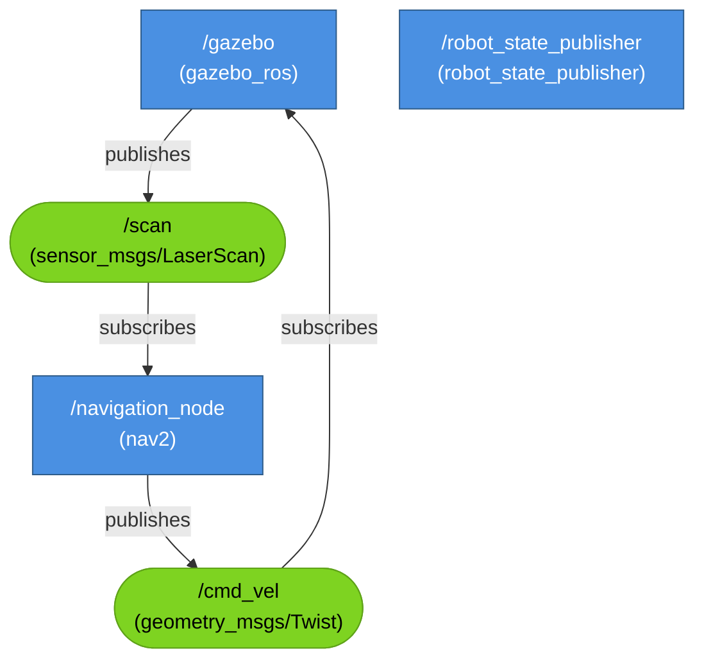

# ROS 2 Computation Graph Template

## Template Code



## Customization Guide

1. **Node Names**: Replace `node_name_1`, `node_name_2` with actual node names (e.g., `/gazebo`, `/robot_state_publisher`)
2. **Package Names**: Add package in parentheses (e.g., `(gazebo_ros)`)
3. **Topics**: Use rounded boxes `([...])` for topics
4. **Message Types**: Include message type (e.g., `(geometry_msgs/Twist)`)

## Example: TurtleBot3 Navigation



## Text Alternative Template

```markdown
<details>
<summary>Text alternative for ROS 2 Computation Graph</summary>

This diagram shows the ROS 2 nodes and topics for [system description]:
- **/node_name_1** (from package_name) publishes to **/topic_name** (message_type)
- **/node_name_2** (from package_name) subscribes to **/topic_name**

Data flows from node_name_1 through the topic to node_name_2.
</details>
```
