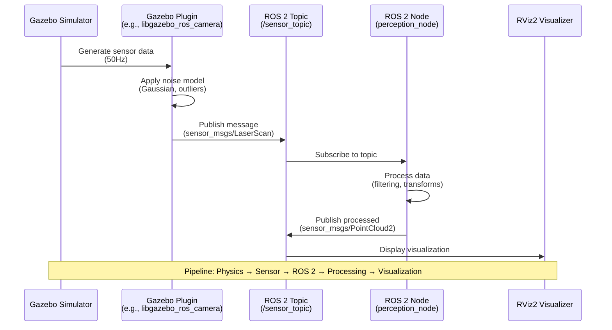
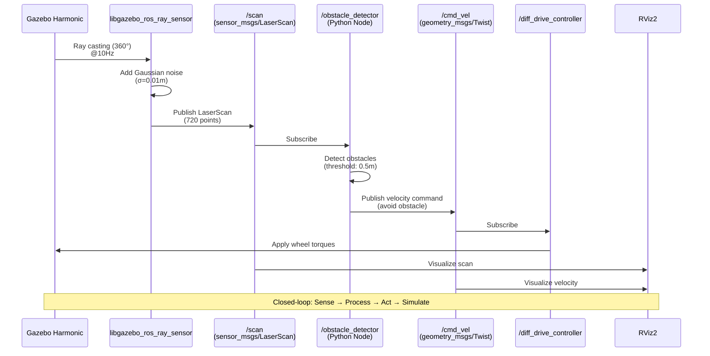
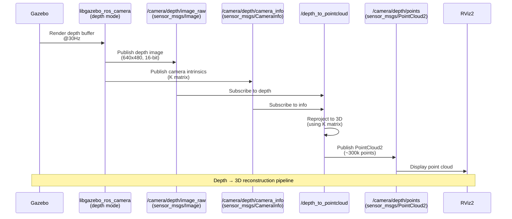
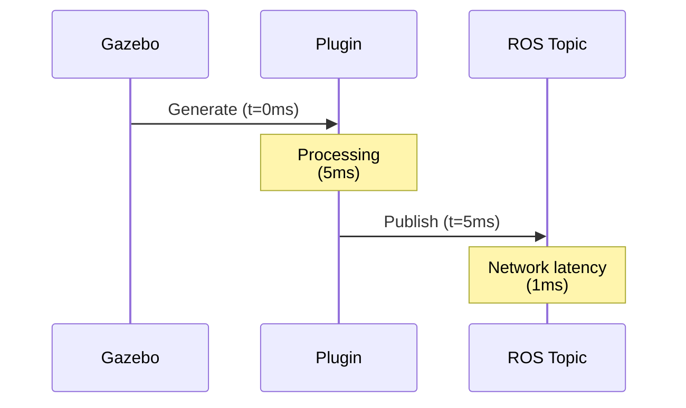

# Sensor Data Flow Template (Sequence Diagram)

## Template Code



## Customization Guide

1. **Participants**: Rename based on your pipeline (e.g., `Unity`, `custom_node`)
2. **Messages**: Update with actual message types (e.g., `sensor_msgs/Image`, `geometry_msgs/Twist`)
3. **Frequencies**: Add timing annotations (e.g., `(30Hz)`, `(10Hz)`)
4. **Processing Steps**: Expand `Node` processing with specific algorithms

## Example: LiDAR Perception Pipeline



## Example: Depth Camera to Point Cloud



## Text Alternative Template

```markdown
<details>
<summary>Text alternative for Sensor Data Flow</summary>

This sequence diagram shows the data flow for [sensor type] in the simulation:

1. **Gazebo Simulator** generates sensor data at [frequency]
2. **Gazebo Plugin** ([plugin name]) processes raw data and applies noise
3. **ROS 2 Topic** ([topic name]) publishes [message type]
4. **ROS 2 Node** ([node name]) subscribes and processes data
5. **RViz2** visualizes the output for debugging

The pipeline demonstrates how simulated sensor data flows from physics simulation to ROS 2 nodes for perception algorithms.
</details>
```

## Common Patterns

### Sensor Simulation Only
```
Gazebo → Plugin → ROS Topic → RViz
```

### Closed-Loop Control
```
Gazebo → Sensor Plugin → ROS Topic → Perception Node → Control Node → Actuator Plugin → Gazebo
```

### Multi-Sensor Fusion
```
Gazebo → LiDAR Plugin → /scan
Gazebo → Camera Plugin → /image
Both → Fusion Node → /fused_data
```

## Timing Annotations

Add timing information to show latency:


