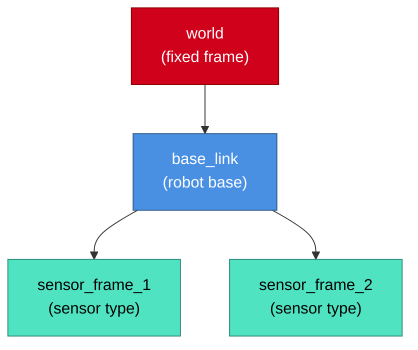
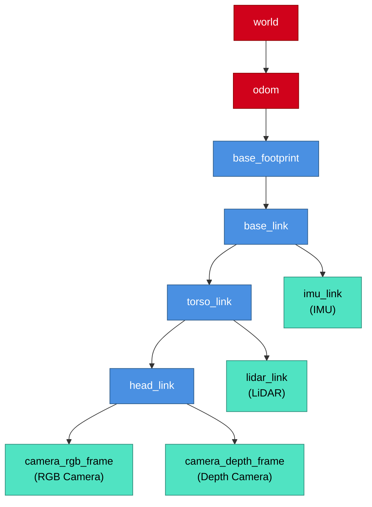

# TF Tree Template

## Template Code



## Customization Guide

1. **Root Frame**: Typically `world` or `map` (fixed reference)
2. **Base Frame**: Robot's main body frame (`base_link`, `base_footprint`)
3. **Sensor Frames**: Child frames for sensors (e.g., `camera_link`, `lidar_link`)
4. **Relationships**: Parent → Child (arrow direction shows TF transform)

## Example: Humanoid Robot TF Tree



## Text Alternative Template

```markdown
<details>
<summary>Text alternative for TF Tree</summary>

This diagram shows the coordinate frame hierarchy for [robot name]:
- **world** (fixed global frame)
  - **odom** (odometry frame, tracks robot motion)
    - **base_footprint** (ground projection of robot)
      - **base_link** (robot's main body)
        - **sensor_frame_1** (sensor type, position relative to base)
        - **sensor_frame_2** (sensor type, position relative to base)

All sensor measurements are transformed through this hierarchy to the world frame for localization and mapping.
</details>
```

## Common Patterns

### Mobile Robot (Wheeled)
```
world → odom → base_footprint → base_link → [sensors]
```

### Humanoid Robot (Multi-Joint)
```
world → odom → base_footprint → base_link → torso → head → [sensors]
                                          → left_arm → [gripper]
                                          → right_arm → [gripper]
```

### Fixed Sensor Rig
```
world → sensor_mount → camera_link → camera_rgb_frame
                                    → camera_depth_frame
```

## Validation Commands

```bash
# View TF tree in terminal
ros2 run tf2_tools view_frames

# Check specific transform
ros2 run tf2_ros tf2_echo world base_link

# Visualize in RViz2
ros2 run rviz2 rviz2
# Add TF display plugin
```
