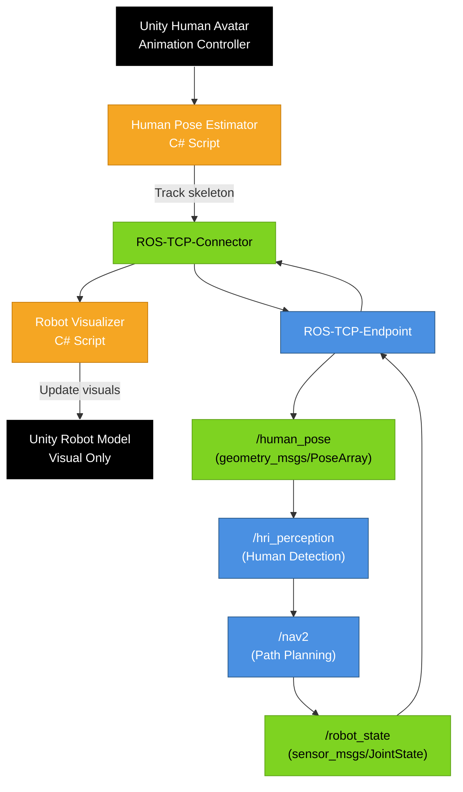

# Unity ROS Integration Template

## Template Code

```mermaid
graph LR
    Unity[Unity Scene<br/>Visual Rendering]
    TCPConnector[ROS-TCP-Connector<br/>Unity Package]
    TCPEndpoint[ROS-TCP-Endpoint<br/>ROS 2 Node]
    ROSTopic[ROS 2 Topic<br/>/topic_name]
    ROSNode[ROS 2 Node<br/>/node_name]

    Unity <-->|C# Scripts| TCPConnector
    TCPConnector <-->|TCP/IP<br/>Port 10000| TCPEndpoint
    TCPEndpoint <-->|DDS| ROSTopic
    ROSTopic <-->|Subscribe/Publish| ROSNode

    style Unity fill:#000,stroke:#fff,color:#fff
    style TCPConnector fill:#7ED321,stroke:#5FA319,color:#000
    style TCPEndpoint fill:#4A90E2,stroke:#2E5C8A,color:#fff
    style ROSTopic fill:#7ED321,stroke:#5FA319,color:#000
    style ROSNode fill:#4A90E2,stroke:#2E5C8A,color:#fff
```



## Customization Guide

1. **Unity Side**: Add specific GameObjects (e.g., `RobotVisualizer`, `HumanAvatar`)
2. **Topics**: Replace `/topic_name` with actual topics (e.g., `/cmd_vel`, `/joint_states`)
3. **Message Types**: Add message types in parentheses (e.g., `(geometry_msgs/Twist)`)
4. **Directionality**: Use `-->` for Unity → ROS, `<--` for ROS → Unity

## Example: Bidirectional Robot Control

```mermaid
graph LR
    UnityScene[Unity Scene<br/>3D Robot Model]
    InputManager[Input Manager<br/>C# Script]
    JointController[Joint Controller<br/>C# Script]

    TCPConn[ROS-TCP-Connector<br/>Unity Asset]
    TCPEndpoint[ROS-TCP-Endpoint<br/>ROS 2 Python Node]

    CmdVelTopic["/cmd_vel<br/>(geometry_msgs/Twist)"]
    JointStateTopic["/joint_states<br/>(sensor_msgs/JointState)"]

    GazeboNode["/gazebo<br/>(Physics Sim)"]
    ControllerNode["/diff_drive_controller<br/>(ROS 2 Control)"]

    UnityScene --> InputManager
    InputManager -->|Keyboard WASD| TCPConn
    TCPConn -->|Publish Twist| TCPEndpoint
    TCPEndpoint --> CmdVelTopic
    CmdVelTopic --> ControllerNode
    ControllerNode --> GazeboNode

    GazeboNode --> JointStateTopic
    JointStateTopic --> TCPEndpoint
    TCPEndpoint -->|Subscribe JointState| TCPConn
    TCPConn --> JointController
    JointController -->|Animate Joints| UnityScene

    style UnityScene fill:#000,stroke:#fff,color:#fff
    style InputManager fill:#F5A623,stroke:#C97E0D,color:#fff
    style JointController fill:#F5A623,stroke:#C97E0D,color:#fff
    style TCPConn fill:#7ED321,stroke:#5FA319,color:#000
    style TCPEndpoint fill:#4A90E2,stroke:#2E5C8A,color:#fff
    style CmdVelTopic fill:#7ED321,stroke:#5FA319,color:#000
    style JointStateTopic fill:#7ED321,stroke:#5FA319,color:#000
    style GazeboNode fill:#4A90E2,stroke:#2E5C8A,color:#fff
    style ControllerNode fill:#4A90E2,stroke:#2E5C8A,color:#fff
```



## Example: Human-Robot Interaction (HRI)



## Text Alternative Template

```markdown
<details>
<summary>Text alternative for Unity ROS Integration</summary>

This diagram shows the integration between Unity and ROS 2:

**Unity → ROS 2 (Command Flow)**:
1. Unity C# scripts capture user input or generate commands
2. ROS-TCP-Connector serializes messages and sends via TCP
3. ROS-TCP-Endpoint (Python node) receives and publishes to ROS 2 topics
4. ROS 2 nodes (e.g., robot controllers) process commands

**ROS 2 → Unity (Feedback Flow)**:
1. ROS 2 nodes publish sensor/state data to topics
2. ROS-TCP-Endpoint subscribes and forwards via TCP
3. ROS-TCP-Connector deserializes messages
4. Unity C# scripts update GameObjects (e.g., animate robot joints)

This bidirectional communication enables Unity to act as a visualization and control interface for ROS 2 robots.
</details>
```

## Connection Configuration

### Unity Side (C# Script)
```csharp
// ROSConnection.cs
using Unity.Robotics.ROSTCPConnector;

void Start()
{
    ROSConnection.GetOrCreateInstance().Connect(
        hostName: "localhost",  // ROS-TCP-Endpoint IP
        port: 10000
    );
}
```

### ROS 2 Side (Launch File)
```python
# unity_bridge.launch.py
from launch import LaunchDescription
from launch_ros.actions import Node

def generate_launch_description():
    return LaunchDescription([
        Node(
            package='ros_tcp_endpoint',
            executable='default_server_endpoint',
            parameters=[{'ROS_IP': '0.0.0.0', 'ROS_TCP_PORT': 10000}]
        )
    ])
```

## Common Use Cases

### Visualization Only (Unity as Viewer)
```
ROS 2 → TCP Endpoint → TCP Connector → Unity
```

### Teleoperation (Unity as Controller)
```
Unity → TCP Connector → TCP Endpoint → ROS 2
```

### Bidirectional (Unity as Interface)
```
Unity ↔ TCP Connector ↔ TCP Endpoint ↔ ROS 2
```

## Performance Considerations

- **Latency**: TCP adds ~10-50ms latency (acceptable for visualization)
- **Frequency**: Limit Unity → ROS messages to 30-60Hz max
- **Message Size**: Keep messages &lt;10KB for smooth performance
- **Network**: Use localhost (127.0.0.1) for same-machine communication
