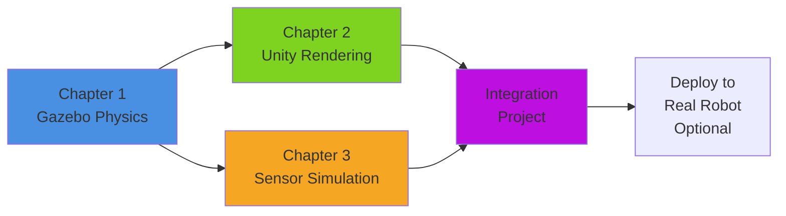

# Module 2: The Digital Twin (Gazebo & Unity)

:::info Module Overview
**Duration**: 2 weeks (Weeks 6-7)
**Prerequisites**: Module 1 (ROS 2 Fundamentals)
**Hardware**: Tier A (Simulation Only) - No physical robot required
:::

## Welcome to Digital Twin Development

In this module, you'll learn to create **digital twins** of robotic systems - virtual replicas that accurately simulate physics, rendering, and sensor behavior before deploying to physical hardware. This simulation-first approach is essential for safe, cost-effective robot development.

### What You'll Build

By the end of this module, you'll have created:
- ✅ **Physics-accurate simulations** in Gazebo Harmonic
- ✅ **Photorealistic environments** in Unity for human-robot interaction
- ✅ **Simulated sensors** (LiDAR, depth cameras, IMUs) for perception testing

---

## Module Structure

### Chapter 1: Physics Simulation in Gazebo ⚛️

**Bloom's Level**: Analyze
**Priority**: P1 (Critical Foundation)

Learn how Gazebo simulates gravity, friction, collisions, and joint constraints. You'll create URDF models with proper physics properties and observe realistic robot behavior.

**What you'll master**:
- Calculating inertia tensors for stable simulations
- Debugging unstable physics (exploding robots, pass-through collisions)
- Spawning and controlling robots in simulated environments

**Time**: 6-8 hours

---

### Chapter 2: High-Fidelity Rendering in Unity 🎨

**Bloom's Level**: Apply
**Priority**: P2 (Important Enhancement)

Build visually realistic simulation environments in Unity for intuitive robot visualization. Learn to integrate Unity with ROS 2 for real-time communication and create human-robot interaction scenarios.

**What you'll master**:
- Importing URDF models into Unity with materials and lighting
- Bidirectional ROS 2 communication via ROS-TCP-Connector
- Optimizing performance for 30+ FPS interactive rendering

**Time**: 8-10 hours

---

### Chapter 3: Sensor Simulation 📡

**Bloom's Level**: Create
**Priority**: P3 (Completes Digital Twin)

Configure and validate simulated sensors for perception algorithm development. Learn to model LiDAR, depth cameras, and IMUs with realistic noise characteristics.

**What you'll master**:
- Attaching sensors to robots with correct TF frames
- Configuring sensor parameters (range, resolution, noise)
- Validating sensor data against ground truth

**Time**: 6-8 hours

---

## Learning Outcomes

By completing this module, you will be able to:

1. **Analyze** physics simulation behavior to understand mass, inertia, and collision effects (Chapter 1)
2. **Apply** Unity rendering tools to create realistic HRI environments (Chapter 2)
3. **Create** custom sensor configurations for perception testing (Chapter 3)
4. **Evaluate** simulation accuracy against real-world robot behavior

---

## Why Digital Twins Matter

### Safety First 🛡️
Test dangerous scenarios (high speeds, collisions, edge cases) safely in simulation before risking physical hardware or human safety.

### Cost Efficiency 💰
Develop and test algorithms without expensive hardware. Tier A (simulation) costs $0 vs. $1,600+ for physical robots.

### Rapid Iteration 🚀
Make changes and test instantly - no waiting for hardware setup or repairs. Simulate 100 scenarios in the time it takes to run 1 physical test.

### Parallel Development 👥
Multiple team members can work on the same robot simultaneously in separate simulations.

---

## Three-Tier Accessibility

This module follows the textbook's accessibility model:

| Tier | Requirements | Chapter Coverage |
|------|--------------|------------------|
| **Tier A** (Simulation Only) | Gazebo + Unity (free software) | ✅ Complete (all chapters) |
| **Tier B** (Edge AI) | Jetson Orin Nano + RealSense D435i | ✅ Sim-to-real concepts (Chapter 3) |
| **Tier C** (Physical Robot) | Unitree Go2/G1 or equivalent | ✅ Validation techniques (optional) |

**This module is fully completable with Tier A only** - no hardware purchase required!

---

## Tools & Software

### Required (Tier A)
- **ROS 2 Humble** or Jazzy
- **Gazebo Harmonic** (Fortress or Garden)
- **Unity 2022 LTS** (free Personal license)
- **Python 3.10+**
- **Docker** (recommended for consistent environment)

### System Requirements
- **Minimum**: 8GB RAM, integrated GPU, Ubuntu 22.04/24.04
- **Recommended**: 16GB RAM, dedicated GPU (GTX 1650+), SSD

---

## Module Workflow

Text alternative for Module Workflow diagram

The module follows this progression:
1. **Chapter 1 (Gazebo Physics)** - Foundation for all subsequent work
2. **Chapter 2 (Unity Rendering)** - Builds on Chapter 1 for visualization
3. **Chapter 3 (Sensor Simulation)** - Builds on Chapter 1 for perception
4. **Integration Project** - Combines all three chapters
5. **Deploy to Real Robot** - Optional for Tier B/C students

Chapters 2 and 3 can be completed in either order after Chapter 1.

---

## Assessment & Success Criteria

### How You'll Know You've Succeeded

- ✅ Spawn robots in Gazebo that behave according to physics laws
- ✅ Create Unity scenes rendering at 30+ FPS with ROS 2 integration
- ✅ Configure sensors that publish valid data to ROS 2 topics
- ✅ Complete the integration project combining all three technologies

### Self-Assessment Questions

After each chapter, ask yourself:
1. Can I explain **why** this behavior occurs? (not just **what** happens)
2. Can I debug issues independently using the troubleshooting guide?
3. Can I adapt examples to my own custom robot designs?

---

## Getting Help

**Stuck?** Here's where to find support:

- 📖 **Chapter Troubleshooting Sections**: Each chapter has common issues and solutions
- 💬 **Discussion Forum**: [github.com/physicalai/discussions](https://github.com/physicalai/discussions)
- 🌐 **ROS 2 Community**: [discourse.ros.org](https://discourse.ros.org)
- 🎥 **Video Tutorials**: Linked in each chapter

---

## Ready to Begin?

**Next**: Start with [Chapter 1: Physics Simulation in Gazebo](./chapter1-gazebo-physics) to build your foundation in digital twin development.

Remember: **Simulation first, hardware second.** Master these tools and you'll save countless hours (and dollars) in robot development!

---

**Let's build some digital twins! 🤖**
