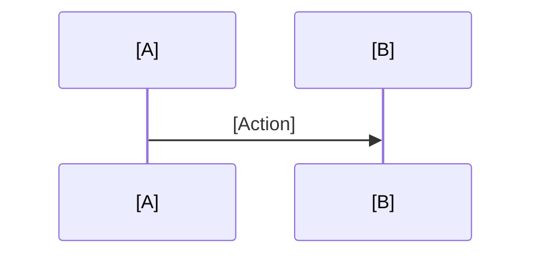

# Contract: Chapter Structure Template

**Purpose**: Standardized Docusaurus MDX template for all Module 2 chapters
**Applies to**: chapter1-gazebo-physics.mdx, chapter2-unity-rendering.mdx, chapter3-sensor-simulation.mdx
**Date**: 2025-12-12

---

## MDX File Structure

```mdx
---
sidebar_position: [CHAPTER_NUMBER]
title: "[CHAPTER_TITLE]"
---

import Tabs from '@theme/Tabs';
import TabItem from '@theme/TabItem';

# {frontmatter.title}

:::info Learning Outcomes (Bloom's Level: [ANALYZE|APPLY|CREATE])
By the end of this chapter, you will be able to:
- [Outcome 1 using Bloom's verb: Analyze/Apply/Create/Evaluate...]
- [Outcome 2...]
- [Outcome 3...]
:::

## Prerequisites

**Required Knowledge**:
- Module 1: ROS 2 Fundamentals (nodes, topics, URDF basics)
- [Chapter-specific prerequisites...]

**Software Requirements**:
<Tabs groupId="operating-systems">
  <TabItem value="docker" label="Docker (Recommended)" default>
    ```bash
    # Pull pre-configured environment
    docker pull [IMAGE_NAME]:humble
    ```
  </TabItem>
  <TabItem value="linux" label="Ubuntu 22.04/24.04">
    ```bash
    # Install dependencies
    sudo apt update
    sudo apt install [PACKAGES...]
    ```
  </TabItem>
</Tabs>

**Hardware Requirements**:
- **Tier A (Simulation Only)**: 8GB RAM, integrated GPU
- **Tier B (Edge AI)**: [If applicable] Jetson Orin + RealSense D435i
- **Tier C (Physical Robot)**: [If applicable] Additional hardware notes

---

## Section 1: [Concept Introduction]

[Introductory prose explaining the core concept: why it matters, real-world applications]

### [Subsection 1.1]

[Detailed explanation with diagrams]

```mermaid
[MERMAID_DIAGRAM_TYPE]
  [DIAGRAM_CODE]
```

<details>
<summary>Text alternative for screen readers</summary>

[Describe the diagram structure and relationships in plain text]

</details>

---

## Section 2: [Hands-On Example]

### Example [N]: [EXAMPLE_TITLE]

**What you'll learn**: [One-sentence goal]

**Code location**: `[REPOSITORY_PATH]`

:::danger Safety Note
[If applicable] This example involves [motor control/force application/...].
Always ensure emergency stop procedures are in place before running.
:::

**Step-by-Step Instructions**:

1. **Clone the code repository**:
   ```bash
   git clone [REPO_URL] ~/ros2_ws/src/module-2-digital-twin
   cd ~/ros2_ws
   ```

2. **Build the workspace**:
   ```bash
   colcon build --packages-select [PACKAGE_NAME]
   source install/setup.bash
   ```

3. **Run the example**:
   <Tabs groupId="example-tabs">
     <TabItem value="launch" label="Using Launch File" default>
       ```bash
       ros2 launch [PACKAGE_NAME] [LAUNCH_FILE].launch.py
       ```
     </TabItem>
     <TabItem value="manual" label="Manual Execution">
       ```bash
       # Terminal 1: [Command 1]
       # Terminal 2: [Command 2]
       ```
     </TabItem>
   </Tabs>

4. **Verify expected behavior**:
   - [Expected output description]
   - Screenshot: 

**Understanding the Code**:

```python title="[FILE_NAME].py" showLineNumbers
[CODE_SNIPPET with key lines highlighted]
```

<details>
<summary>Line-by-line explanation</summary>

- **Line [N]**: [Explanation of what this line does and why]
- **Line [M]**: [Explanation...]

</details>

---

## Section 3: [Deep Dive / Theory]

[More advanced explanation of underlying principles]

### Mermaid Diagram: [DIAGRAM_TITLE]



<details>
<summary>Text alternative</summary>

[Describe the sequence of interactions]

</details>

---

## Exercises

### Exercise [N]: [EXERCISE_TITLE]

**Difficulty**: 🟢 Beginner | 🟡 Intermediate | 🔴 Advanced

**Task**: [Clear, actionable description of what to modify/build]

**Starter Code**: Use the example from [Section X] as your starting point.

**Acceptance Criteria**:
- [ ] [Testable criterion 1]
- [ ] [Testable criterion 2]
- [ ] No errors in terminal output

**Hints** (click to reveal):

<details>
<summary>Hint 1: [Topic area]</summary>

[Guidance without giving away the full solution]

</details>

<details>
<summary>Hint 2: [Another topic]</summary>

[More guidance]

</details>

---

## Troubleshooting

<details>
<summary><strong>Issue</strong>: [Common error message or problem]</summary>

**Cause**: [Why this happens]

**Solution**:
```bash
[Fix commands or configuration changes]
```

</details>

[Repeat for 3-5 common issues]

---

## Key Takeaways

:::tip Summary
- **[Concept 1]**: [One-sentence summary]
- **[Concept 2]**: [One-sentence summary]
- **[Concept 3]**: [One-sentence summary]
:::

---

## Next Steps

**For Self-Paced Learners**:
- [ ] Complete all exercises in this chapter
- [ ] Explore the "Advanced Extensions" (optional)
- [ ] Proceed to [Next Chapter Title]

**For Cohort-Based Learners** (Week [N], Days [X-Y]):
- [ ] Complete Exercises [1-2] (core concepts)
- [ ] Join discussion forum for Q&A
- [ ] Submit Exercise [3] for peer review (optional)

---

## Advanced Extensions (Optional)

:::note For Experts
If you found this chapter straightforward, try these additional challenges:
- [Advanced challenge 1 - extends core concept]
- [Advanced challenge 2 - integrates with other tools]
:::

---

## Additional Resources

- 📖 [ROS 2 Official Docs: [Relevant Topic]](https://docs.ros.org/...)
- 🎥 [Video Tutorial: [Related Content]](https://youtube.com/...)
- 📄 [Research Paper: [Academic Reference]](https://arxiv.org/...)

---

**Chapter Navigation**:
- ← Previous: [Chapter Title or Module Overview]
- → Next: [Chapter Title or Integration Project]
```

---

## Template Variables

When creating a new chapter, replace these placeholders:

| Variable | Example Value |
|----------|---------------|
| `[CHAPTER_NUMBER]` | `1` |
| `[CHAPTER_TITLE]` | `"Chapter 1: Physics Simulation in Gazebo"` |
| `[ANALYZE\|APPLY\|CREATE]` | `ANALYZE` (for Chapter 1) |
| `[Outcome N]` | `"Explain how Gazebo simulates gravity and collisions"` |
| `[MERMAID_DIAGRAM_TYPE]` | `graph TD`, `sequenceDiagram`, `stateDiagram-v2` |
| `[REPOSITORY_PATH]` | `module-2-digital-twin/src/ch1_gazebo_physics/` |
| `[PACKAGE_NAME]` | `ch1_gazebo_physics` |
| `[IMAGE_NAME]` | `gazebo-spawn-robot` |

---

## Quality Checklist

Before publishing a chapter, validate:

- [ ] All code examples run without errors in Docker environment
- [ ] All Mermaid diagrams have text alternatives
- [ ] Safety notes present for motor control / force application code
- [ ] Troubleshooting section covers at least 3 common issues
- [ ] Readability: Flesch-Kincaid Grade 13-15, Reading Ease 30-50
- [ ] Screenshots are clear and properly captioned
- [ ] External links are valid (run `markdown-link-check`)
- [ ] Bloom's taxonomy level matches chapter goals

---

**Status**: Template ready for use. Apply to all 3 Module 2 chapters.
