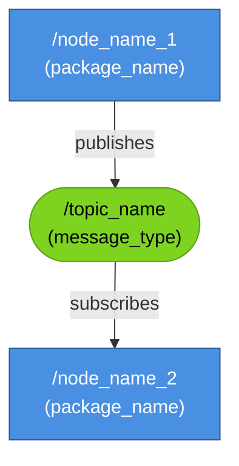
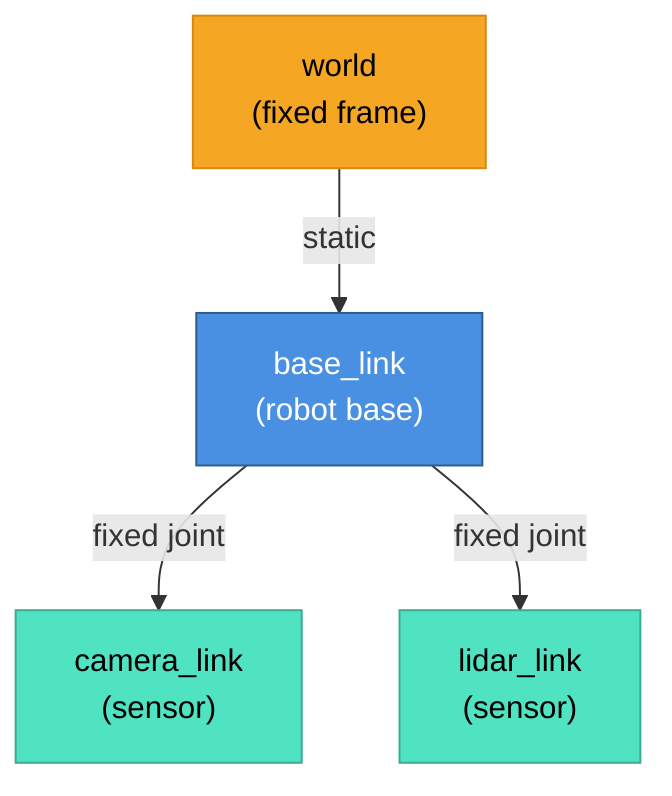
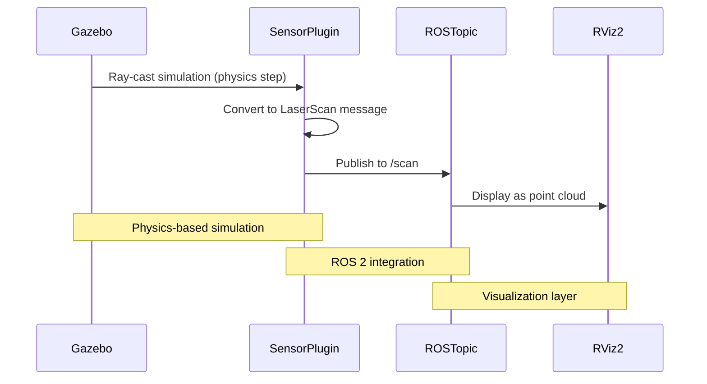
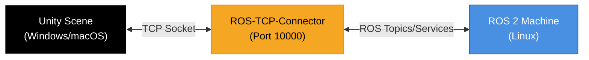
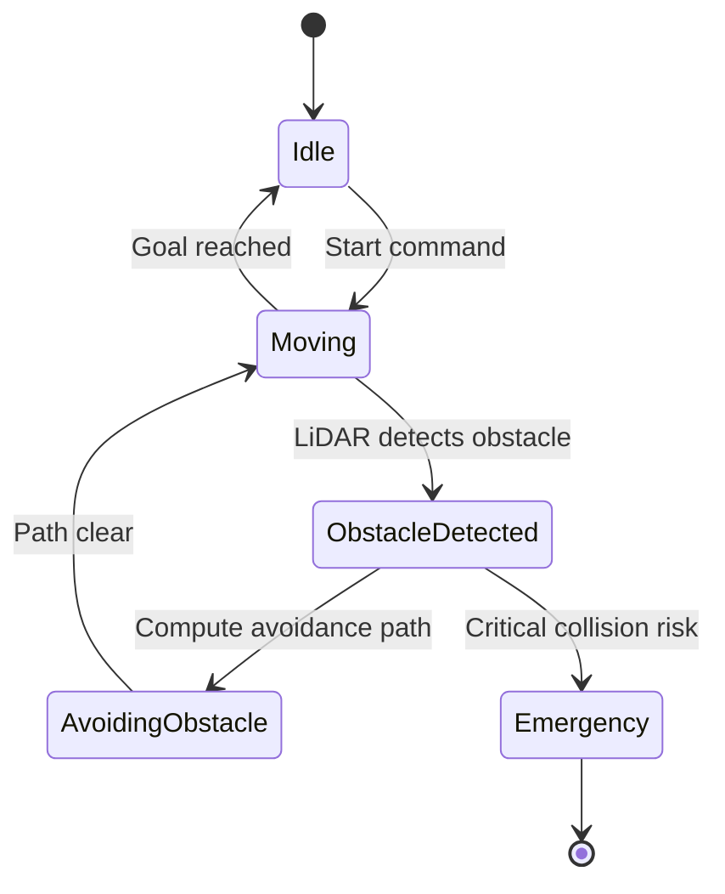
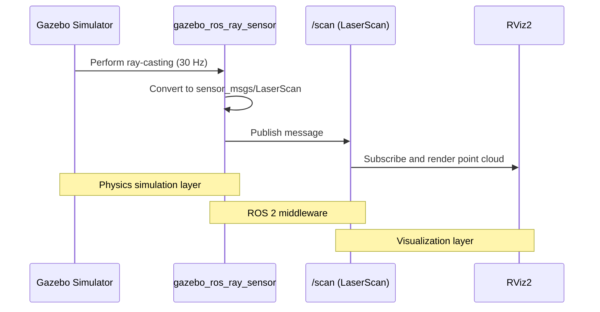

# Contract: Mermaid Diagram Specification

**Purpose**: Standardized templates and accessibility requirements for Mermaid diagrams in Module 2
**Applies to**: All chapters in Module 2
**Date**: 2025-12-12

---

## Diagram Types and Usage

### 1. ROS 2 Computation Graph (`graph TD` or `graph LR`)

**Use when**: Showing nodes, topics, services, and data flow in a ROS 2 system

**Template**:



**Accessibility Template**:

```markdown
<details>
<summary>Text alternative for ROS 2 Computation Graph</summary>

This diagram shows the ROS 2 nodes and topics for [system description]:
- **/node_name_1** (from package_name) publishes to **/topic_name** (message_type)
- **/node_name_2** (from package_name) subscribes to **/topic_name**

Data flows from node_name_1 through the topic to node_name_2.
</details>
```

---

### 2. TF Tree (`graph TD`)

**Use when**: Showing coordinate frame hierarchies for robot kinematics

**Template**:



**Accessibility Template**:

```markdown
<details>
<summary>Text alternative for TF Tree</summary>

This diagram shows the coordinate frame hierarchy for [robot name]:
- **world** is the global fixed frame
- **base_link** is the robot's base, positioned relative to world
- **camera_link** is a sensor frame, fixed to base_link
- **lidar_link** is another sensor frame, also fixed to base_link

All transformations are static (no moving parts in this example).
</details>
```

---

### 3. Sensor Data Flow (`sequenceDiagram`)

**Use when**: Showing how sensor data moves through the system (Gazebo → Plugin → ROS 2 → Visualization)

**Template**:



**Accessibility Template**:

```markdown
<details>
<summary>Text alternative for Sensor Data Flow</summary>

This sequence diagram shows how LiDAR sensor data flows through the system:
1. **Gazebo** performs ray-casting during each physics simulation step
2. **Sensor Plugin** converts ray-cast results into a ROS LaserScan message
3. **Plugin** publishes the message to the /scan topic
4. **RViz2** subscribes to /scan and visualizes the data as a point cloud

The process is divided into three layers: physics simulation (Gazebo), ROS 2 integration (Plugin + Topic), and visualization (RViz2).
</details>
```

---

### 4. Unity ROS Integration (`graph LR`)

**Use when**: Showing bidirectional communication between Unity and ROS 2

**Template**:



**Accessibility Template**:

```markdown
<details>
<summary>Text alternative for Unity ROS Integration</summary>

This diagram shows the communication architecture between Unity and ROS 2:
- **Unity Scene** runs on Windows or macOS (student's development machine)
- **ROS-TCP-Connector** acts as a bridge, listening on TCP port 10000
- **ROS 2 Machine** runs on Linux (could be same machine via WSL or separate)

Data flows bidirectionally: Unity sends commands to ROS 2, and receives sensor/state updates back through the TCP connector.
</details>
```

---

### 5. State Machine (`stateDiagram-v2`)

**Use when**: Showing robot behavior modes or navigation states (less common in Module 2, more in Module 4)

**Template**:



**Accessibility Template**:

```markdown
<details>
<summary>Text alternative for State Machine</summary>

This state diagram shows the robot's navigation behavior:
- **Idle**: Robot waits for commands
- **Moving**: Robot navigates toward goal
- **ObstacleDetected**: LiDAR detects an obstacle in the path
- **AvoidingObstacle**: Robot computes and executes avoidance maneuver
- **Emergency**: Critical collision risk detected, system halts

State transitions:
- Idle → Moving (when start command received)
- Moving → ObstacleDetected (when LiDAR detects obstacle)
- ObstacleDetected → AvoidingObstacle (when avoidance path computed)
- AvoidingObstacle → Moving (when path is clear again)
- Moving → Idle (when goal is reached)
- ObstacleDetected → Emergency (if collision is imminent)
</details>
```

---

## Accessibility Requirements (Constitution Principle IV)

### Mandatory for All Diagrams

1. **Preceding Paragraph**: Every Mermaid diagram MUST have a paragraph before it explaining:
   - What the diagram represents
   - Key components or relationships
   - Why this visualization is helpful

   Example:
   ```markdown
   The following diagram illustrates how sensor data flows from Gazebo's physics engine
   through ROS 2 topics to RViz2 for visualization. Understanding this pipeline is
   crucial for debugging sensor issues and validating simulation accuracy.

   ```mermaid
   [DIAGRAM CODE]
   ```
   ```

2. **Text Alternative**: Every diagram MUST have a `<details>` block immediately after with:
   - Summary line: "Text alternative for [Diagram Type]"
   - Plain text description of structure
   - List of key relationships or transitions

3. **Semantic Naming**: Use descriptive labels, not generic identifiers:
   - ✅ Good: `/camera_node`, `/lidar_link`, `Moving`
   - ❌ Bad: `node1`, `link_3`, `state_B`

4. **Color Coding** (optional but recommended):
   - Nodes: Blue (`#4A90E2`)
   - Topics: Green (`#7ED321`)
   - Services: Orange (`#F5A623`)
   - Sensors: Teal (`#50E3C2`)
   - Errors/Emergency: Red (`#D0021B`)

---

## Validation Checklist

Before publishing a chapter with Mermaid diagrams:

- [ ] All diagrams render without syntax errors in Docusaurus preview
- [ ] Each diagram has a preceding explanatory paragraph
- [ ] Each diagram has a `<details>` text alternative
- [ ] Text alternatives describe structure AND relationships
- [ ] Node/state labels are semantic (not generic)
- [ ] Diagrams are mobile-responsive (tested on narrow screen)
- [ ] Color choices meet WCAG 2.1 AA contrast requirements
- [ ] Diagrams align with equivalent text explanations in chapter

---

## Example: Complete Diagram with Accessibility

````markdown
### ROS 2 Sensor Pipeline

The diagram below shows how LiDAR sensor data is generated in Gazebo, published to a
ROS 2 topic, and visualized in RViz2. This architecture is identical to what you'll
use with real hardware in Tier B/C scenarios, making it an ideal testing ground.



<details>
<summary>Text alternative for ROS 2 Sensor Pipeline diagram</summary>

This sequence diagram shows the flow of LiDAR sensor data through four components:

1. **Gazebo Simulator** performs ray-casting calculations at 30 Hz to simulate laser range finding
2. **gazebo_ros_ray_sensor plugin** converts Gazebo's internal format to a ROS 2 sensor_msgs/LaserScan message
3. **Plugin** publishes the message to the `/scan` topic
4. **RViz2** subscribes to `/scan` and renders the data as a 3D point cloud

The system is organized into three architectural layers:
- Physics simulation (Gazebo and Plugin ray-casting)
- ROS 2 middleware (Plugin to Topic publishing)
- Visualization (Topic to RViz2 rendering)

This pipeline mirrors real-world robot systems where a physical LiDAR sensor publishes to the same `/scan` topic.
</details>

As you can see, the data flows sequentially from physics simulation through ROS 2 middleware
to visualization. Each step is decoupled, allowing you to test components independently.
````

---

**Status**: Mermaid diagram specification complete. Apply to all Module 2 chapters.
