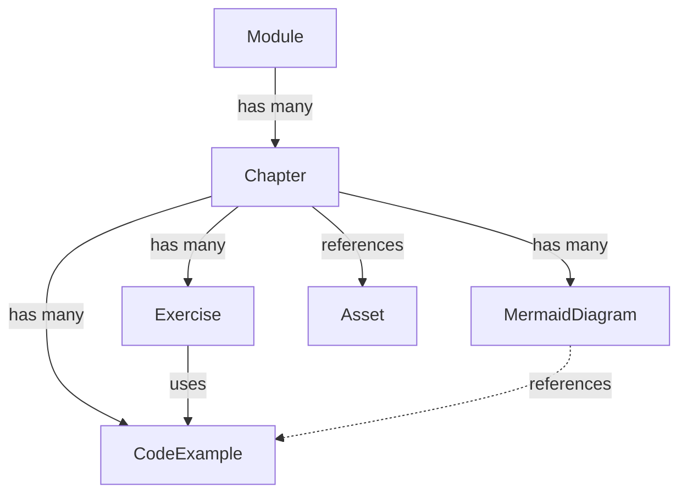
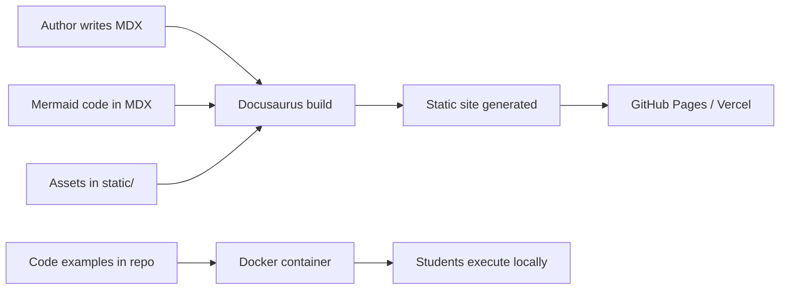

# Data Model: Module 2 - The Digital Twin

**Feature**: Module 2 - The Digital Twin (Gazebo & Unity)
**Date**: 2025-12-12
**Purpose**: Define the structure of learning content entities for educational module delivery

## Overview

This document defines the entities and relationships for Module 2's educational content. Unlike traditional software data models (databases, APIs), this captures the structure of instructional materials, code examples, assessments, and learning resources.

---

## Entity: Module

**Purpose**: Top-level organizational unit representing a cohesive learning theme (Digital Twin simulation)

### Attributes

| Field | Type | Description | Example |
|-------|------|-------------|---------|
| `id` | string | Unique identifier | `"module2"` |
| `title` | string | Display name | `"The Digital Twin (Gazebo & Unity)"` |
| `number` | integer | Sequential module number | `2` |
| `weeks` | integer | Expected completion time | `2` (Weeks 6-7) |
| `prerequisites` | string[] | Required prior knowledge | `["module1"]` |
| `learningOutcomes` | string[] | Bloom's taxonomy goals | `["Analyze physics simulations...", "Apply Unity tools..."]` |
| `chapters` | Chapter[] | Ordered list of chapters | `[ch1, ch2, ch3]` |

### Relationships

- **Has many** Chapters (1:N)
- **Depends on** Module 1 (prerequisite)
- **Prepares for** Module 3 (NVIDIA Isaac Sim)

---

## Entity: Chapter

**Purpose**: Self-contained learning unit covering one major topic (e.g., Gazebo Physics, Unity Rendering, Sensor Simulation)

### Attributes

| Field | Type | Description | Example |
|-------|------|-------------|---------|
| `id` | string | Unique identifier | `"chapter1-gazebo-physics"` |
| `title` | string | Display name | `"Chapter 1: Physics Simulation in Gazebo"` |
| `number` | integer | Sequential chapter number | `1` |
| `estimatedHours` | float | Expected study time | `6.5` hours |
| `priority` | enum | P1 (critical), P2 (important), P3 (nice-to-have) | `"P1"` |
| `bloomsLevel` | enum | Analyze, Apply, Create, Evaluate | `"Analyze"` |
| `content` | string (MDX) | Main instructional text | `"# Physics Simulation\n\nLearn how..."` |
| `learningOutcomes` | string[] | Specific chapter goals | `["Explain collision detection...", "Debug unstable joints..."]` |
| `codeExamples` | CodeExample[] | Associated runnable code | `[rigid_body, wheeled_robot, arm]` |
| `diagrams` | MermaidDiagram[] | Visual learning aids | `[physics_pipeline, tf_tree]` |
| `exercises` | Exercise[] | Hands-on practice activities | `[modify_inertia, collision_test]` |

### Validation Rules

- `bloomsLevel` must progress across chapters within module (Analyze → Apply → Create)
- `priority` P1 chapters must be completable before P2/P3
- All `codeExamples` must have passing tests before chapter publication

### Relationships

- **Belongs to** Module (N:1)
- **Has many** CodeExamples (1:N)
- **Has many** MermaidDiagrams (1:N)
- **Has many** Exercises (1:N)

---

## Entity: CodeExample

**Purpose**: Runnable ROS 2 or Unity code demonstrating a concept (URDF file, launch script, Unity scene)

### Attributes

| Field | Type | Description | Example |
|-------|------|-------------|---------|
| `id` | string | Unique identifier | `"rigid-body-gazebo"` |
| `title` | string | Descriptive name | `"Simple Rigid Body in Gazebo"` |
| `type` | enum | `urdf`, `launch_file`, `python_node`, `unity_scene`, `csharp_script` | `"urdf"` |
| `filePath` | string | Repository location | `"module-2-digital-twin/src/ch1_gazebo_physics/urdf/rigid_body.urdf"` |
| `dependencies` | string[] | Required packages | `["ros-humble-gazebo-ros", "ros-humble-robot-state-publisher"]` |
| `hardwareTier` | enum | Tier A (sim), Tier B (edge), Tier C (robot) | `"Tier A"` |
| `instructions` | string (Markdown) | How to run | `"1. Launch Gazebo...\n2. Spawn model..."` |
| `expectedOutput` | string | Success criteria | `"Robot falls and collides with ground plane"` |
| `testFile` | string | Automated validation | `"tests/ch1_physics/test_collision_detection.py"` |

### Validation Rules

- All Tier A examples must run in Docker environment
- `testFile` must exist and pass before code example is published
- `filePath` must resolve to existing file in repository
- Safety-critical code (motor control) must include E-Stop documentation

### Relationships

- **Belongs to** Chapter (N:1)
- **Referenced by** Exercises (N:N - one example can be used in multiple exercises)

---

## Entity: MermaidDiagram

**Purpose**: Visual representation of system architecture, data flow, or state machines

### Attributes

| Field | Type | Description | Example |
|-------|------|-------------|---------|
| `id` | string | Unique identifier | `"gazebo-physics-pipeline"` |
| `title` | string | Descriptive name | `"Gazebo Physics Simulation Pipeline"` |
| `type` | enum | `computation_graph`, `tf_tree`, `sequence`, `state_machine` | `"sequence"` |
| `mermaidCode` | string | Mermaid.js syntax | `"graph LR\n  URDF --> Physics..."` |
| `description` | string | Preceding paragraph | `"This diagram shows how Gazebo processes URDF..."` |
| `textAlternative` | string | Screen reader text | `"Gazebo reads URDF, applies physics..."` |
| `accessibilityChecked` | boolean | WCAG 2.1 AA validation | `true` |

### Validation Rules

- `mermaidCode` must render without syntax errors
- `description` and `textAlternative` are mandatory (accessibility requirement)
- `textAlternative` must be wrapped in `<details>` block in MDX

### Relationships

- **Belongs to** Chapter (N:1)
- **Can reference** CodeExamples (via node labels)

---

## Entity: Exercise

**Purpose**: Hands-on activity where students modify code or apply concepts

### Attributes

| Field | Type | Description | Example |
|-------|------|-------------|---------|
| `id` | string | Unique identifier | `"modify-inertia-exercise"` |
| `title` | string | Descriptive name | `"Exercise 1.3: Modify Robot Inertia"` |
| `instructions` | string (Markdown) | Task description | `"1. Open rigid_body.urdf\n2. Change mass to 10kg..."` |
| `starterCode` | CodeExample | Base example to modify | Reference to `rigid-body-gazebo` |
| `acceptanceCriteria` | string[] | Success conditions | `["Robot tips over when mass is asymmetric", "No Gazebo warnings"]` |
| `hints` | string[] | Optional guidance | `["Remember inertia scales with mass^2", "Use check_urdf to validate"]` |
| `solutionPath` | string | Reference answer (optional) | `"solutions/ch1/exercise_1_3.urdf"` |
| `difficulty` | enum | `beginner`, `intermediate`, `advanced` | `"intermediate"` |

### Validation Rules

- `starterCode` must exist and be runnable
- `acceptanceCriteria` must be testable (automatable or clearly observable)
- `solutionPath` is optional (some exercises are open-ended)

### Relationships

- **Belongs to** Chapter (N:1)
- **Uses** CodeExample as starter (N:1)

---

## Entity: Asset

**Purpose**: Static resources (images, videos, 3D meshes) supporting learning content

### Attributes

| Field | Type | Description | Example |
|-------|------|-------------|---------|
| `id` | string | Unique identifier | `"gazebo-ui-screenshot"` |
| `type` | enum | `image`, `video`, `mesh`, `pdf` | `"image"` |
| `filePath` | string | Repository location | `"static/assets/module2/screenshots/gazebo-spawn.png"` |
| `altText` | string | Accessibility description | `"Gazebo GUI showing spawned robot with collision visualization"` |
| `caption` | string | Optional explanatory text | `"Figure 1.2: Robot collision meshes (red wireframes)"` |
| `license` | string | Usage rights | `"CC-BY-4.0"` |

### Validation Rules

- All images must have `altText` (accessibility)
- Videos must have captions or transcripts
- 3D meshes must be in open formats (STL, OBJ, DAE)

### Relationships

- **Referenced by** Chapters (N:N - one asset can appear in multiple chapters)

---

## Entity Relationships Diagram



**Text Alternative**: Module 2 contains 3 Chapters. Each Chapter has multiple CodeExamples, MermaidDiagrams, Exercises, and Assets. Exercises reuse CodeExamples as starter templates. MermaidDiagrams can reference CodeExamples in node labels.

---

## Sample Data (Chapter 1 Instance)

```yaml
chapter:
  id: "chapter1-gazebo-physics"
  title: "Chapter 1: Physics Simulation in Gazebo"
  number: 1
  estimatedHours: 6.5
  priority: "P1"
  bloomsLevel: "Analyze"
  learningOutcomes:
    - "Explain how Gazebo simulates gravity, friction, and collisions"
    - "Calculate inertia tensors for simple geometric shapes"
    - "Debug unstable physics behavior in URDF models"

  codeExamples:
    - id: "rigid-body-gazebo"
      title: "Simple Rigid Body in Gazebo"
      type: "urdf"
      filePath: "module-2-digital-twin/src/ch1_gazebo_physics/urdf/rigid_body.urdf"
      dependencies: ["ros-humble-gazebo-ros"]
      hardwareTier: "Tier A"
      testFile: "tests/ch1_physics/test_collision_detection.py"

    - id: "wheeled-robot-launch"
      title: "Differential Drive Robot Launch"
      type: "launch_file"
      filePath: "module-2-digital-twin/src/ch1_gazebo_physics/launch/wheeled_robot.launch.py"
      dependencies: ["ros-humble-gazebo-ros", "ros-humble-robot-state-publisher"]
      hardwareTier: "Tier A"
      testFile: "tests/ch1_physics/test_wheel_physics.py"

  diagrams:
    - id: "gazebo-physics-pipeline"
      title: "Gazebo Physics Simulation Pipeline"
      type: "sequence"
      mermaidCode: |
        sequenceDiagram
          participant URDF
          participant PhysicsEngine
          participant CollisionDetector
          participant ForceApplicator
          URDF->>PhysicsEngine: Load mass, inertia, geometry
          PhysicsEngine->>CollisionDetector: Check contact points
          CollisionDetector->>ForceApplicator: Compute contact forces
          ForceApplicator->>PhysicsEngine: Update velocities, positions
      description: "This diagram shows how Gazebo processes URDF physics properties..."
      accessibilityChecked: true

  exercises:
    - id: "modify-inertia-exercise"
      title: "Exercise 1.3: Modify Robot Inertia"
      instructions: |
        1. Open rigid_body.urdf in your editor
        2. Change the mass from 1.0 kg to 10.0 kg
        3. Recalculate the inertia tensor (ixx, iyy, izz)
        4. Spawn the robot in Gazebo and observe behavior
      starterCode: "rigid-body-gazebo"
      acceptanceCriteria:
        - "Robot falls with 10x more momentum"
        - "No Gazebo physics warnings in terminal"
        - "check_urdf validates the modified URDF"
      difficulty: "intermediate"
```

---

## Content Delivery Pipeline



**Text Alternative**: Authors write Docusaurus MDX content which is built into a static site and deployed to GitHub Pages. Code examples are stored in a separate repository, packaged in Docker containers, and executed locally by students. Mermaid diagrams and static assets are embedded in MDX and rendered during the build process.

---

## Validation Checklist

Before publishing a chapter, validate:

- [ ] All `CodeExample` test files pass
- [ ] All `MermaidDiagram` instances render without errors
- [ ] All `Exercise` acceptance criteria are testable
- [ ] All `Asset` files have `altText` (accessibility)
- [ ] Content readability: Flesch-Kincaid Grade 13-15
- [ ] Bloom's taxonomy level matches chapter priority
- [ ] Tier A examples run in Docker environment
- [ ] Safety-critical code has E-Stop documentation

---

**Status**: Data model complete. Ready for contract generation (Phase 1b).
