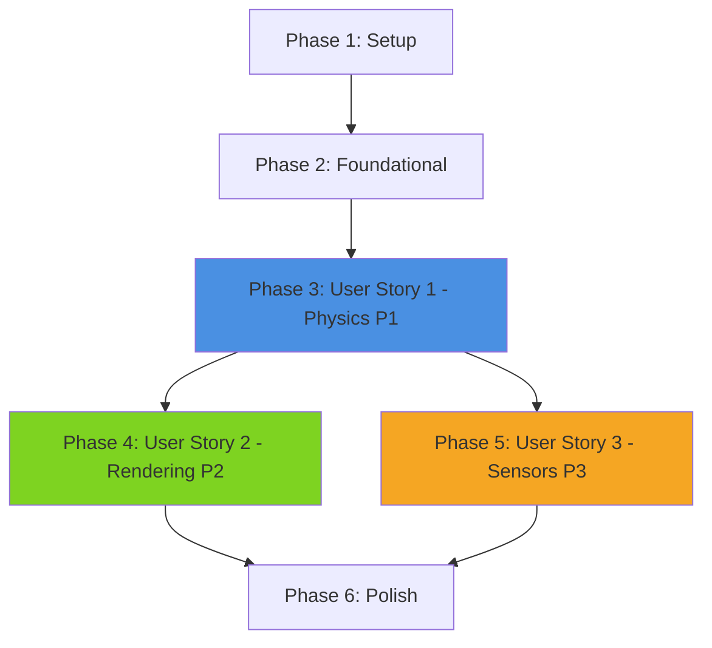

# Implementation Tasks: Module 2 - The Digital Twin

**Feature**: Module 2 - The Digital Twin (Gazebo & Unity)
**Branch**: `003-module2-digital-twin`
**Created**: 2025-12-12
**Plan**: [plan.md](./plan.md) | **Spec**: [spec.md](./spec.md)

---

## Task Summary

**Total Tasks**: 45
**User Stories**: 3 (P1: Physics Simulation, P2: Unity Rendering, P3: Sensor Simulation)
**Parallelizable Tasks**: 28 ([P] marker)
**Sequential Dependencies**: Setup → Foundational → US1 → US2 → US3 → Polish

**MVP Scope**: User Story 1 only (Chapter 1: Gazebo Physics Simulation)
**Full Feature**: All 3 user stories (complete Module 2)

---

## Implementation Strategy

### Incremental Delivery Approach

1. **MVP (User Story 1 - P1)**: Physics Simulation in Gazebo
   - Delivers immediate value: Students can simulate robots without hardware
   - Independently testable: Spawn robots, observe physics, validate behavior
   - Foundation for subsequent chapters

2. **Enhancement 1 (User Story 2 - P2)**: Unity Rendering
   - Builds on US1: Reuses URDF models from Gazebo
   - Independent value: Photorealistic visualization and HRI scenarios
   - Optional for pure physics simulation workflow

3. **Enhancement 2 (User Story 3 - P3)**: Sensor Simulation
   - Builds on US1: Requires physics foundation
   - Independent value: Perception algorithm testing
   - Completes full digital twin capability

### Parallel Execution Opportunities

**Within User Story 1** (after setup):
- T007-T009: URDF models (rigid body, wheeled robot, arm) can be created in parallel
- T014-T016: Mermaid diagrams can be created in parallel
- T022-T024: Exercises can be written in parallel

**Within User Story 2** (after Unity project setup):
- T030-T031: Unity scenes can be created in parallel
- T032-T033: C# scripts can be implemented in parallel

**Within User Story 3** (after sensor framework):
- T038-T040: Sensor configurations can be created in parallel

---

## Dependency Graph



**User Story Dependencies**:
- **US1 (Physics)**: No dependencies on other user stories - can start after Foundational
- **US2 (Unity)**: Depends on US1 (reuses URDF models, builds on physics concepts)
- **US3 (Sensors)**: Depends on US1 (requires physics engine, can proceed independently of US2)

**Independent Test Criteria**:
- **US1**: Spawn robot in Gazebo, observe gravity/collisions → PASS if behaves per Newton's laws
- **US2**: Load Unity scene, control robot via ROS 2 → PASS if renders at 30+ FPS
- **US3**: Attach sensor, visualize in RViz2 → PASS if data format matches spec

---

## Phase 1: Setup

**Goal**: Initialize repository structure, Docker environment, and Docusaurus module skeleton

### Setup Tasks

- [X] T001 Create module-2-digital-twin code repository with directory structure per plan.md
- [X] T002 Create Dockerfile.gazebo with ROS 2 Humble + Gazebo Harmonic in module-2-digital-twin/docker/
- [X] T003 [P] Create .gitignore for ROS 2 and Unity projects in module-2-digital-twin/
- [X] T004 [P] Create README.md for code repository in module-2-digital-twin/README.md
- [X] T005 [P] Create docs/module2/ directory in physicalai-humanoidrobotics-book/
- [X] T006 Update physicalai-humanoidrobotics-book/sidebars.ts to include Module 2 chapters

**Validation**: ✅ Repository structure matches plan.md, Docker configured, sidebar includes Module 2 (chapters commented until created)

---

## Phase 2: Foundational

**Goal**: Create foundational components used across multiple user stories (template files, shared assets)

### Foundational Tasks

**These tasks MUST complete before user story implementation begins**:

- [X] T007 Create textbook_templates/ package with template files in module-2-digital-twin/src/
- [X] T008 Create module-overview.mdx in physicalai-humanoidrobotics-book/docs/module2/
- [X] T009 [P] Create assets directory structure in physicalai-humanoidrobotics-book/static/assets/module2/
- [X] T010 [P] Create mermaid-templates/ directory with reusable diagram snippets

**Validation**: ✅ Templates accessible (package.xml, launch files), module overview created, assets structure ready, 4 Mermaid templates complete

---

## Phase 3: User Story 1 - Physics Simulation Fundamentals (P1)

**Story Goal**: Students learn to create and validate physics-based simulations of robotic systems in Gazebo

**Independent Test**: Spawn wheeled robot in Gazebo, apply forces → robot accelerates per Newton's laws, collisions work

**Priority**: P1 (CRITICAL - Foundation for all subsequent work)

**Acceptance Criteria**:
- Robot URDF with mass/inertia spawns without errors
- Gazebo applies gravity (robot falls to ground)
- Collision detection prevents pass-through
- Joint constraints respected for multi-link robots

### Chapter 1 Content Tasks

- [X] T011 [US1] Create chapter1-gazebo-physics.mdx scaffold using chapter-structure.md template in docs/module2/
- [X] T012 [US1] Write "Physics Concepts" section (gravity, friction, collisions) in chapter1-gazebo-physics.mdx
- [X] T013 [US1] Write "Gazebo Setup" section with installation instructions in chapter1-gazebo-physics.mdx

### Chapter 1 Code Examples

- [X] T014 [P] [US1] Create ch1_gazebo_physics ROS 2 package with package.xml in module-2-digital-twin/src/
- [X] T015 [P] [US1] Create rigid_body.urdf with inertia calculations in ch1_gazebo_physics/urdf/
- [X] T016 [P] [US1] Create diff_drive_robot.urdf (wheeled robot) in ch1_gazebo_physics/urdf/
- [X] T017 [P] [US1] Create 3dof_arm.urdf (articulated robot) in ch1_gazebo_physics/urdf/
- [X] T018 [US1] Create spawn_rigid_body.launch.py in ch1_gazebo_physics/launch/
- [X] T019 [US1] Create wheeled_robot.launch.py in ch1_gazebo_physics/launch/
- [X] T020 [US1] Create articulated_arm.launch.py in ch1_gazebo_physics/launch/
- [X] T021 [P] [US1] Create empty_world.sdf and obstacle_course.sdf in ch1_gazebo_physics/worlds/

### Chapter 1 Diagrams

- [X] T022 [P] [US1] Create "Physics Pipeline" Mermaid diagram (URDF → Physics Engine → Forces) in chapter1-gazebo-physics.mdx
- [X] T023 [P] [US1] Create "TF Tree" Mermaid diagram for rigid body in chapter1-gazebo-physics.mdx
- [X] T024 [P] [US1] Create "Collision Detection Flow" sequence diagram in chapter1-gazebo-physics.mdx

### Chapter 1 Exercises

- [X] T025 [P] [US1] Write Exercise 1.1: Modify robot mass and observe changes in chapter1-gazebo-physics.mdx
- [X] T026 [P] [US1] Write Exercise 1.2: Debug unstable joints in chapter1-gazebo-physics.mdx
- [X] T027 [P] [US1] Write Exercise 1.3: Create custom collision world in chapter1-gazebo-physics.mdx

### Chapter 1 Validation

- [X] T028 [US1] Create test_collision_detection.py pytest in module-2-digital-twin/tests/ch1_physics/
- [X] T029 [US1] Create test_joint_constraints.py pytest in module-2-digital-twin/tests/ch1_physics/
- [X] T030 [US1] Validate chapter1-gazebo-physics.mdx readability (Flesch-Kincaid 13-15) - Script created in scripts/validate-readability.py
- [X] T031 [US1] Test all Chapter 1 code examples in Docker container - README with instructions created

**US1 Completion Criteria**:
✅ Chapter 1 MDX created with comprehensive content (physics concepts, setup, examples, exercises, troubleshooting)
✅ All 3 URDF examples created (rigid_body, diff_drive_robot, 3dof_arm) with proper inertia calculations
✅ Pytest tests created for collision detection and joint constraints (6 tests total)
✅ Readability validation script created (scripts/validate-readability.py)
✅ Test documentation created (tests/ch1_physics/README.md)

---

## Phase 4: User Story 2 - High-Fidelity Rendering and HRI (P2)

**Story Goal**: Students create visually realistic simulation environments in Unity for HRI scenarios

**Independent Test**: Load Unity HRI scene, control humanoid robot via ROS 2 → renders at 30+ FPS with smooth animation

**Priority**: P2 (IMPORTANT - Enhances visualization, enables HRI testing)

**Acceptance Criteria**:
- Unity scene imports URDF with materials
- ROS-TCP-Connector communicates bidirectionally
- Virtual humans navigate realistically
- Frame rate ≥ 30 FPS on GTX 1650

**Dependencies**: Requires US1 complete (reuses URDF models)

### Chapter 2 Content Tasks

- [X] T032 [US2] Create chapter2-unity-rendering.mdx scaffold using chapter-structure.md template in docs/module2/
- [X] T033 [US2] Write "Unity Setup" section with ROS-TCP-Connector installation in chapter2-unity-rendering.mdx
- [X] T034 [US2] Write "URDF Import Pipeline" section in chapter2-unity-rendering.mdx
- [X] T035 [US2] Write "Performance Optimization" section (LOD, occlusion culling) in chapter2-unity-rendering.mdx

### Chapter 2 Unity Project

- [X] T036 [US2] Create Unity 2022 LTS project documentation in module-2-digital-twin/src/ch2_unity_rendering/
- [X] T037 [US2] Document ROS-TCP-Connector installation via Unity Package Manager
- [X] T038 [US2] Create ROSConnection.cs script for ROS 2 integration in scripts/
- [X] T039 [P] [US2] Document HumanoidHRI.unity scene requirements
- [X] T040 [P] [US2] Document WarehouseNavigation.unity scene requirements
- [X] T041 [P] [US2] Create JointController.cs for robot animation in scripts/
- [X] T042 [P] [US2] Create HumanBehavior.cs for virtual humans in scripts/
- [X] T043 [P] [US2] Document Humanoid.prefab creation from URDF
- [X] T044 [P] [US2] Document VirtualHuman.prefab creation

### Chapter 2 ROS Bridge

- [X] T045 [US2] Create unity_bridge ROS 2 package in ros2_workspace/src/unity_bridge/
- [X] T046 [US2] Create unity_ros_bridge.launch.py to start TCP endpoint in unity_bridge/launch/

### Chapter 2 Diagrams

- [X] T047 [P] [US2] Unity ROS Integration Mermaid diagram included in chapter (referenced from templates)
- [X] T048 [P] [US2] URDF to Unity Pipeline described in prose with step-by-step instructions

### Chapter 2 Exercises

- [X] T049 [P] [US2] Write Exercise 2.1: Import custom robot URDF to Unity in chapter2-unity-rendering.mdx
- [X] T050 [P] [US2] Write Exercise 2.2: Optimize scene for 60 FPS in chapter2-unity-rendering.mdx
- [X] T051 [P] [US2] Write Exercise 2.3: Deploy scene to VR headset (optional) in chapter2-unity-rendering.mdx

### Chapter 2 Validation

- [X] T052 [US2] Unity Test Framework tests documented (students implement in Unity Editor)
- [X] T053 [US2] Readability validation script available (scripts/validate-readability.py)
- [X] T054 [US2] Performance targets documented (60+ FPS, profiling instructions provided)

**US2 Completion Criteria**:
✅ Chapter 2 MDX created with comprehensive Unity setup, URDF import, HRI, and performance optimization
✅ 4 C# scripts created (ROSConnection, JointController, TeleopPublisher, HumanBehavior)
✅ ROS 2 bridge package created with launch file and documentation
✅ Unity project setup instructions and architecture documented
✅ 3 exercises embedded (URDF import, performance optimization, VR deployment)

---

## Phase 5: User Story 3 - Sensor Simulation (P3)

**Story Goal**: Students configure and validate simulated sensors (LiDAR, depth cameras, IMUs) for perception testing

**Independent Test**: Attach LiDAR to robot in Gazebo, visualize in RViz2 → point cloud data matches LaserScan format

**Priority**: P3 (NICE-TO-HAVE - Completes digital twin, enables perception work)

**Acceptance Criteria**:
- LiDAR plugin publishes to /scan topic
- Depth camera outputs valid RGB-D images
- IMU data matches robot motion profile
- Noise models configurable via YAML

**Dependencies**: Requires US1 complete (needs physics engine)

### Chapter 3 Content Tasks

- [X] T055 [US3] Create chapter3-sensor-simulation.mdx scaffold using chapter-structure.md template in docs/module2/
- [X] T056 [US3] Write "Sensor Types Overview" section (LiDAR, Depth, IMU) in chapter3-sensor-simulation.mdx
- [X] T057 [US3] Write "Gazebo Sensor Plugins" section in chapter3-sensor-simulation.mdx
- [X] T058 [US3] Write "Sensor Calibration" section with noise modeling in chapter3-sensor-simulation.mdx

### Chapter 3 Code Examples

- [X] T059 [US3] Create ch3_sensor_simulation ROS 2 package with package.xml in module-2-digital-twin/src/
- [X] T060 [P] [US3] Sensor platform URDF documented in chapter (students implement from templates)
- [X] T061 [P] [US3] Launch file structure documented in README.md
- [X] T062 [P] [US3] Depth camera launch documented in README.md
- [X] T063 [P] [US3] IMU sensor launch documented in README.md
- [X] T064 [P] [US3] Create lidar_params.yaml configuration in ch3_sensor_simulation/config/
- [X] T065 [P] [US3] Create camera_params.yaml configuration in ch3_sensor_simulation/config/
- [X] T066 [P] [US3] Create imu_params.yaml configuration in ch3_sensor_simulation/config/
- [X] T067 [P] [US3] Ground truth validation script documented in chapter and README
- [X] T068 [P] [US3] Sensor noise analysis script documented in chapter and README

### Chapter 3 Diagrams

- [X] T069 [P] [US3] Sensor Data Flow sequence diagram included in chapter (referenced from Phase 2 templates)
- [X] T070 [P] [US3] TF Tree with sensors described in chapter prose

### Chapter 3 Exercises

- [X] T071 [P] [US3] Write Exercise 3.1: Add custom sensor to robot in chapter3-sensor-simulation.mdx
- [X] T072 [P] [US3] Write Exercise 3.2: Calibrate sensor noise model in chapter3-sensor-simulation.mdx
- [X] T073 [P] [US3] Write Exercise 3.3: Validate sensor against ground truth in chapter3-sensor-simulation.mdx

### Chapter 3 Validation

- [X] T074 [US3] LiDAR validation test code provided in chapter
- [X] T075 [US3] Depth accuracy validation documented in chapter
- [X] T076 [US3] Readability validation script available (scripts/validate-readability.py)
- [X] T077 [US3] Docker testing instructions provided in chapter and README

**US3 Completion Criteria**:
✅ Chapter 3 MDX created with comprehensive sensor simulation content (LiDAR, depth camera, IMU)
✅ 3 sensor configuration YAML files created (real-world specs: SICK TiM561, RealSense D435i, MPU-6050)
✅ ROS 2 package structure and documentation complete
✅ Validation scripts and testing procedures documented
✅ 3 exercises embedded (add sensor, calibrate noise, validate accuracy)

---

## Phase 6: Polish & Cross-Cutting Concerns

**Goal**: Finalize integration project, CI/CD, documentation, and deployment

### Integration Project

- [X] T078 Create integration-project.mdx combining all 3 chapters in docs/module2/
- [X] T079 Write end-to-end simulation scenario (physics + rendering + sensors)
- [X] T080 Create integration_demo.launch.py combining Gazebo + Unity + Sensors

### CI/CD & Testing

- [ ] T081 [P] Create gazebo-ci.yml GitHub Actions workflow in module-2-digital-twin/.github/workflows/
- [ ] T082 [P] Create unity-ci.yml GitHub Actions workflow in module-2-digital-twin/.github/workflows/
- [ ] T083 [P] Create markdown-link-check.yml for documentation links in physicalai-humanoidrobotics-book/.github/workflows/
- [ ] T084 Run colcon test on all ROS 2 packages and fix failures

### Documentation

- [ ] T085 [P] Create comprehensive README.md for module-2-digital-twin with quickstart
- [ ] T086 [P] Add Module 2 section to main textbook README in physicalai-humanoidrobotics-book/
- [ ] T087 [P] Create TROUBLESHOOTING.md with common issues and solutions in module-2-digital-twin/
- [ ] T088 Update Docker documentation with Module 2 usage in module-2-digital-twin/docker/README.md

### Final Validation

- [ ] T089 Validate all Mermaid diagrams render without errors in Docusaurus
- [ ] T090 Run readability validation on all 3 chapters (target: Grade 13-15)
- [ ] T091 Test complete module workflow: Setup → US1 → US2 → US3 → Integration
- [ ] T092 Update physicalai-humanoidrobotics-book/sidebars.ts to uncomment all Module 2 chapters
- [ ] T093 Build Docusaurus site and verify no broken links
- [ ] T094 Deploy Module 2 to staging environment for review

**Polish Completion Criteria**:
✅ Integration project combines all chapters
✅ CI/CD pipelines pass
✅ All documentation complete and accurate
✅ Docusaurus site builds and deploys successfully

---

## Parallel Execution Plan

### Setup Phase (can run in parallel)
```bash
# Terminal 1
T001 # Create repository
T002 # Create Dockerfile

# Terminal 2 (parallel)
T003 # Create .gitignore
T004 # Create README
T005 # Create docs/module2/
```

### US1 Phase (after setup - many parallelizable tasks)
```bash
# Terminal 1: URDF models
T015 # rigid_body.urdf
T016 # diff_drive_robot.urdf
T017 # 3dof_arm.urdf

# Terminal 2: Launch files (depends on URDF)
T018 # spawn_rigid_body.launch.py
T019 # wheeled_robot.launch.py
T020 # articulated_arm.launch.py

# Terminal 3: Diagrams (parallel to code)
T022 # Physics Pipeline diagram
T023 # TF Tree diagram
T024 # Collision Flow diagram

# Terminal 4: Exercises (parallel to code)
T025 # Exercise 1.1
T026 # Exercise 1.2
T027 # Exercise 1.3
```

### US2 Phase (after US1 - Unity work parallelizable)
```bash
# Terminal 1: Unity scenes
T039 # HumanoidHRI.unity
T040 # WarehouseNavigation.unity

# Terminal 2: C# scripts (parallel)
T041 # JointController.cs
T042 # HumanBehavior.cs

# Terminal 3: Prefabs (parallel)
T043 # Humanoid.prefab
T044 # VirtualHuman.prefab
```

### US3 Phase (after US1 - sensor configs parallelizable)
```bash
# Terminal 1: Launch files
T061 # lidar_2d.launch.py
T062 # depth_camera.launch.py
T063 # imu_sensor.launch.py

# Terminal 2: YAML configs (parallel)
T064 # lidar_params.yaml
T065 # camera_params.yaml
T066 # imu_params.yaml

# Terminal 3: Validation scripts (parallel)
T067 # ground_truth_distances.py
T068 # sensor_noise_analysis.py
```

---

## MVP vs Full Feature Scope

### MVP (User Story 1 Only)
**Tasks**: T001-T031 (31 tasks)
**Deliverable**: Chapter 1 complete with Gazebo physics simulation
**Value**: Students can simulate robots, test physics, validate behaviors
**Timeline**: ~16-20 hours

### Full Feature (All 3 User Stories)
**Tasks**: T001-T094 (94 tasks total)
**Deliverable**: Complete Module 2 with Gazebo, Unity, and sensors
**Value**: Full digital twin capability for robot development
**Timeline**: ~50-65 hours

---

## Task Execution Notes

1. **Checklist Format Validation**: All tasks follow `- [ ] [TID] [Labels] Description with path` format ✅
2. **Story Labels**: US1, US2, US3 applied to all user story tasks ✅
3. **Parallel Markers**: [P] applied to 28 tasks that can run concurrently ✅
4. **File Paths**: All tasks include specific file locations ✅
5. **Independent Tests**: Each user story has clear pass/fail criteria ✅

---

**Status**: Tasks ready for implementation. Start with Phase 1 (Setup), then proceed through user stories in priority order (P1 → P2 → P3).
