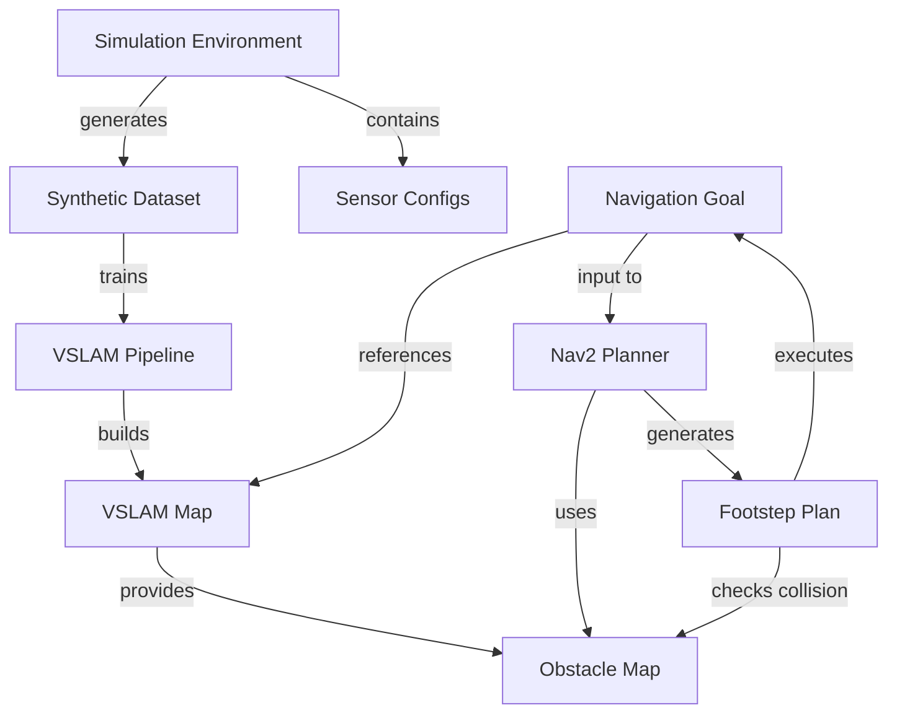

# Data Model: Module 3 - The AI-Robot Brain (NVIDIA Isaac™)

**Feature**: Module 3 Isaac
**Created**: 2025-12-14
**Status**: Draft

## Overview

This document defines the core entities, their structures, relationships, and validation rules for Module 3. All entities align with ROS 2 conventions and NVIDIA Isaac platform standards.

---

## Entity Definitions

### 1. Simulation Environment

**Purpose**: Virtual 3D world with physics, lighting, and sensor simulation for generating synthetic training data.

**Structure**:
```yaml
SimulationEnvironment:
  environment_id: string           # Unique identifier (UUID)
  name: string                     # Human-readable name
  scene_path: string               # Path to USD scene file
  physics_config:
    gravity: [float, float, float] # m/s² (default: [0, 0, -9.81])
    timestep: float                # Simulation timestep in seconds (0.001-0.1)
    solver_iterations: int         # Physics solver iterations (1-20)
  lighting_config:
    primary_light:
      type: enum                   # [directional, point, spot, dome]
      intensity: float             # Lumens (0-10000)
      color_temp: int              # Kelvin (2000-10000)
      position: [float, float, float]
      rotation: [float, float, float]
    randomization_enabled: bool
    randomization_range:
      intensity_variance: float    # ±% (0-100)
      color_temp_variance: int     # ±K (0-3000)
  randomization_params:
    object_pose_jitter:
      translation: float           # ±meters (0-1.0)
      rotation: float              # ±degrees (0-180)
    texture_variants: int          # Number of material variations (1-20)
    camera_noise:
      type: enum                   # [gaussian, salt_pepper, none]
      sigma: float                 # Noise level (0-0.1)
  sensor_configs: [SensorConfig]   # List of virtual sensors
  asset_library_path: string       # Path to 3D assets directory
  created_at: timestamp
  modified_at: timestamp
```

**Relationships**:
- Contains 1+ `SensorConfig` (cameras, LiDAR)
- Generates `SyntheticDataset` instances
- References asset library (3D models, textures)

**Validation Rules**:
- `scene_path` must be valid USD file
- `physics_config.timestep` must be > 0 and ≤ 0.1
- `lighting_config.intensity` must be ≥ 0
- At least 1 sensor must be configured

**State Transitions**:
```
[Created] → [Configured] → [Running] → [Paused] → [Stopped]
                ↓
           [Error]
```

---

### 2. Synthetic Dataset

**Purpose**: Collection of generated sensor data with ground truth labels for training perception models.

**Structure**:
```yaml
SyntheticDataset:
  dataset_id: string               # Unique identifier (UUID)
  name: string                     # Dataset name
  source_environment_id: string    # Reference to SimulationEnvironment
  generation_config:
    num_images: int                # Total images to generate (100-100000)
    resolution: [int, int]         # Width x Height pixels
    frame_rate: int                # Hz (1-60)
    randomization_level: enum      # [tier1, tier2, tier3]
  data_format:
    rgb_format: enum               # [png, jpg, exr]
    depth_format: enum             # [png16, exr, npy]
    annotation_format: enum        # [coco, yolo, kitti, custom]
  contents:
    rgb_images: [ImageFile]        # List of RGB image paths
    depth_maps: [ImageFile]        # List of depth map paths
    segmentation_masks: [ImageFile]# Semantic segmentation masks
    bounding_boxes: [Annotation]   # 2D/3D bounding box annotations
    pose_annotations: [PoseData]   # Ground truth camera/object poses
    point_clouds: [PointCloudFile] # Optional 3D point clouds
  statistics:
    total_samples: int
    class_distribution: map<string, int>  # Class name → count
    mean_rgb: [float, float, float]
    std_rgb: [float, float, float]
  export_path: string              # Directory path for exported data
  created_at: timestamp
  size_bytes: int
```

**Relationships**:
- Generated by `SimulationEnvironment`
- Used for training perception models (external to this module)
- Can be merged with other datasets

**Validation Rules**:
- `num_images` must be > 0
- `resolution` must be valid (min 320x240, max 3840x2160)
- `export_path` must be writable directory
- All file paths in `contents` must exist

**Quality Metrics**:
```yaml
DatasetQuality:
  diversity_score: float           # 0-1 (based on scene variance)
  annotation_completeness: float   # % of images with annotations
  sim_to_real_gap_estimate: float  # Domain shift metric (0-1)
```

---

### 3. VSLAM Map

**Purpose**: 3D representation of the environment built from visual features during Visual SLAM.

**Structure**:
```yaml
VSLAMMap:
  map_id: string                   # Unique identifier (UUID)
  name: string                     # Map name
  coordinate_frame: string         # TF frame (default: "map")
  map_type: enum                   # [sparse, dense, hybrid]
  keyframes: [Keyframe]            # List of keyframe poses
  landmarks: [Landmark]            # 3D point cloud features
  pose_graph:
    nodes: [PoseNode]              # Graph nodes (robot poses)
    edges: [PoseEdge]              # Graph edges (constraints)
    loop_closures: [LoopClosure]   # Detected loop closure events
  map_bounds:
    min: [float, float, float]     # Minimum XYZ coordinates
    max: [float, float, float]     # Maximum XYZ coordinates
  statistics:
    num_keyframes: int
    num_landmarks: int
    trajectory_length: float       # Total path length in meters
    map_coverage_area: float       # m² covered
    avg_tracking_error: float      # RMS error in meters
  metadata:
    sensor_type: enum              # [stereo, mono, rgbd]
    algorithm: string              # VSLAM algorithm name
    created_at: timestamp
    last_updated: timestamp
  serialization:
    format: enum                   # [ros2_bag, json, binary]
    file_path: string
    compressed: bool
```

**Sub-structures**:
```yaml
Keyframe:
  keyframe_id: int
  timestamp: timestamp
  pose:
    position: [float, float, float]
    orientation: [float, float, float, float]  # Quaternion (x,y,z,w)
  image_path: string               # Optional keyframe image
  feature_descriptors: binary      # Feature descriptor blob

Landmark:
  landmark_id: int
  position: [float, float, float]  # 3D world coordinates
  observations: [KeyframeObservation]  # Which keyframes observed this
  descriptor: binary               # Feature descriptor

PoseNode:
  node_id: int
  pose: Pose
  timestamp: timestamp
  covariance: [float]              # 6x6 covariance matrix (flattened)

PoseEdge:
  from_node_id: int
  to_node_id: int
  transform: Pose                  # Relative transform
  information_matrix: [float]      # 6x6 information matrix
  edge_type: enum                  # [odometry, loop_closure, gps]

LoopClosure:
  query_keyframe_id: int
  match_keyframe_id: int
  confidence: float                # 0-1
  relative_pose: Pose
```

**Relationships**:
- Created/updated by VSLAM pipeline (Chapter 2)
- Used by Nav2 for localization (Chapter 3)
- Can be saved/loaded for relocalization

**Validation Rules**:
- `keyframes` must have valid timestamps in ascending order
- `landmarks` must have at least 2 observations
- `pose_graph.nodes` must form connected graph
- `map_bounds` must be consistent with landmark positions

**State Transitions**:
```
[Empty] → [Building] → [Optimizing] → [Complete]
              ↓             ↓
         [Tracking Lost] → [Recovered]
              ↓
         [Failed]
```

---

### 4. Navigation Goal

**Purpose**: Target position and orientation for robot navigation with constraints and tolerances.

**Structure**:
```yaml
NavigationGoal:
  goal_id: string                  # Unique identifier (UUID)
  pose:
    position:
      x: float                     # meters
      y: float                     # meters
      z: float                     # meters (for 3D planning)
    orientation:
      x: float                     # Quaternion
      y: float
      z: float
      w: float
  frame_id: string                 # Coordinate frame (e.g., "map")
  tolerances:
    position_tolerance: float      # meters (default: 0.1)
    orientation_tolerance: float   # radians (default: 0.1)
    time_tolerance: float          # seconds (max time to reach)
  constraints:
    max_velocity: float            # m/s
    max_acceleration: float        # m/s²
    footstep_constraints:
      max_step_length: float       # meters (0.3-0.8)
      max_step_width: float        # meters (0.2-0.5)
      max_step_height: float       # meters (0.0-0.3)
      min_step_duration: float     # seconds
    stability_margin: float        # ZMP safety margin (0.01-0.1 m)
  priority: enum                   # [low, normal, high, critical]
  approach_type: enum              # [direct, spiral, multi_waypoint]
  waypoints: [Pose]                # Optional intermediate waypoints
  status:
    state: enum                    # [pending, planning, executing, succeeded, failed, aborted]
    progress: float                # 0-1
    estimated_time_remaining: float  # seconds
    last_error: string             # Error message if failed
  timestamps:
    created_at: timestamp
    planning_started_at: timestamp
    execution_started_at: timestamp
    completed_at: timestamp
```

**Relationships**:
- Input to Nav2 path planner
- References `VSLAMMap` for localization
- Generates `FootstepPlan` as output
- Updates `ObstacleMap` during execution

**Validation Rules**:
- `pose.orientation` must be normalized quaternion
- `tolerances` must be > 0
- `max_step_length` must be within humanoid kinematic limits
- `stability_margin` must be > 0

**Lifecycle**:
```
[Created] → [Validated] → [Planning] → [Executing] → [Succeeded]
                ↓             ↓            ↓
            [Invalid]    [No Path]    [Aborted/Failed]
```

---

### 5. Footstep Plan

**Purpose**: Sequence of foot placements for bipedal locomotion with timing and stability constraints.

**Structure**:
```yaml
FootstepPlan:
  plan_id: string                  # Unique identifier (UUID)
  goal_id: string                  # Reference to NavigationGoal
  robot_model: string              # URDF reference (e.g., "unitree_g1")
  footsteps: [Footstep]            # Ordered sequence of footsteps
  timing:
    total_duration: float          # Total plan duration (seconds)
    step_durations: [float]        # Duration for each footstep
  stability_metrics:
    min_zmp_margin: float          # Minimum ZMP margin in plan (meters)
    avg_zmp_margin: float          # Average ZMP margin
    com_trajectory: [COMState]     # Center of Mass trajectory
  cost_metrics:
    path_length: float             # meters
    energy_estimate: float         # Arbitrary units
    num_steps: int
    smoothness_score: float        # 0-1 (higher is smoother)
  status:
    state: enum                    # [planned, executing, completed, failed]
    current_step_index: int        # Which footstep is executing
  created_at: timestamp
```

**Sub-structures**:
```yaml
Footstep:
  step_id: int                     # Sequential step number
  foot: enum                       # [left, right]
  pose:
    position: [float, float, float]
    orientation: [float, float, float, float]  # Quaternion
  support_phase: enum              # [single_support, double_support]
  swing_trajectory: [Pose]         # Swing foot trajectory points
  contact_points: [[float, float, float]]  # Foot contact polygon vertices
  zmp_position: [float, float]     # Planned Zero Moment Point
  stability_margin: float          # Distance from ZMP to support polygon edge
  duration: float                  # Time to execute this step (seconds)

COMState:
  timestamp: float                 # Time from plan start
  position: [float, float, float]  # Center of Mass position
  velocity: [float, float, float]  # COM velocity
  acceleration: [float, float, float]  # COM acceleration
```

**Relationships**:
- Generated by Nav2 footstep planner plugin (Chapter 3)
- Executes `NavigationGoal`
- Uses `ObstacleMap` for collision checking
- References robot URDF model

**Validation Rules**:
- `footsteps` must alternate feet (left → right → left...)
- Each `stability_margin` must be > 0
- `zmp_position` must be inside support polygon
- Step durations must sum to `total_duration`
- Footstep poses must respect kinematic limits

**Quality Criteria**:
```yaml
PlanQuality:
  kinematically_feasible: bool     # All steps within joint limits
  statically_stable: bool          # All ZMP constraints satisfied
  collision_free: bool             # No collisions with obstacles
  energy_efficient: bool           # Energy cost below threshold
```

---

### 6. Obstacle Map

**Purpose**: Dynamic representation of environment obstacles updated from sensor data for collision avoidance.

**Structure**:
```yaml
ObstacleMap:
  map_id: string                   # Unique identifier (UUID)
  frame_id: string                 # Coordinate frame (e.g., "map" or "odom")
  map_type: enum                   # [costmap_2d, voxel_grid, octomap]
  resolution: float                # Grid cell size in meters (0.01-0.1)
  dimensions:
    width: float                   # meters
    height: float                  # meters
    depth: float                   # meters (for 3D maps)
  origin:
    position: [float, float, float]
    orientation: [float, float, float, float]
  data:
    occupancy_grid: [int]          # Flattened grid (0=free, 100=occupied, -1=unknown)
    cost_values: [int]             # Cost values (0-255, 255=lethal)
    inflation_radius: float        # Obstacle inflation radius (meters)
  layers:
    static_layer: OccupancyGrid    # Static obstacles from map
    sensor_layer: OccupancyGrid    # Dynamic obstacles from sensors
    inflation_layer: CostGrid      # Inflated costs around obstacles
  sensor_sources:
    - source_topic: string         # ROS 2 topic name
      sensor_type: enum            # [laser, pointcloud, depth, rgbd]
      observation_timeout: float   # seconds
      clearing_enabled: bool
  update_frequency: float          # Hz (1-50)
  publish_frequency: float         # Hz (1-50)
  timestamps:
    created_at: timestamp
    last_updated: timestamp
    last_sensor_update: timestamp
```

**Sub-structures**:
```yaml
OccupancyGrid:
  width: int                       # Grid width in cells
  height: int                      # Grid height in cells
  data: [int]                      # Flattened occupancy data

CostGrid:
  width: int
  height: int
  data: [int]                      # Flattened cost data (0-255)
```

**Relationships**:
- Updated by sensor data from VSLAM (Chapter 2)
- Used by Nav2 planners for collision checking (Chapter 3)
- Can merge static map from `VSLAMMap`
- Publishes to ROS 2 topics for visualization

**Validation Rules**:
- `resolution` must be > 0
- `dimensions` must match `occupancy_grid` size
- `update_frequency` ≤ `publish_frequency`
- `inflation_radius` must be ≥ robot footprint radius

**Update Logic**:
```
1. Receive sensor data (point cloud, laser scan)
2. Transform to map frame
3. Raycast from sensor origin
4. Update occupancy grid cells
5. Apply inflation layer
6. Merge with static layer
7. Publish updated costmap
```

---

## Entity Relationships Diagram



---

## Validation Checklist

For each entity instance, validate:

- [ ] All required fields are populated
- [ ] Data types match specification
- [ ] Enum values are from defined sets
- [ ] Numeric values are within valid ranges
- [ ] Timestamps are in correct format (ISO 8601)
- [ ] File paths exist and are accessible
- [ ] Cross-references (IDs) point to valid entities
- [ ] State transitions follow defined lifecycle
- [ ] Constraints are satisfied (e.g., ZMP margins)

---

## ROS 2 Integration Notes

**Coordinate Frames** (TF2):
- `map`: World-fixed frame (origin of VSLAM Map)
- `odom`: Odometry frame (drift-prone, updated by VSLAM)
- `base_link`: Robot base frame
- `left_foot`, `right_foot`: Foot frames for bipedal robots

**Time Synchronization**:
- All timestamps use ROS 2 `builtin_interfaces/Time`
- Sensor data requires header with frame_id and timestamp
- VSLAM and Nav2 use message filters for synchronization

**Serialization**:
- ROS 2 messages use CDR (Common Data Representation)
- Bags use SQLite3 backend (default for ROS 2 Humble/Jazzy)
- Custom serialization for Isaac Sim USD files

---

## Performance Considerations

**Memory Limits**:
- `VSLAMMap`: ~100MB for 1000 keyframes with sparse landmarks
- `ObstacleMap`: ~10MB for 100mx100m @ 0.05m resolution
- `SyntheticDataset`: 1GB per 1000 images @ 1920x1080

**Update Rates**:
- VSLAM Map: 30-60 Hz during active mapping
- Obstacle Map: 10-20 Hz for dynamic updates
- Footstep Plan: 1-5 Hz replanning rate

**Storage**:
- Use compression for ROS 2 bags (zstd, ~50% reduction)
- Store only keyframes, not all frames
- Archive old datasets to external storage

---

## References

- ROS 2 Humble Documentation: https://docs.ros.org/en/humble/
- NVIDIA Isaac Sim USD Format: https://docs.omniverse.nvidia.com/
- Nav2 Costmap Specification: https://navigation.ros.org/configuration/
- Bipedal Locomotion (Kajita et al.): ZMP stability constraints
