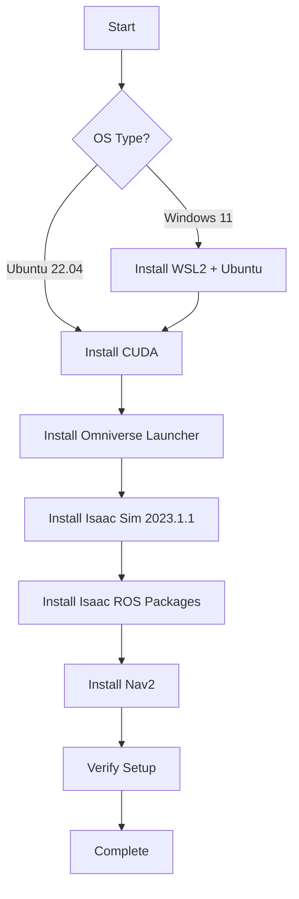

# Quickstart Guide: Module 3 - The AI-Robot Brain (NVIDIA Isaac™)

**Module**: Module 3 Isaac
**Feature Branch**: `004-module3-isaac`
**Created**: 2025-12-14
**Target Audience**: Learners who completed Module 1 (ROS 2 Fundamentals) and Module 2 (Digital Twin)

---

## Overview

This guide provides step-by-step instructions to set up your development environment for Module 3. You'll install NVIDIA Isaac Sim for photorealistic simulation, Isaac ROS packages for hardware-accelerated VSLAM, and Nav2 for bipedal path planning.

**Estimated Setup Time**: 2-3 hours (varies by internet speed and hardware)

---

## Prerequisites

### Hardware Requirements

#### Tier A: Simulation Only (Minimum)
- **OS**: Ubuntu 22.04 LTS or Windows 11
- **CPU**: Intel i5/i7 or AMD Ryzen 5/7 (4+ cores)
- **RAM**: 16GB minimum, 32GB recommended
- **GPU**: NVIDIA RTX 2060 or higher with 6GB+ VRAM
- **CUDA**: Compute Capability 7.5+ (Turing architecture or newer)
- **Disk**: 100GB free space (50GB for Isaac Sim + 50GB for datasets/workspace)

**Supported GPUs**:
- Minimum: GTX 1660 Ti (6GB VRAM) - 15-20 Hz VSLAM
- Recommended: RTX 3060 (12GB VRAM) - 30-60 Hz VSLAM
- Optimal: RTX 4070+ (12GB+ VRAM) - 60+ Hz VSLAM

#### Tier B: Edge AI Deployment (Optional)
- **Hardware**: NVIDIA Jetson Orin Nano (8GB) or Jetson Orin NX
- **Power**: 10W-25W power mode
- **Expected VSLAM**: 20-25 Hz at 848x480 resolution

#### Tier C: Physical Robot (Advanced, Optional)
- Humanoid robot with ROS 2 support (e.g., Unitree G1, Boston Dynamics Spot)
- Stereo camera setup

**GPU Check**:
```bash
# Check if you have NVIDIA GPU
lspci | grep -i nvidia

# Check CUDA version
nvidia-smi

# Check compute capability
nvidia-smi --query-gpu=compute_cap --format=csv
```

If you see "compute_cap >= 7.5", you're good to go!

### Software Prerequisites

- **Ubuntu 22.04 LTS** (primary) or **Windows 11** (WSL2 for ROS 2)
- **ROS 2 Humble** (LTS) installed and configured
- Basic command line proficiency
- Git installed
- Python 3.10+

---

## Installation Roadmap



---

## Step 1: NVIDIA Drivers and CUDA Setup

### Ubuntu 22.04

1. **Install NVIDIA Drivers** (if not already installed):
```bash
# Check current driver version
nvidia-smi

# If not installed or outdated, install latest driver
sudo apt update
sudo apt install nvidia-driver-535
sudo reboot
```

2. **CUDA is bundled with Isaac Sim**, so no separate installation needed! Isaac Sim 2023.1.1 includes CUDA 11.8.

### Windows 11

1. Download and install NVIDIA drivers from: https://www.nvidia.com/download/index.aspx
2. Install WSL2:
```powershell
wsl --install -d Ubuntu-22.04
wsl --set-default Ubuntu-22.04
```
3. Install NVIDIA CUDA on WSL2: Follow [NVIDIA's WSL2 guide](https://docs.nvidia.com/cuda/wsl-user-guide/)

---

## Step 2: Install NVIDIA Omniverse and Isaac Sim

### 2.1 Install Omniverse Launcher

1. **Download Omniverse Launcher**:
   - Visit: https://www.nvidia.com/en-us/omniverse/download/
   - Create free NVIDIA account (if needed)
   - Download for your OS

2. **Install Launcher**:
   ```bash
   # Ubuntu
   chmod +x omniverse-launcher-linux.AppImage
   ./omniverse-launcher-linux.AppImage
   ```

   ```powershell
   # Windows
   # Run the downloaded .exe installer
   ```

### 2.2 Install Isaac Sim 2023.1.1

1. **Open Omniverse Launcher**
2. Navigate to **Exchange** tab
3. Search for **"Isaac Sim"**
4. Select **Isaac Sim 2023.1.1** (or latest stable)
5. Click **Install**
   - Installation size: ~40GB
   - Default location: `~/.local/share/ov/pkg/isaac_sim-2023.1.1/`

6. **Verify Installation**:
   - Click **Launch** in Omniverse Launcher
   - Isaac Sim should open with a 3D viewport
   - Try loading a sample scene: `File > Open > Isaac/Samples/Simple_Room.usd`

### 2.3 Configure Isaac Sim for ROS 2

1. **Set ROS 2 Environment Variables**:
   ```bash
   # Add to ~/.bashrc
   export ROS_DISTRO=humble
   source /opt/ros/humble/setup.bash

   # Set Isaac Sim path
   export ISAAC_SIM_PATH="$HOME/.local/share/ov/pkg/isaac_sim-2023.1.1"
   export LD_LIBRARY_PATH=$ISAAC_SIM_PATH/exts/omni.isaac.ros2_bridge/humble/lib:$LD_LIBRARY_PATH

   # Reload
   source ~/.bashrc
   ```

2. **Enable ROS 2 Bridge Extension** (in Isaac Sim):
   - Window > Extensions
   - Search "ROS2 Bridge"
   - Enable `omni.isaac.ros2_bridge`

---

## Step 3: Install Isaac ROS Packages (VSLAM)

### 3.1 Prerequisites

```bash
# Install ROS 2 development tools
sudo apt update
sudo apt install -y \
  ros-humble-desktop \
  ros-humble-isaac-ros-visual-slam \
  ros-humble-isaac-ros-common \
  python3-colcon-common-extensions \
  python3-rosdep \
  git \
  cmake \
  build-essential
```

### 3.2 Create Workspace

```bash
# Create workspace
mkdir -p ~/ros2_ws/src
cd ~/ros2_ws/src

# Clone Isaac ROS Visual SLAM
git clone https://github.com/NVIDIA-ISAAC-ROS/isaac_ros_visual_slam.git

# Clone Isaac ROS Common (dependencies)
git clone https://github.com/NVIDIA-ISAAC-ROS/isaac_ros_common.git

# Install dependencies
cd ~/ros2_ws
rosdep update
rosdep install --from-paths src --ignore-src -r -y

# Build
colcon build --symlink-install
source install/setup.bash
```

### 3.3 Verify Installation

```bash
# Check if cuVSLAM node is available
ros2 pkg list | grep isaac_ros_visual_slam

# Expected output:
# isaac_ros_visual_slam
# isaac_ros_visual_slam_interfaces
```

---

## Step 4: Install Nav2

```bash
# Install Nav2 packages
sudo apt install -y \
  ros-humble-navigation2 \
  ros-humble-nav2-bringup \
  ros-humble-turtlebot3-gazebo \
  ros-humble-turtlebot3-navigation2

# Install additional dependencies
sudo apt install -y \
  ros-humble-slam-toolbox \
  ros-humble-twist-mux \
  ros-humble-robot-localization
```

**Verify**:
```bash
ros2 pkg list | grep nav2

# You should see multiple nav2_* packages
```

---

## Step 5: Install Module 3 Codebase

```bash
cd ~/ros2_ws/src

# Clone the Physical AI & Humanoid Robotics repository
git clone https://github.com/YOUR_ORG/physicalai-humanoidrobotics-book.git
cd physicalai-humanoidrobotics-book

# Checkout Module 3 branch
git checkout 004-module3-isaac

# Navigate to module directory
cd module-3-isaac

# Install Python dependencies
pip3 install -r requirements.txt
```

**Build workspace**:
```bash
cd ~/ros2_ws
colcon build --packages-select \
  module3_isaac_sim \
  module3_vslam \
  module3_navigation

source install/setup.bash
```

---

## Step 6: Validation Tests

### 6.1 Test Isaac Sim ROS 2 Bridge

```bash
# Terminal 1: Launch Isaac Sim with ROS 2
cd $ISAAC_SIM_PATH
./isaac-sim.sh --ros2

# Terminal 2: Check ROS 2 topics
source ~/ros2_ws/install/setup.bash
ros2 topic list

# You should see topics like:
# /clock
# /rosout
# /tf
# /tf_static
```

### 6.2 Test Isaac ROS VSLAM (Simulation)

```bash
# Terminal 1: Launch Isaac Sim with sample scene
cd ~/ros2_ws
source install/setup.bash
ros2 launch module3_isaac_sim stereo_camera_scene.launch.py

# Terminal 2: Launch cuVSLAM
ros2 launch isaac_ros_visual_slam isaac_ros_visual_slam.launch.py

# Terminal 3: Visualize in RViz
ros2 run rviz2 rviz2 -d ~/ros2_ws/src/module-3-isaac/config/vslam.rviz

# You should see:
# - Camera feed
# - Point cloud (landmarks)
# - Robot trajectory
```

### 6.3 Test Nav2 (Basic)

```bash
# Launch Nav2 with sample map
ros2 launch nav2_bringup tb3_simulation_launch.py

# Send a navigation goal via RViz:
# - Click "2D Goal Pose" button
# - Click on map to set goal
# - Robot should navigate to goal
```

### 6.4 Performance Benchmark

Run the provided benchmark script:
```bash
cd ~/ros2_ws/src/physicalai-humanoidrobotics-book/module-3-isaac/scripts
python3 benchmark_vslam.py

# Expected output for RTX 3060:
# VSLAM Frame Rate: 35.2 Hz
# Tracking Latency: 28.4 ms
# GPU Utilization: 68%
# Status: PASS
```

---

## Tier-Specific Setup

### Tier A: Simulation-Only (Default)

All steps above complete Tier A setup. You can:
- Generate synthetic datasets in Isaac Sim
- Run VSLAM in simulation
- Test Nav2 with simulated bipedal robots

**No additional steps required.**

### Tier B: Jetson Orin Deployment

1. **Flash Jetson Orin Nano** with JetPack 6.0:
   ```bash
   # On host machine
   sudo apt install nvidia-jetpack
   # Follow NVIDIA Jetson setup guide
   ```

2. **Install Isaac ROS on Jetson**:
   ```bash
   # SSH into Jetson
   ssh jetson@<jetson-ip>

   # Install ROS 2 Humble (ARM64)
   sudo apt update
   sudo apt install ros-humble-desktop

   # Install Isaac ROS (pre-built binaries for Jetson)
   sudo apt install ros-humble-isaac-ros-visual-slam
   ```

3. **Optimize Power Mode** for VSLAM:
   ```bash
   # Set to 25W mode for best performance
   sudo nvpmodel -m 0
   sudo jetson_clocks
   ```

4. **Test with Physical Camera**:
   ```bash
   # Launch VSLAM with ZED camera (example)
   ros2 launch module3_vslam zed_vslam.launch.py
   ```

### Tier C: Physical Humanoid Robot

**Prerequisites**:
- Completed Tier B setup
- Physical humanoid robot with ROS 2 driver
- Stereo camera mounted on robot

**Integration Steps**:

1. **Configure Robot URDF**:
   ```bash
   # Edit robot description
   nano ~/ros2_ws/src/module-3-isaac/urdf/my_humanoid.urdf.xacro

   # Add camera links and joints
   ```

2. **Calibrate Cameras**:
   ```bash
   ros2 run camera_calibration cameracalibrator \
     --size 8x6 \
     --square 0.108 \
     --no-service-check \
     image:=/stereo/left/image_raw \
     camera:=/stereo/left
   ```

3. **Launch Full Stack**:
   ```bash
   # Terminal 1: Robot driver
   ros2 launch my_robot_bringup robot.launch.py

   # Terminal 2: VSLAM
   ros2 launch module3_vslam robot_vslam.launch.py

   # Terminal 3: Navigation
   ros2 launch module3_navigation bipedal_navigation.launch.py
   ```

---

## Troubleshooting

### Issue: Isaac Sim won't launch

**Solution**:
```bash
# Check Vulkan support
vulkaninfo | grep deviceName

# Update NVIDIA drivers
sudo apt install --reinstall nvidia-driver-535

# Check logs
tail -f ~/.nvidia-omniverse/logs/Kit/Isaac-Sim/2023.1/kit_*.log
```

### Issue: VSLAM frame rate too low

**Solution**:
```bash
# Reduce camera resolution
# Edit launch file: ~/ros2_ws/src/module-3-isaac/launch/vslam.launch.py
# Change:
#   width: 1280 → 848
#   height: 720 → 480

# Enable GPU acceleration (verify)
nvidia-smi

# Close other GPU applications
```

### Issue: Nav2 planner not generating paths

**Solution**:
```bash
# Check costmap
ros2 topic echo /global_costmap/costmap --once

# Verify TF tree
ros2 run tf2_tools view_frames

# Check for missing transforms
```

### Issue: ROS 2 topics not visible

**Solution**:
```bash
# Source workspace in every terminal
source ~/ros2_ws/install/setup.bash

# Add to ~/.bashrc for persistence
echo "source ~/ros2_ws/install/setup.bash" >> ~/.bashrc

# Check ROS_DOMAIN_ID consistency
export ROS_DOMAIN_ID=0
```

---

## Alternative Setups

### CPU-Only Fallback (No NVIDIA GPU)

If you don't have an NVIDIA GPU, use ORB-SLAM3 instead of cuVSLAM:

```bash
# Install ORB-SLAM3
cd ~/ros2_ws/src
git clone https://github.com/thien94/orb_slam3_ros2.git
cd ~/ros2_ws
colcon build --packages-select orb_slam3_ros2

# Launch (slower, but CPU-compatible)
ros2 launch orb_slam3_ros2 stereo.launch.py
```

**Performance**: 5-10 Hz VSLAM (vs 30-60 Hz with GPU)

### Gazebo Alternative (Instead of Isaac Sim)

For learners who can't run Isaac Sim:

```bash
# Install Gazebo Harmonic
sudo apt install ros-humble-gazebo-ros-pkgs

# Use Gazebo scenes instead
ros2 launch module3_gazebo stereo_camera_world.launch.py
```

**Trade-off**: Less photorealistic, but faster setup and broader compatibility

### Cloud GPU Option (AWS/GCP)

**AWS EC2 Instance** (pay-as-you-go):
1. Launch `g5.xlarge` instance (NVIDIA A10G GPU, ~$1.20/hour)
2. Use AMI: "Deep Learning AMI (Ubuntu 22.04)"
3. Install Isaac Sim and follow Ubuntu setup
4. Access via X11 forwarding or VNC

**Cost**: ~$10-15 for Module 3 completion (8-12 hours)

---

## Next Steps

After completing setup:

1. **Verify all tests pass** (Section 6)
2. **Proceed to Chapter 1**: Isaac Sim - Photorealistic Simulation
3. **Join Discord community** for support: [link]
4. **Report issues** on GitHub: [repository/issues]

---

## Quick Reference

### Essential Commands

```bash
# Launch Isaac Sim
$ISAAC_SIM_PATH/isaac-sim.sh

# Source ROS 2 workspace
source ~/ros2_ws/install/setup.bash

# Build workspace
cd ~/ros2_ws && colcon build --symlink-install

# Check GPU usage
watch -n 1 nvidia-smi

# List ROS 2 topics
ros2 topic list

# Launch full Module 3 stack (simulation)
ros2 launch module3_bringup full_sim.launch.py
```

### File Locations

- **Isaac Sim**: `~/.local/share/ov/pkg/isaac_sim-2023.1.1/`
- **ROS 2 Workspace**: `~/ros2_ws/`
- **Module 3 Code**: `~/ros2_ws/src/physicalai-humanoidrobotics-book/module-3-isaac/`
- **Config Files**: `~/ros2_ws/src/module-3-isaac/config/`
- **Launch Files**: `~/ros2_ws/src/module-3-isaac/launch/`
- **URDF Models**: `~/ros2_ws/src/module-3-isaac/urdf/`

### Documentation Links

- NVIDIA Isaac Sim: https://docs.omniverse.nvidia.com/isaacsim/
- Isaac ROS: https://nvidia-isaac-ros.github.io/
- Nav2: https://navigation.ros.org/
- ROS 2 Humble: https://docs.ros.org/en/humble/

---

## Support

If you encounter issues not covered here:

1. **Check Module 3 FAQ**: `module-3-isaac/docs/faq.md`
2. **Search GitHub Issues**: [repository/issues]
3. **Ask on Discord**: #module3-isaac channel
4. **Email**: support@physicalai-book.com

---

**Congratulations!** Your environment is ready for Module 3. Let's build the AI-Robot Brain!
